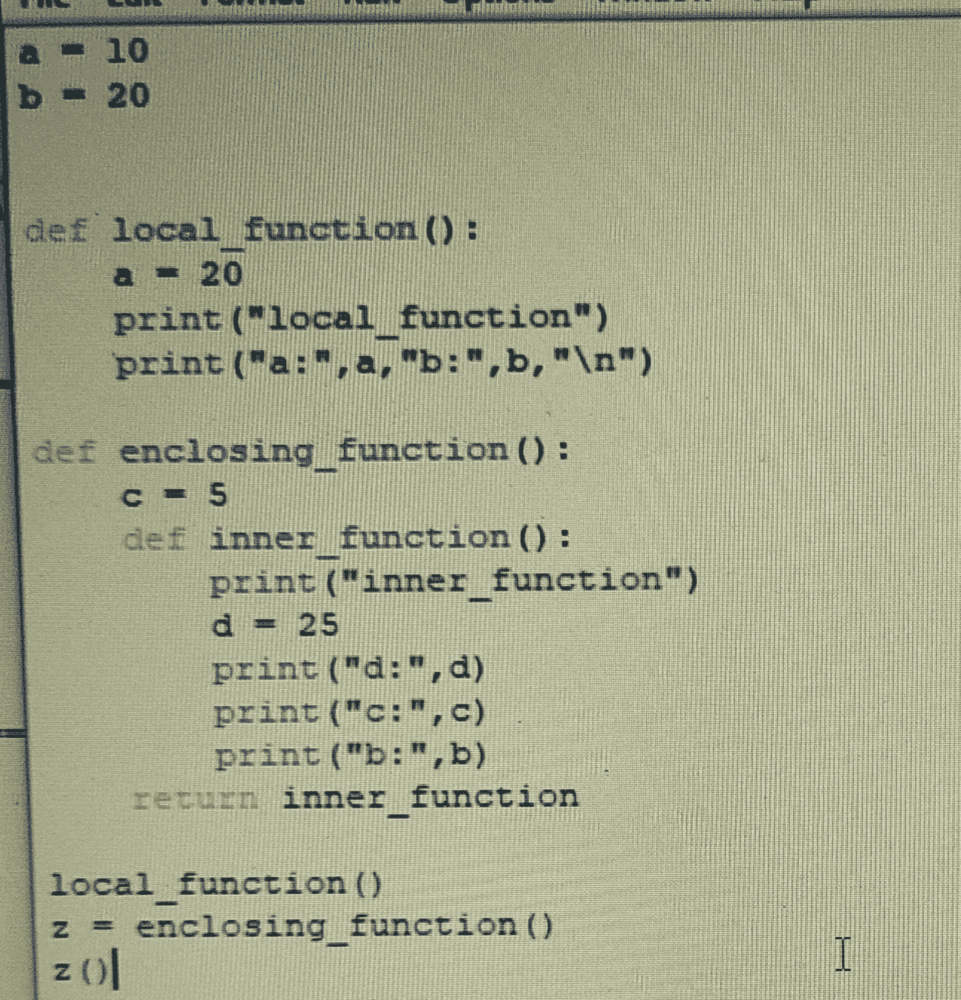
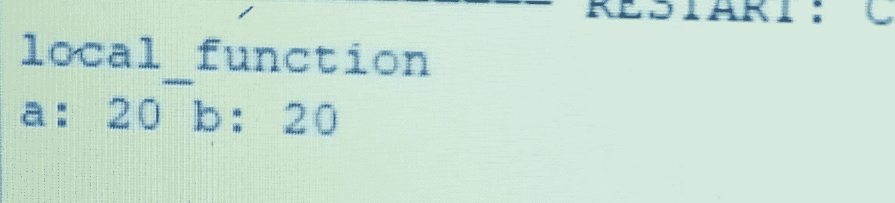
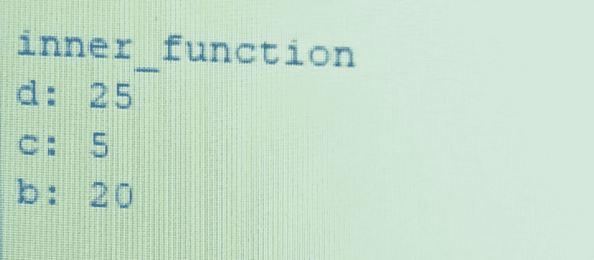
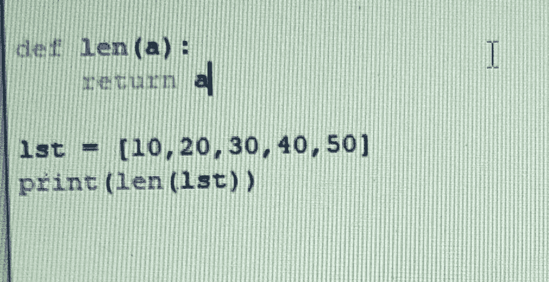
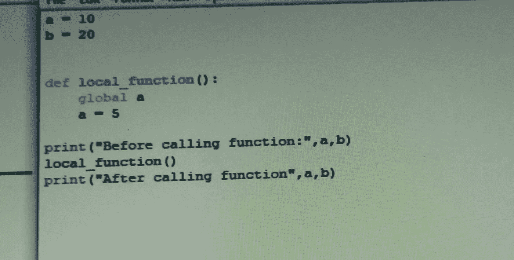
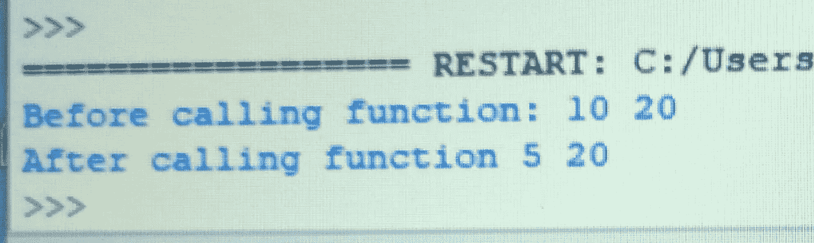
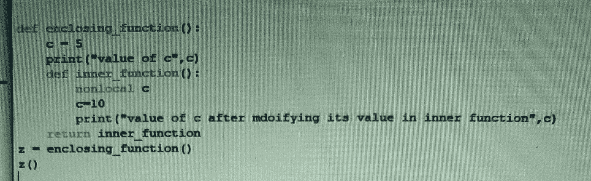

# python 中的命名空间、范围、LEGB 规则以及全局和非局部变量

> 原文：<https://medium.com/analytics-vidhya/namespace-scope-legb-rule-and-global-and-non-local-variable-in-python-d84c3e05e1c8?source=collection_archive---------12----------------------->

## 命名空间:

在 Python 中，一切都是一个对象，我们给这个对象一个名字，这样我们以后就可以访问它。

您可以将名称空间看作是一个键-值对的字典，其中键是变量名，值是与之关联的对象。

## 范围

变量范围定义了我们搜索变量的层次结构。

python 中变量的作用域是代码中可访问或可见的位置或部分。

## LEGB:

LEGB 规则用于决定在范围解析中搜索名称空间的顺序。

变量的作用域可以是局部的(L)，封闭的(E)，全局的(G)，内置的(B)。

让我们借助例子来理解整个概念:

在上面的例子中，变量 a，b 没有在任何函数中定义，因此它们是全局变量。它们可以在程序的任何地方被访问。

现在看看 local_function()，这里我们又有了变量 a，但它只能在函数内部访问，因此它被称为局部变量。

当我们调用 local_function()时，输出将是，

要打印 a 和 b 的值，解释器将检查变量是否定义在局部范围内。这里定义了变量 a，但没有定义 b，现在解释器在全局范围内检查变量 b。在输出中，我们得到 a=20 和 b=20，因为解释器在局部范围内得到 a 的值，在全局范围内得到 b 的值。

> 记住，解释器总是首先在局部范围内搜索变量值。

现在，上去看看 enclosing_function。在 enclosing_function 中，我们有变量 c 和 inner_function()，变量 c 可以在 enclosing_function 和 inner_function 中访问，因此 c 有封闭的作用域。

当我们调用 enclosing_function()时，它将返回 inner_function()，当我们调用 inner_function 时，输出将是，

解释器将在局部范围内检查变量 d 的值，即在 inner_function 内部，得到 d 的值。由于 c 没有在 inner_function 中定义，它将在封闭范围内检查，即在 enclosing_function 内部，得到 c 的值。变量 b 没有在 inner_function 和 enclosing_function 中定义，解释器将检查全局范围内的 b。

> 别忘了，
> 
> 局部→封闭→全局

到目前为止，我们已经完成了 LEGB 规则的一部分，现在让我们来理解内置(B)。

内置的是一个特殊的 Python 作用域，每当运行脚本时都会创建或加载它。这个范围包含诸如关键字、函数、异常和 Python 中内置的其他属性的名称。这个 Python 范围内的名称也可以在代码中的任何地方找到。当你运行一个程序或脚本时，Python 会自动加载它。

让我们借助下面的例子来理解它:

len()是 python 中的内置函数。len()计算长度。当我们运行以上代码时，输出将是:

现在看看下面代码，

当我们运行上面的代码输出时，我们得到的是，

我们调用了同一个函数 len，但是在第一个输出中我们得到了列表的长度，在第二个输出中我们得到了列表本身。这是因为，我们已经定义了同名的函数，而那个函数只是返回了列表。

在第一种情况下，解释器在我们的脚本中没有 len 函数，因此它调用内置函数。

在第二种情况下，解释器在我们的脚本中获得了 len 函数，因此它没有调用内置函数。

> 记住这条规则，
> 
> 局部→封闭→全局→内置

## 全局和非局部变量:

如果我们在函数内部用关键字 global 定义了变量，那么我们就可以访问和修改全局变量。

输出:

在上面的例子中，我们已经访问了全局变量 a 并修改了内部函数。

## 非局部变量:

非局部变量用于未定义局部范围嵌套函数中。这意味着变量既不能在局部范围内，也不能在全局范围内。

输出:

