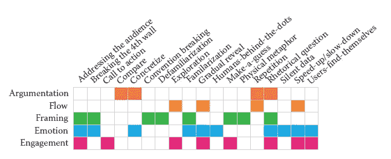
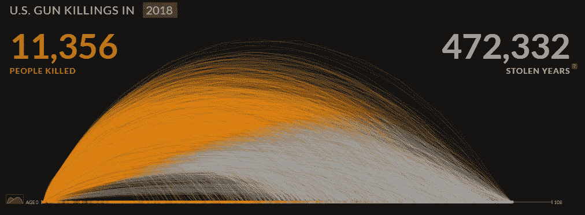
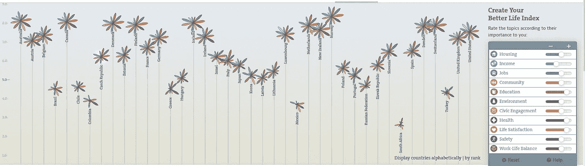
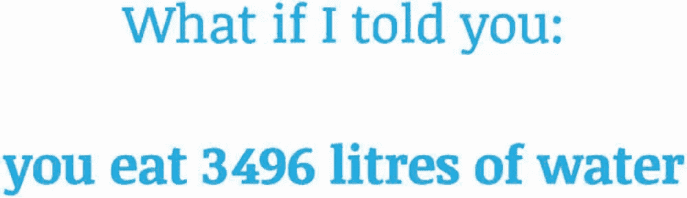
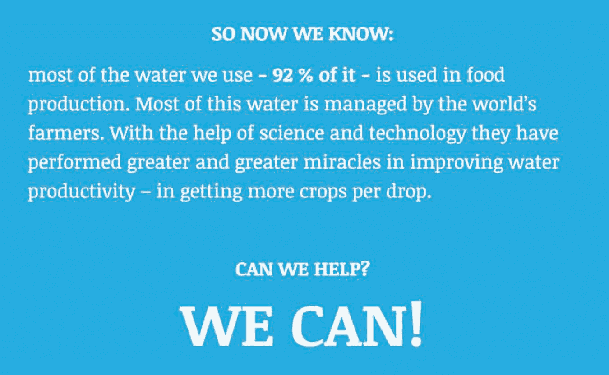

# 数据叙事的叙事设计模式

> 原文：<https://medium.com/analytics-vidhya/narrative-design-patterns-for-data-storytelling-5a42a6f64536?source=collection_archive---------4----------------------->

## 叙事模式如何帮助你呈现你的故事？

最近，我在阅读关于数据叙事的文章，发现了一套叙事设计模式，这些模式对于呈现基于数据的故事非常有帮助。深入挖掘，我发现这一套原本是为记者，主持人和公共演讲者创造的互动环境。很有趣，对吧？

# 这是怎么发生的？

基本上，叙事模式将你的叙述与故事的意图联系起来，所以如果你有了故事，有了观众的想法，知道你的故事应该对观众产生什么样的影响，你就会选择最符合你目标的叙事模式。

但我觉得最好还是通过展示这些如何应用叙事模式用卡片讲述数据故事的例子来给你解释:[纳帕卡片](http://napa-cards.net/)。此外，看一看叙述模式的组的插图。为了更好地理解它们的应用，我们将讨论它们。

叙事模式分为 5 个主要模式组(资料来源:里奇，
胡尔特，迪亚科普洛斯&卡彭代尔，2018，图 5.2，第 112 页)

## 论证模式

> 论证模式服务于说服和说服观众的目的——*里奇、胡尔特、迪亚科普洛斯&卡彭代尔，2018*

**比较**两个或两个以上的数据集，**通过用具体对象说明抽象概念来具体化**，以及**重复**作为在数据中寻找答案的一种手段是最常见的论证模式。

## 流动模式

> 流的模式是帮助构建消息
> 和参数*序列的装置——Riche，Hurter，Diakopoulos & Carpendale，2018*

**逐步揭示**数据的元素，并最终导致整个画面和最终论点，**放慢速度**并专注于数据的单个方面或**加快速度**数据的呈现是最有用的流程模式。

加速的例子，这些痕迹给人以武器开火的印象(来源:[https://guns.periscopic.com/](https://guns.periscopic.com/)

## 叙述的框架模式

> 框架模式可以用来将观众融入到
> 故事中，或者反过来保持距离——Riche，Hurter，Diakopoulos & Carpendale，2018

创造一个观众能够认同的**熟悉的设定**，邀请公众**对数据进行**猜测，并建立一个**惯例，通过颜色或尺度打破**吃主要图案进行取景。

熟悉模式示例(来源:[http://www.oecdbetterlifeindex.org/#](http://www.oecdbetterlifeindex.org/#)

## 移情和情感的模式

> 情感和同理心在讲故事中至关重要，因为它们让我们参与到故事内容中:我们关注、感知并思考信息— *里奇、胡尔特、迪亚科普洛斯&卡彭代尔，2018*

通过使用**逐渐揭示**或**放慢**叙述获得情感反应使用**直接对观众说话**到**打破第四堵墙**(源自剧院，第四堵墙是舞台和观众之间的墙)。

## 参与模式

> 参与感可以被视为是故事的一部分，与故事
> 相连，并控制与故事
> 内容的互动——Riche，Hurter，Diakopoulos & Carpendale，2018

以一个**反问**开始，并暗示一个**行动号召**来激发参与。此外，要求**猜测**有关信息，并通过**探索**来主动参与互动。

回顾性问题和行动号召示例(来源:[http://www.thewaterweeat.com/](http://www.thewaterweeat.com/))

你准备好开始使用叙事模式了吗？？

如果你想了解更多，我推荐《数据驱动的故事讲述》这本书，作为本文的参考。