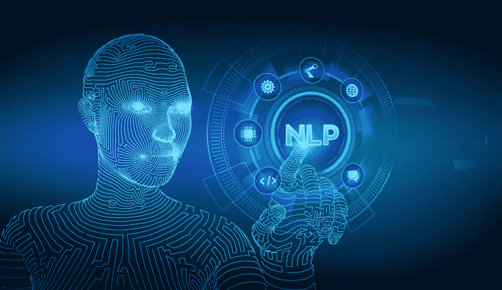

# 自然语言处理—流水线

> 原文：<https://medium.com/analytics-vidhya/natural-langauge-processing-1b20b82e12c7?source=collection_archive---------23----------------------->

计算机是处理结构化数据(如表格、数据库等)的好机器。但是我们人类说话的语言是计算机的非结构化数据。

你有没有想过计算机是如何理解人类语言的？

Siri 和她的朋友 Alexa 和 Cortana 是如何理解我们所说的话并做出回应的？

答案是**自然语言处理。**

# 自然语言处理

> **自然语言处理(NLP)** 是语言学、计算机科学、信息工程和人工智能的一个子领域，涉及计算机和人类(自然)语言之间的交互，特别是如何编写计算机程序来处理和分析大量自然语言数据。
> 
> (来源:[维基百科](https://en.wikipedia.org/wiki/Natural_language_processing))

来源: [Xoriant](https://www.xoriant.com/cdn/ff/yH8KFP9UpFRhaXz2jeKsn19NXIVb2Gmui0VBSTlPRHA/1622011601/public/2021-05/Xoriant-Natural-Language-Processing.png)

NLP 处理的是文本数据，无论是结构化、非结构化还是半结构化的数据。

如果你想在 NLP 中开始一个项目，有一个管道可以遵循。

# NLP 项目的管道

在 NLP 中，您可以选择遵循不同的步骤(有些是基于需求的)

*   收集数据
*   分割
*   标记化
*   停用词删除
*   词性标注
*   词汇化
*   文本矢量化
*   模型训练和预测

# 1.收集数据

您可以获得数据或生成/下载数据。数据工程师可能会帮助您获取您可以使用的数据。

让我们假设我们有以下文本作为我们的数据-

> 这是第一句话。这是第二句话，比第一句话长。

# 2.分割

一旦你获得了数据并从中提取出文本，第一步就是从文本中分割出句子。这样做是因为句子比整篇文章更容易。

如果我们分割上面的文本，我们将得到如下输出-

> **1。这是第一句话'，**
> 
> **2。这是第二句话，比第一句话长。**

在最**基本形式**中，我们可以说我们寻找标点符号来拆分文本。

# 3.标记化

在将段落分解成句子(分割步骤)之后，我们将进一步将句子分解成单词。这个过程被称为记号化(或单词记号化)。

如果我们对第二个句子进行记号化，我们会得到这样的输出-

> **'这个'，'是'，'第二个'，'句子'，'是'，'更长'，'比'，'第一个'，'一个'，'**

每当单词之间有空格时，我们就把句子分开。

# 4.停用词删除

停用词是对句子的意思没有任何价值的词。有时，识别并删除文本中的停用词会更好。

一些停用词是-

*"我"、"我"、"我的"、"我自己"、"我们"、"我们"、"我们的"、"我们的"、"我们自己"、"你们"、"你们的"、"你们的"、"你们的"、"你们自己"、"你们自己"、"他"、"他"、"没有"、"也没有"、"不是"、"只有"、"自己的"、"一样的"*

所以，我们的例句现在变成了-

> **'这个'，'第二个'，'句子'，'更长'，'第一个'，'一个'，'**

在这里， ***是*** ， ***，*** ， ***比*** 都去掉了。

**注意**停用词的选择很大程度上取决于需求。根据需要，您可以添加/删除停用词。

例如，默认的停用词列表包含像“no”、“not”和“nor”这样的词。在情感分析这样的项目中删除这些是不可取的，因为它会改变整个情感。

# 5.词性标注

*词类(POS)，顾名思义，就是给文本标注相应词类(名词、动词、形容词、副词等)的过程。*

*对于同一个句子，在执行了词性标注之后，我们将得到以下结果-*

> ***('这个'，' DT ')，('第二'，' JJ '，('句子'，' NN ')，('更长'，' JJR ')，('第一'，' JJ '，('一'，' CD '，('.', '.')***

*这是标签的列表以及它们的含义-*

*   *DT — *限定词**
*   *JJ — *形容词**
*   *NN — *名词**
*   *JJR — *形容词，比格**
*   *JJ — *形容词‘大’**
*   *CD — *基数**
*   *。— *标点符号**

# *6.词汇化*

*词汇化是将任何单词分解成其基本形式的过程。*

*例如，单词'*Care*'将被转换为单词' *Care* '*

*对我们的句子来说，它是-*

> ***‘这个’，‘第二个’，‘句子’，‘长’，‘第一个’，‘一个’”***

*在这里，单词' ***变长*** *'* 已改为' ***变长*** *'。**

# *7.文本矢量化*

*我们需要将文本转换成数学数据(向量)，这些数据将被输入到机器学习算法中。*

*我们可以使用不同的技术/模型来表示预处理后得到的单词。有些是-*

1.  *单词袋(蝴蝶结)*
2.  *tf-idf*
3.  *word2vec*

*每一个都有不同的方式来表示单词，但最终会为每个句子提供一个向量，我们可以进一步将其输入到我们的机器/深度学习模型中。*

# *8.模型训练和预测*

*得到向量后，现在是建立模型的时候了。*

*我们将数据分为训练集和测试集(通常占数据集的 20–30%)。*

*然后，将矢量化的句子与预期的输出(实际标签)一起输入到我们的模型，以便它可以学习并为任何新句子做好准备。*

*然后我们用我们的测试集测试它。使用指标(另一天的主题😉)，如果模型足够精确，我们将继续进行。*

*如果没有，我们可以随时重新训练模型。*

# *结论*

*如您所见，NLP 管道包含多个步骤。最好的部分是，你有不同的库，为所有提到的步骤，这将减轻你的工作。*

*但是并不总是要求实现所有的步骤(或者甚至以相同的顺序)。这完全取决于您的使用案例和数据集。*

**如果喜欢，请留个*👏。*

**欢迎反馈或建议。**