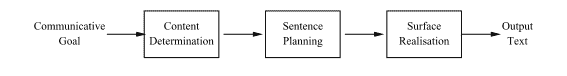
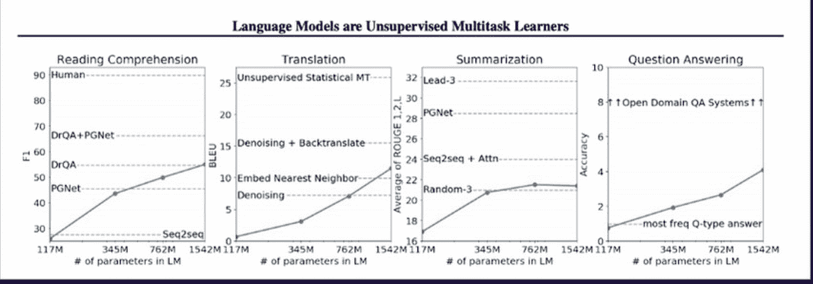

# 从结构化数据生成自然语言

> 原文：<https://medium.com/analytics-vidhya/natural-language-generation-from-structured-data-9d70f3f224af?source=collection_archive---------4----------------------->

迪利普·帕苏玛蒂和达尔吉特·维尔迪

*伊利诺伊大学香槟分校*

*开发时间:2019 年 9 月*

在过去的几年里，SOTA 通用语言模型(BERT、GPT-2、XL-Net 等)得到了迅速的改进。)来自新的神经架构(LSTMs、变压器等。)和不同的预训练技术(MLM、双向等)。)已经在大范围的自然语言处理任务(问题回答、翻译、文本到语音等)上产生了人类水平的能力。).这些发展有望像 ImageNet 对计算机视觉一样，对自然语言处理产生广泛的影响，开创汽车(自动驾驶汽车)、零售(无收银员结账)、金融服务(身份验证)、医疗保健(放射学)等领域自治的新时代..

在本文中，我们探索了 NLP 的一个子领域，自然语言生成，以及一种从结构化数据生成文本的技术(数据到文本的合成)。潜在的应用包括自动生成新闻文章、天气预报、行业报告和商业见解。这些作品可以根据地方、背景和阅读风格进行高度个性化。例如，来自新生儿护理中的婴儿的数据可以不同地转换成文本，具有不同水平的技术细节和解释性语言，这取决于预期的读者是医生、护士还是父母(Mahamood & Reiter，2011 年)。为各个球队的球迷生成不同的体育报告；从输队的角度来看，一个队的制胜进球很可能被认为是幸运的。一个人类记者不会梦想写关于一场体育比赛的单独报道，但是对于一台计算机来说，这不是一个问题，这可能会被一个读者所欣赏，他会收到一份更适合他个人的报道。

我们编写了一个程序来从金融时间序列数据中创建叙述性摘要。基于个人的投资组合，财经新闻对不同的人意味着不同的东西。这项研究可以开创一种新的财经新闻生成方式，从每个人一篇新闻变成每个人一篇新闻，直接应用于财富管理、财务报告和投资者关系。

NLG 系统包括三个过程:

**1。** [含量测定](http://en.wikipedia.org/wiki/Content_determination) —你要说什么

**2。**句子规划——你打算怎么说

**3。**表面实现——具体用哪个词，你可以称之为*风格*或*流程*。

开发人员传统上实现这三个阶段，并在管道中组装它们。每一部分都需要在模板中编纂规则和大量的工程工作。大多数自然语言应用程序最初都是以这种基于规则的方式构建的。

随着深度学习 NLP 研究的发展，我们正处于对基于神经的架构的这些应用的大规模检修之中。例如，直到 2015 年，产品级拼写检查器大约有 2000 行代码。使用神经概率方法，现代拼写检查器可以少至 17 行代码。随着新问题的出现，这些系统的复杂性在某些方面有所下降，减少了基于规则的死记硬背编程，但在其他方面有所增长:这些模型有多准确、精确、偏差？

大多数现代广义语言模型创建连贯的自然语言(见:GPT-2，伯特等。)但是从业者被警告不要在生产用例中使用它们，因为他们不能区分“事实和虚构”。文字听起来可能很自然，但往往不准确或不连贯。

我们对这些模型进行了“微调”,在从结构化数据生成文本时，对它们进行专门训练，使其更加精确和符合事实。我们的方法基于对 SOTA 广义语言模型的两个关键改进:

1.  从结构化数据中选择和复制内容的复制机制
2.  通用语言模型(GPT-2，伯特，XL-网)组成连贯的句子。

我们使用预先训练的领域无关语言模型，GPT-2，并训练它学习一种复制机制，只使用几个(< 200 examples) training examples.

Wikipedia articles about people often come with a table of structured data and the first few sentences in the article narrate that table. With 200 Wikipedia articles about people, we fine-tune GPT-2 to write sentences about people that sound like the sentences written by Wikipedia authors and score 16 BLEU points.

**给定 200 个这样的例子:**

**一桌:**

**维基百科文章正文的前几行:**

查尔斯·怀伯利(1859-1930)是一名英国文学记者和作家。

**我们可以输入新的表格，生成这样的句子:**

1.  *rihards kuk si(1988 年 7 月 17 日出生于拉脱维亚里加)是斯洛里达 rihard kuksi 大学的拉脱维亚学者。*
2.  *克里斯·克朗(生于 1964 年 8 月)是前美国右手击球手。*
3.  尼尔·墨菲(生于 1980 年 5 月 19 日)是前英格兰足球运动员，踢中后卫。
4.  *胡因塞·阿塔拉(生于 1991 年 10 月 27 日)是一名土耳其足球运动员，目前效力于安塔利亚*

这种风格反映了维基百科作者的风格，并展现了有趣的行为。例如，模型知道因为克里斯·克朗的出生地是波士顿，所以这个人是美国人。

我们试图将这项工作扩展到金融领域，但无法找到结构化数据和金融摘要，比如来自维基百科的数据和摘要，需要我们自己构建。我们采用公开可用的[纽约证券交易所数据](https://www.kaggle.com/dgawlik/nyse#securities.csv)，使用 PySpark 对其进行汇总和分析，提取关键指标，并使用实现引擎 SimpleNLG 编写模板化摘要。

我们将这些训练数据插入到我们的模型中，但惊讶地发现它在不到 100 个时期内就学会了模板结构。因此，我们尝试了一个小的黑客来增加更多的多样性。在我们创建句子之前，我们使用 Datamuse API 来查找单词的同义词，并从我们生成的 10-15 个句子中随机选取 2-5 个句子。

**财务数据示例:**

**结构化数据:**

**总结:**

与上个月相比，平均下降了 2.17 美元！不太好。苹果的股价最低，为 105.44 美元。这段时间的平均价格大约为 111.13 美元，上下浮动 19.24 美元。苹果在预期月份的预期平均股票价格为 108.96 美元！。

**第 50 纪元后…**

苹果公司以 115.57 美元的股价高居榜首。苹果公司本季度的平均股价为 111 美元..有兴趣了解更多吗？。以下是一些容易引起共鸣的平均值！。苹果本季度的平均销量为 111 辆..

**…第 700 纪元:**

与上个月相比，平均下降了 1.67 美元！与上个月相比，平均下降了 1.03 美元！不太好。苹果的股价最低，为 105.44 美元。

正如你所看到的，我们使用同义词的技巧妨碍并突出了为什么拥有干净的训练数据是重要的。为了改善这些结果，我们可以使用 Amazon Mechanical Turk 来建立一个小型的最小可行语料库，而不是使用模板，在我们遇到的其他[数据集](https://aclweb.org/aclwiki/Data_sets_for_NLG)上进行尝试，如[餐厅评论](http://www.macs.hw.ac.uk/InteractionLab/E2E/#data)和天气摘要，并将我们重新训练的 117M 参数 GPT-2 模型替换为更健壮的 1.5B 参数模型 1，它具有更强的基准，见下文。

GPT-2 的创造者警告说，这些“像 GPT-2 这样的大规模语言模型不能区分事实和虚构，我们不支持要求生成的文本是真实的用例。”然而，对他们进行结构化数据的培训，并教会他们复制机制，已经大大降低了这种风险，并打开了广泛的应用领域。

# 参考资料:

[1][https://www . blue wolf . com/blue wolf-now/future-retail-weather-insights-QA-ibms-Paul-Walsh](https://www.bluewolf.com/bluewolf-now/future-retail-weather-insights-qa-ibms-paul-walsh)

[2][https://www . earth networks . com/blog/5-key-insights-from-our-airport-weather-report-view-infograph/](https://www.earthnetworks.com/blog/5-key-insights-from-our-airport-weather-report-view-infographic/)

[3][https://enterprise . four square . com/intersections/article/summer-weather-data-reveals-consumer-insights](https://enterprise.foursquare.com/intersections/article/summer-weather-data-reveals-consumer-insights/)

[https://github.com/rikdz/GraphWriter](https://github.com/rikdz/GraphWriter)

[https://arxiv.org/pdf/1707.08052.pdf](https://arxiv.org/pdf/1707.08052.pdf)

[https://arxiv.org/pdf/1706.09254.pdf](https://arxiv.org/pdf/1706.09254.pdf)

[7][https://web . Stanford . edu/class/cs 224n/slides/cs 224n-2019-lecture 15-NLG . pdf](https://web.stanford.edu/class/cs224n/slides/cs224n-2019-lecture15-nlg.pdf)

[http://www.visionandlanguage.net/workshop2019/](http://www.visionandlanguage.net/workshop2019/)

[9][https://medium . com/@ samim/generating-stories-about-images-d 163 ba 41 E4 ed](/@samim/generating-stories-about-images-d163ba41e4ed)

[http://www.visionandlanguage.net/workshop2019/program.html](http://www.visionandlanguage.net/workshop2019/program.html)

[https://arxiv.org/abs/1904.09521](https://arxiv.org/abs/1904.09521)

[https://github.com/ratishsp/data2text-plan-py](https://github.com/ratishsp/data2text-plan-py)

[13][https://www.youtube.com/watch?v=3oEb_fFmPnY&list = PLtmWHNX-gukkocxqokqjuvxglsdywsh 9&index = 14](https://www.youtube.com/watch?v=3oEb_fFmPnY&list=PLtmWHNX-gukKocXQOkQjuVxglSDYWsSh9&index=14)

[14][https://github . com/fastai/course-NLP/blob/master/7 b-seq 2 seq-nucleus . ipynb](https://github.com/fastai/course-nlp/blob/master/7b-seq2seq-nucleus.ipynb)

[15][https://github.com/jitta/Natural-Language-Generation](https://github.com/jitta/Natural-Language-Generation)