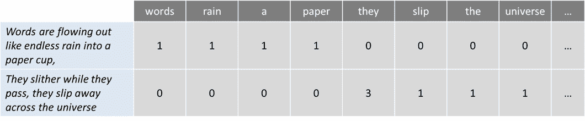
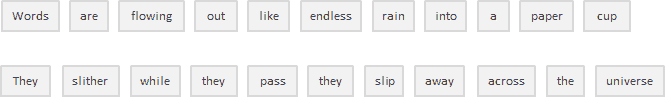

# 自然语言处理

> 原文：<https://medium.com/analytics-vidhya/natural-language-processing-7f6d89a7590?source=collection_archive---------16----------------------->

安妮·斯普拉特在 [Unsplash](https://unsplash.com?utm_source=medium&utm_medium=referral) 上的照片

我们表达的一切(无论是口头还是书面)都携带着大量的信息。我们选择的主题，我们的语气，我们选择的词语，每一件事都增加了某种类型的信息，可以被解读并从中提取价值。理论上，我们可以利用这些信息理解甚至预测人类行为。

但有一个问题:一个人可能会在一份声明中产生数百或数千个单词，每个句子都有其相应的复杂性。如果你想在一个给定的地理范围内扩展和分析数百、数千或数百万的人或声明，那么情况就不可收拾了。

从对话、声明甚至推文中生成的数据是非结构化数据的例子。**非结构化数据**并不完全符合关系数据库的传统行列结构，而是代表了现实世界中绝大多数可用的数据。这是混乱和难以操纵的。然而，由于机器学习等学科的进步，关于这个话题正在发生一场大革命。如今，人们不再试图根据关键词来解释文本或演讲(老式的机械方法)，而是理解这些词背后的含义(认知方法)。这样就有可能检测出像反语这样的修辞，甚至进行情感分析。

> 自然语言处理(NLP)是人工智能的一个领域，它赋予机器阅读、理解和从人类语言中获取意义的能力。

# **NLP 的优势**

众所周知，博客、社交网站和网页每天都会产生数百万千兆字节的数据。

有许多公司收集所有这些数据来了解用户和他们的热情，并将这些报告交给公司来调整他们的计划。

假设一个人喜欢旅行，并且定期搜索度假目的地，用户进行的搜索被用于通过在线酒店和航班预订应用向他提供相关广告。

你知道吗，搜索引擎并不是自然语言处理(NLP)的唯一实现，还有很多很棒的实现。

# 一袋单词

是一个常用的模型，允许您计算一段文本中的所有单词。基本上，它为句子或文档创建一个出现矩阵，不考虑语法和词序。这些词频或出现次数然后被用作训练分类器的特征。

举个简短的例子，我引用了甲壳虫乐队的歌曲《穿越宇宙》的第一句话:

> 文字像无尽的雨水一样流入纸杯，
> 
> 它们滑过，滑过宇宙

现在让我们数数单词:

这种方法可能反映了几个缺点，如缺乏语义和上下文，以及阻止单词(如“the”或“a”)的事实给分析增加了噪声，并且一些单词没有相应地加权(“universe”的权重小于单词“them”)。

为了解决这个问题，一种方法是根据单词在所有文本(不仅仅是我们正在分析的文本)中出现的频率来重新调整单词的频率，以便像“the”这样在其他文本中也经常出现的频繁单词的分数会受到惩罚。这种打分的方式叫做**“词频—逆文档频率”**，通过权重来提高单词的袋子。文本中频繁出现的术语会得到“奖励”(如我们示例中的单词“他们”)，但如果这些术语在我们包含在算法中的其他文本中频繁出现，它们也会受到“惩罚”。相反，这种方法突出显示并“奖励”考虑所有文本的独特或罕见的术语。然而，这种方法仍然没有上下文和语义。

# 标记化

是将连续文本分割成句子和单词的过程。本质上，它的任务是将文本切割成称为*记号*的片段，同时丢弃某些字符，如标点符号。按照我们的例子，标记化的结果将是:

很简单，对吧？虽然在这种情况下，以及在像英语这样的用空格分隔单词的语言(称为分段语言)中，这看起来很基本，但并不是所有语言的行为都是一样的，如果你仔细想想，空格本身并不足以让英语执行正确的标记化。在空格处进行拆分可能会将应该被视为一个标记的内容分开，例如某些名称(例如旧金山或纽约)或借用的外国短语(例如自由放任)。

**标记化也可以去除标点**，为正确的分词铺平了道路，但也引发了可能的复杂性。对于缩写后面的句点(例如 dr .)，该缩写后面的句点应被视为同一令牌的一部分，不能删除。

在处理包含大量连字符、括号和其他标点符号的生物医学文本领域时，标记化过程可能会特别成问题。

关于标记化的更深入的细节，您可以在本文的[中找到很好的解释。](https://www.ibm.com/developerworks/community/blogs/nlp/entry/tokenization?lang=en)

# 基于自然语言处理的文本分类和情感分析

自然语言处理(NLP)是计算机科学的一个广阔领域，它涉及计算机和人类语言之间的交互。
在 NLP 中，许多任务是——或者可以被重新表述为——分类任务。在分类任务中，我们试图产生一个分类函数，它可以给出某个特征和某个类别之间的相关性。

这个分类器首先必须用训练数据集来训练，然后它可以用于实际分类文档。训练意味着我们必须确定它的模型参数。如果正确选择了训练样本集，分类器应该以类似的精度(作为训练样本)预测实际文档的分类概率。

# NLP 实现

以下是自然语言处理(NLP)的一些成功实现:

*   **搜索引擎**如谷歌、雅虎等。谷歌搜索引擎知道你是一个技术人员，所以它会显示与你相关的搜索结果。
*   社交网站像脸书新闻一样提供信息。新闻提要算法使用自然语言处理理解你的兴趣，并比其他帖子更有可能向你显示相关的广告和帖子。
*   **语音引擎**比如苹果 Siri。
*   像谷歌垃圾邮件过滤器一样的垃圾邮件过滤器。不仅仅是通常的**垃圾邮件过滤**，现在垃圾邮件过滤器了解电子邮件内容，并查看它是否是垃圾邮件。