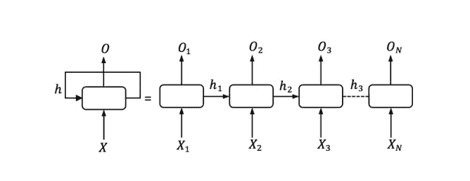
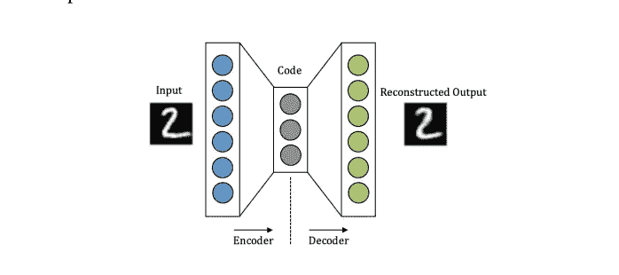
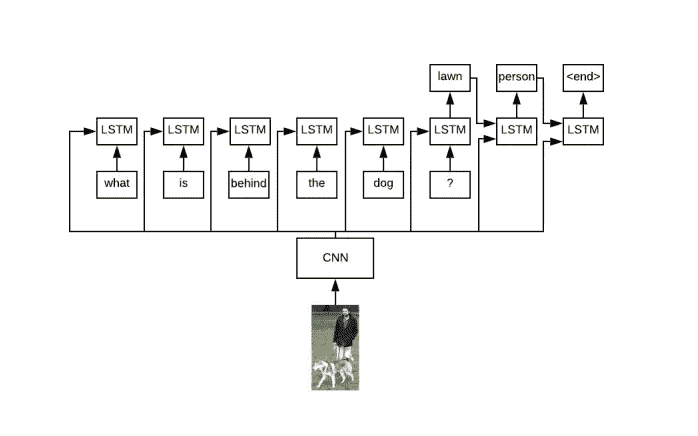

# 深度学习促进自然语言处理:综述

> 原文：<https://medium.com/analytics-vidhya/natural-language-processing-advancements-by-deep-learning-a-survey-24d2428ba19f?source=collection_archive---------23----------------------->

# 介绍

自然语言处理是计算机科学的一个分支，涉及自然语言和计算机。它帮助机器理解、处理和分析人类语言。由于先进的计算能力、更大的大数据集可用性和深度学习，NLP 在这些时候很容易。本文涵盖了深度学习在 NLP 领域的作用及其广泛的类别。本文解释了将深度学习应用于 NLP 问题的挑战、机遇和影响评估。

# 背景

深度学习是使用深度神经网络对海量数据进行学习，旨在处理一个任务的问题。只要有大量相关的数据集，它就能解决任何问题。它还检测和分析问题陈述的重要特征。

**深度学习架构**

在不同的研究领域已经开发了许多深度学习架构。

1.  **多层感知器**

多层感知器(MLP)至少有三层——输入层、隐藏层和输出层。一层使用神经元将信息从前一层传递到下一层。神经元之间不相互通信，使用非线性激活函数。每个节点通过连接到下一层的其他神经元形成全连接网络。MLPs 是不产生任何循环的前馈神经网络(FNNs)的最简单形式。

**2。卷积神经网络**

CNN 内部使用卷积作为其数学函数，这是其输入函数互操作性的一种度量。它主要用于将数据表示为 2D 或 3D 地图的情况。地图中的数据点代表信息关联。在图像 CNN 中，数据图的图像像素与其相邻像素高度相关。CNN 有宽度、高度和深度。CNN 将图像表示为一组数值。在特征提取之后，关键图像内容被捕获并在输出中表示。这些特征可用于不同的任务，如图像分类或对象检测。在利用 CNN 进行 NLP 的情况下，输入是表示为矩阵的句子或文档。矩阵的每一行都与一个语言元素如单词或字符相关联。CNN 架构用于各种分类任务，例如情感分析和主题分类。

图一。用于目标检测的典型 CNN 结构

**3。递归神经网络**

当我们将每个 FNN 的输出作为下一个的输入时，将构建一个递归神经网络(RNN)。像模糊神经网络一样，RNN 中的图层可以分为输入图层、隐藏图层和输出图层。在离散时间帧中，输入向量序列作为输入，一次一个向量。因此，如图 2 所示，在每个时间步长，我们使用当前隐藏层的参数作为下一个时间步长的输入，并进行预测。

图二。递归神经网络(RNN)

RNNs 中的隐藏层携带来自过去的信息或记忆该信息。这在序列类型的输入中特别有用。长短期记忆网络(LSTM)是应用最广泛的一类 RNNs。LSTMs 捕获不同时间步长的输入之间的长期相关性。语音识别通常依赖于 LSTMs。

**4。自动编码器**

自动编码器在深度学习中实现无监督的方法，并由序列到序列建模组成。它们用于降维或 NLP 应用。图 3 示出了自动编码器的示意图。他们的目标是学习每个输入的代码表示，因为没有对应于每个输入的标签。解码器的操作类似于编码器，但是相反，即基于编码的输入构建输出。

图三。自动编码器示意图

**5。生成对抗网络**

GAN 是两个神经网络(鉴别器和生成器)的组合，本质上是迭代的。首先，生成器网络生成一个假样本。然后鉴别器网络试图决定这个样本是真的还是假的。生成器的目标是欺骗鉴别器，使鉴别器相信生成器生成的样本是真实的。这个迭代过程一直持续到发生器产生鉴别器无法区分的样本。在 GAN 中，一旦训练阶段结束，就不再需要鉴别网络，因此我们可以单独使用生成网络。在自然语言处理领域，GANs 通常用于文本生成。

# 自然语言处理的核心概念

**特征表示**

对于 NLP 系统，由于与符号的原子表示相关的问题，必须学习单词表示。编码的输入特征可以是字符、单词或句子。提供单词的紧凑表示比稀疏表示更可取。Word2vec 和 doc2vec 方法是作为一种无监督算法提出的，称为段落向量(PV)。Doc2vec 克服了 BoW 的缺点，在文本分类和情感分析中是高效的。

**一键显示**

在一键编码中，需要表示的每个唯一元素都有其维度，这导致了非常高维、非常稀疏的表示。在这种方法中，特征空间中的不同单词之间没有有意义的联系。一些研究工作展示了使用一键编码的有希望的结果。

**连续袋字**

CBOW 试图根据一个词的上下文来预测它。CBOW 既不依赖于单词的顺序，也不依赖于概率特征。该模型主要用作更复杂任务的预训练模型。在加权 CBOW (WCBOW)中，向量根据它们在上下文中的相对重要性获得不同的权重。TF-IDF 分数是 CBOW 的一个例子。

**词级嵌入**

单词嵌入是一种学习的表示，其中具有相关语义的单词在表示空间中变得高度相关。与稀疏的、更高维度的表示相反，它具有很高的概括能力。学习分布式表示具有在上下文中使用单词的优势，并且为语义相关的单词提供相似的表示。

**字符级嵌入**

CNN 已经被成功地用于生成字符级嵌入，并且已经被用于 NLP。它可以使用较小的模型大小，并用较低级别的语言元素来表示单词。它还使用了词汇外单词(OOV)问题，对于给定的单词，在单词嵌入中没有等价的向量时，通常会遇到这种问题。这种方法的缺点是字符与语言的语义和句法部分之间的相关性很弱。

**Seq2Seq 框架**

Seq2seq 模拟输入，输出表示为序列。这用于机器翻译、文本摘要、语音到文本和文本到语音等应用中。它包括一个编码器和一个解码器。编码器获取输入数据序列，并生成中间输出，解码器使用该中间输出产生一系列最终输出。这是使用递归神经网络或 LSTM 实现的。在不同的应用中，解码器可以利用更多的信息，例如上下文向量或内部注意力向量，来生成更好的输出。教师强迫是训练模型的常用方法。一旦使用交叉熵损失优化了模型，它可以生成如下的整个序列。在 NLP 应用中，可以通过波束搜索找到一个相当好的输出序列来改善输出。在波束搜索期间，我们不是使用 argmax 来选择最佳输出，而是在每一步选择前 K 个输出，为输出序列生成 K 个不同的路径，并最终选择提供更好性能的路径作为最终输出。

**自然语言处理中的强化学习**

Seq2seq 模型有两个问题:(1)暴露偏差和(2)训练时间和测试时间测量之间的不一致。在教师强制中，在模型的训练期间，解码器利用两个输入，先前的解码器输出状态和真实的输入，来确定其当前的输出状态。然而，在测试期间，解码器完全依赖于先前从模型分布中创建的令牌。由于地面实况数据不可用，这一步骤对于预测下一步行动是必要的。此后，在训练中，解码器输入来自地面实况，而在测试阶段，它依赖于先前的预测。这造成了误差增长。为了解决这个问题，通过仅依靠模型分布来最小化交叉熵损失，来消除训练中的地面真实依赖性。seq2seq 模型的第二个问题是，当使用交叉熵损失完成训练时，通常使用 ROUGE 或 METEOR 进行评估。这将在培训目标和测试评估指标之间形成不一致。这可以通过强化学习来解决。该模型利用其预测来产生一系列动作(单词序列)。然后，在每个时间步，使用贪婪搜索算法来学习最佳动作，并且将训练策略来预测该特定动作。

在演员-评论家训练中，演员通常是用于生成输出的同一个神经网络，而评论家是一个回归模型，用于估计演员对输入数据的表现。演员随后会收到评论家的反馈，并改进其动作。一个主要的挑战是 NLP 应用中的大量动作空间，这导致正确的动作选择困难，并且使得训练过程非常缓慢。这使得寻找最佳演员-评论家模型的过程变得非常复杂，并且模型收敛通常需要对模型进行大量的调整。

# 数据集

基准测试是对方法和算法的评估，以测试它们学习特定模式的能力。与其他现有方法相比，基准测试有助于验证新方法。基准数据集通常采用三种形式之一。1)第一个是真实世界的数据 2)第二个是人工生成的合成数据。它主要用于当所需的数据超过可用数据或数据隐私是一个问题。3)第三种类型是用于演示和可视化目的的玩具数据集。它们是人工生成的。深度学习模型的有效性取决于数据的质量。该模型需要根据与期望任务相关联的数据来训练。因此，对于不同的机器领域，如 NLP，创建新的数据集是至关重要的。然而，这并不容易。数据应该有 3 个属性——适合训练的数据、足以进行评估的数据和可以准确处理的数据。训练数据集用于训练模型，使其知道如何找到输入和相关输出之间的联系。测试数据集用于评估机器的智能。数据准备，以确保它对人类专家来说是简单易懂的。数据的分发可能需要特定的授权，尤其是当我们处理敏感或私人数据时。创建合适的数据集既复杂又重要。这就是为什么研究人员和开发人员经常选择很少的数据集进行基准测试。

# 自然语言处理任务的深度学习

**词性标注**

词性标注是自然语言处理的基本任务之一。这是用词类来标记单词的过程。WSJ corpus7 数据集包含超过一百万个标记，并被广泛用作标记系统的基准数据集。已经为序列标记任务提出了多种基于神经网络的模型，例如 LSTM 网络、双向 LSTM 网络、具有 CRF8 层的 LSTM 网络等。序列标注本身包括词性标注、组块和命名实体识别。

**解析**

解析是给一个被识别的字符串分配一个结构。成分分析特别是指给句子分配句法结构。贪婪解析器使用向量表示来执行内容的语法和语义摘要。最近，深度神经网络模型优于传统算法。依存句法分析显示了目标句子中单词之间的结构关系。在依存分析中，短语元素和短语结构规则对该过程没有贡献。神经网络在泛化能力和降低特征计算成本方面显示了其优越性。双向 LSTMs 已经在依赖分析器中用于特征表示。引入了一种新的控制结构，用于基于堆栈 LSTM 的序列到序列神经网络，并用于基于转换的解析。

**语义角色标注**

语义角色标注(SRL)是对文本论元进行识别和分类的过程。这样做是为了描述元素的特征，以确定“谁”对“谁”做了“什么”，以及“如何”、“在哪里”和“何时”SRL 的目标是提取谓词和相关论元之间的语义关系。

最近，深度学习方法在不考虑显式语法表示的情况下达到了 SRL 的最新水平。当前最先进的方法采用谓词和论元的联合预测，新颖的单词表示方法和自我注意模型。

**文本分类**

文本分类的主要目的是将预定义的类别分配给文本部分，以便进行初步分类。一个简单的例子是给定文档的政治或非政治新闻文章的分类。使用 CNN 进行句子分类，其中通过微调在预先训练的单词向量之上训练模型，已经在学习特定任务向量方面产生了相当大的改进。rnn 已经被用于文本分类。LSTM-RNN 体系结构已经被用于在定义的网络搜索任务中具有特别优势的句子嵌入。除了最大池之外的递归架构，具有有效的单词表示方法，并且与简单的基于窗口的神经网络方法相比表现出优越性。

**信息提取**

信息提取从“非结构化”数据(如社交媒体帖子和在线新闻)中识别结构化信息。信息抽取有命名实体识别、关系抽取、共指消解和事件抽取等子任务。

**命名实体识别**

命名实体识别(NER)的目的是在上下文中定位命名实体并将其分类到预定义的类别中，例如人名和地名。

**关系提取**

关系抽取的目的是发现实体对之间的语义关系。递归神经网络(RNN)模型已经被提出用于通过学习合成向量表示来进行语义关系分类

**共指消解**

共指消解包括在指代同一实体的上下文中对提及的识别。例如，提到的“汽车”、“凯美瑞”和“它”都可以指同一个实体。

**事件提取**

提取事件，识别与事件相关的触发词，并将标签分配给代表事件触发的实体提及。

**情绪分析**

情感分析有时被称为观点挖掘，因为它的主要目标是分析人类的观点、情感，甚至是关于产品、问题和各种主题的情感。情感分析一般分为三个类别/级别:文档级、句子级和方面级。

1)文档级情感分析:任务是确定整个文档反映的是对一个实体的正面情感还是负面情感。门控递归神经网络结构已经被用于此，

2)句子级情感分析:情感分析确定关于句子中表达的观点的积极、消极或中立。递归自动编码器已经被用于句子级情感标签预测

3)方面级情感分析:方面级情感分析直接针对观点，假设情感及其目标存在。方面级情感分析通常涉及方面情感分类和方面抽取。前者决定对不同方面(积极的、中立的或消极的)的看法，而后者确定在上下文中评估的目标方面。为此，提出了基于注意力的 LSTMs。

# 机器翻译

这是 NLP 中受到深度学习进步深刻影响的领域之一。

1.  **传统机器翻译**

BLEU 评分是作为一种新的评估指标引入的，与使用人工评估的唯一方法相比，它可以实现更快的改进。

**2。神经机器翻译**

与传统的统计机器翻译不同，NMT 基于端到端的神经网络。这意味着不需要大量的预处理和单词对齐。输入令牌序列被输入到网络中。一旦到达一个句子结束(EOS)标记，它就开始生成输出序列。输出序列以与输入序列相同的递归方式生成，直到它到达一个句子结束标记。这种方法的一个主要优点是不需要指定序列的长度；网络会自动将其考虑在内。

**3。问题解答**

问答是信息检索的一个细粒度版本。在信息检索中，需要从一组文档中检索一组所需的信息。在问答中，寻找特定的答案，通常是可以从可用的文档中推断出来的答案。

1.  基于规则的问题回答:baseball 是关于 QA 的早期作品之一。Baseball 系统包括(1)问题读入，(2)问题中单词的字典查找，(3)问题中单词的句法(POS)分析，(4)用于提取输入问题的内容分析，以及(5)估计关于回答输入问题的相关性。
2.  深度学习时代的问答:智能手机(Siri，Ok Google，Alexa 等。)是 QA 系统的常见示例，许多人每天都与之交互。虽然早期的此类系统采用了基于规则的方法，但今天它们的核心算法是基于深度学习的。系统试图在数据库中挑选一个有问题答案的句子，一个特征向量代表每个问题-句子对。卷积神经网络，以便以固定长度向量的形式编码问答句子对，而不管输入句子的长度。他们没有使用余弦相关等距离度量，而是引入了非线性张量层来匹配问题和答案之间的相关性。
3.  视觉问答:给定一个输入图像，视觉问答(VQA)试图回答一个关于图像的自然语言问题。VQN 解决了多个问题，如对象检测，图像分割，情感分析。

图 4。神经图像问答

**文件汇总**

文档摘要是指给定一个或多个文档作为输入，涉及生成摘要句子的一组问题。

**摘录摘要**目标是识别文档中最突出的句子，并将其作为摘要返回。摘录式摘要容易产生冗长且有时重叠的摘要句子；但是，结果反映了作者的表达方式。

**抽象总结**目标是从零开始生成总结句子；它们可能包含原始文档中没有出现的新单词。抽象方法产生一个更短的摘要，但是它们很难训练。

# 对话系统

对话系统正迅速成为人机交互的主要工具，部分原因是它们的潜力和商业价值。由于有知识的人力资源的高成本，公司经常转向智能对话机器。对话系统通常是基于任务的或非基于任务的。尽管在对话系统的后端采用了有用的统计模型，但是大多数部署的对话系统依赖于昂贵的手工制作和手动特征来操作。深度学习有助于创建端到端的面向任务的对话系统，这丰富了框架，使对话超越了带注释的特定任务对话资源。

图 4。对话系统的框架。

基于任务的系统:基于任务的对话系统的结构通常包括以下要素:

**自然语言理解(NLU):** 该组件通过为口语话语分配成分结构来处理对用户口语上下文的理解和解释

**对话管理器(DM):**NLU 生成的表示将由对话管理器处理，对话管理器调查上下文并返回合理的语义相关响应。

**自然语言生成(NLG):** 自然语言生成(NLG)组件基于由 DM 组件提供的响应来产生话语。

大致流水线如下:NLU 模块(即语义解码器)将语音识别模块的输出转换成一些对话元素。然后，DM 处理这些对话元素，并提供合适的响应，该响应被馈送给 NLG 以生成响应。最近，基于深度强化学习设计了面向任务的对话系统，该系统在性能、领域适应和对话生成方面提供了有希望的结果。

**非基于任务的系统**

与基于任务的对话系统相反，设计和部署非基于任务的对话系统的目标是赋予机器与人类进行自然对话的能力。通常，聊天机器人属于以下类型之一:基于检索的方法和生成方法。基于检索的模型可以访问信息资源，并且可以提供更简洁、流畅和准确的响应。另一方面，生成模型的优势在于，当这样的响应不在语料库中时，能够产生合适的响应。然而，与基于检索的模型相反，它们更容易因其生成模型而出现语法和概念错误。基于检索的方法从候选响应中选择适当的响应。基于检索的方法通常采用单轮响应匹配或多轮响应匹配。在第一种类型中，当前查询(消息)仅用于选择合适的响应。该模型试图选择考虑整个上下文的响应，以保证会话的一致性。已经提出了基于 LSTM 的模型用于上下文和响应向量的创建。生成模型不假设预定义响应的可用性。新的响应是从零开始产生的，并且基于训练好的模型。生成模型通常基于序列对序列模型，并将输入查询映射到目标元素作为响应。一般来说，设计和实现一个能够在人类层面上对话的对话代理是非常具有挑战性的。为此，通常在大型对话语料库上训练机器。对于定量评估，对抗性评估最初用于句子生成的质量评估，并用于对话系统的质量评估。尽管人工智能取得了显著进步，对话系统也受到了极大关注，但在现实中，成功的商业工具，如苹果的 Siri 和亚马逊的 Alexa，仍然严重依赖手工制作的功能。鉴于自然语言的复杂性、框架设计的困难以及可用数据源的复杂性，设计和训练数据驱动的对话机器仍然非常具有挑战性。

# 结论

在这篇文章中，我们对使用深度学习的自然语言处理中最杰出的作品进行了全面的调查。我们为介绍不同的 NLP 核心概念、方面和应用提供了分类背景，并强调了每个相关类别中最重要的研究成果。深度学习和自然语言处理是当今发展最快的两个研究课题。由于这种快速的进展，希望新的有效模型将很快取代当前最先进的方法。

本文是以下 IEEE 论文的概述—

[https://arxiv.org/pdf/2003.01200.pdf](https://arxiv.org/pdf/2003.01200.pdf)