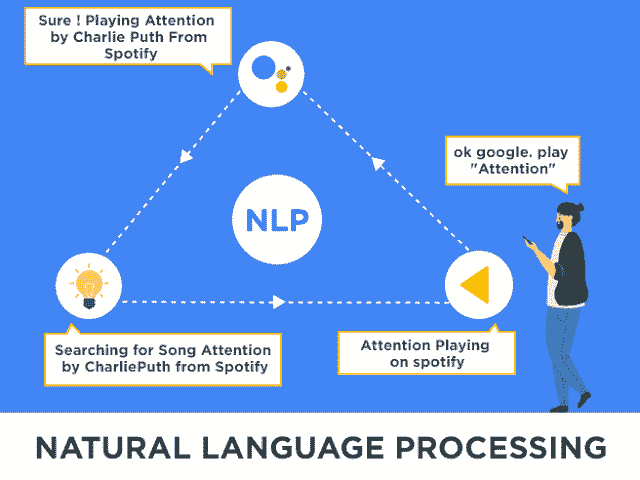
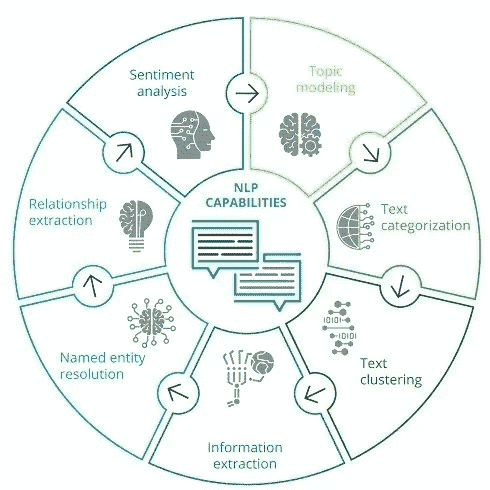

# 自然语言处理及其对金融业的影响

> 原文：<https://medium.com/analytics-vidhya/natural-language-processing-and-its-impact-on-financial-sector-2f2d4f143da7?source=collection_archive---------33----------------------->

# 什么是自然语言处理？

自然语言处理可能有许多定义，简称为 **NLP** ，但其核心是定义为理解、解释和操纵人类语言的过程。NLP 是人工智能的一个分支，它基于包括计算机科学和计算语言学在内的许多学科而形成，以增强人类和机器的交流。

以前，机器用来从人类那里获得预先构建的命令，执行相关任务，并最终产生输出/结果。现在随着机器学习和人工智能的出现，机器能够根据当前的情况选择做什么。如果你用的是 Alexa 或者 Google Home 甚至 Google search，那么你其实用的是 NLP。

# 但是 NLP 如何影响金融部门？

几十年来，金融机构一直在使用耗时的方法进行文档搜索，以便对非结构化数据的客户服务进行分析。NLP 经过训练，即使在非结构化数据中也能高精度地发现模式。NLP 可用于文本分类、信息检索、自然语言生成和自然语言理解，以提供简单而强大的结果。这使得 NLP 被广泛接受来自动化整个金融部门的某些过程。从下面的例子可以很容易地看出这种影响。

图片来源:德勤分析

## 个性化客户服务

金融部门雇佣了大量的后勤和客户服务人员。这些工作是高度重复的，需要注意细节，并意味着高压力水平。NLP 可以更容易地帮助建立聊天机器人，它们可以作为客户的个人职员全天候工作，但它们也可以是财务顾问，帮助人们节省更多的钱，按时付款，并管理他们的帐户。

## 自动化交易平台

加密货币市场的兴衰引发了高频交易机器人的使用。这些都是建立在定量交易模型的基础上，这些模型分析最佳交易决策，并专注于复制它们的模式。

在这里使用大数据的优势在于，这些模式可以从各种互连的数据集以及非结构化但相关的数据(如新闻和新闻稿)中检索到。NLP 在从新闻和其他金融文章中提取信息方面表现突出。

好消息是，这些工具几乎是实时运行的，可以帮助经纪人验证他们的决策。这是通过将现场数据存储解决方案与预测应用相结合来实现的。

## 监控公司情绪

虽然重大新闻，如收益报告或收购，会影响投资者对一家公司的看法，但新闻报道的总体基调也是如此。使用 NLTK 和 Spacy 等 NLP 工具，金融服务提供商可以跟踪公司的提及情况，并辨别新闻报道中的负面或正面情绪。

## 提升分析师报告的质量

由于能够访问经过筛选的相关信息，金融服务分析师能够编写更详细的报告，并为客户和内部决策者提供更好的建议。

## 实现更简单的搜索

金融机构有大量的公司内部数据可供决策过程查询。在 NLP 的帮助下，他们只需问一个问题就可以轻松访问他们的数据库。通过在现有的复杂的基于 API 的搜索功能上添加一个对话层，该系统允许用户请求特定主题的新闻，即使他们使用复杂的语言现象。

# 结论

由于法规和合规性要求，金融部门采用新技术的时间相对较晚，但它也对降低成本非常感兴趣。一旦大联盟和人工智能成为主流，这个市场将提供潜在的高回报。

NLP 可以用来评估来自不同上下文的各种各样的语音和文本数据。它可能会帮助银行自动化和优化收集客户信息和搜索文档等任务。

简而言之，随着金融行业迅速转向数字化，NLP 是金融机构的一个必不可少的解决方案。看看 NLP 将如何对金融行业产生影响，以及它将如何改变整个行业，这将是一件有趣的事情。