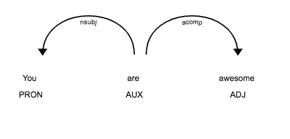
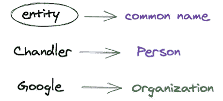

# 自然语言处理—基本概念

> 原文：<https://medium.com/analytics-vidhya/natural-language-processing-basic-concepts-a3c7f50bf5d3?source=collection_archive---------12----------------------->

*让我们学习如何使用 Python 中一个简单有效的工具包——自然语言工具包****NLTK——来处理(基本上是理解)自然语言(非结构化数据的大文本)。*** *(大部分)*

假设我们有趣的用例是处理 F.R.I.E.N.D.S .的脚本…这是我最喜欢的一集 ***【拿着所有扑克的那个】*** 的开始脚本

> 罗斯:嗯，瑞秋，我们这里的简历快用完了。
> 
> 莫妮卡:你真的想要一份大众机械师的工作吗？
> 
> 好吧，如果你想为机械师工作，那就为他们工作吧。
> 
> 嘿，听着，伙计们，我什么都愿意做，好吗？我不能再做服务员了，我是认真的。我受够了糟糕的小费，我受够了被人叫对不起。
> 
> 罗斯:瑞秋，你校对过这些吗？
> 
> 瑞秋:嗯……是的，怎么了？
> 
> 罗斯:嗯，没什么，我相信他们会对你出色的电脑技能印象深刻。
> 
> 瑞秋:(沮丧地)哦，我的天啊！哦，你认为它们都在上面吗？
> 
> 乔伊:哦，不，我确定复印机有拍到一些。

怀旧。无论如何，让我们分析这篇课文，好吗？但是首先..

## 下载/导入 NLTK 库

首先[安装 NLTK](https://www.nltk.org/install.html) 并检查你是否安装了它，要么导入它，要么查看命令“pip show nltk”是否给出任何输出。

接下来，您可能希望下载 NLTK 库下最“流行”的数据+预训练模型列表，因此使用以下代码:

```
import nltk
nltk.download(‘popular’) #run this once, no need to run it again
```

# *1。符号化*

Tokenize 基本上意味着将文本字符串转换成单词列表。

## 转换成句子= >句子标记化:

```
sentences = nltk.sent_tokenize(script)
print(sentences)**OUTPUT:** ["Ross: Uh, Rach, we're running low on resumes over here.", 'Monica: Do you really want a job with Popular Mechanics?', "Chandler: Well, if you're gonna work for mechanics, those are the ones to work for." .. (and so on)
```

## 转换为单词= >单词标记化:

我们可以将每个句子或整个脚本转换成单词，但是我们需要删除像句号、省略号、逗号等分隔符。所以我们使用 Python 的正则表达式库 RE 来做这件事。

```
import re
def remove_delimiters(sentence):
    return re.sub(r'[^\w\s]', '', sentence)trimmed_sentences = [remove_delimiters(sent) for sent in sentences]
print(trimmed_sentences)**OUTPUT:** ['Ross Uh Rach were running low on resumes over here', 'Monica Do you really want a job with Popular Mechanics', 'Chandler Well if youre gonna work for mechanics those are the ones to work for', .. (and so on)
```

将修剪后的句子转换成单词:

```
all_words = [nltk.word_tokenize(sent) for sent in trimmed_sentences]
print(all_words)**OUTPUT:** [['Ross', 'Uh', 'Rach', 'were', 'running', 'low', 'on', 'resumes', 'over', 'here'], ['Monica', 'Do', 'you', 'really', 'want', 'a', 'job', 'with', 'Popular', 'Mechanics'], ['Chandler', 'Well', 'if', 'youre', 'gon', 'na', 'work', 'for', 'mechanics', 'those', 'are', 'the', 'ones', 'to', 'work', 'for'], ... (and so on)(NOTE: Directly tokenizing into words causes some problems, like **gonna** became **gon na,** so one can use regex according to ones needs. The base here is creating tokens out of text, whether using NLTK or RE)
```

## [或]一次将整个脚本转换为单词:

但是，如果您不想(转换成句子，使用正则表达式，然后单词标记器)…有一个更简单的单行正则表达式方法将整个语音转换成单词:

```
all_words_easy = re.findall(r’\w+’, script)
print(all_words_easy)**OUTPUT:** ['Ross', 'Uh', 'Rach', 'we', 're', 'running', 'low', 'on', 'resumes', 'over', 'here', 'Monica', 'Do', 'you', 'really', 'want', 'a', 'job', 'with', 'Popular', 'Mechanics', 'Chandler', 'Well', 'if', 'you', 're', 'gonna', 'work', 'for', 'mechanics', 'those', 'are', 'the', 'ones', 'to', 'work', 'for', ... (and so on)
```

# 2.停用字词删除:

停用词是在任何文本中频繁出现的不太重要的词，如`the`、`and`、`a`等。大多数时候，它们在我们的 NLP 任务中贡献很少或没有意义，所以我们通常移除它们..

```
from nltk.corpus import stopwords
stop_words=set(stopwords.words("english"))
print(stop_words)**OUTPUT:** 'your', 'him', "that'll", 'hers', 'an', 'same', 'did', 'yours', 'that', 'as' .. (you get my point)#Remove stopwords
words_without_stopwords = [word for word in all_words_easy if word not in stop_words]
print(words_without_stopwords)**OUTPUT:** ['Ross', 'Uh', 'Rach', 'running', 'low', 'resumes', 'Monica', 'Do', 'really', 'want', 'job', 'Popular', 'Mechanics', 'Chandler', 'Well', 'gonna', 'work', 'mechanics', 'ones', 'work', 'Rachel', 'Hey', 'look', 'guys', 'I', 'going', 'anything', 'OK', 'I', 'cannot', 'waitress', 'anymore', 'I', 'mean', 'I', 'sick', 'lousy', 'tips', 'I', 'sick', 'called', 'Excuse', 'Ross', 'Rach', 'proofread', 'Rachel', 'Uh', 'yeah', 'Ross', 'Uh', 'nothing', 'I', 'sure', 'impressed', 'excellent', 'compuper', 'skills', 'Rachel', 'upset', 'Oh', 'Goood', 'Oh', 'think', 'Joey', 'Oh', 'I', 'sure', 'Xerox', 'machine', 'caught']
```

# 3.单词标记(词性标记):

词性标注基本上意味着将一个标签与句子中的每个单词相关联。例如:

```
string = ‘You are awesome’
words = nltk.word_tokenize(string)
pos_tag = nltk.pos_tag(words)
print(pos_tag)**OUTPUT:** [('You', 'PRP'), ('are', 'VBP'), ('awesome', 'JJ')]Here, You => personal pronoun
      are => verb
      awesome => simple adjective
```

# 4.词干:

词干化意味着把这个词转换成它的词根或者去掉它的后缀。这里我们使用 NLTK 中的 PorterStemmer 类，正如您所看到的，词干处理将单词转换成它们的基本形式或者去掉后缀(例如:`cooking`变成了`cook`)

```
from nltk.stem import PorterStemmer
ps = PorterStemmer()
print(ps.stem('cooking'))  -> cook
print(ps.stem('serving'))  -> serv
```

缺点:词干有时会使单词变得毫无意义。于是,**来拯救被异化的**。

# **5。词汇化**:

它将单词转换成它的(有意义的)基本词根或词条。这里唯一的问题是，我们需要提到作为参数的是哪种单词(即它的位置标签)。这里两者都是动词，所以我们将参数作为`'v'.`传递

```
from nltk.stem.wordnet import WordNetLemmatizer
lm = WordNetLemmatizer()
print(lm.lemmatize('cooking', 'v')) -> cook
print(lm.lemmatize('serving', 'v')) -> serve
```

# 6.依存句法分析

词性标注只会将每个单词转换成其各自的词性。然而，大多数时候，我们需要算法来理解单词之间的关系。依赖解析器做的*和*完全一样。让我们看看如何:

```
import spacy #another open-source library for NLP
nlp = spacy.load(‘en_core_web_md’)
from spacy import displacytemp = nlp('You are awesome')
displacy.serve(temp, style=’dep’)
```



使用空间的词性标注+依存句法分析

这里， **you** 是主语， **awesome** 是形容词补语。这两者通过单词 **are 相互连接。**

# 7.命名实体识别

这不是 NLP 工作流程中的一个强制步骤，但是，这是一个对你的单词进行分类的好方法。NER 是每个实体(句子中的基本主语和宾语)到它们的**通用名的映射。**



使用[https://excalidraw.com/](https://excalidraw.com/)绘制

```
sentence = "Chandler works at Google"
print (nltk.ne_chunk(nltk.pos_tag(nltk.word_tokenize(sentence))))**OUTPUT:** (S (PERSON Chandler/NNP) works/VBZ at/IN (ORGANIZATION Google/NNP))
```

这些是关于 NLP 的基本概念，在深入分析文本并为进一步的任务进行处理之前，需要理解这些概念:)

下次有人问你知不知道 NLP)

哦，嘿，也许以后你可以用这些处理过的脚本，应用 ML 来分析钱德勒使用的是哪种幽默。迁就我；)

以上代码可以在 [***这里找到***](https://nbviewer.jupyter.org/github/riddhinn99/medium-articles-code/blob/main/nlp_basics.ipynb) ！感谢阅读！如果你觉得这篇文章很有见地和/或很有趣，请为它鼓掌，关注我的[](/@riddhinn)*！*

*一如既往，你和我一起学习。如果我错过了什么明显的东西，请留下回复，我会检查一下。干杯！✨*