# 自然语言处理

> 原文：<https://medium.com/analytics-vidhya/natural-language-processing-bb8de5fc902?source=collection_archive---------7----------------------->

## **社交媒体分析—** 分布语义

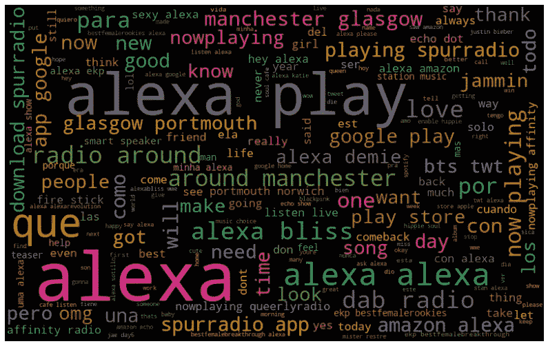

英国语言学家约翰·弗斯在 1957 年说过——“**你可以通过一个人交什么样的朋友来了解这个人”。**

**最常用的单词表示法是使用“单词向量”。有两种技术可以将单词表示为向量:**

> ***术语-文档出现矩阵，*** *其中每行是词汇表中的术语，每列是文档(如网页、推文、书籍等。)*
> 
> ***术语-术语共现矩阵*** *，其中第 I 行和第 j 列表示第 j 个单词在第 j 个单词的上下文中的出现。*

“现在，每个单词和文档都有相应的向量表示——每行是一个表示单词的向量，而每列是一个表示文档(或上下文，如推文、书籍等)的向量。)".

> **术语-文档矩阵**
> 
> 考虑四个文档，每个文档都是从一部电影中截取的一段。假设你的词汇只有以下几个词:恐惧、啤酒、乐趣、魔法、巫师。
> 
> *下表总结了术语-文档矩阵，每个条目代表一个术语在电影中的使用频率::*

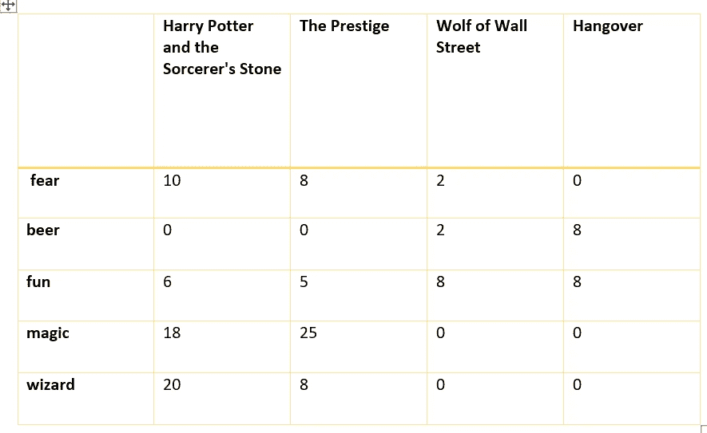

创建共生矩阵有两种方式:

> ***利用发生上下文(如句子):***
> 
> 每个句子被表示为一个上下文(也可以有其他定义)。如果两个术语出现在同一个上下文中，我们说它们出现在同一个上下文中。
> 
> ***【x-Skip-n-grams】:***
> 
> *滑动窗口将包括(x+n)个单词。这个窗口现在将作为上下文。在这个上下文中共同出现的术语被称为已经共同出现。*

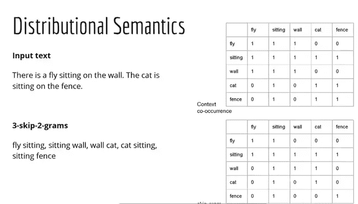

最后，让我们谈谈我们开始做的事-

# 从一个人交的朋友，你就可以知道这个人说的话。

# **词向量**

假设你从《哈利·波特与魔法石》中得到以下一段话:

“对不起，”当这个瘦小的老人绊了一下，差点摔倒时，他咕哝道。过了几秒钟，德思礼先生才意识到那个人穿着一件紫色斗篷。对于差点被撞倒在地，他似乎一点也不难过。”

让我们假设我们的词汇表只包含下面列出的几个单词。删除停用词和标点符号，只保留词汇表中的词后，段落变成:

**男子绊倒秒钟德思礼男子披风打翻被撞倒地**

> 使用 3-skip-2-gram 技术创建一个共现矩阵，并回答下列问题(选择一个相似性度量)。
> 
> 词汇应该是:
> 
> *(人，绊倒，秒，德思礼，斗篷，打翻，撞倒，落地)*
> 
> 你得到的共现对将是(左右单词的位置无关紧要，它们也可以互换):
> 
> (男子，绊倒)(男子，秒)(男子，德思礼)(男子，男子)
> 
> (绊倒，秒)(绊倒，德思礼)(绊倒，伙计)(绊倒，斗篷)
> 
> (秒，德思礼)(秒，人)(秒，斗篷)(秒，心烦)
> 
> (德思礼，伙计)(德思礼，斗篷)(德思礼，心烦意乱)(德思礼，敲门)
> 
> (人，斗篷)(人，心烦意乱)(人，敲)(人，地面)
> 
> (斗篷，不安)(斗篷，被撞)(斗篷，地面)
> 
> (心烦意乱，敲门)(心烦意乱，地面)
> 
> (敲，地面)

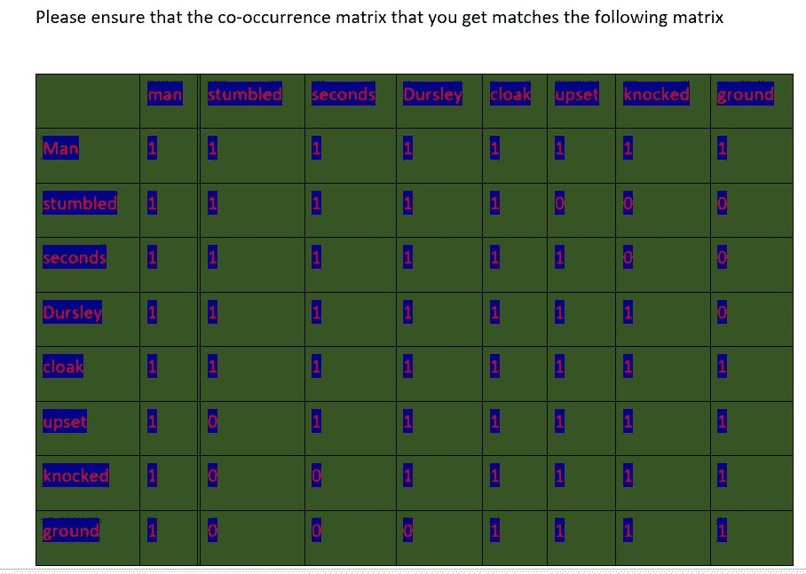

**单词嵌入:**

**出现和共现矩阵是稀疏的(真的稀疏！)和高维。谈论高维——为什么不使用矩阵分解技术(如奇异值分解等)来降低维数呢？？**

> 这正是单词嵌入的目的。单词嵌入是庞大的出现和共现矩阵的压缩、低维版本。
> 
> *每一行(即单词)都有一个更短的向量(大小为 100，而不是数万)，并且是密集的，即大多数条目都是非零的(并且您仍然可以保留完整大小的稀疏矩阵所包含的大部分信息)。*

**可以使用以下两种广泛的方法来生成单词嵌入:**

> ***基于频率的方法*** *:减少术语-文档矩阵(也可以是 tf-idf、关联矩阵等。)使用维数减少技术，例如 SVD。*
> 
> ***基于预测的方法*** *:在这种方法中，输入是单个单词(或单词的组合)，输出是上下文单词的组合(或单个单词)。浅层神经网络学习嵌入，使得可以使用输入单词来预测输出单词。*

# **潜在语义分析**

> 在 LSA，你把一个单词的嘈杂的高维向量投影到一个低维空间。低维空间是单词语义的更丰富的表示。
> 
> *LSA 广泛用于处理大量文档，用于各种目的，例如文档聚类和分类(在低维空间中)，比较文档之间的相似性(例如，推荐用户喜欢的相似书籍)，寻找术语之间的关系(例如同义词和多义词)等。*
> 
> ***LSA 除了有很多优点外，也有一些缺点。一个是产生的维数是不可解释的(任何基于矩阵分解的技术如 PCA 的典型缺点)。此外，LSA 不能处理多义词等问题。例如，我们之前提到过，术语“Java”有三种含义，在低维空间中该术语的表示将代表该术语的某种“平均含义”，而不是三种不同的含义。***

# ****Word2Vec****

****“语义规则和相似性是词向量最重要的部分，可以由 word2vec 模型捕获，而不是像词模型包那样由词汇/句法处理捕获”。****

**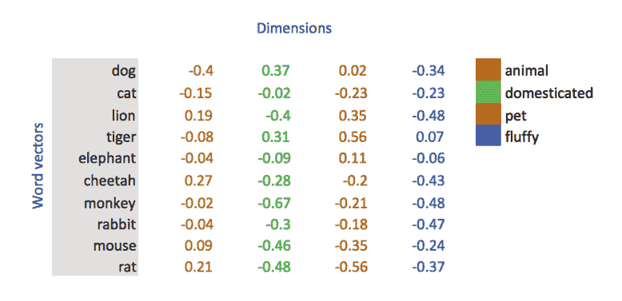**

****未定义维度的词向量****

> ****使用余弦相似度来测量词向量之间的相似度。****
> 
> ****最近邻居****
> 
> **两个单词向量之间的欧几里德距离(或余弦相似度)提供了一种测量相应单词的语言或语义相似度的有效方法。有时，根据这一标准，最近的邻居揭示了普通人词汇之外的罕见但相关的单词。**

**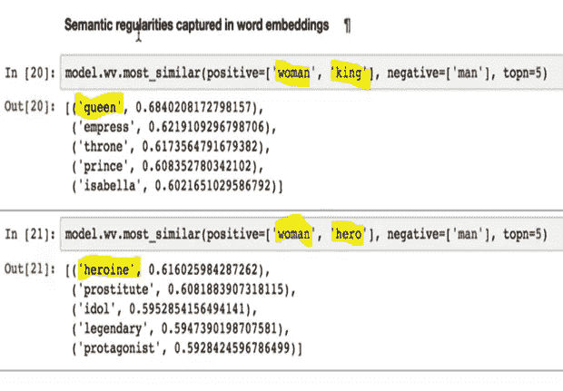**

****跳跃图和 CBOW****

**skip-gram 将目标/给定单词作为输入，并预测上下文单词(在窗口中)，而 CBOW 将上下文术语作为输入，并预测目标/给定术语。**

****简单来说，CBOW 模型通过基于上下文预测当前单词来学习嵌入。skip-gram 模型通过预测给定当前单词的周围单词来学习。****

**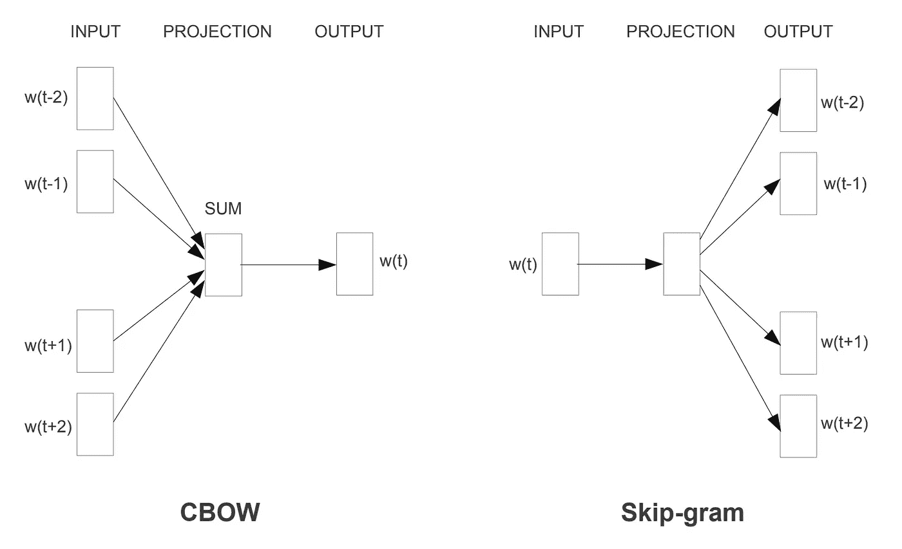**

**对于不太频繁的单词，使用跳跃图训练的单词嵌入比使用 CBOW 训练的单词嵌入略“好”。所谓“更好”，我们只是指与不常用词相似的词也将是不常用词。**

****手套嵌入****

**我们之前提到过，除了 Word2Vec 之外，不同的团队还开发了其他几个单词嵌入。其中最流行的是斯坦福研究小组开发的 [*GloVe(单词的全局向量)*](https://nlp.stanford.edu/projects/glove/) 。这些嵌入在大约 60 亿个独特的标记上进行训练，并作为预训练的词向量可用于文本应用。**

**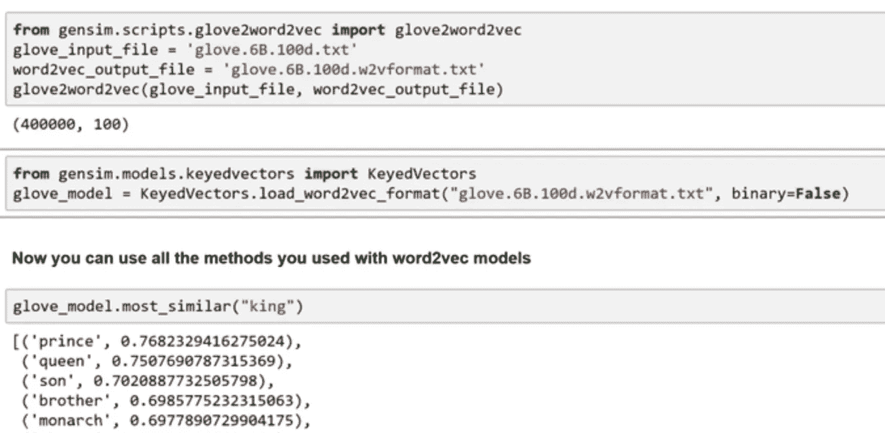**

****概率潜在语义分析(PLSA)****

**PLSA 是一种用于主题建模的概率技术。首先，我们固定任意数量的主题，这是一个超参数(例如，所有文档中有 10 个主题)。我们假设的基本模型是这样的——每个文档是一些主题的集合，每个主题是一些术语的集合。**

****PLSA 算法**的任务是算出题目集合 c. **PLSA** 通常被表示为图形模型，阴影节点表示观察到的随机变量(d，w)，无阴影节点表示未观察到的随机变量。建立优化例程的基本思想是找到最大化联合概率 **P(d，w)** 的主题集合 c。**

# **无监督学习——主题建模:我们为什么需要它？**

**让我假设你是亚马逊的一名产品经理，想要了解客户在评论中谈论的最近发布的产品(比如亚马逊 Echo Dot)的功能。**

**让我们假设你能够确定 50%的人谈论硬件，30%谈论与音乐相关的功能，而 20%谈论产品的包装。**

****

**另一个场景可能是，我们有一些研究论文的大型语料库，我们希望构建一个能够进行特定主题搜索的应用程序。**

****什么是主题——文章描述的主要观点****

****主题背后的高层次直觉:**假设一名教师每天给一班学生讲授技术。**

**我是他的一个学生，转录了他所有的 **Gyan** 并得到了如下几个关键词**

**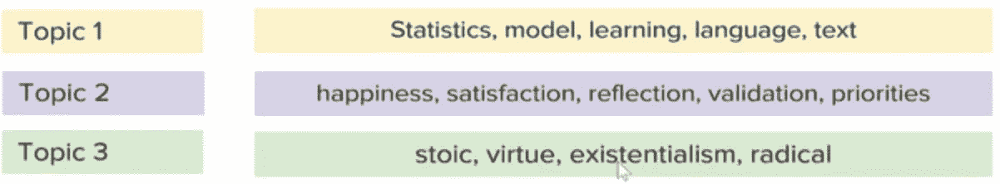**

****猜猜题目讲的是什么！！****

**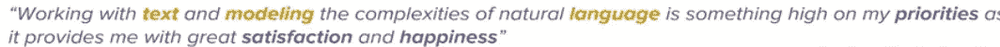**

> ****主题分布::(o.5，o.5，0)::‘这是主题建模的核心思想’。****
> 
> ***主题模型的输入是文档集，例如一组客户评论、推文、研究论文、书籍等。***
> 
> **主题模型有两个输出——1。文档中主题的分布和 2。主题中的单词分布。**

**同样，在主题建模中有两个**任务****

1.  **定义一个主题——很简单，每个术语就是一个词汇表中的主题分布**
2.  **估计覆盖率**

**假设我们有两个主题魔术和科学—**

**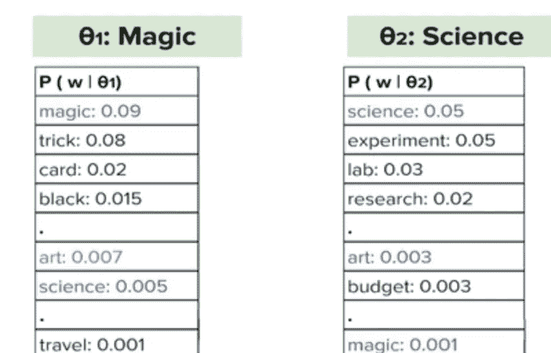**

****词汇的分布****

****概率潜在语义分析(PLSA)****

**PLSA 可以被表示为具有随机变量文档 d、主题 c 和单词 w 的图形模型**

**用于推断参数的基本思想，即优化目标，是最大化观察文档和单词的联合概率 p(w，d )(因为这两个是仅有的观察变量)。注意，你正在做一件非常聪明(也很困难)的事情——使用观察到的随机变量(d，w)来推断未观察到的随机变量 c。**

**使用贝叶斯法则，你可以把 p(w，d)写成:**

****p(w，d) = p(d) x p(w|d)****

****“推理** **任务**是计算 M×k 个文档-主题概率和 k×N 个主题-术语概率。”**

**假设有 M 个文档(由下图中的外板表示)，为了简单起见，假设每个文档(内板)中有 N 个单词。**

**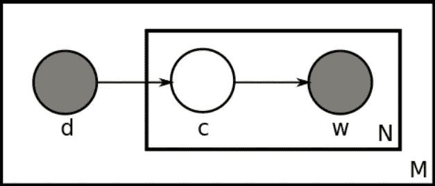**

> ***术语 p(w|d)代表单词 w 从文档 d 中生成的概率，但是我们的模型假设单词从主题中生成，而主题又从文档中生成，所以我们可以将 p(w|d)写成 p(w|c)。p(c|d)对所有 k 个主题求和:***
> 
> ***P(w|d) = ∑p(c|d) x p(w|c)***
> 
> ***所以，我们有* ***P(w，d)= P(d)x∈【P(c | d)x P(w | c)】*****

****PLSA 的局限性**:“PLSA”的主要问题是它有大量参数，这些参数随文档线性增长。"**

# ****潜在狄利克雷分配(LDA)——****

> ***在 LDA 中，我们假设* ***文档-主题*** *和* ***主题-术语*** *分布是* ***狄利克雷分布*** *(由一些变量参数化)，我们要推断这两个分布。***
> 
> ***下面我们有 LDA 板图-***

**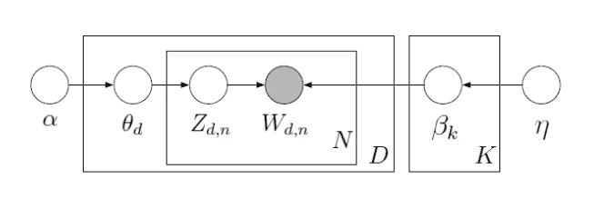**

****LDA 板****

> ***“与 PLSA 不同，LDA 是一个参数模型，也就是说，我们不必知道所有的个体概率。相反，我们假设概率来自一个基本的概率分布(‘狄利克雷’分布),我们可以使用一些参数对其进行建模。”***
> 
> ***例如，在正态分布中，我们有两个参数，即均值和标准差。在 LDA 中，* ***我们假设文档-主题和主题-术语分布是狄利克雷分布(由一些变量参数化)*** *，我们想要推断这两个分布。***

**如上图所示；**

****Alpha** —“决定文档主题分布的狄利克雷分布参数。”
**Eta** —“决定主题词分布的参数。**

# *****狄利克雷分布* :****

**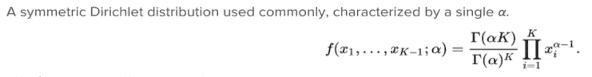**

****对称狄利克雷分布****

**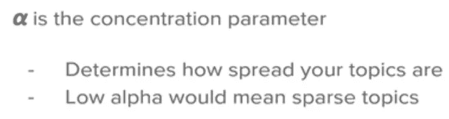**

> ***在****alpha<1****的值下(图-4)，除了少数位于中心的点，大部分点向边缘分散(a* ***稀疏分布****——大部分主题概率低，少数占主导地位)。***
> 
> ***在* ***alpha=1*** *(图-1)点是* ***均匀分布在整个单纯形上的*** *。***
> 
> ***在****alpha>1****(图 2，右上)点围绕中心分布(即所有主题具有可比较的概率，例如(t1=0.32，t2=0.33，t3=0.35))。***
> 
> ***左下图显示了一个* ***非对称分布****(LDA 中未使用)，大部分点靠近 topic-2。***

**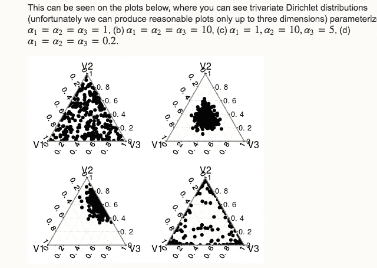**

****关键推论**:**

> *****稀疏主题—非常低的 alpha 表示文档中只有一个主题或者给定主题中只有一个术语—。
> —如果 alpha 很高，你甚至没有在听数据，但是如果它适中，你就混合了给定的数据和估计值。*****

# **工作进展**

**作为一个用例，我正在使用 Twitter Api 实时抓取推文，并应用所有的 NLP 技术来创建 LDA 模型、word 到 vec，以及提取叙述并对它们进行聚类。**

**请继续关注此工作区以获取更多更新…**