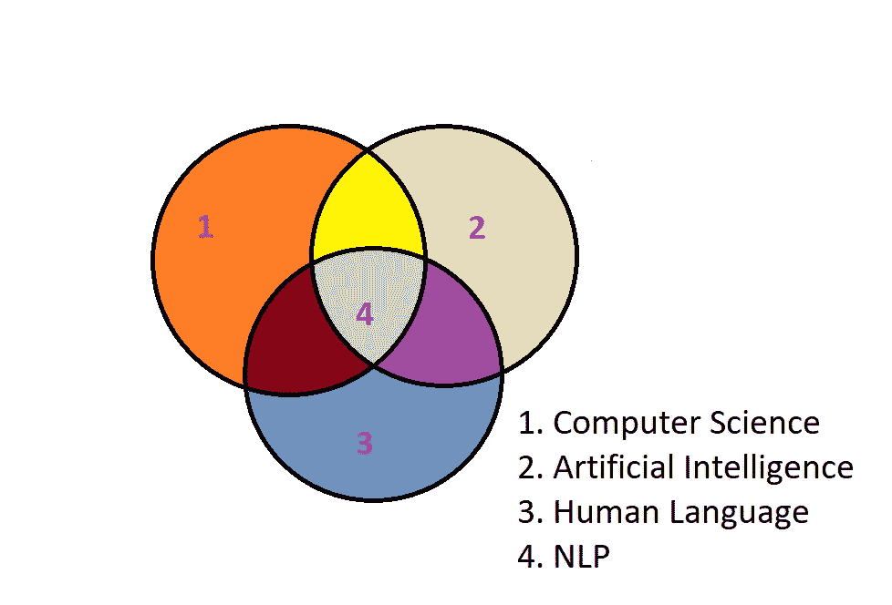
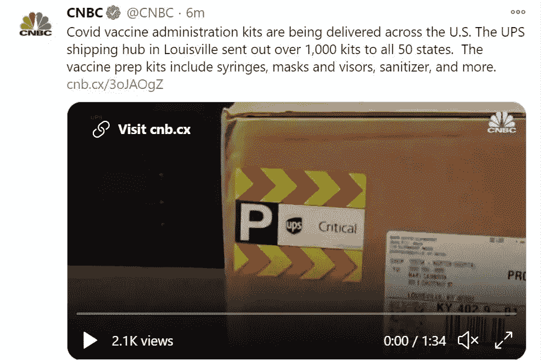

# 自然语言处理

> 原文：<https://medium.com/analytics-vidhya/natural-language-processing-c01b6610cfa4?source=collection_archive---------11----------------------->

来源:[https://www . blume global . com/learning/natural-language-processing/](https://www.blumeglobal.com/learning/natural-language-processing/)

## 维基百科版本

> [自然语言处理是自然语言、计算机科学和人工智能的一个子领域，涉及计算机和人类语言之间的交互，特别是如何编写计算机程序来处理和分析大量自然语言数据。](https://en.wikipedia.org/wiki/Natural_language_processing)

因此，如果我形象地表达这一点，它会像 NLP 是所有三个领域的一个婴儿产品。

让我们看看为什么 NLP 被认为是所有三个主要领域的子领域？

**计算机科学- >编程
人工智能- >你将应用机器学习模型
人类语言- >文本或语音。**

这能解释 NLP 吗？我猜没有！我想到的一个问题是，NLP 的目的是什么？

自然语言处理的目的是阅读、翻译成机器语言、理解和理解人类语言。基本上，这是教机器理解口头或书面语言的方法。

记得几年前，我们必须在谷歌搜索中输入所有内容才能得到有效的结果。现在我们只是用谷歌语音助手或者 Siri(如果你是苹果用户的话)。什么变了？

来源:[https://img . deusm . com/information week/mai casaa-virtual _ assistant-adobe stock _ 234947260 . JPEG](https://img.deusm.com/informationweek/maicasaa-virtual_assistant-AdobeStock_234947260.jpeg)

这并不难猜。谷歌开发了像谷歌翻译和语音助手这样的应用程序，我们可以向我们的 Android 设备口述一些东西，这些设备可以将我们的声音捕获到音频文件中，将其转换为文本，处理文本数据并在互联网上搜索，或者将它们转换回音频并呈现给用户。

## 自然语言处理中常用的技术

1.  情感分析
2.  主题建模
3.  文本生成
4.  命名实体识别
5.  文本摘要

## 情感分析

情感分析是分析文本以确定给定文本是正面的、负面的还是中性的过程。

例子:举一个简单的 twitter 帖子的例子。

来源:[https://twitter.com/CNBC/status/1337439012018135042](https://twitter.com/CNBC/status/1337439012018135042)

用于传递关于 COVID 疫苗试剂盒交付信息的文字是正面、负面还是中性情绪？

这种类型的问题可以在情感分析中处理，在情感分析中，我们将试图发现人们对某些文本或信息的反应是什么！！

## 主题建模

主题建模是一个统计框架，它帮助我们理解大量的文档集合，不仅仅是找到单个的文档，还能理解集合中的一般主题。

## 文本生成

文本生成是生成与人类书写文本相似的文本的任务。

我们刚刚输入了“怎么样”，gmail 就生成了“你好吗？”

## 命名实体识别

命名实体识别是自然语言处理中用于从文本中提取实体的一种技术。

例子:Ram 是谷歌的一名员工。他目前在海德拉巴。他从 2019 年 11 月开始居住在那里。

来源:[https://www . pexels . com/photo/photo-of-man-holding-a-book-927022/](https://www.pexels.com/photo/photo-of-man-holding-a-book-927022/)

因此命名实体识别将识别诸如名称、位置、日期、组织等实体。

名称:拉姆
组织:谷歌
地点:海德拉巴
日期:2019 年 11 月

## 文本摘要

文本摘要用于将大文本摘要成较小的文本。

一篇新闻文章可以概括成一行新闻。

来源:[https://www . the Hindu . com/news/national/coronavirus-Indias-covid-cases-drop-to-low-in-over-100-days/article 33307865 . ECE](https://www.thehindu.com/news/national/coronavirus-indias-covid-cases-drop-to-lowest-in-over-100-days/article33307865.ece)

在这里，我们可以看到这篇文章被总结为“冠状病毒|印度的 COVID 病例降至 100 多天以来的最低水平”

## 自然语言处理的应用

1.  复习课文，分为好的和坏的。
2.  物品类别。
3.  图书类型预测。
4.  机器翻译。
5.  语言的分类等等…..

*参考文献:*

1.  [https://www.nowpublishers.com/article/Details/INR-030](https://www.nowpublishers.com/article/Details/INR-030)
2.  [https://blog . aureusanalytics . com/blog/5-提取信息的自然语言处理技术](https://blog.aureusanalytics.com/blog/5-natural-language-processing-techniques-for-extracting-information)
3.  [https://www . udemy . com/course/machine learning/learn/lecture/6052110 #问题](https://www.udemy.com/course/machinelearning/learn/lecture/6052110#questions)