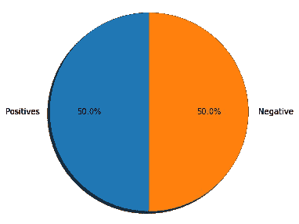
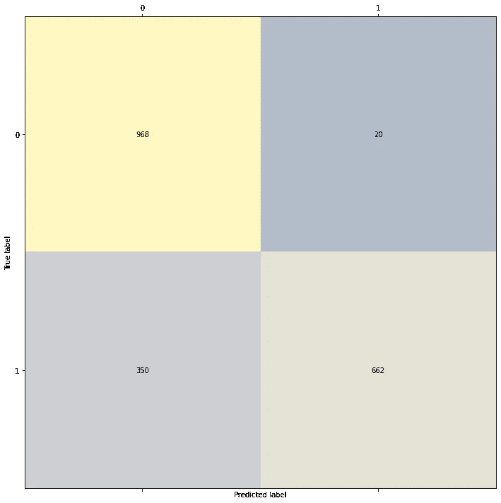

# 自然语言处理:边做边学

> 原文：<https://medium.com/analytics-vidhya/natural-language-processing-ed71ff6e41f2?source=collection_archive---------11----------------------->


**ut sav sres tha click @ unsplash**

存在各种格式的数据，这些数据为了消费目的而被疯狂地构造。
即
*—结构化格式。
—非结构化格式
—半结构化格式。*

幸运的是，在第一次写这篇文章的时候，Andrew NG 和他的团队推出了迄今为止最好的专业化系列，它是关于自然语言处理的。

对于我们的用例，我们将首先尝试根据文本的内容对其进行分类，无论它们是好还是坏？
我们将探索如何为情感分析预处理推文。
在这个练习中，我们将使用 NLTK 附带的 Twitter 数据集。这个数据集已经被手工注释，用于快速建立模型的基线。NLTK 包含 5000 +ve 和 5000 -ve 的 tweets。

```
all_positive_tweets=twitter_samples.strings('positive_tweets.json')
all_negative_tweets=twitter_samples.strings('negative_tweets.json')print('Number of positive tweets: ', len(all_positive_tweets))
print('Number of negative tweets: ', len(all_negative_tweets))Number of positive tweets:  5000
Number of negative tweets:  5000
```

**让我们看看数据传播的情况。**

```
fig = plt.figure(figsize=(5, 5))
labels = 'Positives', 'Negative'
sizes = [len(all_positive_tweets), len(all_negative_tweets)] 
plt.pie(sizes, labels=labels, autopct='%1.1f%%',
        shadow=True, startangle=90)
plt.axis('equal')  
plt.show()
```



**一条推文在我们的数据集中的样子**

```
# print positive in greeen
print('\033[92m' + all_positive_tweets[random.randint(0,5000)])

# print negative in red
print('\033[91m' + all_negative_tweets[random.randint(0,5000)])[92m@clarelea101 Deal. I'm great with kids :)
[91mOMG selena tweets while i was busy out :(
```

数据是无模式的、非结构化的，包含有意义的语法和语义结构信息。

## **预处理**

我们可以看到在给定的文本数据中存在各种各样的垃圾，我们需要在进一步的步骤之前清除这些垃圾，例如:

*   删除停用词、特殊字符。
*   将高语法单词根植于它们的词根。

下面是我们可以用于数据预处理的便捷函数。

```
def process_tweet(tweet):
    stemmer = PorterStemmer()
    stopwords_english = stopwords.words('english')
    tweet = re.sub(r'\$\w*', '', tweet)
    tweet = re.sub(r'^RT[\s]+', '', tweet)
    tweet = re.sub(r'https?:\/\/.*[\r\n]*', '', tweet)
    tweet = re.sub(r'#', '', tweet)
    tokenizer = TweetTokenizer(preserve_case=False,        strip_handles=True,reduce_len=True)
    tweet_tokens = tokenizer.tokenize(tweet)

    tweets_clean = []
    for word in tweet_tokens:
        if (word not in stopwords_english and  
                word not in string.punctuation): 
            stem_word = stemmer.stem(word)  # stemming word
            tweets_clean.append(stem_word)

    return tweets_clean
```

## 特征抽出

```
def build_freqs(tweets, ys):
    freqs = {}
    for y, tweet in zip(yslist, tweets):
        for word in process_tweet(tweet):
            pair = (word, y)
            if pair in freqs:
                freqs[pair] += 1
            else:
                freqs[pair] = 1
    return freqsfreqs = build_freqs(tweets, ys)def extract_features(tweet, freqs,flag):
       word_l = process_tweet(tweet)
       x = np.zeros((1, 4)) 
       x[0,0] = 1

       if flag == 1:
            x[0,3]=1
       else:
            x[0,3]=0

    for word in word_l:
              x[0,1] += len([1 for key, value in freqs.items() if word==key[0]and key[1]==1])
                x[0,2] += len([1 for key, value in freqs.items() if word==key[0]and key[1]==0])

    return x
```

我们将我们的特征空间作为 2 个向量，一个带注释的标志作为标签。
只需将特征矩阵与其对应的标签进行组合。训练模型并观察性能，我们将使用混淆矩阵。

```
def dataMaker(all_positive_tweets,all_negative_tweets):
    extracted_pos_feature = []
    for tweet in all_positive_tweets:
        feature = extract_features(tweet,freqs,1)
        extracted_pos_feature.append(feature[0])

    extracted_neg_feature = []
    for tweet in all_negative_tweets:
        feature = extract_features(tweet,freqs,0)
        extracted_neg_feature.append(feature[0])

    return extracted_pos_feature,extracted_neg_featurepos,neg = dataMaker(all_positive_tweets,all_negative_tweets)
pos_df = pd.DataFrame(pos)
neg_df = pd.DataFrame(neg)
featured_tweet_data = pd.concat([pos_df,neg_df],axis=0)
featured_tweet_data.head(n=10)
```

接下来，我们将决定分割并训练我们的模型，训练后，我们将尝试验证模型并绘制准确度矩阵。

**模型构建:**

```
featured_tweet_data.columns = ["Bias","Pos_Count","Neg_Count","Tag"]x = featured_tweet_data[["Pos_Count","Neg_Count"]]
y = featured_tweet_data["Tag"]

X_train, X_test, y_train, y_test = train_test_split(x,y,test_size=0.20, random_state=42)
model = LogisticRegression()
model.fit(X_train,y_train)
y_pred = model.predict(X_test)
confmat = confusion_matrix(y_true=y_test, y_pred=y_pred)fig, ax = plt.subplots(figsize=(10, 10))
ax.matshow(confmat, cmap=plt.cm.cividis, alpha=0.3)
for i in range(confmat.shape[0]):
    for j in range(confmat.shape[1]):
        ax.text(x=j, y=i, s=confmat[i, j], va='center', ha='center')

plt.xlabel('Predicted label')
plt.ylabel('True label')

plt.tight_layout()
plt.show()
```



在这里，目前看文本数据和它的处理有关信息提取，以及它如何导致分类后矢量化。专门的人可以看看这个 NLP 的端到端传播和相应领域的增长。

如果你喜欢它，别忘了在下面留下你的宝贵反馈。这将有助于勘探的改进。

感谢您抽出时间。