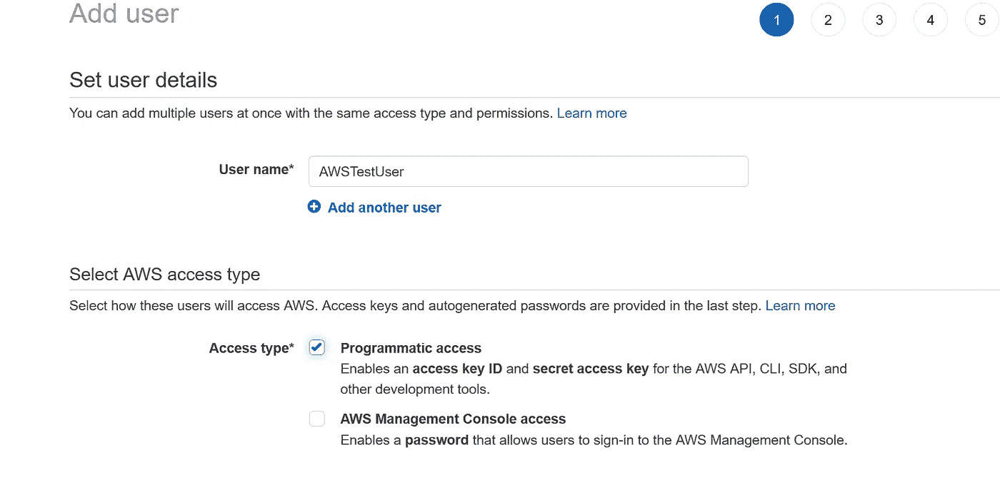
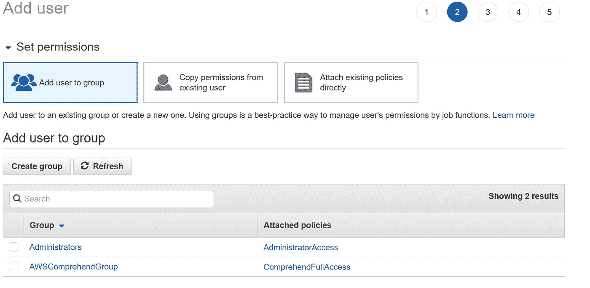
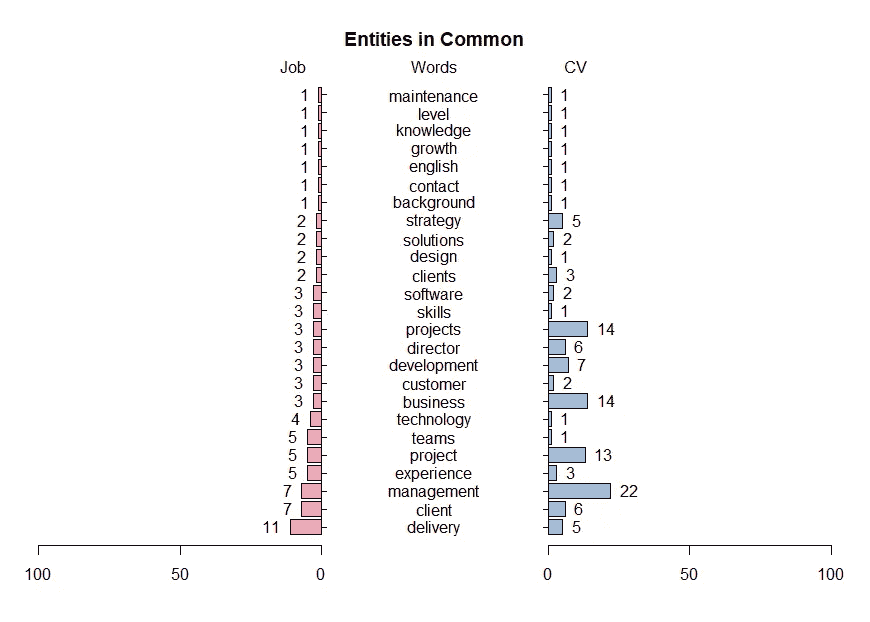

# 自然语言处理:实验实体识别(第 2 部分 AWS 理解 NLP API)

> 原文：<https://medium.com/analytics-vidhya/natural-language-processing-experimenting-entity-recognition-part-2-aws-comprehend-nlp-api-1722e80eeb3d?source=collection_archive---------4----------------------->


# 介绍

在本系列的第一篇文章中，我们展示了如何使用 Google NLP API 从个人资料中提取单词，并将其与工作描述进行比较。在第二篇文章中，让我们使用 AWS(Amazon Web Services)understand API 做同样的实验。我们将再次使用 R，但是同样的事情在 Python 中也可以很容易地完成，我们将在文章的最后展示如何做。

# 使用 AWS 理解 API 和 R 进行实体检测

## 在 AWS IAM 控制台中设置测试用户

首先，您必须有一个 AWS 的注册帐户，因为不建议使用您的根用户来访问 AWS 服务，让我们为我们的实验创建一个特定的用户。



在下一页，将要求您将用户分配到预定义的组(或创建特定的组)。例如，我定义了一个对 AWS understand 拥有完全访问权限的组，我将把测试用户分配到这个组。



成功创建用户后，您将能够下载用户凭证，这是稍后能够访问 AWS API 的关键信息，因此请将其保存在安全的地方。

## 用 R 做实验

为了用 R 测试 AWS API，我们将使用 AWS . understand R 包和库:

```
install.packages('aws.comprehend')
library(aws.comprehend)
```

请注意，如果您想使用这个库，它的检测实体功能会有问题，所以如果您想使用它，请查看 github 中的修复程序。

现在是时候使用您之前保存的访问密钥 ID 和秘密访问密钥了，它们应该在 aws 的环境变量中定义。

```
Sys.setenv("AWS_ACCESS_KEY_ID" = "xxxxxxxxxxxx",
           "AWS_SECRET_ACCESS_KEY" = "yyyyyyyyyyyyyyyyyyyyyyyyy",
           "AWS_DEFAULT_REGION" = "us-east-1")
```

正如上一篇文章[https://medium . com/@ Patrick . rotz etter/natural-language-processing-experimenting-entity-recognition-with-Google-Amazon-nltk-and-maybe-B1 Fe 673 EFE 46，](/@patrick.rotzetter/natural-language-processing-experimenting-entity-recognition-with-google-amazon-nltk-and-maybe-b1fe673efe46)我们使用以下代码读取 PDF 文件并做一些预处理

```
# read PDF file using pdftools library
library(pdftools)
library(stringr)
text <- pdf_text("xxxxxx.pdf")
textCV<-paste(text,collapse = " ")
textCV=str_replace_all(textCV,"[^[:graph:]]", " ") 
text <- pdf_text("yyyyyyy.pdf")
textJob<-paste(text,collapse = " ")
textJob=str_replace_all(textJob,"[^[:graph:]]", " ")# clean the text, remove numbers and make everything lower caselibrary(tm)
library(stringi)
clean_corpus <- function(corpus){
  corpus <- tm_map(corpus, removeNumbers)
  corpus <- tm_map(corpus, content_transformer(stri_trans_tolower))
  return(corpus)
}
text_corpus_clean_CV<-clean_corpus(VCorpus(VectorSource(textCV)))
```

现在我们准备调用 AWS NLP API，在这种情况下，我们将使用“检测语法”功能，文本将被分析，单词将被分类为名词、动词、副词等。

```
awsJobSyntax<-detect_syntax(textJob)
```

我们将从 AWS 结果中过滤所有名词，并按名词对它们进行分组和计数:

```
awsDetectedNounsinJob<-awsJobSyntax %>% filter(PartOfSpeech.Tag=='NOUN')  %>% group_by(Text) %>% summarise(count = n())
```



与 Google API 的结果相比，我们可以看到一个单词被识别的次数有一些显著的差异，例如，在之前的实验中，我们有 144 次使用单词“projects ”,而使用 AWS 有 14 次。

# 尝试 Python

## 设置 AWS 命令行界面

为了能够与 AWS understand API 进行交互，您需要下载 AWS 命令行界面(CLI ),并使用您之前存储的凭据对其进行配置。(更多信息请参见[https://docs . AWS . Amazon . com/CLI/latest/user guide/CLI-chap-configure . html](https://docs.aws.amazon.com/cli/latest/userguide/cli-chap-configure.html))

## 使用 Python API

boto3 库是用于 Python 的 Amazon Web Services (AWS) SDK。所以首先导入库

```
import boto3 
```

然后实例化一个 instantiate 对象，用“instantiate”作为 boto3.client 调用的参数

```
comprehend = boto3.client(service_name='comprehend', region_name='us-east-1')
```

您可以使用任何流行的 PDF 库来阅读您的 PDF 文件，例如

```
def readPdfFileComprehend(filename):
    text=list()
    read_pdf = PyPDF2.PdfFileReader(filename)   
    for i in range(read_pdf.getNumPages()):
        page = read_pdf.getPage(i)
        txt=page.extractText()
        text.append(txt)
    return text
```

一旦有了想要分析的文本，只需调用检测实体函数就可以了

```
entities = comprehend.detect_entities(Text=text, LanguageCode='en')
```