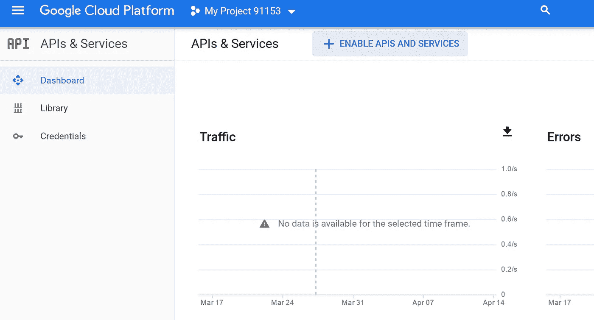

# 自然语言处理:实验实体识别(第 1 部分 Google NLP API)

> 原文：<https://medium.com/analytics-vidhya/natural-language-processing-experimenting-entity-recognition-with-google-amazon-nltk-and-maybe-b1fe673efe46?source=collection_archive---------1----------------------->


# 介绍

自然语言处理是当今机器学习和人工智能最有前途的领域之一，也是发展最快的领域。有很多数字试图预测市场的增长，但我不喜欢把它们作为预测

自然语言处理包括广泛的主题，例如:

*   语音识别
*   语言翻译
*   虚拟助手
*   文本分类
*   文本摘要
*   文本生成

现在有很多库和基于云的 API 可用，并且选择越来越多。本系列文章将深入探讨一些可用的技术，并在给定文档中的实体识别、文档相似性和文档分类的上下文中实验 NLP 库和 API。

# 使用 Google NLP API 和 R 进行实体检测

## 在 Google 云平台中设置项目

首先，你必须有一个谷歌注册账户。

作为第一步，你需要在谷歌云平台上创建一个项目


一旦创建了项目，请转到 API 和服务，并开始启用 API 服务



在可用 API 列表中，您选择了云自然语言 API


完成后，您可以通过单击 enable 来启用 API。完成后，您需要向 API 添加凭证，并获取访问和 API 密钥。


这是使用下面的屏幕完成的，以 JSON 格式下载您的凭证，当您想要运行实验时，您将需要它。这一步是绝对需要的。


## 用 R 做实验

为了用 R 来试验 Google API，我们将使用 googleLanguageR 库:

```
install.packages('googleLanguageR')
library(googleLanguageR)
```

您需要指出在哪里可以找到您之前下载的凭证，以及 json 文件名:

```
GL_AUTH='.'
gl_auth("your file.json")
```

在我们的实验中，我们将尝试识别两篇文章中的主要实体，并找出共同的实体。我们将使用职位描述和个人资料来尝试将职位描述与个人资料相匹配。首先让我们加载 2 个 PDF 文件，并做一些清理工作

```
library(pdftools)
library(stringr)
text <- pdf_text("xxxxxx.pdf")
textCV<-paste(text,collapse = " ")
textCV=str_replace_all(textCV,"[^[:graph:]]", " ") 
text <- pdf_text("yyyyyyy.pdf")
textJob<-paste(text,collapse = " ")
textJob=str_replace_all(textJob,"[^[:graph:]]", " ") 
```

可能需要进一步的文本清理，因此让我们对文本语料库进行最小的清理，删除数字并将所有内容转换为小写:

```
library(tm)
library(stringi)
clean_corpus <- function(corpus){
  corpus <- tm_map(corpus, removeNumbers)
  corpus <- tm_map(corpus, content_transformer(stri_trans_tolower))
  return(corpus)
}
text_corpus_clean_CV<-clean_corpus(VCorpus(VectorSource(textCV)))
```

现在我们准备调用 Google NLP API 并检测文档中的实体

```
nlp <- gl_nlp(text_corpus_clean_CV[[1]]$content)
```

API 调用的结果包括识别的标记、句子、分类、语言、情感和实体。现在，我们将把重点放在检测到的实体上，并尝试在工作配置文件和人员配置文件之间找到共同的实体。


已经检测到 25 个常见实体，对于每个文档，我们可以看到与其他文档相比，该实体在文本中出现了多少次。一个观察结果是，在某些情况下，实体以单数和复数形式出现，这可能不会给我们的比较增加太多信息。