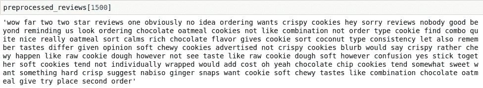

# 自然语言处理:亚马逊美食评论数据的探索性数据分析

> 原文：<https://medium.com/analytics-vidhya/natural-language-processing-exploratory-data-analysis-with-amazon-fine-food-reviews-data-adefe46e98cf?source=collection_archive---------22----------------------->

数据来源:[https://www.kaggle.com/snap/amazon-fine-food-reviews](https://www.kaggle.com/snap/amazon-fine-food-reviews)(仅包含关于食品的评论)

我将执行单词包，将文本数据转换为向量，以便我们可以在清理和预处理它之后的进一步处理中使用它。

Amazone Fine Food Reviews 数据由每个食品评论中的以下信息组成:

1.  *评分(1-5 颗星)*
2.  *书评*
3.  *综述*
4.  *这个评论有没有帮助的投票人数。*
5.  *投票认为该评论有帮助的人数。*
6.  *用户 ID*
7.  *产品 ID*

亚马逊食品评论

现在，如果我想确定一个评价是积极的还是消极的，我可以选择许多方式，但我在这里选择的是**评级**。假设评级为 4 或 5 的评论可以被认为是积极的评论，评级为 1 或 2 的评论可以被认为是消极的评论，评级为 3 的评论可以被认为是中立的和被忽略的。

可用数据有两种形式:**。csv** 版本和**。SQLite** 版本。我在用。SQLite 版本，因为它更容易有效地查询数据和可视化数据。我正在使用 Anaconda Navigator 和 ipython 笔记本。

# 数据清理:重复数据删除

通过查看评论，数据中有许多重复条目。为了获得数据分析的公正结果，删除重复项。

从上面可以看出，同一用户对具有相同的帮助性分子、帮助性分母、分数、时间、摘要和文本值的有多个评论，并且在进行分析时发现，

ProductId=B000HDOPZG 是 Loacker Quadratini 香草威化饼干，8.82 盎司包装(一包 8 个)

ProductId=B000HDL1RQ 是 Loacker Quadratini 柠檬威化饼干、8.82 盎司包装(一包 8 个)等等。

经过分析推断，除了 ProductId 之外，具有相同参数的评论属于相同的产品，只是具有不同的味道或数量。因此，为了减少冗余，决定消除具有相同参数的行。同样的方法是，我们首先根据 ProductId 对数据进行排序，然后只保留第一个相似的产品评论，删除其他的。例如，在上面的例子中，只保留了对 ProductId=B000HDL1RQ 的审查。这种方法确保每个产品只有一个代表，并且不进行排序的重复数据删除可能会导致同一产品仍然存在不同的代表。

**按照 ProductId 对数据进行升序排序:**
sorted _ data = filtered _ data . sort _ values(' product id '，axis=0，ascending=True，inplace=False，kind='quicksort '，na_position='last ')

还可以看出，在下面给出的两行中，helpfullness 的值分子大于 helpfullness 分母，这实际上是不可能的，因此这两行也被从计算中删除。

# 文本预处理

现在，在制作预测模型之前，我们已经完成了重复数据消除，但我们的数据仍然需要一些预处理，如下所示:

1.  从移除 HTML 标签开始
2.  删除任何标点符号或有限的一组特殊字符，如、或。或者#，等等。
3.  检查单词是否由英文字母组成，并且不是字母数字
4.  检查单词的长度是否大于 2(据调查，没有两个字母的形容词)
5.  将单词转换成小写
6.  删除停用词
7.  最后，雪球式词干法(据观察比波特词干法更好)之后，我们收集用于描述正面和负面评论的单词

从文本中删除网址:[https://stackoverflow.com/a/40823105/4084039](https://stackoverflow.com/a/40823105/4084039)

从文本中删除 URL

从元素中移除所有标签:[https://stack overflow . com/questions/16206380/python-beautiful soup-how-to-remove-all-tags-from-an-element](https://stackoverflow.com/questions/16206380/python-beautifulsoup-how-to-remove-all-tags-from-an-element)

去掉带数字的单词:[https://stackoverflow.com/a/18082370/4084039](https://stackoverflow.com/a/18082370/4084039)

删除特殊字符:[https://stackoverflow.com/a/5843547/4084039](https://stackoverflow.com/a/5843547/4084039)

现在，去掉停用词:[https://gist.github.com/sebleier/554280](https://gist.github.com/sebleier/554280)

从现在开始，我将在 5000 个顶级数据评论上进行试验。(最初，我拿了 3000。)

# 特色化:词汇袋

现在，通过我们执行的所有数据清理任务(如重复数据消除),数据的 helpnumerator 应始终小于 helpdenominator，我们有了一个名为“preprocessed_reviews”的最终数据帧。Scikit-learn 为从文本生成向量提供了 Countvectorizer()。如下图所示，我们可以看到计数矢量器生成了一个稀疏矩阵，其中包含一些独特的单词。它生成的维度等于每个评论的独特字数。

*探索 CountVectorizer()这里:*[*https://scikit-learn . org/stable/modules/generated/sk learn . feature _ extraction . text . count vectorizer . html*](https://scikit-learn.org/stable/modules/generated/sklearn.feature_extraction.text.CountVectorizer.html)

> 二元语法和多元语法

请务必阅读计数矢量器文档:[http://sci kit-learn . org/stable/modules/generated/sk learn . feature _ extraction . text . count vectorizer . html](http://scikit-learn.org/stable/modules/generated/sklearn.feature_extraction.text.CountVectorizer.html)

> TF IDF

在下面的代码中，在 ngram_range 中，我提到了 unigram(1)到 bigram(2)的唯一单词和唯一对的产生。

