# 自然语言处理

> 原文：<https://medium.com/analytics-vidhya/natural-language-processing-faf89fffce56?source=collection_archive---------12----------------------->

## 定义:

自然语言处理(NLP)是语言学、计算机科学、信息工程和人工智能的一个子领域，涉及计算机和人类(自然)语言之间的交互，特别是如何对计算机进行编程以处理和分析大量自然语言数据。

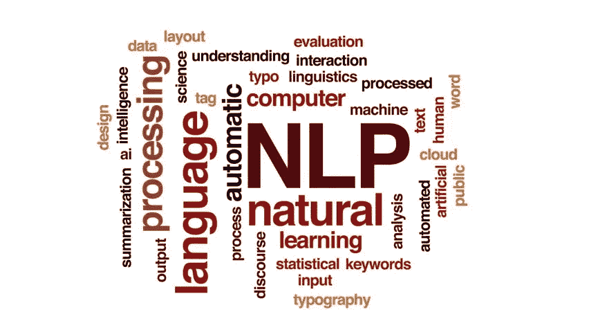

自然语言处理图像

# 自然语言处理的应用:

垃圾邮件过滤器(Gmail 单独过滤垃圾邮件)。
·自然语言生成(从图像或视频数据生成文本)。
·语音识别(Google WebSpeech 或 Vocalware)。
·文本摘要(Smmry 或 Reddit 的 autotldr 给出句子摘要)。
·情绪分析(Hater News 给我们用户的情绪)。
·自动预测(谷歌搜索预测用户搜索结果)。
·机器翻译(谷歌翻译将语言从一种语言翻译成另一种语言)。

# 数据集信息

**餐厅评论数据集:-**
该数据集包含以下 2 个变量的 2000 个数据点。
1。查看
2。喜欢的
**喜欢的**是数据集中的响应变量。
**回顾**是数据集中的特征变量。
下载数据集。 [**餐厅点评**](https://www.kaggle.com/akram24/restaurant-reviews/download)

# 阅读和探索数据集

```
***# Reading the raw data*** raw_data=open("Restaurant_Reviews.tsv").read()
raw_data[1:1001]
```

**Output**:“eview \ t liked \ n 多么……喜欢这个地方。\ t1 \信任不好。\ t0 \不好吃，质地也很差。\ t0 \在五月底的银行假日期间，在 Rick Steve 的推荐下来到了这家店，非常喜欢。\ t1 \菜单上的选择很棒，价格也不错。\ t1 \现在我生气了，我要我那该死的照片。\ t0 \老实说，味道没那么新鲜。)0 \该"

```
***# Importing the libraries*** import numpy as np
import matplotlib.pyplot as plt
import pandas as pd***# Importing the dataset*** data=pd.read_csv("D:\\...**\\**Restaurant_Reviews.tsv",delimiter="**\t**",quoting=3)
data.head(2)
```

**输出**:

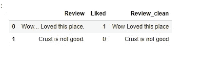

数据集样本

# 数据预处理

## 1.去掉标点符号

更多信息请点击此处。 [**标点**](https://en.wikipedia.org/wiki/Punctuation)
它去掉了所有的标点符号(！" #$% & '()*+，-。/:;< = >？[]^_`{|}~)

```
**import string**
print(string.punctuation)
```

**输出**:(！" #$% & '()*+，-。/:;< = >？[]^_`{|}~)

以上是所有的**标点符号。**

```
***# Function to remove punctuation*
def** remove_punct(text):
    text_nopunct="".join([char **for** char **in** text **if** char **not** **in** string.punctuation]) *# It will discard all punctuation*
    **return** text_nopunct
data["Review_clean"]=data["Review"].apply(**lambda** x:remove_punct(x))
data.head(2)
```

**输出**:

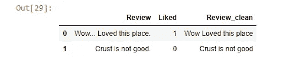

去除标点符号后的数据集样本

## 2.标记化

它把句子分解成单词。更多信息，请点击此处。 [**标记化**](https://www.guru99.com/tokenize-words-sentences-nltk.html)

```
**import re
*# Function to Tokenize  words*
def** tokenize(text):
    tokens=re.split('\W+', text) *# w+ means that either a word character (A-Z,a-z,0-9)*
    **return** tokens
data["Review_tokenized"]=data["Review_clean"].apply(**lambda** x:tokenize(x))
data.head(2)
```

**输出**:

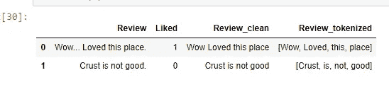

应用标记化后的数据集样本

## 3.删除停用词

它删除了**停止字**。
更多信息点击此处 [**停用词**](https://www.geeksforgeeks.org/removing-stop-words-nltk-python) **。**

```
**import nltk** stopwords=nltk.corpus.stopwords.words("english") ***# All englishwords******# Function to remove stopwords*
def** remove_stopwords(tokenized_list):
    text=[word **for** word **in** tokenized_list **if** word **not** **in** stopwords] ***# To remove all stopwords*
**    **return** text
data["Review_nostop"]=data["Review_tokenized"].apply (**lambda** x:remove_stopwords(x))
data.head(2)
```

**输出**:

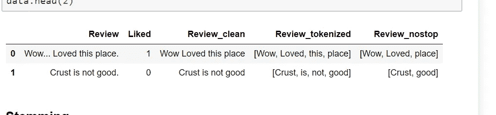

去除停用词后的数据集样本

# 堵塞物

它将一个单词简化为其词干形式。它去掉了足够的词，如“ing”、“ly”、“s”等。通过简单的基于规则的方法。它减少了单词集，但是实际的单词经常被忽略。例如:Entitling，Entitled- > Entitl
了解更多信息 [**词干**](https://www.geeksforgeeks.org/python-stemming-words-with-nltk/) 。

```
ps=nltk.PorterStemmer()
**def** stemming(tokenized_text):
    text=[ps.stem(word) **for** word **in** tokenized_text]
    **return** text
data["Review_stemmed"]=data["Review_nostop"].apply(**lambda** x:stemming(x))
data.head(2)
```

**输出**:

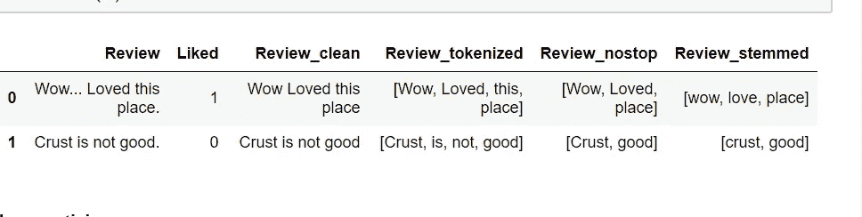

应用词干后的数据集示例

## 词汇化

它推导出一个单词的标准形式(“引理”)。即根形式。它比词干分析法要好，因为它使用了一种基于词典的方法，即对词根进行词法分析。
了解更多信息 [**词条化**](https://www.machinelearningplus.com/nlp/lemmatization-examples-python/) 。

**nltk.download()** 为了下载 **wordnet** 和不同的包对于不同的 **NLP** 使用上面的代码。

```
**wn=nltk.WordNetLemmatizer()
** 
**def** lemmatizing(tokenized_text):
    text=[wn.lemmatize(word) **for** word **in** tokenized_text]
    **return** text
data["Review_lemmatized"]=data["Review_nostop"].apply(**lambda** x:lemmatizing(x))
data.head(2)
```

**输出**:

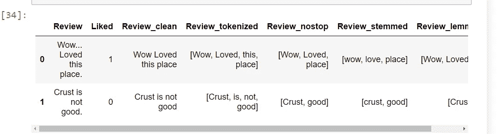

应用术语化后的数据集样本

# 向量化数据:词汇袋

你需要把这些文本转换成一些数字或者数字的向量。词袋模型(BoW)是从文本中提取特征的最简单的方法。BoW 将文本转换成文档中单词出现的矩阵。

```
**from sklearn.feature_extraction.text import CountVectorizer** count_vect=CountVectorizer()
X_counts=count_vect.fit_transform(data["Review"])
print(X_counts.shape)
```

**输出** :(1000，2035)

# 向量化数据:N-grams

它是一系列大型文本或句子中 n 个项目的一组共现或连续序列。这里的项目可以是单词、字母和音节。1-gram 也称为 unigrams，因为它是句子中出现的唯一单词。Bigram(2-gram)是两个单词的组合。三元组是 3 个单词，以此类推。

```
**from sklearn.feature_extraction.text import CountVectorizer** ngram_vect=CountVectorizer(ngram_range=(2,2))
X_counts=ngram_vect.fit_transform(data['Review'])
print(X_counts.shape)
print(ngram_vect.get_feature_names())
```

**输出** :(1000，6691)
['10 分钟'，' 10 次'，' 100 推荐'，' 100 次'，' 11 个 99 '，' 12 个可笑'，' 15 分钟'，' 17 个汉堡'，' 1979 和'，' 20…]

## 向量化数据:TF-IDF

它计算一个单词在一个文档中出现的“相对频率”,与它在所有文档中出现的频率进行比较。对于识别每个文档中的“重要”单词(在该文档中出现频率高，在其他文档中出现频率低)，它比“术语频率”更有用。
NLTK 不支持 tf-idf。因此，我们将使用 scikit-learn。scikit-learn 有一个内置的 tf-Idf 实现，而我们仍然利用 NLTK 的标记器和词干分析器来预处理文本。

```
**from sklearn.feature_extraction.text import TfidfVectorizer** tfidf_vect=TfidfVectorizer()
X_tfidf=tfidf_vect.fit_transform(data['Review'])
print(X_tfidf.shape)
print(tfidf_vect.get_feature_names())
```

**输出** : (1000，2035)
['00 '，' 10 '，' 100 '，' 11 '，' 12 '，' 15 '，' 17 '，' 1979 '，' 20 '，' 2007 '，' 23 '，' 30 '，' 30s '，' 35 '，' 40 '，' 40 分钟'，' 45 '，' 4th '，' 5lb '，' 70 '，' 85 '，' 90 '，' 99 '，'大约'，'以上'，，…]

## 特征创建:

特征工程是使用数据的领域知识来创建使机器学习算法工作的特征的过程。它就像一门艺术，因为它需要领域知识，并且创建特征可能很困难，但是 ML 算法预测结果可能是富有成效的，因为它们可能与预测相关。

```
**import string
*# Function to calculate length of message excluding space*** data["Review_len"]=data["Review"].apply(**lambda** x: len(x)-x.count(" "))

**def** count_punct(text):
    count=sum([1 **for** char **in** text **if** char **in** string.punctuation])
    **return** round(count/(len(text)-text.count(" ")),3)*100
data["punct%"] = data["Review"].apply(**lambda** x:count_punct(x))
data.head(2)
```

**输出**:

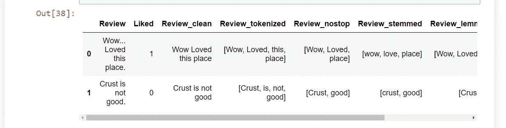

统计单词后的数据集样本

# 绘制数据集

```
bins=np.linspace(0,200,40)
plt.hist(data[data['Liked']==1]['Review_len'],bins,alpha=0.5,normed=**True**,label=1)
plt.hist(data[data['Liked']==0]['Review_len'],bins,alpha=0.5,normed=**True**,label=0)
plt.legend(loc="upper right")
plt.show()
```

**输出**:

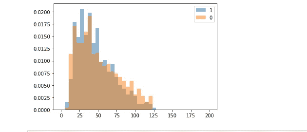

评论的直方图 _ 长度

```
bins=np.linspace(0,50,40)
plt.hist(data[data['Liked']==1]['punct%'],bins,alpha=0.5,normed=**True**,label=1)
plt.hist(data[data['Liked']==0]['punct%'],bins,alpha=0.5,normed=**True**,label=0)
plt.legend(loc="upper right")
plt.show()
```

**输出**:

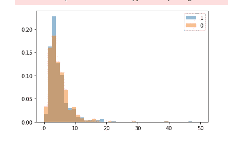

标点符号百分比直方图

## 型号选择

我们使用机器学习的集成方法，其中使用多个模型，并且它们的组合产生比单个模型更好的结果(支持向量机/朴素贝叶斯)。合奏方法是许多 Kaggle 比赛的首选。随机森林，即构建多个随机决策树，每棵树的集合用于最终预测。它可以用于分类以及回归问题。它遵循随机打包策略。

**网格搜索**:在给定的网格中彻底搜索所有参数组合，以确定最佳模型。

```
**from** **sklearn.ensemble** **import** **RandomForestClassifier**
**from** **sklearn.model_selection** **import** GridSearchCV
rf=RandomForestClassifier()
param={'n_estimators':[10,150,300],'max_depth':[30,60,90,**None**]}
gs=GridSearchCV(rf,param,cv=5,n_jobs=-1)*# For parallelizing the speech*
gs_fit=gs.fit(X_counts,data['Liked'])
pd.DataFrame(gs_fit.cv_results_).sort_values('mean_test_score',ascending=**False**).head()
```

**输出**:

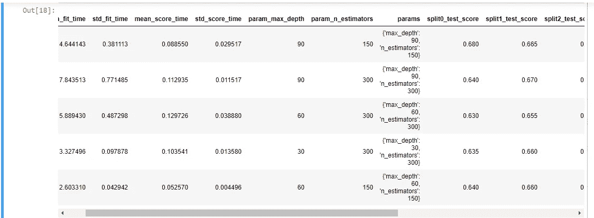

应用随机森林分类器后 X_counts 值的样本

```
**from** **sklearn.ensemble** **import** RandomForestClassifier
**from** **sklearn.model_selection** **import** GridSearchCV
rf=RandomForestClassifier()
param={'n_estimators':[10,150,300],'max_depth':[30,60,90,**None**]}
gs=GridSearchCV(rf,param,cv=5,n_jobs=-1)*# For parallelizing the speech*
gs_fit=gs.fit(X_tfidf,data['Liked'])
pd.DataFrame(gs_fit.cv_results_).sort_values('mean_test_score',ascending=**False**).head()
```

**输出**:

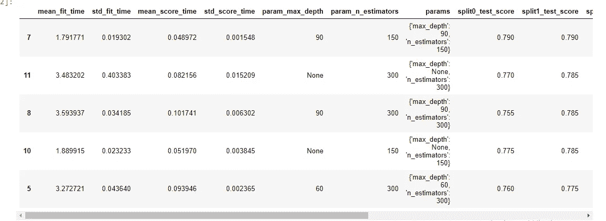

应用随机森林分类器后 X_TFIDF 值的示例

```
**# Spliting the dataset into X and y variables** corpus=X_counts
X = corpus.toarray()
y = data.iloc[:, 1].values

***# Splitting the dataset into the Training set and Test set*
from** **sklearn.model_selection** **import** train_test_split
X_train, X_test, y_train, y_test = train_test_split(X, y, test_size = 0.20, random_state = 0)

***# Fitting Random Forest Classifier to the Training set*
from** **sklearn.ensemble** **import** RandomForestClassifier
classifier = RandomForestClassifier()
gs.fit(X_train, y_train)

***# Predicting the Test set results*** y_pred = gs.predict(X_test)

***# Making the Confusion Matrix*
from** **sklearn.metrics** **import** confusion_matrix
cm = confusion_matrix(y_test, y_pred)
print(cm)
```

**输出**:

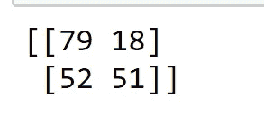

混淆矩阵

```
**import** **seaborn** **as** **sns**
sns.heatmap(cm,annot=**True**)
plt.figure(figsize=(10,10))
```

**输出**:

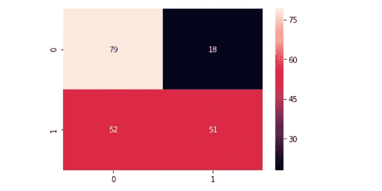

混乱矩阵图

```
**from** **sklearn.metrics** **import** classification_report
cr=classification_report(y_test,y_pred)
print(cr) 
```

**输出**:

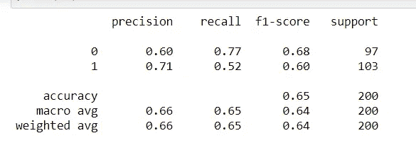

分类报告值

# 结论

因此，我们通过使用随机森林分类器获得了 65%的准确性。由于唯一性，我们不能获得超过 60%的准确性。为了提高，我们需要使用评级系统，该系统大大提高了我们训练数据中的信息，以便我们可以获得更高的准确性

## **Github 要点:**

[https://gist . github . com/Priyanka-makin Eni/aa 69202 e 874594648792 a 03106 da 4211](https://gist.github.com/Priyanka-Makineni/aa69202e874594648792a03106da4211)

**我的 Github:**

 [## priyanka-makin Eni/数据科学代码

### 数据是新的科学。数据科学掌握着“答案”

github.com](https://github.com/Priyanka-Makineni/Data-science-codes) 

# **参考文献:**

1.  分析 Vidhya
2.  极客为极客
3.  向数据科学进军