# 面向开发人员的自然语言处理

> 原文：<https://medium.com/analytics-vidhya/natural-language-processing-for-developers-912ee0fda979?source=collection_archive---------2----------------------->

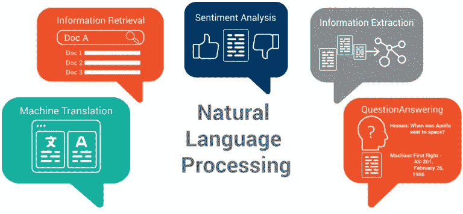

**自然语言处理** ( **NLP** )是[语言学](https://en.wikipedia.org/wiki/Linguistics)、[计算机科学](https://en.wikipedia.org/wiki/Computer_science)、[信息工程](https://en.wikipedia.org/wiki/Information_engineering_(field))、[人工智能](https://en.wikipedia.org/wiki/Artificial_intelligence)的一个子领域，涉及计算机与人类(自然)语言之间的交互，特别是如何编程计算机处理和分析大量的[自然语言](https://en.wikipedia.org/wiki/Natural_language)数据。这里的自然语言数据是指语音、文本等。进一步将语音转换为文本语句，然后进一步发送到后续管道进行处理，然后用于服务、零售等最终产品。


谷歌图片

原始输入来自不同的来源，如 web、pdf、doc，甚至来自语音识别系统。文本也可以来自使用 OCR 扫描的书籍。大多数网页文本包含 HTML 标签、URL 和其他与任务无关的内容。

## A.文本处理:

在转换到 d 维向量之前，应该首先对文本进行重新处理。通常，文本预处理的目的是去除这些不必要的标签，只保留简单的文本。在再处理阶段，我们按以下顺序执行以下操作

1.  从移除 HTML/URL 标签开始
2.  删除任何标点符号或有限的一组特殊字符，如、或。或者#，等等。
3.  检查单词是否由英文字母组成，并且不是字母数字
4.  检查单词的长度是否大于 2(据调查，没有两个字母的形容词)
5.  将单词转换成小写
6.  去掉“我”、“我”、“你”、“是”等停用词。因为它们不包含太多有助于消除建模过程复杂性的信息。
7.  最后，雪球式词干法(据观察比波特词干法更好)

让我们一个一个来

[](https://www.kaggle.com/sudalairajkumar/getting-started-with-text-preprocessing) [## 文本预处理入门

### 使用 Kaggle 笔记本探索和运行机器学习代码|使用 Twitter 上的客户支持数据

www.kaggle.com](https://www.kaggle.com/sudalairajkumar/getting-started-with-text-preprocessing) 

**从文本中删除网址 python:**[https://stackoverflow.com/a/40823105/4084039](https://stackoverflow.com/a/40823105/4084039)

```
sent = re.sub(r"http\S+", "", sent)
print(sent)
```

**转换成短成长**[https://stackoverflow.com/a/47091490/4084039](https://stackoverflow.com/a/47091490/4084039)

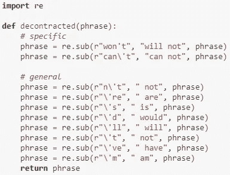

```
sent = decontracted(sent)
print(sent)
```

**将所有文本转换成小写**

```
df["text_lower"] = df["text"].str.lower()
```

【https://stackoverflow.com/a/18082370/4084039】用数字去掉单词 python:

```
sent = re.sub(“\S*\d\S*”, “”, sent).strip()
print(sent)
```

**拼写更正:**

另一个重要的文本预处理步骤是拼写纠正。错别字在文本数据中很常见，我们可能希望在进行分析之前纠正这些拼写错误。

```
!pip install pyspellchecker
from spellchecker import SpellChecker

spell = SpellChecker()
def correct_spellings(text):
    corrected_text = []
    misspelled_words = spell.unknown(text.split())
    for word **in** text.split():
        if word **in** misspelled_words:
            corrected_text.append(spell.correction(word))
        else:
            corrected_text.append(word)
    return " ".join(corrected_text)

text = "speling correctin"
correct_spellings(text)
```

**删除特殊字符**:[https://stackoverflow.com/a/5843547/4084039](https://stackoverflow.com/a/5843547/4084039)

```
sent = re.sub('[^A-Za-z0-9]+', ' ', sent)
print(sent)
```

**处理正则表达式**

```
import re
# Tutorial about Python regular expressions: [https://pymotw.com/2/re/](https://pymotw.com/2/re/)
import string
from nltk.corpus import stopwords
from nltk.stem import PorterStemmer
from nltk.stem.wordnet import WordNetLemmatizer
```

**在单一功能中处理停止字/stem/clean**

*   [https://gist.github.com/sebleier/554280](https://gist.github.com/sebleier/554280)
*   我们将从停用字词列表中删除字词:“否”、“或非”、“不是”
*   == >经过以上步骤，我们得到了" br br"
    我们正在将它们包含到停用词列表中
*   如果我们有
    ，而不是
    ，这些标签将在第一步中移除

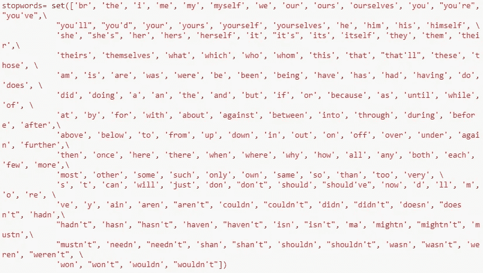

删除停用词并不总是最好的主意。假设你有两个相同的句子，其中一个不包含任何内容。在这种情况下，删除停用词会改变句子的意思，因此删除停用词必须采取一些预防措施。*你可以用 n-gram 来摆脱以上所有问题*。

您也可以使用下面的代码从 NLTK 库中获得这些停用词:

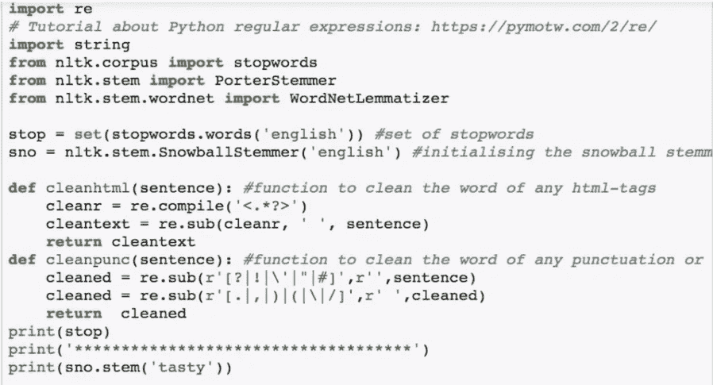

你会在这里找到 tasti 的词根。

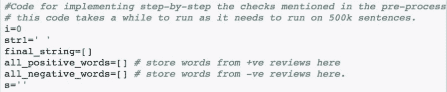

清洁和堵塞功能

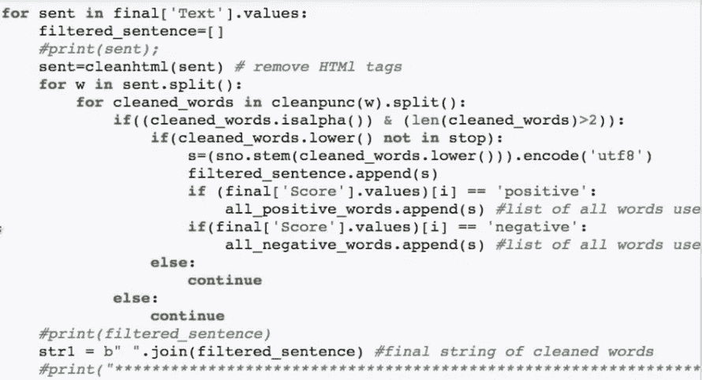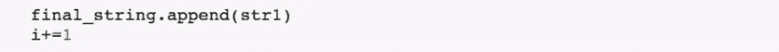

```
import re
from nltk.corpus import stopwords
nltk.download('stopwords')
# loading stop words from nltk library
stop_words = set(stopwords.words('english')) 
```

**处理炮泥:**

```
from nltk.stem.porter import PorterStemmer

stemmer = PorterStemmer()
def stem_words(text):
    return " ".join([stemmer.stem(word) for word **in** text.split()])

df["text_stemmed"] = df["text"].apply(lambda text: stem_words(text))
df.head()
```

词干化是产生词根/基本词的形态变体的过程。词干程序通常被称为词干算法或词干分析器。词干算法将单词“chocolate”、“chocolatey”、“choco”简化为词根，“chocolate”和“retrieve”，“retrieved”，“retrieved”简化为词干“retrieve”。

Testy，test 和 taste 是 BOW 上不同的向量，所以使用词干转换所有的单词。雪球式词干法(据观察比波特词干法更好)可以解决上述问题。

**处理词汇化:**

```
from nltk.stem import WordNetLemmatizer

lemmatizer = WordNetLemmatizer()
def lemmatize_words(text):
    return " ".join([lemmatizer.lemmatize(word) for word **in** text.split()])

df["text_lemmatized"] = df["text"].apply(lambda text: lemmatize_words(text))
df.head()
```

词汇化是将一个词的不同屈折形式组合在一起的过程，这样它们就可以作为一个项目进行分析。词汇化类似于词干化，但它给单词带来了上下文。所以它把意思相近的单词链接成一个单词。

```
from nltk.corpus import wordnet
from nltk.stem import WordNetLemmatizer

lemmatizer = WordNetLemmatizer()
wordnet_map = {"N":wordnet.NOUN, "V":wordnet.VERB, "J":wordnet.ADJ, "R":wordnet.ADV}
def lemmatize_words(text):
    pos_tagged_text = nltk.pos_tag(text.split())
    return " ".join([lemmatizer.lemmatize(word, wordnet_map.get(pos[0], wordnet.NOUN)) for word, pos **in** pos_tagged_text])

df["text_lemmatized"] = df["text"].apply(lambda text: lemmatize_words(text))
df.head()
```

我们还需要为 nltk 中的 lemmatizer 提供单词的 POS 标签。根据位置的不同，lemmatizer 可能会返回不同的结果。

Lemmatizer 面包句子变成单词，但把纽约变成一个单词。它有一个所有这类单词的字典。它是特定于语言的。

将句子分解成单词。但预防当(纽约)

**将上述所有处理步骤组合在下面的代码中**【https://stackoverflow.com/a/47091490/4084039 

1.  从正文中分离出代码片段
2.  从问题标题和描述中删除特殊字符
3.  删除停用词(除了“C”)
4.  删除 HTML 标签
5.  将所有字符转换成小写字母
6.  用雪球词干仪来阻止单词

```
from nltk.stem import WordNetLemmatizer

def striphtml(data):
    cleanr = re.compile('<.*?>')
    cleantext = re.sub(cleanr, ' ', str(data))
    return cleantext
stop_words = set(stopwords.words('english'))
stemmer = SnowballStemmer("english")
```

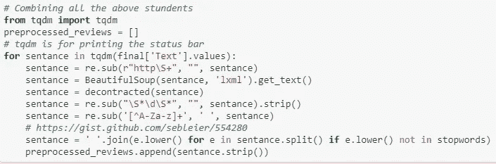

在应用上述处理部分之后，我们可以使用文本数据进行机器学习模型中的下一步。

**词语的语义:**

我们将在这种情况下使用 word2vec。暴躁和美味，它们是同义词。

**清理后最终存储数据库**

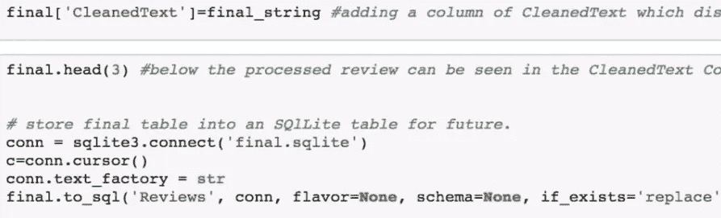

## B.特征提取:

文本数据以数字的 ASCII 值存储在计算机上。计算机以二进制形式存储和传输这些数字。它并不意味着一个

1.  ****基于图的模型:**像 wordnet 一样用单词之间的关系将单词表示为符号节点。**

**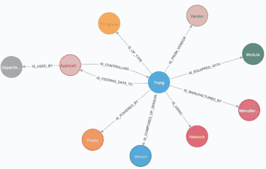**

**2.**统计模型:**你需要一个单词的数值表示。这里我们用 **BoW，TF-IDF，AvgW2Vec，TF-IDF 加权 W2v** 把一个词表示成一个数值向量**

## **一袋单词:**

**[](http://scikit-learn.org/stable/modules/generated/sklearn.feature_extraction.text.CountVectorizer.html) [## sk learn . feature _ extraction . text . count vectorizer-sci kit-learn 0 . 21 . 3 文档

### class sk learn . feature _ extraction . text . count vectorizer(input = ' content '，encoding='utf-8 '，decode_error='strict'…

scikit-learn.org](http://scikit-learn.org/stable/modules/generated/sklearn.feature_extraction.text.CountVectorizer.html) 

1.  它首先构建一个字典，即文本中所有单词的集合。它由文本中所有独特的单词组成。它将单词表示成稀疏矩阵。
2.  创建 d 维向量(d 是唯一的单词数)

2.对于每个文档(行)，查找唯一的单词，其中每个单词是一个不同的维度。每个单元格由单词在相应行中出现的次数组成。

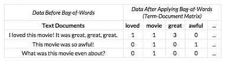

维度将非常大，其中大部分单元格的值为零。所以会形成一个稀疏矩阵。这里要注意的一点是，如果两个向量非常接近，那么它们之间的相似性将会很高。

每行被命名为**字向量**，每列被命名为**文档向量**


最好将值存储在字典位置。

代码:

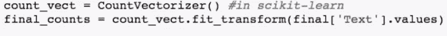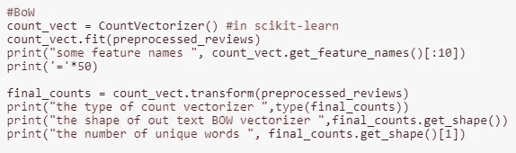

**二元语法、三元语法和 n 元语法:** *n* 表示组合在一起被视为一个特征的单词的数量。

注意:在构建 n 元语法之前，应该避免删除像“not”这样的停用词。

**ngram _ range**:*tuple(min _ n，max_n)*

要提取的不同 n 元文法的 n 值范围的下限和上限。n 的所有值使得 min_n <= n <= max_n will be used.

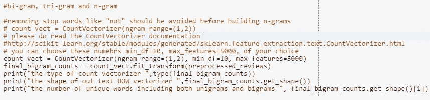

***二进制弓:***

它不是将 count 放入 vector 中，而是根据文档中是否存在单词来存储 1，0。

**弓的缺点:**

BOW 不考虑语义。例如,“好吃”和“美味”意思相同，但是 BOW 认为它们是不同的。

# TF-IDF(术语频率-逆文档频率)

TF-文档 *d* 中出现的时间字 *t* 的个数除以文档 *d* 中的总字数。换句话说，在文档 *d* 中找到一个单词的概率是多少。如果一个单词出现在文档中，那么 TF 增加。

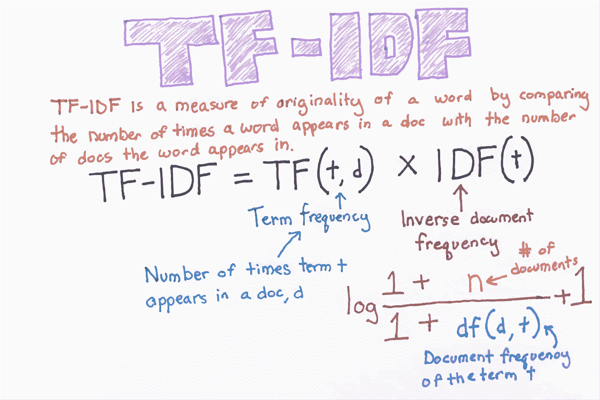

如果一个单词出现在更多的文档中，那么 IDF 减少。单元值是 TF * IDF 的乘积。更重要的是在文档中很少见，如果某个单词在文档/评论中很常见，则更重要。

代码:

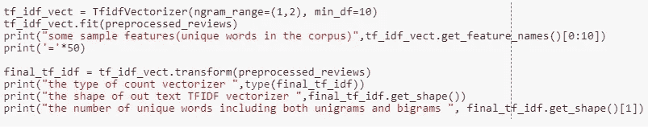

以下是 tf-idf 矢量化的密集输出。

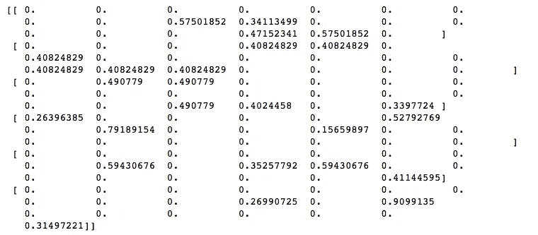

[https://stack overflow . com/questions/48429367/appending-2-dimensional-list-dense-output-of-tfi df-result-into-pandas-data fram](https://stackoverflow.com/questions/48429367/appending-2-dimensional-list-dense-output-of-tfidf-result-into-pandas-datafram)

获取其在前 25 个特征值的数据帧中的值，

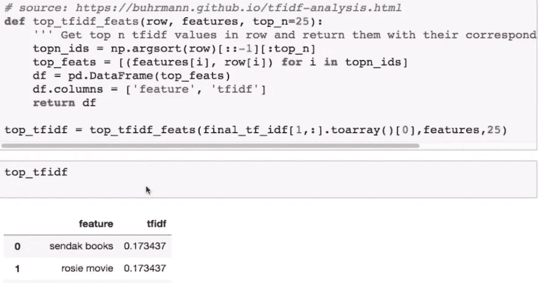

**TF-IDF 的缺点:**

TF-IDF 不考虑语义。《出埃及记》美味和可口有相同的含义，但 TF-IDF 认为是分开的。

## 平均 Word2Vector:

**Word2Vector:** Word2vec 基本上将单词放置在特征空间中，使得它们的位置由它们的含义决定，即具有相似含义的单词被聚集在一起，并且两个单词之间的距离也具有相同的含义。

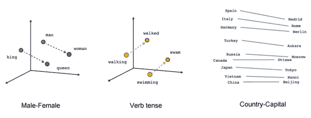

[https://www.google.com/search?rlz=1C1EJFC_enUS810US810&biw = 1366&BIH = 695&TBM = isch&sxsrf = acybgnqbnxds 4 _ S3 zhi 8 fbhjkhyvohvo 9 w % 3a 1568807382246&sa = 1&ei = 1 hmcxdpudp 3 ez 7 SPME 6 skam&q = word 2 vec+tensor flow&OQ = word 2v..50643...0.0..0.238.238.2-1......0....一..gws-wiz-img。MK-l 30 T4 El 0 # imgrc = jlzudvam 8 ur 2cm:](https://www.google.com/search?rlz=1C1EJFC_enUS810US810&biw=1366&bih=695&tbm=isch&sxsrf=ACYBGNQbNXDs4_S3zhi8fbhJKHYVOhvo9w%3A1568807382246&sa=1&ei=1hmCXdPUDp3ez7sPme6SkAM&q=word2vec+tensorflow&oq=Word2Vector+&gs_l=img.1.3.0i24l3j0i10i24l2.47297.47297..50643...0.0..0.238.238.2-1......0....1..gws-wiz-img.MK-l30T4EL0#imgrc=JLZUdvaM8UR2CM:)

**余弦相似度:**让我们先了解什么是余弦相似度，因为 word2vec 使用余弦相似度来找出更相似的单词。余弦相似性不仅可以判断两个向量之间的相似性，还可以检验向量的正交性。余弦相似度由公式表示:

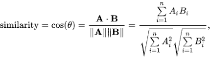

如果角度接近零，那么我们可以说向量彼此非常相似，如果θ为 90°，那么我们可以说向量彼此正交(正交向量彼此不相关)，如果θ为 180°，那么我们可以说两个向量彼此相反。

**训练 Word2Vector 模型**:先把每个单词拆分成一行，存入 list。

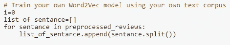[](http://kavita-ganesan.com/gensim-word2vec-tutorial-starter-code/#.XXpERSgza01) [## Gensim Word2Vec 教程-完整工作示例| Kavita Ganesan

### Word2Vec 背后的想法非常简单。我们假设一个词的意思可以通过…

kavita-ganesan.com](http://kavita-ganesan.com/gensim-word2vec-tutorial-starter-code/#.XXpERSgza01) 

***案例 1 —想训练自己的 W2V***

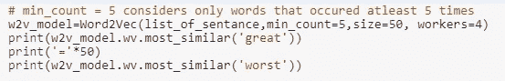

[http://ka vita-ganesan . com/gensim-word 2 vec-tutorial-starter-code/# . w17 srfazzpy](http://kavita-ganesan.com/gensim-word2vec-tutorial-starter-code/#.W17SRFAzZPY)

您可以对整个单元格进行注释，或者根据需要更改这些变量。

***案例 2 —想在 google news 上训练 Google w2v***

*   在这个项目中，我们使用谷歌的预训练模型
*   它的 3.3G 文件，一旦你把它载入你的记忆
*   它占用大约 9Gb，因此只有当您的 ram 大于 12G 时，请执行此步骤
*   我们将提供一个包含字典的 pickle 文件，
*   它包含我们所有的语料库单词作为键，模型[单词]作为值
*   要使用这段代码，请下载“Google news-vectors-negative 300 . bin”
*   来自[https://drive . Google . com/file/d/0 b 7 xkcwpi 5 kdynlnuttlss 21 pmmm/edit](https://drive.google.com/file/d/0B7XkCwpI5KDYNlNUTTlSS21pQmM/edit)
*   大小是 1.9GB。

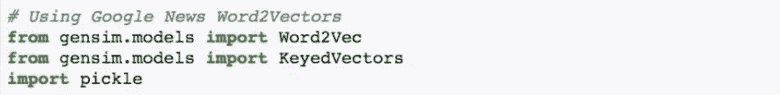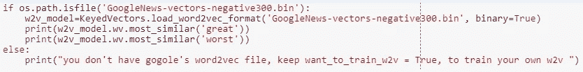

如果要检查单词出现的次数:

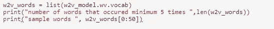

**实现 Avg Word2Vector:**

我们需要给出一个大的文本语料库，其中每个单词都有一个向量。它试图从原始文本中自动学习向量之间的关系。向量的维数越大，它的信息量就越大。

属性:

1.  如果字 w1 和 w2 相似，则向量 v1 和 v2 会更接近。
2.  自动学习单词/向量之间的关系。


我们正在观察男女图表，观察到男人和女人之间的距离与国王(男性)和王后(女性)之间的距离相同

不仅是不同的性别，如果我们观察同性，我们会发现女王和女人之间的距离以及国王和男人之间的距离是相同的(国王和男人，女王和女人代表同性比较，因此它们必须是相等的距离)。

**如何把每个文档转换成矢量？**

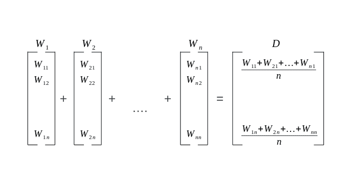

每个单词都有一个向量，我们将平均 word2vec 转换为除以文档中的单词数。

代码:

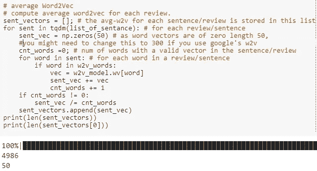

## TF-IDF 加权 Word2Vec:

在这个方法中，我们首先计算每个单词的 TF-IDF 值。然后，按照与上一节相同的方法，将 TF-IDF 值乘以相应的单词，然后将总和除以 TF-IDF 值的总和。

代码:

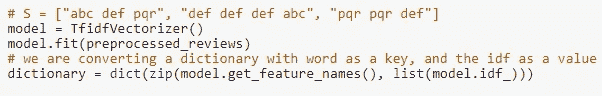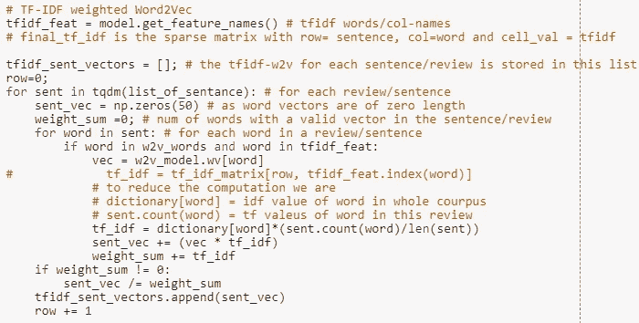

## **创造你自己的 WORD2VEC**

创建句子列表的列表

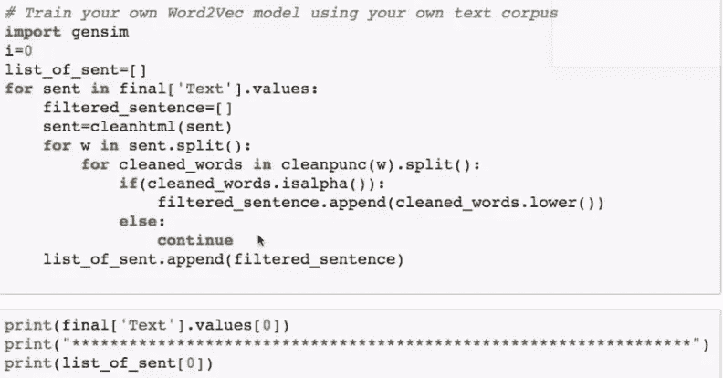

如何训练你的模型

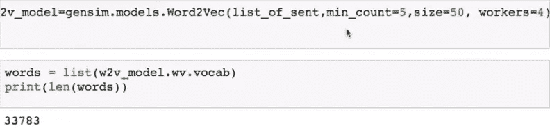

1.  *min _ count*——一个单词出现的最小次数
2.  *大小* -矢量的大小
3.  *workers* -在您的系统中使用所有 4 个内核

[](https://radimrehurek.com/gensim/models/word2vec.html) [## Gensim:面向人类的主题建模

### 机器学习和 NLP * PII 工具咨询自动发现个人和敏感数据初始化模型…

radimrehurek.com](https://radimrehurek.com/gensim/models/word2vec.html) 

您可以使用您训练过的模型进行检查。

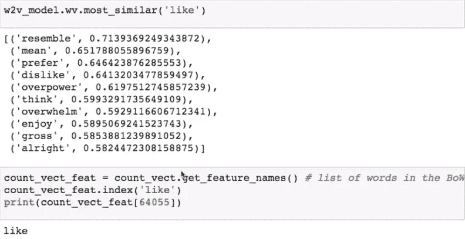

在这里你可以看到，所有语义元素在 BOW/TFIDF 中是不可能的。可以使用相同的模型为每个句子创建 w2v，如以上部分所做的那样。

## C.建模:

这个过程包括设计统计模型。在这种情况下，将数据作为训练输入，并使用创建的模型来预测未知数据。数字数据的好处在于它可以暗示任何统计模型。该模型包括以下内容

1.  线性、非线性建模和物流建模(分类和回归)
2.  朴素贝叶斯，KNN，SVM 模型
3.  决策树和集成模型(Bagging，Boosting，Random forest，XGBoost)
4.  人工神经网络(回归和分类)
5.  堆叠和最大投票模型

## 上述模型的应用:

上述模型可以部署为基于 web 的应用程序。这些应用程序可以与产品、服务等集成。下面是我们使用 NLP 模型几个例子——

1.  情感分析
2.  文本分类
3.  电子零售推荐系统
4.  语音识别

=================谢谢===============

============ = = = = = =代码= = = = = = = = = = = =

[https://github . com/Rana Singh-gkp/Applied _ AI _ O/blob/master/Assignments _ AFR _ 2018/Amazon _ Fine _ Food _ Reviews _ analysis . ipynb](https://github.com/ranasingh-gkp/Applied_AI_O/blob/master/Assignments_AFR_2018/Amazon_Fine_Food_Reviews_Analysis.ipynb)

## 参考资料:

1.  谷歌图片
2.  https://en.wikipedia.org/wiki/Natural_language_processing
3.  Kaggle.com/amazon 食品评论
4.  应用人工智能
5.  代码在[Amazon _ Fine _ Food _ Reviews _ analysis . ipynb](https://github.com/ranasingh-gkp/Applied_AI_O/blob/master/Assignments_AFR_2018/Amazon_Fine_Food_Reviews_Analysis.ipynb)笔记本中给定的链接处找到。[https://github . com/Rana Singh-gkp/Applied _ AI _ O/tree/master/Assignments _ AFR _ 2018](https://github.com/ranasingh-gkp/Applied_AI_O/tree/master/Assignments_AFR_2018)
6.  [http://ka vita-ganesan . com/gensim-word 2 vec-tutorial-starter-code/# . w17 srfazzpy](http://kavita-ganesan.com/gensim-word2vec-tutorial-starter-code/#.W17SRFAzZPY)
7.  [https://stack overflow . com/questions/48429367/appending-2-dimensional-list-dense-output-of-tfi df-result-into-pandas-data fram](https://stackoverflow.com/questions/48429367/appending-2-dimensional-list-dense-output-of-tfidf-result-into-pandas-datafram)
8.  [http://sci kit-learn . org/stable/modules/generated/sk learn . feature _ extraction . text . count vectorizer . html](http://scikit-learn.org/stable/modules/generated/sklearn.feature_extraction.text.CountVectorizer.html)
9.  [https://stackoverflow.com/a/18082370/4084039](https://stackoverflow.com/a/18082370/4084039)
10.  [https://sci kit-learn . org/stable/tutorial/text _ analytics/working _ with _ text _ data . html](https://scikit-learn.org/stable/tutorial/text_analytics/working_with_text_data.html)**