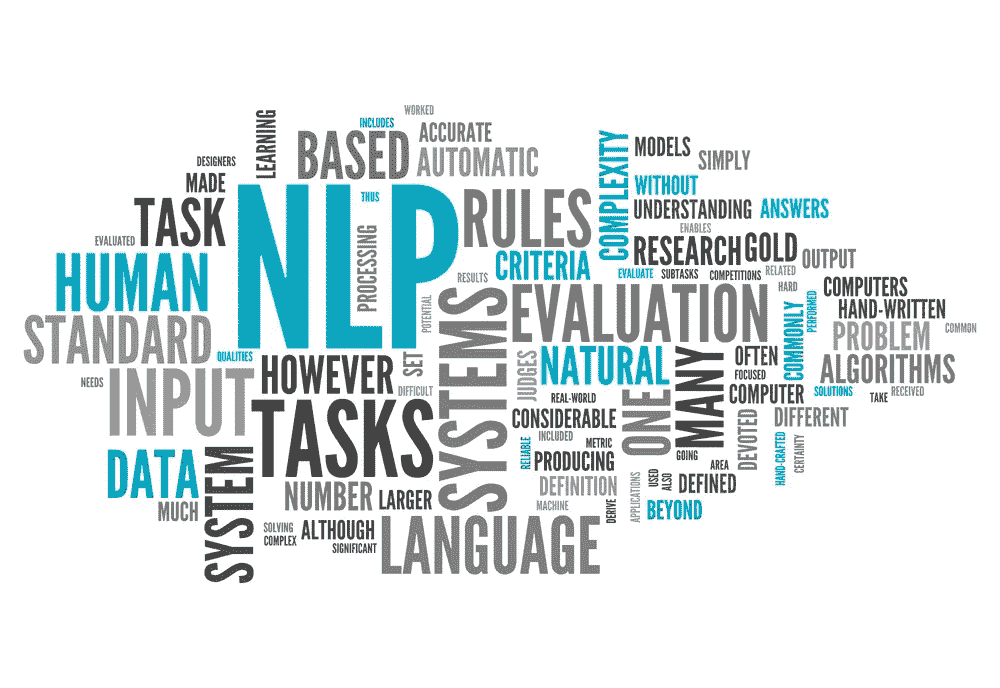

# IT 支持事件的自然语言处理

> 原文：<https://medium.com/analytics-vidhya/natural-language-processing-for-it-support-incident-51cb35af0735?source=collection_archive---------7----------------------->

了解如何利用 NLP 从非结构化事件中提取热点

# 介绍

E 每个月，企业都面临着不断增长的 IT 服务数量和速度。在很大程度上，调查、诊断和根本原因分析都是手动过程。当 IT 经理希望了解他们的 IT 系统或应用程序时…