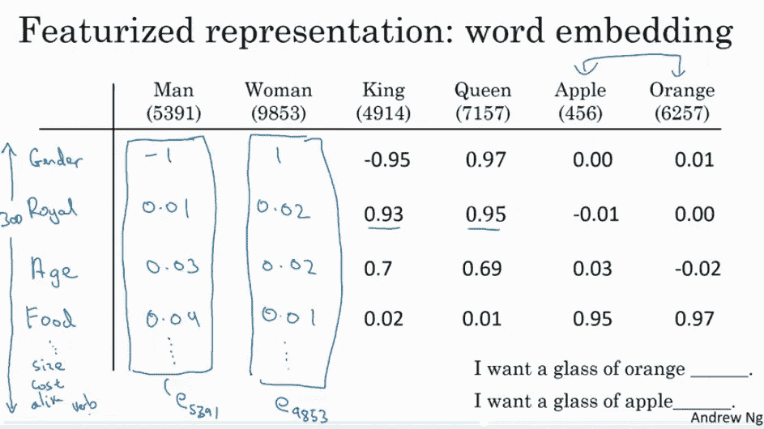

# 自然语言处理:从基础到使用 RNN 和 LSTM

> 原文：<https://medium.com/analytics-vidhya/natural-language-processing-from-basics-to-using-rnn-and-lstm-ef6779e4ae66?source=collection_archive---------0----------------------->

## 对自然语言处理领域中流行的所有概念的详细介绍

机器学习领域最引人入胜的进步之一，是开发了教会机器如何理解人类交流的能力。机器学习的这个分支被称为自然语言处理。

这篇文章试图解释自然语言处理的基础知识，以及随着深度学习和神经网络的发展，自然语言处理如何取得快速进展。

在我们深入探讨这个问题之前，有必要了解一些基础知识

## 什么是语言？

一种语言，基本上是一个固定的词汇，由一群人共享，用来表达和交流他们的思想。

这些词汇是作为人类成长过程的一部分教给他们的，并且大部分都是固定的，每年都有少量增加。

精心制作的资源，如字典，被保留下来，这样如果一个人遇到一个新单词，他或她可以参考字典来查找它的意思。一旦这个人接触到这个单词，它就会被添加到他或她的词汇中，并可以用于进一步的交流。

## 计算机是如何理解语言的？

计算机是根据数学规则工作的机器。它缺乏人类可以轻松完成的复杂解释和理解，但可以在几秒钟内完成复杂的计算。

> 为了使计算机能够处理任何概念，有必要用数学模型的形式来表达所述概念。

这个约束极大地限制了计算机可以处理的自然语言的范围和领域。迄今为止，机器在执行分类和翻译任务方面非常成功。

分类基本上是将一段文本归类到一个类别中，而翻译是将这段文本转换成任何其他语言。

## **什么是自然语言处理？**

> 自然语言处理，简称 NLP，广义上定义为软件对自然语言的自动操作，如语音和文本。

自然语言处理的研究已经有 50 多年的历史了，并且随着计算机的兴起而从语言学领域发展出来。[1]

有关 NLP 基础的详细教程，请访问

 [## 自然语言处理教程:什么是自然语言处理&它是如何工作的

### 人工智能。自然语言处理是如何产生的？自然语言处理是如何工作的…

www.mygreatlearning.com](https://www.mygreatlearning.com/blog/natural-language-processing-tutorial/) 

**基本转变**

如前所述，要让机器理解自然语言(人类使用的语言)，它需要转换成某种可以建模的数学框架。下面提到的，是一些最常用的技术，帮助我们实现这一点。

**标记化、词干化和词汇化**

**标记化**是将文本分解成单词的过程。标记化可以发生在任何字符上，但是最常见的标记化方式是在空格字符上进行。

**词干提取**是一种简单的方法，通过截断词尾来获得基本单词，通常包括去除派生词缀。一个**派生词缀**是一个**词缀**，通过它一个词从另一个词形成(派生)。派生单词通常与原始单词属于不同的词类。最常用的算法是波特算法。

**词汇化**对单词进行词汇和词形分析，通常仅用于去除屈折词尾。一个**屈折词尾**是加在一个单词末尾改变其意思的一组字母。一些**屈折词尾**有:-s. bat。蝙蝠。

> 由于词干提取是基于一组规则进行的，词干提取返回的词根可能不总是英语单词。另一方面，词汇化适当地减少了屈折词，确保词根属于英语。

**N-Grams**

N 元语法指的是出于表示目的将邻近单词组合在一起的过程，其中 N 表示要组合在一起的单词的数量。

对于 eg，考虑一句话，“ ***自然语言处理对于计算机科学来说是必不可少的。***

一个 **1-gram** 或 **unigram** 模型将把句子标记成一个单词组合，因此输出将是"**自然、语言、处理、is、本质、计算机、科学**

另一方面，**二元模型**将把它符号化为每个 2 个单词的组合，输出将是"**自然语言，语言处理，处理是，是必要的，对计算机，计算机科学是必要的**"

类似地，三元模型将把它分解为“自然语言处理，语言处理是，处理是必要的，是必要的，对计算机，对计算机科学是必要的”，并且 n 元模型因此将把句子标记为 n 个单词的组合。

> 将自然语言分解成 n 元语法对于维护句子中出现的单词数是必不可少的，句子中出现的单词数形成了自然语言处理中使用的传统数学过程的主干。

# **转换方法**

在单词包表示中实现这一点的最常见方法之一是 tf-idf

**TF-IDF**

> TF-IDF 是一种对词汇进行评分的方法，以便根据单词对句子意思的影响比例为单词提供足够的权重。分数是两个独立分数的乘积，术语频率(tf)和逆文档频率(idf)

图片来源:谷歌

**词频** (TF):词频定义为词在当前文档中出现的频率。

**逆文档频率** ( IDF):衡量单词提供了多少信息，即在所有文档中是常见还是罕见。它的计算方法是 log (N/d ),其中 N 是文档总数，d 是出现该单词的文档数。

**一键编码**

> 一种热编码是用数字形式表示单词的另一种方式。**单词向量的长度等于词汇的长度，每个观察用一个矩阵表示，矩阵的行等于词汇的长度，列等于观察的长度，观察中出现词汇的单词时取值 1，不出现时取值 0。**

图片来源——[乔恩·克罗恩](https://medium.com/u/e6be2cb902a1?source=post_page-----ef6779e4ae66--------------------------------)(通过谷歌搜索获得)

**单词嵌入**

> **单词嵌入是一组语言建模和特征学习技术的统称，其中来自词汇表的单词或短语被映射到实数的向量。该技术主要用于神经网络模型**。

从概念上讲，它包括将一个单词从一个相当于词汇长度的维度投影到一个更低维度的空间，其思想是相似的单词将被投影到彼此更近的地方。

为了便于理解，我们可以把嵌入想象成每个单词被投射到一个特征空间，如下图所示。

图片来源:吴恩达，Coursera。每个单词都在一个特征空间(性别、皇室、年龄、食物)中表示

> 然而，在现实中，这些维度并不是那么清晰或容易理解。当算法训练维度之间的数学关系时，这不会出现问题。从训练和预测的角度来看，维度所表示的内容对于神经网络来说是没有意义的。

如果有人对直观理解线性代数、投影和变换感兴趣，它们是许多机器学习算法背后的核心数学原理，我会强烈鼓励他们访问 3Blue1Brown 的“**线性代数的本质**”。

# 表现方法

## 一袋单词

对于导出文本数据之间关系的算法，它需要以清晰的结构化格式来表示。

> 单词包是一种以表格格式表示数据的方式，其中列表示语料库的总词汇，每行表示单个观察。单元格(行和列的交叉点)表示在该特定观察中由列表示的单词的计数。
> 
> **它帮助机器理解一个易于解释的矩阵范式中的句子，从而使各种线性代数运算和其他算法能够应用于数据，以建立预测模型。**

以下是医学期刊文章样本的单词袋模型示例

**图片来源:取自谷歌搜索，未提及出处。让我知道这是否是你的形象，我可以添加信用**

这种表示工作得非常好，并负责为一些最常用的机器学习任务(如垃圾邮件检测、情感分类器等)生成模型。

然而，这种表示法有两个主要缺点:

1.  它忽略了文本的顺序/语法，因此失去了单词使用的上下文
2.  **这种表示产生的矩阵是高度稀疏的**，更偏向于最常见的单词。想想看，算法主要是对单词进行计数，而在语言中，单词的重要性实际上与出现的频率成反比。出现频率较高的单词是更一般的单词，如 the、is、an，它们不会显著改变句子的意思。因此，恰当地权衡这些词以反映它们对句子意义的充分影响变得很重要。

**嵌入矩阵**

嵌入矩阵是一种表示词汇表中每个单词的嵌入情况的方法。行代表单词嵌入空间的维度，列代表词汇表中存在的单词。

> **为了将样本转换成其嵌入形式，其一个热编码形式中的每个单词乘以嵌入矩阵，以给出样本的单词嵌入**。

图片鸣谢:吴恩达深度学习课程

要记住的一件事是，这里的一个热点编码仅仅是指一个 n 维向量，其值为词汇表中单词位置处的 1，其中 n 是词汇表的长度。这些一次性编码是从词汇表中提取的，而不是从一批观察数据中提取的。

# 递归神经网络(RNN)

递归神经网络或简称为 RNN，是在自然语言处理中大量使用的神经网络的一个非常重要的变体。

> 从概念上讲，它们不同于标准神经网络，因为 RNN 中的标准输入是一个单词，而不是标准神经网络中的整个样本。这使得网络可以灵活地处理不同长度的句子，这是标准神经网络由于其固定的结构而无法实现的。它还提供了一个额外的优势，即**共享在文本**的不同位置学习到的特征，这在标准的神经网络中是无法获得的。

RNN 将句子中的每个单词视为在时间“t”出现的单独输入，并且还使用在“t-1”的激活值，作为除了在时间“t”的输入之外的输入。下图显示了 RNN 架构的详细结构。

图片来源:kdnuggets.com

上述架构也称为多对多架构，其中(Tx = Ty)，即输入数量=输出数量。这种结构在层序建模中非常有用。

除了上面提到的建筑，还有三种其他类型的 RNN 建筑是常用的。

1.  **多对一 RNN** :多对一架构指的是一种 RNN 架构，其中许多输入(Tx)用于给出一个输出(Ty)。使用这种架构的一个合适的例子是**分类任务**。

**图片来源:取自谷歌搜索，未提及出处。让我知道这是否是你的形象，我可以添加信用**

在上图中，H 代表激活函数的输出。

2.**一对多 RNN** :一对多架构是指 RNN 基于单一输入值生成一系列输出值的情况。使用这种架构的一个主要例子是**音乐生成**任务，其中输入是一个音符或第一个音符。

**图片来源:取自谷歌搜索，未提及出处。让我知道这是否是你的图像，我可以添加信用**

3.多对多架构(Tx 不等于 Ty):这种架构指的是读取许多输入以产生许多输出，其中输入的长度不等于输出的长度。使用这种架构的一个主要例子是机器翻译任务。

**图片来源:取自谷歌搜索，未提及出处。让我知道这是否是你的图像，我可以添加信用**

**编码器**是指读取待翻译句子的网络部分，**解码器**是将句子翻译成所需语言的网络部分。

## RNN 的局限性

除了它所有的用处之外，RNN 也有一些限制，主要是:

1.  上述 RNN 体系结构的例子只能够捕捉语言的一个方向上的依赖性。基本上，在自然语言处理的情况下，它假设后面的单词对前面的单词的意思没有影响。根据我们的语言经验，我们知道这肯定不是真的。
2.  RNN 也不太擅长捕捉长期依赖性，渐变消失的问题在 RNN 再次出现。

这两个限制导致了下面将要讨论的新型 RNN 体系结构的出现。

## 门控循环单元

这是对基本循环单元的修改，有助于捕捉长程相关性，也有助于解决消失梯度问题。

**图片来源:取自谷歌搜索，未提及出处。让我知道这是否是你的图像，我可以添加信用**

> GRU 由通常称为更新门或复位门的附加存储单元组成。**除了具有 sigmoid 功能和 softmax 输出的常用神经单元外，它还包含一个附加单元，具有 tanh 激活功能**。使用 Tanh 是因为它的输出可以是正的也可以是负的，因此可以用于放大和缩小。然后，该单元的输出与激活输入相结合，以更新存储单元的值。

因此，在每一步，隐藏单元和存储单元的值都被更新。存储单元中的值在决定传递给下一个单元的激活值时起作用。

更详细的解释可以参考[https://towards data science . com/understanding-gru-networks-2ef 37 df 6 c 9 be](https://towardsdatascience.com/understanding-gru-networks-2ef37df6c9be)

**LSTM**

在 LSTM 体系结构中，不是像 GRU 那样只有一个更新门，而是有一个更新门和一个遗忘门。

图片鸣谢:吴恩达深度学习 Coursera

这种结构给存储单元一个选择，即在时间 t-1 保持旧值，并在时间 t 将值加到其上

http://colah.github.io/posts/2015-08-Understanding-LSTMs/有关于 LSTM 的更详细的解释

## 双向 RNN

在上述 RNN 体系结构中，可以考虑仅在先前时间戳发生的影响。在 NLP 的情况下，这意味着它考虑了仅在当前单词之前书写的单词的影响。但在语言结构中却不是这样，因此双向 RNN 来帮忙了。

图片鸣谢:吴恩达，深度学习 Coursera

> 双向 RNN 由一个前向和一个后向递归神经网络组成，最终预测是在任何给定时间 t 结合两个网络的结果进行的，如图所示。

在这篇博客中，我试图涵盖自然语言处理领域中流行的所有相关实践和神经网络架构。对于那些有兴趣深入了解神经网络的人，我强烈建议他们参加吴恩达 Coursera 的课程。

# **参考文献**

1.  [https://machine learning mastery . com/natural-language-processing/](https://machinelearningmastery.com/natural-language-processing/)
2.  深度学习课程，吴恩达
3.  [http://www . wild ml . com/2015/09/recurrent-neural-networks-tutorial-part-1-introduction-to-rnns/](http://www.wildml.com/2015/09/recurrent-neural-networks-tutorial-part-1-introduction-to-rnns/)
4.  3Blue1Brown 系列油管
5.  [https://towards data science . com/understanding-gru-networks-2ef 37 df 6 c 9 be](https://towardsdatascience.com/understanding-gru-networks-2ef37df6c9be)
6.  [**http://colah.github.io/posts/2015-08-Understanding-LSTMs/**](http://colah.github.io/posts/2015-08-Understanding-LSTMs/)