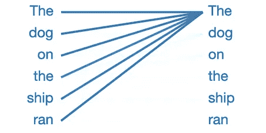
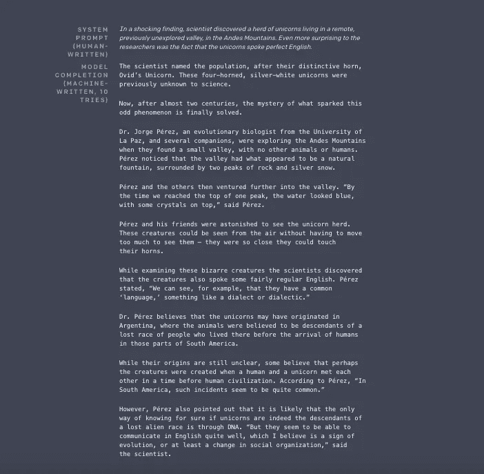

# 自然语言处理:计算机如何学习写作

> 原文：<https://medium.com/analytics-vidhya/natural-language-processing-how-computers-learn-to-write-3f344f414d5c?source=collection_archive---------18----------------------->

15 万年前，人类创造性地提出了新的相互交流方式。最近，人类开发出了复杂的语言，需要不同的规则来表达任何意义。

最受欢迎的语言之一，英语(仅次于普通话)正被用于训练机器学习模型来创建自己的文本！

## 什么是自然语言处理？🤔

简单来说，NLP 是机器学习领域中的一种人工智能形式，它允许计算机理解、操作、分析并潜在地生成人类语言。

自然语言处理(NLP)目前更侧重于能够反映英语。英语的规则包括句子结构、语法、句法等，这些都是为了恰当的交流。

有几种其他形式的 NLP 努力将其他语言的句子翻译成英语或另一种语言。虽然我们不会讨论这种特定的 NLP，但是理解 NLP 的不同应用是很重要的。

## 今天的应用:📈

我们现在使用的 NLP 有很多例子，还有很多你可能不知道。

谷歌！是的，谷歌。当你在搜索栏中输入东西，按下回车键，不到一秒钟就能立即得到**数十亿**的结果，这大部分是通过 NLP 完成的。这种机器学习模型允许谷歌查看和搜索数百个网站、新闻文章等。

Google 的 BERT 模型示例(改进后)

2.Google 集成 NLP 的另一个有趣的方式是在他们的语音识别中使用它，两个例子是 Google Web speech 和 Vocalware。

虽然今天的应用非常有趣，但我想更多地谈谈 NLP 的未来，以及我们如何在这一领域缓慢但稳步地取得进展。

## 未来/进展中的应用:🤖

OpenAI 创造了迄今为止最迷人的 NLP 模型之一！

这是一个名为 GPT-2 的文本生成式 ML 模型，是生成式预训练转换器 2 的缩写。

这个模型的第二版比上一版“GPT”好 10 倍。据说 GPT-2 拥有最好的训练算法之一，因为它不是使用特定的域(网站和在线书籍)，而是已经用 800 万个网页进行了训练。

该模型利用了问答、阅读理解、摘要和翻译等任务的进步，GPT-2 从你给它的文本中学习，而不是从网上找到的文本中学习。唯一的目标是找出下一个单词是什么，而不是整个句子应该是什么。

OpenAI 声称，它的模型“就像一条变色龙”，能够适应给它的文本条件。

## 它是如何工作的？

*在我继续之前，我只想快速提一下，由于担心恶意使用，该型号(GPT-2)不可公开使用，尽管较小的版本(GPT-2 small)可以。*

**首先，我先举个例子:**

当我们将这句话输入模型时:

> 船上的狗跑了🐶

GPT-2 小型模型产生了这样一句话:

> “船上的狗**跑了*走了，狗被船员发现了。***

如果您选择将单词 dog 改为 motor:

> 船上的马达运转了🚢

该模型现在创建了短语:

> “飞船上的马达以大约每小时 100 英里的速度运转 ***。*** ”

*   这个例子证明了 GPT-2 small 理解狗跑和船跑的区别。

**你可能会问自己，这是怎么回事？**

我们应该先谈谈两个非常重要的术语，它们解释了计算机实际上是如何“阅读”的 TF-IDF 代表术语频率逆文档频率，这有助于找出一个术语或单词出现的频率和重要性。所以我们可以把它们都过一遍:

**TF:术语频率**衡量一个术语在文档中出现的频率。每个文档都有不同的长度，所以在查找术语时，是用术语出现的次数除以总的术语数来查找术语频率。

TF(t) =(术语 t 在文档中出现的次数)/(文档中的术语总数)

**IDF:逆文档频率**衡量一个术语的重要性。某些时候，如“是”、“的”和“那个”，可能会出现很多次，但只有一点重要性，所以我们使用下面的等式来找出术语出现的频率及其“重要性”；

IDF(t) = log_e(文档总数/包含术语 t 的文档数)。

**回到 GPT-2:**

GPT-2 就是你所说的注意力模型，这意味着它会阅读前面的单词，从而预测下一个单词是什么。

当模特正在猜测*跑完*后的下一个单词时，模特密切关注*狗这个单词。* GPT-2 使用语言属性，通过这些属性，模型能够知道接下来会出现什么单词。

GPT-2 有 12 层，每层有 12 个独立的“注意”机制，称为“头”；这意味着大约有 144 种不同的模式被用来找出哪个是正确的下一个单词。

一个“头”长什么样的例子:

每个“头”关注不同的东西，前一个词，后一个词，这样，它就学会了用什么词来完成句子。

ML 模型，GPT-2 是基于变压器的概念，这是在谷歌的论文中首次提到的“注意力是你所需要的”

GPT-2 使用一个称为“自动回归”的术语，这意味着在每个部分产生后，该部分被添加到输入序列中。在这种情况下，新的部分成为一个输入，并重复这一过程。

## 这一切意味着什么？😲

在这里可以看到 GPT-2 最受欢迎的例子:

知道这个故事完全是假的，老实说有点可怕，但也令人兴奋。很难确切地说出这种特定的自然语言处理模型的能力，但我们知道的是，它将产生巨大的影响，并教会了我们很多关于计算机每天变得越来越像“人”的可能性

正如中国思维实验所表明的那样:我们将衡量计算机或机器的智能，看它能在多大程度上让我们相信它有多聪明，而不是看计算机或机器实际上有多聪明。

**关键要点-🤯**

*   谷歌在自然语言处理技术方面取得了巨大的进步
*   OpenAI 的 GPT-2 ML 型号是最好的型号之一
*   GPT-2 毫升的模型是如此先进，它没有被用于公共用途，因为它可能是危险的。
*   GPT-2 从数据库中学习句子
*   自然语言处理目前更关注自然语言处理的英语语言

**社交媒体:👤**

如果你喜欢这篇文章或有任何问题或顾虑，请联系我在 dexteralxbarahona@gmail.com

在 https://www.linkedin.com/in/dexter-barahona-723314194[的 Linkedin 上与我联系](https://www.linkedin.com/in/dexter-barahona-723314194)

Instagram: DexterBarahona

## 资源:🙌🏼

 [## OpenAI 的 GPT-2:用 Python 构建世界上最先进的文本生成器的简单指南

### 概述了解如何使用 OpenAI 的 GPT-2 框架在 Python 中构建自己的文本生成器 GPT-2 是一个…

www.analyticsvidhya.com](https://www.analyticsvidhya.com/blog/2019/07/openai-gpt2-text-generator-python/)  [## 更好的语言模型及其含义

### 我们已经训练了一个大规模的无监督语言模型，它可以生成连贯的文本段落，实现…

openai.com](https://openai.com/blog/better-language-models/#task2)  [## GPT-2:如何构建“太危险而无法释放的人工智能”

### 今天，联合国呼吁立即从世界上撤走所有核武器。句子…

blog.floydhub.com](https://blog.floydhub.com/gpt2/)  [## 变形金刚在 NLP 中是如何工作的？最新最先进型号指南

### 概述 NLP 中的 Transformer 模型真正改变了我们处理文本数据的方式

www.analyticsvidhya.com](https://www.analyticsvidhya.com/blog/2019/06/understanding-transformers-nlp-state-of-the-art-models/)  [## 用于机器学习的自然语言处理

### 在本文中，我们将学习自然语言处理(NLP ),它可以帮助计算机轻松地分析文本…

towardsdatascience.com](https://towardsdatascience.com/natural-language-processing-nlp-for-machine-learning-d44498845d5b)  [## Tf-idf::单页教程——信息检索和文本挖掘

### Tf-idf 代表词频-逆文档频率，tf-idf 权重是一个常用于…

www.tfidf.com](http://www.tfidf.com/)