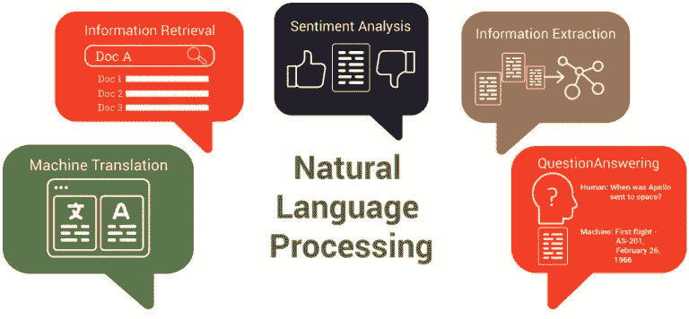

# 基于自然语言处理(NLP)的聊天机器人

> 原文：<https://medium.com/analytics-vidhya/natural-language-processing-nlp-based-chatbots-7b2436428256?source=collection_archive---------12----------------------->

# 自然语言处理

自然语言处理，也称为 NLP，是计算机科学和人工智能的一个领域，涉及计算机和人类(自然)语言之间的交互，特别是如何对计算机编程以有效地处理大量自然语言数据。

NLP 使计算机能够从用户的输入中获取意义。它是信息学、数学语言学、机器学习和人工智能的一个分支。

基于 NLP 的聊天机器人是一种计算机程序或人工智能，它通过文本或声音方法与客户进行交流。

语言学、人工智能、机器学习、深度学习和 NLP 之间的关系。

市面上的各种 NLP 引擎有 [Google 的 Dialogflow](https://dialogflow.com/) 、 [Wit.ai](https://wit.ai/) (脸书)、[Watson Conversation Service](https://www.ibm.com/watson/services/conversation/)(IBM)、 [Lex](https://aws.amazon.com/lex/) (亚马逊)等等。

# 聊天机器人

聊天机器人是模仿人类对话来解决各种任务的应用程序。

> 根据牛津词典，聊天机器人是
> 
> "一种设计用来模拟与人类用户对话的计算机程序，特别是在互联网上."

# 聊天机器人的类型

## 现成的解决方案聊天机器人

这个聊天机器人允许用户自己制作聊天机器人。对于那些不需要复杂和尖端技术解决方案的人来说，这是一个受欢迎的解决方案。

***现成方案的利弊***

**快速简单:**向用户提供现成的工具来构建聊天机器人，用户没有资源编写代码。

**内置集成:**大多数现成的平台都为聊天机器人提供内置集成，如 Messenger、Telegram、Skype 等消息平台，以及支付快捷方式等第三方服务。

**预算友好型价格:**很多聊天机器人搭建平台都是预算友好型或者免费使用的。

***现成方案的弊端***

**功能性差:**现成的工具只能给聊天机器人提供一些基本的功能和简单的逻辑。

**难以定制:**如果用户希望添加新功能或扩展聊天机器人的功能，由于现成工具的功能限制，这可能会很困难。

现成的解决方案聊天机器人:利弊

## 自定义解决方案机器人

用户可以使用不同的 API 集成创建复杂的聊天机器人。他们可以创建一个具有自定义逻辑和一组功能的解决方案，这些功能可以理想地满足他们的业务需求。

***风俗发展的利弊***

**可定制:**通过定制开发，用户可以使用 NLP 制作一个复杂而独特的聊天机器人。对于他们想要添加的功能数量没有限制。

专家意见:用户可以选择一个在特定技术方面有专家意见的团队。拥有聊天机器人专业知识的开发者将能够根据需要定制聊天机器人软件。

**简单测试&维护:**当用户为他们的聊天机器人选择定制开发时，他们必须确保团队将来不仅会开发，还会测试和维护聊天机器人。这种方法有助于确保聊天机器人没有错误，即使在进一步的技术升级后也能正常工作。

***定制开发的弊端***

耗时:开发一个定制的聊天机器人可能需要很长时间。从几个小时到几个星期不等。

**成本高:**聊天机器人的定制开发中使用了不同的特性。这些功能的成本可能不同。因此，聊天机器人的总成本增加了。

自定义解决方案聊天机器人:利弊

# 基于自然语言处理的聊天机器人的最佳方法

实现自然语言处理的最佳方法是使用机器学习和最大化结果的基本含义。他们一起帮助制作高效的基于自然语言处理的聊天机器人。

> **机器语言**用于训练机器人，使其不断学习自然语言理解(NLU)和自然语言生成(NLG)。
> 
> **基本含义**是一种帮助理解单词本身的自然语言处理方法。

# NLP 聊天机器人的工作

1.  例如，你想购买一些东西，你决定使用聊天机器人。你输入你的请求。
2.  当你向聊天机器人发送一条信息，要求购买某样东西时，聊天机器人会将纯文本发送给 NLP 引擎。
3.  在 NLP 引擎中，非结构化的人类语言被转换成计算机可以解释的结构化数据。因此，它使用算法从每个句子中获取含义和上下文，从而从中收集数据。这个过程叫做**自然语言理解(NLU)** 。
4.  聊天机器人将收集的数据(意图和实体)移动到决策引擎。
5.  决策模型基于以前采取的行动和结果得出可靠的决策。
6.  然后在自然语言生成器中，聊天机器人将决策数据转换成文本。这个过程被称为**自然语言生成(NLG)** 。使用 NLG，消息生成器输出消息。该消息以文本或语音消息的形式显示给用户。

免责声明:图片版权归其各自所有者所有。

# 自然语言聊天机器人在现实世界中的应用

*苏格兰皇家银行*在其聊天机器人中使用自然语言处理技术，通过文本分析来解读多种形式的客户反馈趋势，如调查、呼叫中心讨论、投诉或电子邮件，从而增强客户体验。这有助于他们确定客户不满意的根本原因，并据此帮助他们改进服务。

# 聊天机器人开发所需的技术

聊天机器人开发中最流行和最常用的技术有:

**Python** —一种用于构建聊天机器人架构的编程语言

**Pandas** —一个为 Python 编程语言编写的软件库，用于数据操作和分析。

**TensorFlow** —一个经常用于机器学习和神经网络任务的库。

SpaCy —一个用于高级自然语言处理的开源软件库

**Twilio** —允许软件开发人员以编程方式拨打和接听电话，发送和接收文本消息，以及使用 web 服务 API 执行其他通信功能。

**Telegram、Viber 或 Hangouts API**—用于将聊天机器人连接到信使或网站

# 结论

最近，我们看到聊天机器人市场呈指数级增长，超过 85%的商业公司已经实现了客户支持自动化。

聊天机器人有助于增强业务流程，将客户体验提升到一个新的水平，同时也提高了企业的整体增长和盈利能力。它为保持市场竞争力提供了技术优势，节省了时间、精力和成本，从而进一步提高了客户满意度和业务参与度。