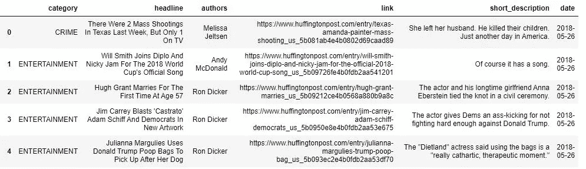
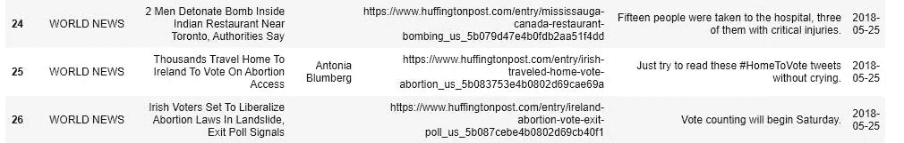
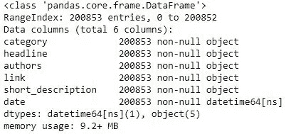
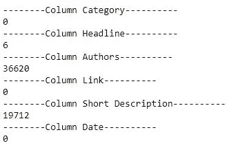
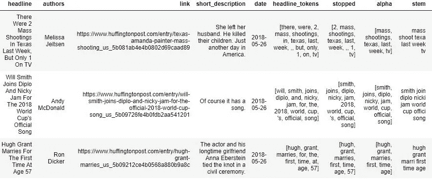
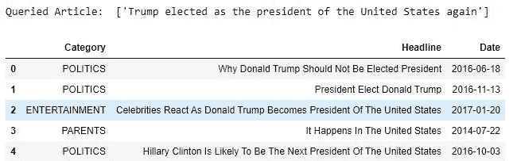
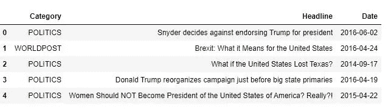
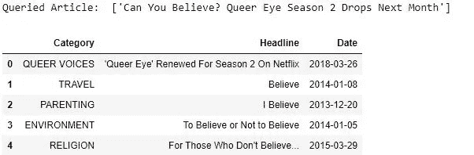
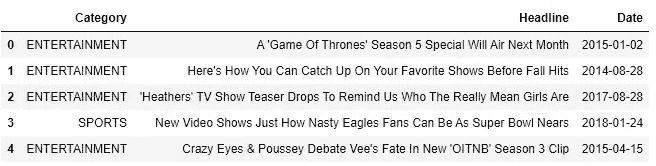

# 自然语言处理(NLP):实用介绍

> 原文：<https://medium.com/analytics-vidhya/natural-language-processing-nlp-practical-introduction-1fe3ad96e360?source=collection_archive---------21----------------------->


帕特里克·托马索在 [Unsplash](https://unsplash.com?utm_source=medium&utm_medium=referral) 上的照片

我们产生的数据比以往任何时候都多。其中很大一部分是文本。推文、评论、评论、搜索、查询，一切都在文本中，因为这是我们交流的方式，这是我们的语言。

> 电脑就知道 0 和 1，多教教吧

## 先决条件:

1.  Python 基础
2.  NLP 概念，如标记化、停用词、词干和矢量化
3.  Word2Vec 基础

> **注意:这个故事没有深入 NLP 的理论，而是展示了如何开始使用 python(实用方法)**

**考虑数据集:** [**新闻类别**](https://www.kaggle.com/rmisra/news-category-dataset)

## 步骤 0:导入

```
#Importing the required libraries
import pandas as pd
import numpy as np
import matplotlib.pyplot as plt
from nltk.stem import PorterStemmer 
from nltk.tokenize import word_tokenize
import nltk
from nltk.corpus import stopwords
from sklearn.feature_extraction.text import TfidfVectorizer
from nltk.corpus import stopwords
stop = stopwords.words('english')
from sklearn.metrics.pairwise import cosine_similarity
```

## 第一步:探索



显示数据集的前五行

它有 5 个栏目:类别、标题、作者、链接、简短描述和日期。
我们可以看到数据是按日期降序排列的，也就是说最新的新闻最先出现。查看 short_description，我们可以说它可能会也可能不会给出关于标题的细节。



缺失数据

在查看更多行时，我们可以看到有丢失的值。



df.info()

我们看到所有的值都是非空对象，但这不是真的，因为有丢失的值。

```
print('--------Column Category----------')#Checking if the column value contains an empty string as empty string is considered as a non-null value.
print(len(df[(df['category']=='')]))
```



缺失值总数

标题列有 6 个空值，这些行必须从数据集中删除，因为如果标题为空，我们就无法知道文章的内容。

```
len(df['headline'].unique())
```

总共有 199344 个唯一标题，但总行数是 200853，这意味着存在重复条目，必须删除这些条目，并且必须只保留一个值。

```
#Deleting rows where headlines are null
df.drop(df[df['headline'] == ''].index, inplace = True)#Deleting duplicate rows
df.drop_duplicates(subset ='headline', 
                     keep = 'first', inplace = True)
```

## 步骤 2:预处理

现在，我们已经探索了数据，并进行了一些清理，下一步是预处理。
从这里开始，我们将只考虑“标题”列。

***预处理阶段:***

1.  标记化
2.  停用词移除
3.  删除标点符号
4.  堵塞物
5.  …向量化…

```
#Tokenization
df['headline_tokens'] = df['headline'].apply(word_tokenize)#All words to lowercase
df['headline_tokens'] = df['headline_tokens'].apply(lambda sentence:      [words.lower() for words in sentence])#Removal of stop words
 df["stopped"] = df['headline_tokens'].apply(lambda sentence: [words for words in sentence if words not in stop])#Only storing alphabetic characters
df["alpha"] = df['stopped'].apply(lambda sentence: [words for words in sentence if words.isalpha()])#Stemming
df["stem"] = df["alpha"].apply(lambda sentence: [ps.stem(word) for word in sentence])
```



预处理的逐步结果

在矢量化(将标题转换成矢量格式)之前，我们还需要做两件事。

> 词干提取后，可能会有一些标题只包含停用词，这样的标题将变得无效，因此我们需要删除它们。
> 
> 移除许多行后，我们需要重置索引，这非常重要。
> 如果没有这样做，则使用索引值和。iloc 返回不同的行。

```
#Dropping the rows which have no value in 'stem' 
df = df.dropna(subset=['stem'])#Resetting index
df.reset_index(inplace = True, drop = True)
```

矢量化:

```
#Initializing TFIDF
tfidf = TfidfVectorizer()#Transforming the dataframe into TFIDF
X_t = tfidf.fit_transform(df['stem'])
```

我们终于把数据帧转换成了矢量格式。

> 让我们看看计算机是否能理解这篇课文

## 第三步:寻找相似的文章

我们将向计算机提供一个新的标题，看看它是否能从数据集中返回类似的文章。

```
#A new headline which is not in the dataset
headline = {'headline': 'Trump elected as the president of the United States again'}#Storing it into the dataframe
new_test = pd.DataFrame(headline,index=[0])
```

我们必须对这个数据帧进行预处理，使其具有相同的格式。

> 只有变更处于矢量化阶段。这里我们只变换数据，不拟合。

```
#Using cosine_similarity to find similar articles
cosine_list = []
cosine_list = list(map(lambda x:                    
cosine_similarity(df_test_vectorized,x)[0][0], X_t))#Converting list of cosine scores in numpy array
cosine_np = np.array(cosine_list).flatten()#Getting the index list after sorting by scores
index_list = np.argsort(cosine_np)#Getting the index of articles with highest similarity 
fetched_index = index_list[-2:-7:-1]#Building the dataframe
fetched_dataframe= pd.DataFrame({'Category':df.iloc[fetched_index]['category'].values,
                                'Headline':df.iloc[fetched_index]['headline'].values,
                                'Date':df.iloc[fetched_index]['date'].values})
```



类似文章

我们可以看到结果是基于内容的，这意味着大多数相似的文章将与查询标题中的单词相同。

为了改善结果，我们可以使用 gensim Word2Vec 模型。这个模型可以用来寻找相似的单词而不是句子。
但是可以建立一个平均的 word2vec 模型来找到相似的句子。

## Word2Vec

```
#Initializing the model
model = KeyedVectors.load_word2vec_format('GoogleNews-vectors-negative300.bin',binary=True)#Calculating avg word2vec for both dataframe and new article
avgW2V = []
for i in df['headline']:
        word_vec = np.zeros(300,dtype="float32")
        for word in i.split():
            if word in model.vocab:
                word_vec = np.add(word_vec,model[word])
        word_vec = np.divide(word_vec,len(i.split()))
        avgW2V.append(word_vec)
```



使用 Word2Vec 的类似文章

我们可以看到，我们得到的是多样化的文章，而不是基于内容的相似性。

让我们考虑另一个 TF-IDF 和 Word2Vec 模型如何给出不同结果的例子。



余弦相似度



平均 Word2Vec(余弦相似度)

我们可以看到 Word2Vec 型号比 TF-IDF 好多少。

## 接下来呢！：

1.  可以不用 TF-IDF，用词袋(BOW)。
2.  还有 n 元模型等其他模型。
3.  还有 skip-gram 和 cbow 模型。
4.  不同的相似性度量。

可以尝试这些模型，看看哪一个给出更好的结果。