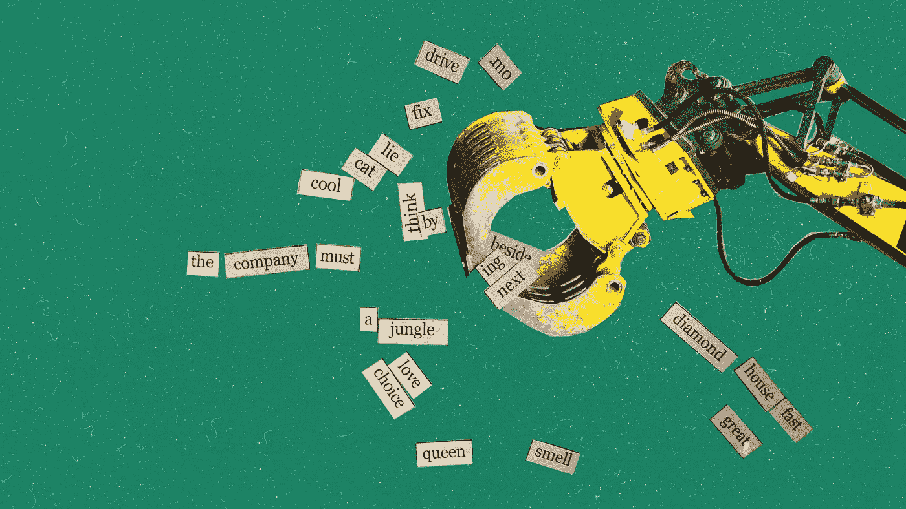
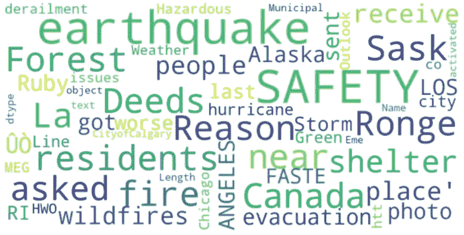
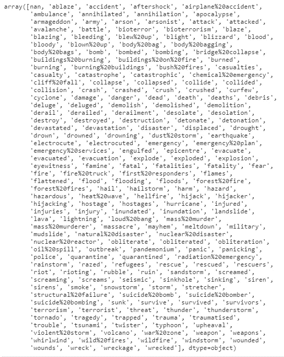
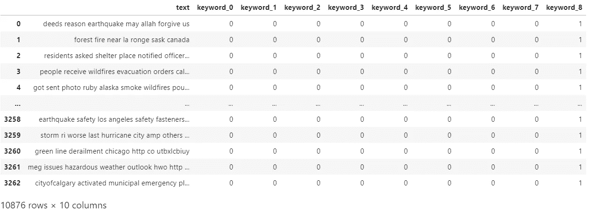
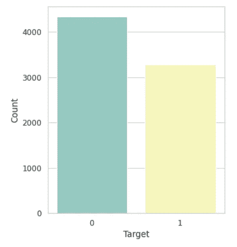
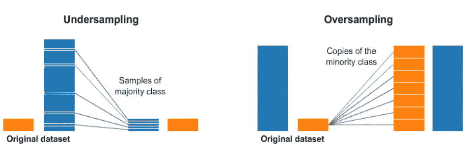
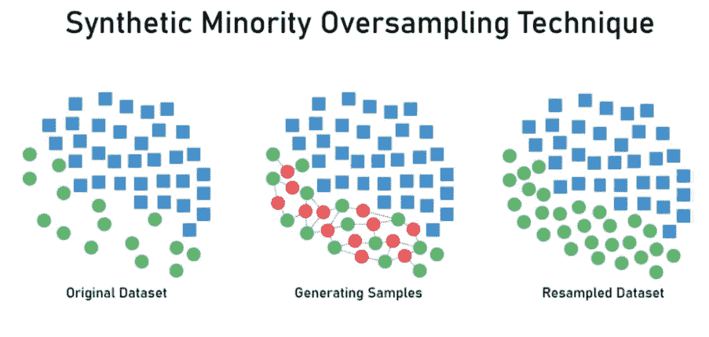
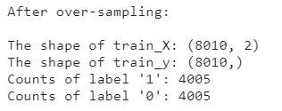
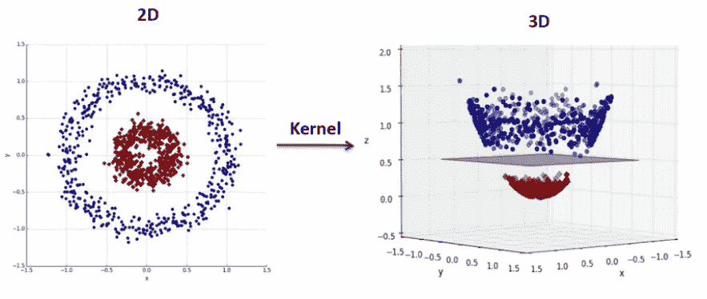
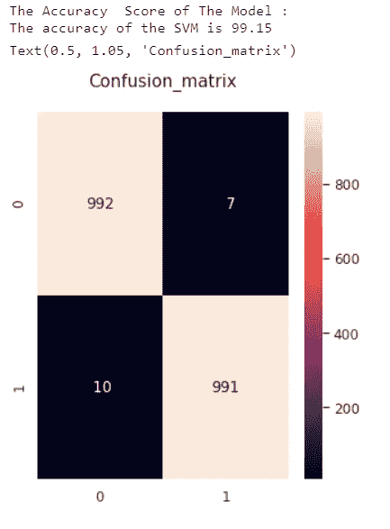

# 面向初学者的自然语言处理(NLP)项目示例

> 原文：<https://medium.com/analytics-vidhya/natural-language-processing-nlp-project-example-for-beginners-616549300c54?source=collection_archive---------3----------------------->

鸣谢:埃琳娜·莱西——盖蒂图片社

# 指令

当感兴趣的领域变成机器学习时，它就采取步骤进行各种研究。这些调查可能需要很长时间。但是如果你继续不放弃，过一段时间，就会有你没有注意到的步骤和你思考的细节。

作为一个已经采取了其中一些步骤的人，我想分享一个我已经完成的简单但有指导意义的机器学习项目，特别是对初学者来说。

这个示例应用程序是 Kaggle 上发布的竞赛。简单解释一下:它在 Twitter 上发布各种推文。这些是关于严肃的问题、笑话、批评、侮辱、灾难等等。

Kaggle 提供的数据集包括许多推文。在为测试准备的数据集中有 3243 个唯一数据，在训练数据集中有 7503 个唯一数据。在训练和测试数据集中有 id、关键字、位置、文本(tweeted)列。我们将进行各种开发，以改进对列车数据集的预测。因此，有一个目标列将有利于我们作为一个加号。测试数据集中还没有目标列，我们将创建这个列，看看我们能猜得多好。

训练数据集中有目标列 1 和 0 数据。因此，我们有一个目标列，其中的分类变量包含离散值。如果 Target = 1，则同一列中的推文是灾难推文。如果 Target = 0，则同一列中的推文不是灾难推文。

这个问题是一个 NLP 问题，我们需要预测的数据只有 1 或 0，这意味着我们可以使用分类算法作为解决方案。更多信息在步骤 8 中。

*竞争在这里:* [*真实与否？NLP 与灾难推文*](https://www.kaggle.com/c/nlp-getting-started)

鸣谢:Getty Images

# 步骤 1:连接数据集以使其可用

训练集和测试集是分开的，但是在训练期间对单个数据集进行操作更准确和有效。因此，作为第一步，我们必须合并数据集。这样做时，目标列已被删除，但稍后会被添加回去。

# 步骤 2:可视化数据

直观地表达数据有助于更好地理解所处理的主题。

Python 中有很多模块和方法可用于数据可视化。我选择了一个简单的方法，字云。使用单词云可以突出显示重要的单词。在这种方法中，单词的大小根据使用频率而变大或变小。

# 第三步:清理正文

在有文字的交易中，要突出能触及具体问题的文字。删除不必要的、无意义的或无意义的对猜测没有帮助的词，让我们更容易对推文进行分类。

其中最重要的是 ***停用词*** 。停用词是一种语言中的一组常用词，因为无效而从搜索引擎查询中删除。Python 中有一个 ***NLTK*** 模块列出了停用词。

Twitter 平台上有太多非字母数字的有意义或无意义的字符，这是人们可以立即写下想法的预期情况。以及这些字符、邮件地址、共享链接等。结构也是可用的。*摆脱这些结构会提高我们的效率和表现，对吗？那么我们该怎么办呢？*我们编写了 ***正则表达式*** 的等价物，并在 replace 函数中使用它来查找和删除这些不必要或无意义的结构。

# **第四步:删除无用的列**

数据集中的位置和 id 列对我们的预测没有帮助。因此，删除了位置和 id 列。

Keyword 是一个专栏，其中的推文根据其包含的主题进行标记。因此，对它进行编码会更有效，这样它就可以通过分类过程，而不是删除它。让我们首先看看关键字列中唯一数据的数量，并相应地选择一种编码解决方案；

我们得到结果 ***(221，)*** 。换句话说，关键字列中有 221 个唯一数据。

打印关键字列中的标签/类别；

让我们回顾一下我们可以做些什么:

1.  ***标签编码器*** 可能是该问题的合适解决方案，但是标签编码器通常在基于树的算法上工作良好，我们将不使用基于树的算法。
2.  ***一键编码*** 占用大量内存，因为这意味着为每个数据添加列
3.  就目前而言，最好的解决方案看起来像是 ***二进制编码*** 。当有很多类别时，二进制编码非常有效。这是一种更有效的内存使用方法，因为它使用的功能比一键编码少。

# 步骤 5: **分析单词**和文档频率

在数据挖掘和 NLP 问题中，有一些统计方法用于测量称为文档的文本组。这种计算权重因子的方法名字叫做 ***TF-IDF(词频—逆文档频)。***

**TF(术语频率):**测量术语在文档中出现的频率。这个计算实际上是一个归一化的过程。因为每个文档的长度不同，一个术语可能在长文档中出现得更频繁，一个术语可能在长文档中出现得更频繁。如果我们查看所有文档中的所有术语，归一化对于计算术语频率变得至关重要。因此，术语在文档中出现的次数除以文档中的术语总数。

> TF =(术语在文档中出现的次数)/(文档中的总术语数)

**IDF(逆文档频率):**简而言之，衡量术语的重要性。根据这种计算，几乎所有文档中的单词以及大多数充当连词的单词都不重要。很少使用或独特的单词很重要，并且具有很高的 IDF 值。

> IDF = log_e(文档总数/包含术语的文档数)

我们来想一个例句，命名为‘猫’。包含术语“cat”的文档数量越多，TF-IDF 值越低。此外，cat 术语在自己的文档中出现得越多，TF-IDF 值就越高。

在 Python 中， ***计数矢量器*** 用于 TF-IDF 操作；

# **第六步:不平衡数据集控制**

需要开发具有不平衡类别的数据集的预测模型。不平衡数据集会对基于分类的预测模型的结果产生不利影响。虽然该模型可以很好地预测较大的类，但它会对构成少数的数据类做出不好的预测，它会忽略少数类。

如果我们看看我们的模型，它没有一个极度不平衡的阶级。但是仍然存在影响预测模型的不平衡；

解决这个问题最常见的方法是称为 ***重采样*** 的方法。这是一种快速而简单的技术。重采样技术分为两种；通过向少数类添加样本或从多数类中移除样本，使数据集达到更平衡的水平。

*   **过采样:**该方法将样本的副本添加到被视为少数的类中，从而产生一个平衡的数据集。
*   **欠采样:**该方法通过使用各种方法删除大部分样本来提供平衡的数据集。

欠采样和过采样

通过对分类模型进行过采样，我们可以得到一个更加平衡的数据集。Python 的名为*不平衡学习(imblearn)* 的包可以用于过采样。使用了 imblearn 包中的 SMOTE 方法。

***SMOTE(合成少数过采样技术):*** 通过少数类中已经存在的样本的邻域来复制附近的样本。SMOTE 查找少数类中每个样本的 K 个最近邻。然后，在连接原始样本和检测到的相邻样本的线上添加新的数据点。

SMOTE 的输出。

# 第七步:**拆分**数据

通过各种过程传递数据，如删除、编码。这为分类提供了更有效的环境。这对于良好的预测性能是必要的。

在所有这些操作的最开始，我们组合了训练和测试数据集，并创建了 all_data 数据帧。现在是时候再次获取训练和测试数据集了。

# 第八步:**型号选择**

如果有必要从一个很基本的问题开始，*学习模型的目的是什么？*我们试图用各种数学学习算法为我们拥有的数据找到最佳模式。有了我们的训练集，它可以帮助我们找到需要的模式。当我们找到最接近的模式，即学习模型时，我们就在测试集中获得了成功的结果。

在文章的开头，我们说明了使用分类算法(一种监督学习方法)来解决这个问题是合适的。

选择模型时，有时尝试几个模型是很好的。因此，可以观察到哪个模型给出更好的结果。我已经用朴素贝叶斯、随机森林和 SVM 测试了我的模型的性能。结果，我用 ***【支持向量机】*** 得到了最好的预测数据。我建议你也做这些试验。除了达到最好的结果，我们还获得了经验。随着经验的积累，机器学习领域变得更容易理解，就像在许多其他领域一样。随着你的实验，你的头脑中可以有更多不同的和实际的想法。

**SVM(支持向量机):**表示不能线性分离的数据集。一条曲线可以将这两个类别分开，但不是直线。像大多数真实世界的数据集一样，它代表一个线性不可分的数据集。我们可以把这些数据导出到一个更高维的空间，比如映射到一个三维空间。转换后，桥可以定义两个类别之间的边界。由于我们现在是在三维空间中，我们把它表示为一个分离的平面。

该平面可用于分类新的或未知的目标数据。因此，SVM 算法生成一个分类新样本的最佳超平面。

SVM 算法

该视频将有助于更好的视觉理解:

# 步骤 9:计算模型的准确性

在训练了我们的模型之后，我们在测试集中进行了目标预测。那么，这些预测有多少是正确的呢？在我们计算准确度之后，如果我们获得不期望的低结果，它将被返回以处理数据并被审查。数据被尝试优化用于预测模型，或者我们改变模型。在 Python 中，精确度分数是通过 sklearn 库中的 accuracy_score 度量来计算的。准确度分数取 1 到 0 之间的值。准确度分数在 1 时达到最佳值，在 0 时达到最差值。我们将用百分比来表示准确度分数。

它可以用于混淆矩阵，作为获得分类器精度的方法之一。该矩阵显示了与真实标签相比的正确和不正确的估计。每个混淆矩阵行显示测试集中的正确标签，列显示分类器估计的标签。这种方法叫做***F1——得分*** 。我们可以更清楚地看到哪个类有多少实例预测正确，有多少实例预测错误。

如果我们需要重新安排我们的数据集或选择另一个模型，我们将在这一步理解。因此，如果我们在这一步不能得到我们想要的结果，很可能我们将重复前面所有的步骤。

预测结果出来了 99.15%。这是一个好结果。

**表格解读:**根据 F1 评分表，目标值为 1 的样本中有 10 个样本被估算为 0，991 为 1。换句话说，在 10 条推特上出现了错误的猜测。目标值为 0 的样本中有 7 个被估计为 1，992 个被估计为 0。换句话说，超过 7 条推文做出了错误的猜测。

# 结论

以下是我们从取得成功的结论中得出的总结:

*   当你遇到一个需要解决的问题时，先复习资料，试着了解问题的大概轮廓。通过这种方式，您将了解可以使用哪些模型。
*   不要害怕将你拥有的数据形象化，这会让你更好地理解这些数据。
*   如果你正在处理文本(就像我们正在处理的这个例子)。思考在猜测阶段对你有帮助的单词，并努力突出那些对你将得到的结果有发言权的单词或词组。我们可以简称其为*清理正文*。
*   如果可以对数据进行分类，请检查数据集是平衡的还是不平衡的。它会成为一个严重影响结果的问题。
*   在为模型准备数据或选择模型时，不要犹豫尝试。如果你添加的一个步骤严重影响了结果，那就删除它，然后考虑另一个选择。如果你真的有耐心，机器学习是一个你可以前进的领域。

**感谢您的阅读！！**