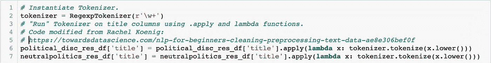
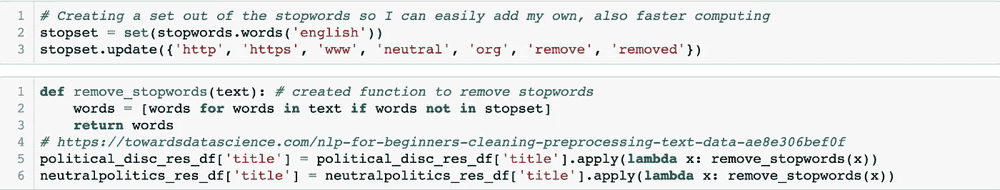
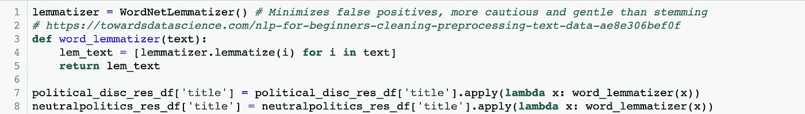
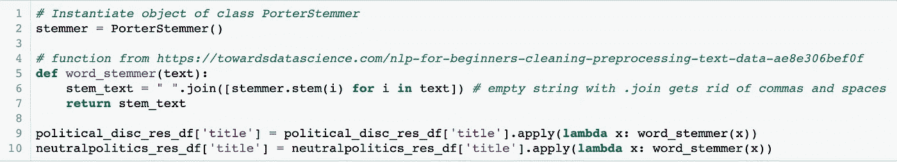
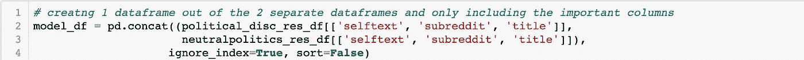
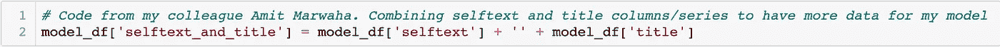
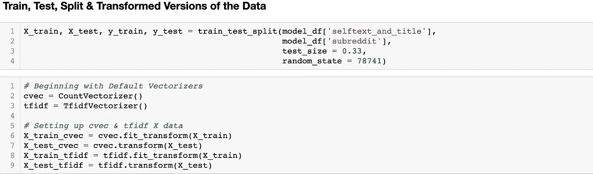
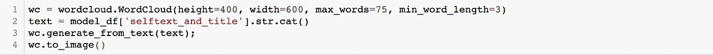
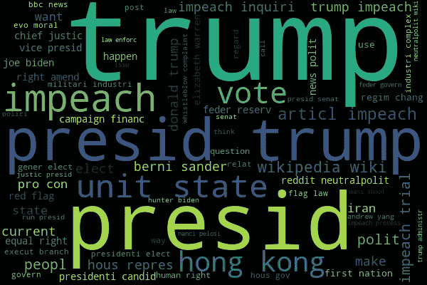
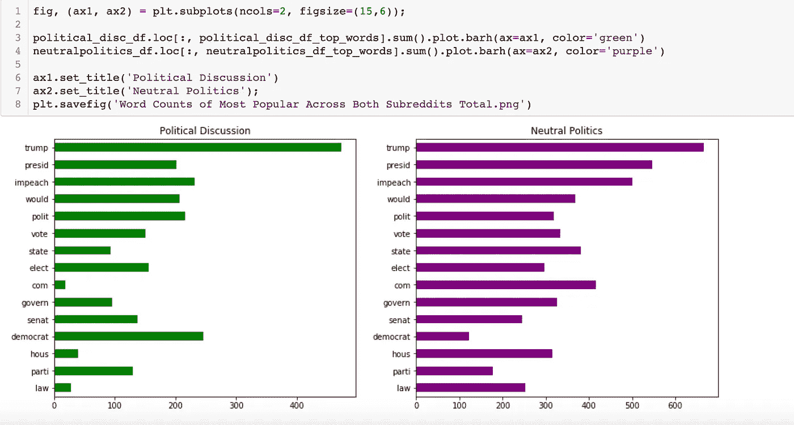

# Sci-kit Learn 中二进制分类的自然语言处理(NLP)工作流/教程

> 原文：<https://medium.com/analytics-vidhya/natural-language-processing-nlp-workflow-tutorial-for-binary-classification-in-sci-kit-learn-b9f94c6aaf14?source=collection_archive---------7----------------------->

图片来自:[https://www . xoriant . com/blog/machine-learning/natural-language-processing-the-next-disruptive-technology-under-ai-part-I . html](https://www.xoriant.com/blog/machine-learning/natural-language-processing-the-next-disruptive-technology-under-ai-part-i.html)

本文将概述和描述我构建二元分类器的工作流，该分类器可以通过自然语言处理(NLP)技术，根据帖子中的内容成功预测帖子来自哪个子编辑。使用的主要编程语言是 Python，一些导入的库是:nltk、regex、pandas、wordcloud、sklearn 和 beautiful soup。这篇文章中包含了一些代码，但大部分是 NLP 专有的，不会包含太多基本的 Python、Pandas、Webscraping 等。

## 网页抓取和数据框架

我能够使用 Beautiful Soup 和 [PushShift API](https://github.com/pushshift/api) 提取 6000 个帖子:3000 个来自 r/NeutralPolitics，3000 个来自 r/PoliticalDiscussion。然后我创建了两个熊猫数据框，包含了每个子编辑的所有帖子。现在我已经组织好了我的文本数据。接下来，我必须对它进行预处理，然后才能适合模特。这需要多个步骤:

## 符号化

虽然标记化可以在我稍后将使用的矢量器中自动完成，但我希望在整个 NLP 过程中获得经验和理解。使用 nltk 中的 Regexp 标记器，我标记了我的每一列。

正则表达式标记器的实例化，然后在我的文本数据上应用它。向 Rachel Koenig 致敬，她的代码和有影响力的 NLP 文章在这里找到:[https://towards data science . com/NLP-for-初学者-清理-预处理-文本-数据-ae8e306bef0f](https://towardsdatascience.com/nlp-for-beginners-cleaning-preprocessing-text-data-ae8e306bef0f)

## 停止言语

接下来，我决定手动删除文本中的停用词。同样，这可以是矢量器中的一个过程，但我选择手动执行。我用 nltk.corpus 停用词集作为我的初始停用词集。在我的项目中稍后运行测试之后，我会回到这个问题，用 nltk.corpus 中没有包括但与我的目标相关的附加停用词来更新它。其中大部分是互联网相关词汇，如“www”、“org”、“http”等。

创建停用词集并在函数中实现它们

## 词汇化

与标记化和添加停用词不同，这个过程不是用矢量器自动完成的，所以我必须手动完成。尽管对 NLP 来说，lemmatizing 并不总是必要的，但它可以提高模型的性能，我就是这样做的。我使用了 WordNetLemmatizer，它也来自 nltk 库。首先，我使用 Rachel Koenig 的方法创建了一个将文本进行 lemmatize 的函数，然后在我的列上的 lambda 函数中调用它。

实例化 Lemmatizer，在函数中使用它，并在 lambda 函数中实现该函数

## 堵塞物

我使用同样来自 nltk 库的 PorterStemmer 遵循了上面相同的协议。我建议为您的项目尝试每种工具。我尝试在不进行词汇化的情况下对数据进行词干化，反之亦然，两者都用。对于这个项目，在我的文本数据上使用这两种方法后，我得到了最好的结果。

实例化斯特梅尔，在函数中使用它，并在 lambda 函数中实现该函数

注意:如果您使用词干分析器和词汇分析器，请确保使用. join 或与您最后使用的工具等效的工具，以便您的文本可以在一个大字符串中保持连接，但用逗号分隔。

## 模型准备

文本数据几乎都是为了建模而设置的！只剩下最后几个步骤了。在这一点上，每个子编辑仍然在单独的数据帧中进行预处理，所以现在是时候将它们组合起来了。这里我使用了 pandas concat 函数。我还在同一列中添加了提交的标题文本和自我文本，这样我就可以在模型中包含尽可能多的文本。这个新的组合列将是我在预测它所来自的 subreddit 的名称时唯一的 X 特征，这是我的 y。然后，我使用 train test split 将我的数据分成多组训练和测试数据。

使用 Pandas concat 函数

因为每一列都是由字符串组成的，所以我只是将它们加在一起。向我的同事 Amit Marwaha 致敬，感谢他对我的项目做出的贡献

## 矢量化

让我们的文本数据为建模做好准备的最后一步是将其矢量化！也就是说，我们使用 Count 和 Tfidf 矢量器将文本转换成数字数据。为了方便和实验，我为我的 X 训练和测试数据创建了 count 和 tfidf 矢量化变量。通过这种方式，我可以在所有不同的模型上快速、轻松地试验每个版本的矢量化数据，看看哪个矢量化工具对每个模型的性能更好。这些矢量器可以用不同的参数修改。我建议尝试许多不同的选项，尤其是 ngram 系列。

## 建模

说到建模，我有太多的选择。这里有足够的自由和实验空间。如果你有时间和计算资源，我建议你运行多个管道，尝试调整模型和矢量器的许多不同的超参数。我试验了一些不同的模型，包括逻辑回归、支持向量机和多项式朴素贝叶斯。

## 估价

基于 Tfidf 矢量化数据的支持向量机最终表现最佳，达到 96.8%的准确率，相比之下，计数矢量化版本的准确率为 86.6%。该分数表示该模型根据标题和自我文本预测帖子来自 2 个子编辑中的哪一个的准确度。

## 数据可视化

在创建了我的模型之后，我回去直观地探索数据。这包括创建单词云来以一种美观的方式表现最流行的单词，并创建条形图来做同样的事情。

下面是单词云的代码

帖子标题和两个子编辑的自文本中最流行的词的词云

每个子主题中最流行的词及其频率

我希望你喜欢这篇文章，它能帮助你在你的 NLP 项目中找到你的心流！如果您对我的代码或流程有任何反馈、批评或建议，请联系我们！我们互相帮助学习得越多，我们的社区就会变得越好越聪明！