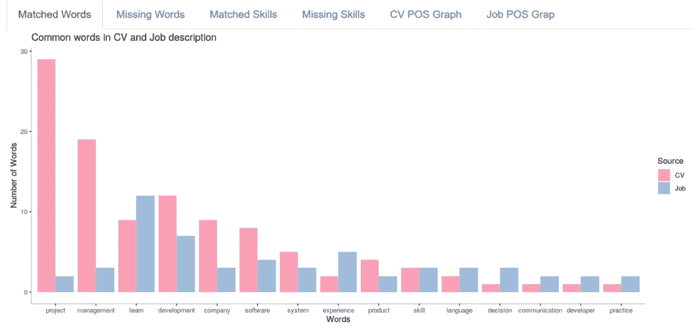
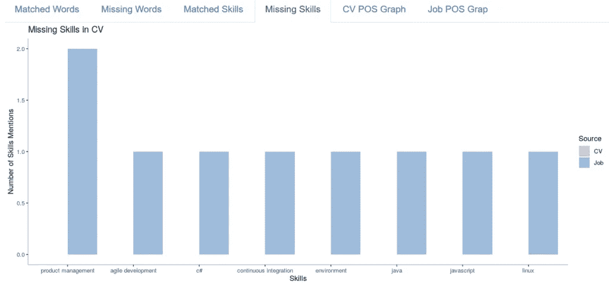

# 自然语言处理:简历比较引擎(第 6 部分)

> 原文：<https://medium.com/analytics-vidhya/natural-language-processing-resume-comparison-engine-part-6-cbe5b3552dd8?source=collection_archive---------6----------------------->


# 介绍

在前 5 篇文章中，我们已经说明了 Google 和 AWS NLP APIs 的用法。我们还试验了 spacy 库，从不同的文档中提取实体和名词。我们已经展示了如何使用 spaCy 的模式匹配函数来改进模型。最后，我们还用新实体训练了模型。

现在，我们想进入一个比较引擎的完整实现，它超越了简单的关键字搜索，并使用 spacy 的功能。

我们选择使用个人简介和工作描述，因为这是一个常见的用例，任何人都很容易理解。虽然我们认为使用这种算法来匹配候选人和工作是远远不够的。

# 匹配使用的名词

一个有趣的对比是看简历和职位描述中使用的名词。我们正在使用 spacy 的能力来自动识别词性，然后通过名词进行过滤。

所以基本上代码如下:

```
dfCV<-data_frame(parse_text(textCV))`# call to a python function dfCV<-subset(dfCV, POS=="NOUN") # filter only nouns groupEntitiesJob<-dfJob %>% group_by(lemma) %>% summarise(count = n())
```

我们可以在下面的对比图中看到最终的结果:



该图是使用 ggplot 创建的，应用程序是使用 Shiny([https://shiny.rstudio.com/](https://shiny.rstudio.com/))实现的

# 识别技能

我们需要超越简单的单词匹配，从职位描述中找出所需的技能，并将它们与简历中的可用技能进行匹配。Spacy 允许做句子匹配。为此，我们将使用从开源数据集下载的可能技能列表，该列表包含 6000 多个条目。这些条目将由 spacy 自动检测，然后与 jos 和 CV 文本进行比较。这对于 spacy 来说相对容易，困难的是拥有足够的技能来掌握不同领域的大多数重要技能。

假设技能在 csv 文件中可用，这可以简单地在 Python 中完成:

```
matcher=PhraseMatcher(nlp.vocab) patterns=[] skills = pd.read_csv("skills.csv") for index, row in skills.iterrows(): patterns3.append(nlp(row["SKILLS"].lower())) matcher.add("Skills", patterns)
```

结果很酷，我们可以清楚地识别匹配和缺失的技能。



# 简短的演示

将简历与职位描述进行比较和匹配

# 技术堆栈

对于此版本，我们使用了以下堆栈:

*   r 以 reticulate、ggplot 和 dplyr 为主要文库
*   Python 访问空间功能
*   康达将部署 Python
*   为构建应用程序而闪亮
*   码头集装箱
*   Azure docker 实例来部署应用程序

*原载于 2019 年 12 月 27 日*[*https://smart lake . ch*](https://smartlake.ch/natural-language-processing-resume-comparison-engine-part-6/)*。*