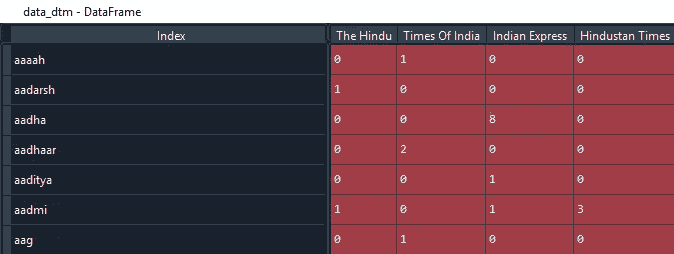
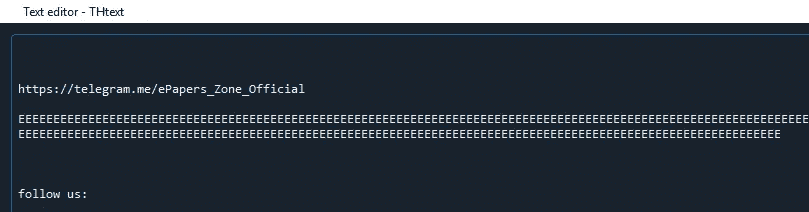
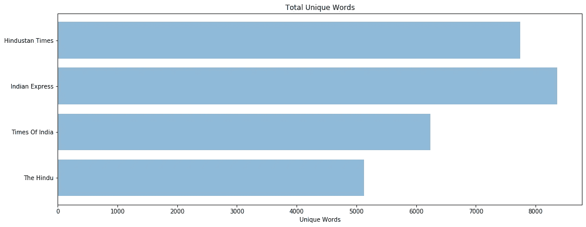
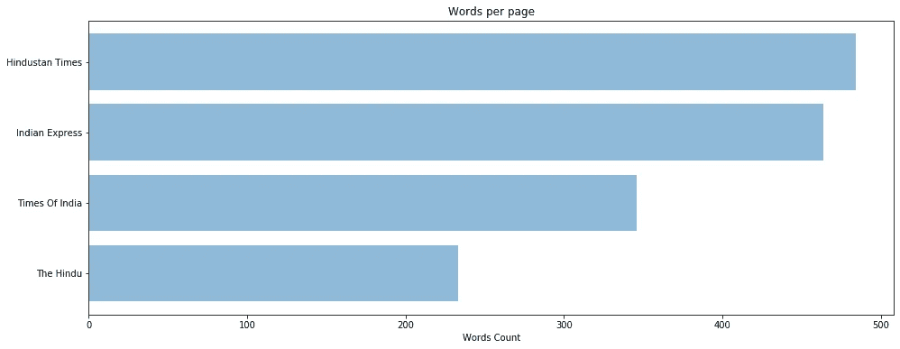
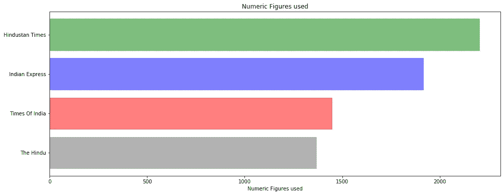
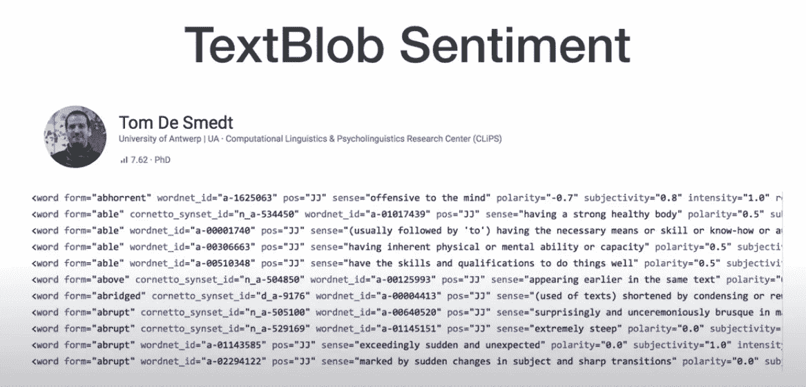
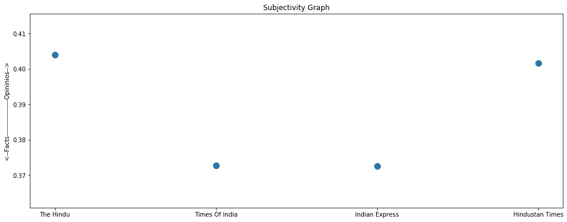
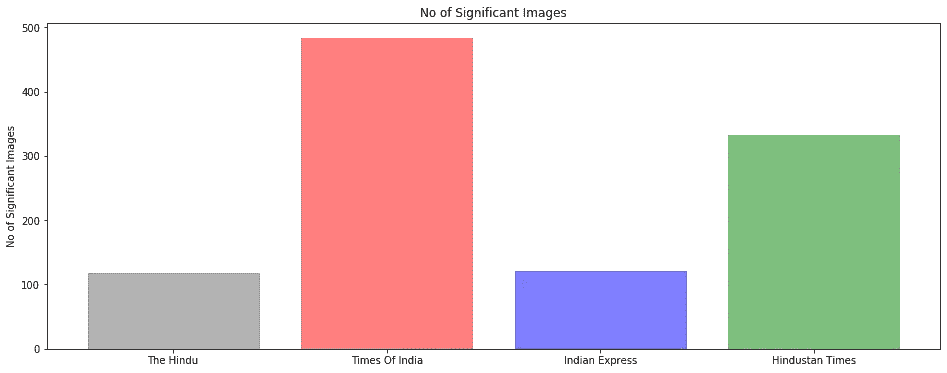

# 使用 Python 评估英文报纸词汇、事实与观点(情感分析)的自然语言处理

> 原文：<https://medium.com/analytics-vidhya/natural-language-processing-to-evaluate-english-newspapers-for-vocab-facts-vs-opinions-ebe9cb30942d?source=collection_archive---------17----------------------->

> 文本解析(docx2txt)、标记化、词干化、探索性数据分析、基于规则的情感分析、图像提取。


自然语言处理；图片来源[MediaUpdate.co.za](https://www.mediaupdate.co.za/media/142841/what-is-natural-language-processing)

考虑到手头的空闲时间，我不知道该看哪份报纸。对我来说，重点是提高我的词汇和事实。这就形成了初级的 ***问题陈述*** 为文章。

这篇文章是执行自然语言处理的基本方法，用于评估 2020 年 5 月 10 日出版的印度各地的一些知名英文报纸。

顾名思义，NLP 是一个研究成熟的、进化的人类口语的领域，如英语、印地语或汉语。

*我认为评估报纸内容的要点:*

*—每段的词汇或独特字数。
—每页的图像数，假设更多的图形&图像增加了放纵。
—事实 Vs 观点(情感分析—文本点)
—探索性数据分析:可视化中间结果，进一步清理和预处理文本。
—一般情况下提供的统计数据/数字*

NLP 包括一步一步地重复文本过滤和格式化，然后开始应用进一步的 DS 技术进行任何预测。

## **A 部分(数据收集)**

**第一步** *:* 从[这个网站](https://www.newspaperpdf.online/)积累报纸的电子版(pdf)并将其转换为 word *docx* 用于这四家报纸: *The Hindu，Times of India，Indian Express，Hindustan Times。*

**第二步**:使用 *docx2txt* python 库加载报纸文本和图片。

**第三步**:使用正则表达式获取报纸文本中的所有数字&小数。更多的数字。更多的统计数字。

## **B 部分(数据清理)**

**第一步**:所有单词小写

**第二步**:只取字母，去掉标点、逗号和其他字符，如括号、引号。

**第三步**:词干提取——将单词分解为词根，去掉前缀和后缀。例如:跑步→跑步；带来→带来。

**第四步**:删除停用词。停用词是那些不会给文章的上下文增加价值的词。例如' the '，' a '，' in '。

在这里，我们进行第一轮数据清理，并将数据保存在 *pickle 中。*

由于上述步骤有时会占用大量处理器资源，我们将结果保存为一个变量( *corpus.pkl* )，以便以后调用。

## **C 部分:创建文档术语矩阵**

从过滤出的文本中，我们创建文档术语矩阵，该矩阵记录每个唯一单词在所有输出文本中的出现次数。

```
cv = CountVectorizer(stop_words = ‘english’,ngram_range = (1,1) )
docTermMatrix = cv.fit_transform(corpus).toarray()
data_dtm = pd.DataFrame(docTermMatrix,columns = cv.get_feature_names())
data_dtm.index = pd.Index(newspapers)
data_dtm = data_dtm.transpose()
```

DTM 的转置对我们来说是这样的:



文档术语矩阵

## **D 部分:探索性数据分析**

**第一步**:这里我们看到有一些单字单词，比如:“eeeee”等。所以我们在 A 部分增加了一个步骤来清除这样的单词。



删除单字符单词

**第二步**:有了这样一个矩阵，找出每份报纸的前 30 个(最常出现的)单词就更容易了。然后检查这些报纸中的热门词汇，并查看所有报纸中常见的热门词汇。

既然这些词如此普遍，它们并没有给我们的 DTM 增加价值。我们通过将这些单词作为*停用词*添加到现有单词中来过滤掉它们。

```
# Checking out top 30 words for all newspapers
top_dict = {}
for c in data_dtm.columns:
 top = data_dtm[c].sort_values(ascending =False).head(30)
 top_dict[c] = list(zip(top.index,top.values))# checking top words collective in these and seeing top occurring words accross 
words = []
for newspaper in data_dtm.columns:
 top = [word for (word,count) in top_dict[newspaper]]
 for t in top:
 words.append(t)from collections import Counter 
Counter(words).most_common()
```

**第三步**:同样，有了一组新的停用词，我们更新了文档术语矩阵。

**第四步**:我们将 DTM 可视化为单词云，以查看最常出现的单词。


WordCloud

**第五步**:我们解析保存在“*\ NLP _ extract Images”*目录下的图像也有一些小的，比如线条和点状图像。我们发现，一般来说，对于当前的场景，超过 5 kb 的图像是有意义的。

## **E 部分:分析**

第一步:因为每份报纸的页数不同。我们得到了所有报纸的页数。



所有页面中唯一单词的总数

此外，我们检查每份报纸每页的独特字数，以创建一个情节:



每页的唯一字数

```
# Getting unique words / Vocabulary
unique_list = []
for newspaper in data_dtm.columns:
 uniques = data_dtm[newspaper].to_numpy().nonzero()[0].size
 unique_list.append(uniques)unique_words = pd.DataFrame(list(zip(newspapers,unique_list)),columns = [‘newspaper’,’unique_word’])
#unique_words= unique_words.sort_values(‘unique_word’,ascending = False)# Manually checked 
NoOfPages = [ [‘The Hindu’,22], [‘Times Of India’,18], [‘Indian Express’,18],[“Hindustan Times”,16] ]
NoOfPages = pd.DataFrame(NoOfPages, columns = [‘Newspaper’,’PageCount’])
NoOfPages = NoOfPages.transpose()# Unique words per page
WPP = []
for i,j in enumerate(NoOfPages):
 WPP.append( int(unique_words.unique_word[i] / NoOfPages[i].PageCount) )
```

**步骤二**:绘制文本中使用的数字。因为我们知道事实和数字让观众参与任何形式的媒体或演示。

```
file = open('stats.pkl', 'rb')
stats = pickle.load(file)
file.close()
statsLen = [len(li) for li in stats ]barlist = plt.barh(X, statsLen , align= 'center', alpha = 0.5)
barlist[0].set_color('0.4')
barlist[1].set_color('r')
barlist[2].set_color('b')
barlist[3].set_color('g')
plt.yticks(X,newspapers)
plt.xlabel('Numeric Figures used')
plt.title('Numeric Figures used')
plt.show()
```



每份报纸使用的数字

**步骤三**:使用文本块的情感分析

TextBlob 是基于规则的方法。所以要记住，它包含的所有英语单词的极性和主观性都是由语言学家“汤姆·德·斯梅特”手动标记的。因此，一个词在不同的上下文中可能有不同的意思。因此，一个词可以以不同的极性和主观性重复自己(如下图所示)。



courtsey:Alice Zhao(adashofdata)@[YouTube](https://www.youtube.com/watch?v=N9CT6Ggh0oE&t=263)

我们将每份报纸的主观性计算为:

```
from textblob import TextBlob
sentiment = []
for i in np.arange(4):
 sentiment.append(TextBlob(corpus[i]).subjectivity)plt.scatter(X,sentiment,linewidths=5)
plt.xticks(X,newspapers)
plt.ylabel(“←Facts — — — — — — — — -Opininios →”)
plt.title(“Subjectivity Graph”)
plt.show()
```



主观性情节

**第四步**:每份报纸使用的大尺寸图片数量。5 Kb 以上，如 EDA 中所述:

```
paths = [ BasePath + “\\TH\\”, BasePath + “\\TOI\\” , BasePath + “\\IE\\”, BasePath + “\\HT\\” ]
for path in paths:
  os.scandir(path)
  counter = 0 
  for entry in os.scandir(path):
      size = entry.stat().st_size
      if size > 5000 :
          counter += 1
  imagesCount.append(counter)barlist = plt.bar(X, imagesCount , align= ‘center’, alpha = 0.5)
barlist[0].set_color(‘0.4’)
barlist[1].set_color(‘r’)
barlist[2].set_color(‘b’)
barlist[3].set_color(‘g’)
plt.xticks(X,newspapers)
plt.ylabel(‘No of Significant Images’)
plt.title(‘No of Significant Images’)
plt.show()
```



使用的重要图像数量

前往我的 [github](https://gist.github.com/getgimphed/e46082cabc1434d793f4889e4a5b7ac9) 集体编译代码。

## **结论**

我最初的意图是挑选一本有助于提高我的词汇和知识的读物。上面的锻炼给了我一个很好的准备。#StayHomeStaySafe

P.S .文章纯属学术兴趣 ***非*** 比较各自的“印刷媒体品牌”。