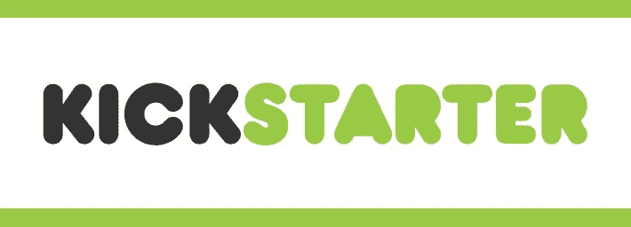
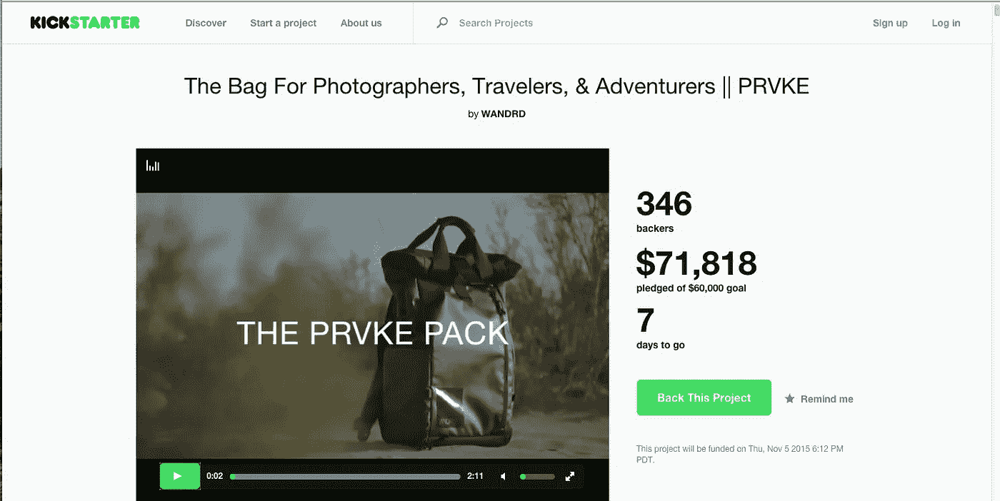
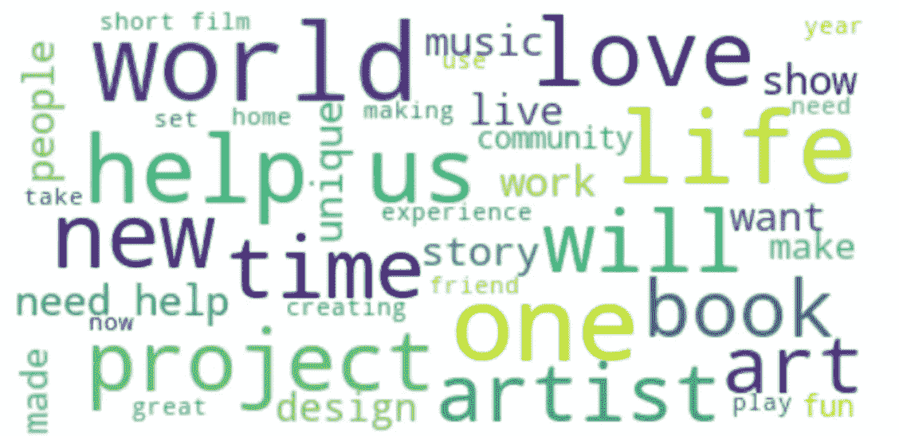

# 预测 Kickstarter 活动成功的自然语言处理(准确率 92%)

> 原文：<https://medium.com/analytics-vidhya/natural-language-processing-to-predict-success-of-kickstarter-campaigns-b0d7a0cc565a?source=collection_archive---------13----------------------->

**TL；这个项目旨在预测 Kickstarter 上可能成功的活动的高准确率。如果只考虑成功概率高于 90%的活动，则准确率达到 92%。**

**Kickstarter 简介**



来源:ICO 合作伙伴

Kickstarter 是一个全球众筹网站，为创业者提供了一个从公众那里为他们的项目筹集资金的平台。作为回报，投资者可能会对创业者的业务感兴趣，获得免费产品或其他经济回报。因此，Kickstarter 既服务于初露头角的创业者，也服务于投资者。问题是 Kickstarter 对每个项目收取 5%的平台费，并且对失败的项目有严格的不退款政策。

**商业问题**



来源:单反休息室

对投资者来说，投资失败导致资本损失的可能性无疑是高风险的。例如，一款来自热门 YouTuber 的游戏 Yogsadventure 在被取消之前筹集了 56.7 万美元！

此外，此类 Kickstarter 产品还有一些其他特征，这些特征存在高风险。首先，产品通常是新的和新颖的，并且没有经过成熟市场的测试。这使得评估产品是否会成功变得更加困难。

其次，这些创业者可能缺乏经验，缺乏创造和推出产品的必要技能。此外，这些初创企业通常规模较小，可能缺乏资金支持和人力。

最后，可能缺乏这类产品的信息和跟踪记录。因此，这里的投资者似乎承担了风险资本家的工作。

**攻击计划**


资料来源:123RF.com

在这个项目中，我扮演了 Kickstarter 产品的潜在保守投资者的角色，只投资成功可能性高的活动。我还使用了 2017 年以来 Kickstarter 活动的历史成功和失败的数据集，你可以在这里访问。

该数据集包含 215，000 个描述以及活动是否成功，其中 50%成功，反之亦然。

作为投资者，我只关心投资那些最有可能成功的项目。此外，鉴于 Kickstarter 上的项目数量众多，投资者可以选择的成功几率很高的活动会多得多！

因此，我认为更重要的评估标准应该是模型的精确度。也就是说，在模型预测会成功的项目中，有多少是真正成功的。

**第 1 部分:数据预处理**

首先，我们将数据集读入 Python，并删除任何缺失的值。与其他数据集相比，我们不能在这里估算缺失值，因为每个产品都是不同的，并且这里只有一个用于预测的要素。

其次，如果活动成功，我们还提供标签“1”，如果不成功，则提供“0”。但在此之前，我们还可以返回“state”列中的所有唯一值，以检查是否只有单词“successful”和“failed”被用作标签。

接下来，我们可以预处理文本描述。我们首先删除所有非字母字符，然后将单词转换成小写。这里，我们假设非字符单词，如数字和标点符号，在预测中起最小的作用。将单词转换成小写也有助于文本的标准化。

然后，这些单词也被词干化成它们的词根，停用词也被删除。停用词是句子结构中必不可少的词，但不会给句子提供太多必要的意义，如“the”、“its”和“to”。

这种文本预处理的一个关键目的是减少不必要的单词。例如，通过将单词“liking”转化为词根“like ”,我们减少了描述语料库中独特单词的数量。同样的逻辑也适用于我们为什么删除停用词和非字母字符。

**第二部分:创建单词袋模型**

```
from sklearn.feature_extraction.text import CountVectorizer
cv=CountVectorizer(max_features=2500) #Keep top 2500 most frequently used words
X=cv.fit_transform(corpus).toarray() #Develop a sparse matrix for every word
y=dataset.iloc[0:len(dataset[‘blurb’]),3].values
```

之后，一个单词袋模型被创建。基本上，描述将被转换成一个大的稀疏矩阵，行代表每个观察(活动)，列代表在我们整个描述语料库中出现的每个唯一的单词。如果某个单词出现在特定的描述中，则该列将返回值“1”


*来源:自由代码营*

比如，我们把“狗在桌子上”这个描述作为我们第一次观察的描述。图像中的数字代表我们的单词袋模型的第一行。我们可以看到，如果一个特定的单词出现在我们的描述中，返回值为 1，否则为 0。

然而，我们创建的模型应该有比这更多的列，因为我们在所有的描述中有成千上万个独特的单词。因此，为了简化模型，我们的单词包模型只考虑最常用的前 2500 个单词。鉴于超过 200，000 种不同的活动描述，2，500 字似乎太少了。然而，经过大量实验，使用超过 2500 个单词几乎没有什么区别。

在这个阶段，我们还可以使用单词云来可视化数据集中最常用的单词。

```
# Word Cloudfrom wordcloud import WordCloud 
import matplotlib.pyplot as plt
text=""
for i in range(len(dataset.blurb)):
    if i==44343 or i==62766 or i==97999:
        continue
    text=text+str(dataset.blurb[i])

wordcloud = WordCloud(max_font_size=50, max_words=40,background_color="white").generate(text.lower())
plt.figure(figsize=(12,5))
plt.imshow(wordcloud, interpolation='bilinear')
plt.axis("off")
plt.show()
```



描述的文字云

**第 3 部分:装配我们的分类器**

```
# Splitting the dataset into the Training set and Test set
from sklearn.model_selection import train_test_split
X_train, X_test, y_train, y_test = train_test_split(X, y, test_size = 0.20, random_state = 0)# Fitting Logistic Regression to the Training setfrom sklearn.linear_model import LogisticRegression
classifier = LogisticRegression(random_state = 0)
classifier.fit(X_train, y_train)
```

最后，我们将数据分为训练集和测试集，测试规模为 20%，训练规模为 80%。然后拟合逻辑回归模型。

**第四部分:模型结果**

```
# Predictions
pred=classifier.predict_proba(X_test)[:,1]
pred=pred>0.9
pred=pred.astype(int)
from sklearn.metrics import confusion_matrix
cm = confusion_matrix(y_test, pred)
precision=cm[1,1]/(cm[0,1]+cm[1,1])
print("Precision is "+precision)
```

最后，我们使用我们的模型来执行我们的预测。如前所述，我只选择查看预测概率超过 90%的项目，如果满足此条件，则返回值 1。

这里，达到了 92%的精确度，这意味着这些被预测有超过 90%的成功概率的项目中的 92%最终都成功了。作为一个投资者，我会对这样的结果非常满意！

此外，在超过 40，000 个测试观察中，有近 1，500 个被预测有超过 90%的成功概率。这表明在 200，000 个(原始数据集)项目中，7，500 个项目有很高的成功几率。我相信在这么多可供选择的项目中，你会找到一些你感兴趣并愿意资助的项目:)

**第 5 部分:尝试过的其他方法**


来源:哥伦比亚广播公司新闻

尽管模型很简单，但我实际上已经尝试了更复杂的方法。例如，我尝试通过单词袋模型运行神经网络。我还试图使用 Word2vec 通过手套数据将单词转换为向量，然后通过它运行神经网络。我甚至试图通过基于描述的 K-Means 聚类来对观察结果进行聚类，以获得更好的结果。降维技术做得并不好。

尽管这些模型变得更加复杂，并声称对文本有效，但它们无法击败简单对数回归的准确性。事实上，这样的模型需要更长的处理时间。

**第六部分:进一步研究/改进**

我相信这个模型还可以进一步改进。双向 RNNs 可能在这类文本分类问题上表现得更好，我也计划很快探索这种替代方法。

碰巧的是，我还发现仅使用数据集中的前 20，000 个观察值就能产生更好的准确性。这似乎表明数据集中存在特定的聚类，这是直观的，考虑到产品可能已按不同的产品类型进行了分类。遗憾的是，这种分类在数据中找不到。

**总结……**

在这篇文章中，我通过 Kickstarter 的描述做了一个简单的 NLP 预测。我试图保持这篇文章的简洁，所以如果语气听起来有点冷，或者如果需要更多的阐述，我道歉。

在任何情况下，我都希望听到反馈，所以请你的意见:)

**参考文献**

[机器学习 A-Z:数据科学中的动手 Python&R](https://www.udemy.com/course/machinelearning/#instructor-3)作者[基里尔·叶列缅科](https://www.udemy.com/user/kirilleremenko/)、[哈德琳·德·庞特维斯](https://www.udemy.com/user/hadelin-de-ponteves/) & [SuperDataScience 团队](https://www.udemy.com/user/superdatascience-team/)