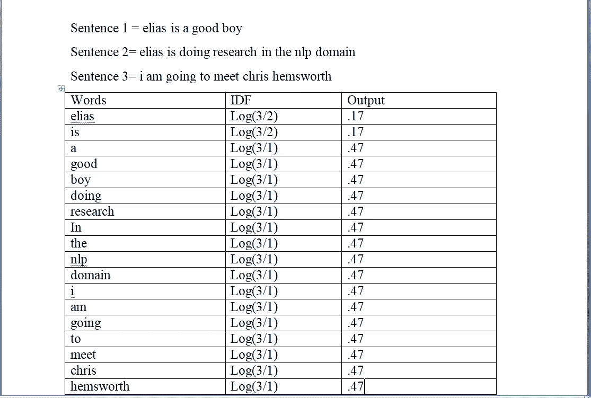

# 自然语言处理:走向人工智能

> 原文：<https://medium.com/analytics-vidhya/natural-language-processing-towards-artificial-intelligence-152d361af23?source=collection_archive---------26----------------------->

当你想到自然语言处理(NLP)时，你的脑海中可能会出现许多问题，例如，如何开始，或者 NLP 背后的步骤是什么。虽然我已经阅读了大量的文章，但我很难理解它背后的步骤，所以我试图在这篇文章中写点东西来强调 NLP 的基本概念。在本文中，您将了解自然语言处理背后的步骤，以及如何使用基于 NLP 的算法将文本数据转换为数字表示。

那么，让我们开始吧

***关于自然语言处理***

在开始迈向 NLP 之前，你需要对它有一些基本的了解，这可能比走向实际的实现更有益。嗯，作为人类，我们通常用语言来表达我们的感情、想法或其他东西。想象一台不能识别人的语言的计算机，而这台计算机是由它的语言或机器的语言驱动的。 ***所以，NLP 的一个简单定义就是*** 通过各种方法将计算机转化为智能来理解人类语言的过程。

***自然语言处理的应用***

在我们的现代生活中，自然语言处理无处不在，尤其是在计算机科学领域。但是，垃圾邮件过滤、感官分析、问答、情感分析、文本分类、段落识别、拼写检查、机器翻译等。在自然语言处理领域已经完成了大量的研究。目前，各公司正在使用情感分析来了解在线意见和客户反馈。例如，我们提供各种产品的反馈，尤其是在网上购物时。不可能在成千上万的评论或评论中识别观点，这就是为什么情感分析在许多组织中被使用。它通常用于识别客户反馈，负面的、正面的或他们对产品的看法，帮助公司了解用户想要哪个产品，不想要哪个产品。

***文本处理***

最具挑战性的部分是人类语言处理，因为它是如此复杂，此外，技术已经提出了所有伟大的算法以及一些编程语言，使我们的生活变得更容易。Python 是自然语言处理中最值得推荐的编程语言。在开始技术实现之前，你必须知道一些文本可视化的算法。假设你有一些文本数据，如果你把这些数据交给机器学习模型，机器就不会理解你的数据，因为机器学习只接受数值。所以我们需要将文本数据转换成数值的形式。我们如何将文本数据转换成数字表示？是的，一些不可思议的算法给了我们这些优势，举个例子，单词袋(BOW)，词频逆文档(TF-IDF)，word2vec 等等。现在我将描述用于数值表示的 TF-IDF 算法。让我们总结一下

假设以下数据是您的样本语料库:

伊利亚是个好孩子

**句子 2:** Elias 正在做自然语言处理领域的研究

**第三句:**我要去见克里斯·海姆斯沃斯

> ***步骤 01:将每个句子转换成更小的格***
> 
> **第一步**要求把每个句子转换成一个更小的格。在某些情况下可能会有例外，例如，美国、美国、英国、印度、孟加拉国等。在那种情况下，我们和我们并不等同。国家名称必须以大写字母开头，所以如果你把它转换成小写，那么可能是一个例外。你可以做的是把特殊的单词放在一个单独的列表中，然后你可以保留这些特殊的单词，剩下的单词你可以在句子中去掉。

**将每个句子转换成较小的格后:**

句子 1 输出:伊利亚是个好孩子

句子 2 输出:elias 正在 nlp 领域做研究

句子 3 输出:我要去见克里斯·海姆斯沃斯

> ***步骤 02:对句子进行分词***
> 
> **在这一步，**需要把每个句子分词成不同的单词。它是将字符串、文本标记化或拆分成标记列表的过程。我们可以把记号看作是组成部分，就像单词是句子中的记号，句子是段落中的记号一样。对句子进行分词后，你就会得到如图 1 所示的例句

**图 1 .对句子进行标记**

> ***步骤 03:使用词干化或词汇化***
> 
> **下一步**是利用词干化或词汇化。在这种情况下，我们不需要这样做，因为我们的数据集由三个句子组成，但在现实生活中，您必须使用该技术。同样，如果你想找出一个句子中可能的意思，也就是说，消极的，积极的，那么你不需要找出句子的整体意思。在这种情况下，你可以使用词干，因为它需要很少的时间来执行。另一方面，如果你想弄清楚每个句子的整体意思，你可以应用词汇化。参见下面的例子来理解词干化和词汇化的概念。这里我试着用另一个例子来解释。

示例:示例数据= "伊丽莎白女王二世被称为女王陛下"

使用词干后:→ **英国女王伊丽莎白二世称女王陛下**

**这里**有些东西是不被理解的，比如威严就变成了威严，称呼就变成了称呼。我使用这个相似的句子，通过词汇化技术得到的输出如下:

样本数据= "英国女王伊丽莎白二世被称为女王陛下"

应用词条化后:**英国女王伊丽莎白二世被称为陛下**

再比如，“*跑”、“跑”*、*“跑”*这些词都是“*跑”*这些词的形式，所以“*跑”*是前面所有词的引理。

> ***步骤 04:停用词***
> 
> 下一步是停用词。我们不需要所有的单词来找出相似之处或其他东西。所以我需要去掉一些不必要的词，比如“双关”、“分号”、“and”、“the”或“to”。不需要不需要的单词来处理文本，因为它会进一步减慢处理速度，所以使用停用词一方面会加快处理速度，另一方面也有利于文本的处理。
> 
> ***步骤 05: TF-IDF 直方图***
> 
> 在这一阶段，我们将创建一个直方图，因为首先我们需要看到每个单词在句子中出现了多少次。如果一个单词在每个单词中重复出现，我们就计数。图 2 显示了我们的样本数据集的直方图。

**图 2 .数据集的直方图**

> ***步骤 06:排序直方图***
> 
> 在这一步中，我们将对我们现在制作的直方图进行排序。我们将根据频率对直方图进行排序，例如，在一个句子中，出现次数较多且频率较高的词，我们将优先排列该词，而频率较低的词优先排列。最后，我们必须选择直方图中的最大频率值。由于我们得到了大约 18 个单词，我们将选择前 10 个最常用的单词。由于我们的数据集很小，我将尝试以这种方式显示它，而不采用最大值。

我们的文本清理任务已经完成，因此在这个阶段，我们将使用 TF-IDF 算法将文本转换为数值。机器学习不接受文本数据，所以我们需要把数据转换成机器语言。

> ***步骤 07:应用词频***
> 
> 在这一步中，我们将在直方图中应用词频。我们来看看词频(TF)的规律，以及如何才能达到目标。现在我们将创建一个词频矩阵表。

**词频→句中重复字数/句中字数。**

**图 3 .术语频率(TF)**

**解释:**

注意上面的表格。图 3 显示了 TF 的模拟。单词“elias”在句子 1 中出现过一次，总单词数是 5，所以它的 1/5 和句子 2 中的 1/8 是一样的。但是单词“elias”不在第三句中，所以给了零分。一切都是以同样的方式完成的。

> ***步骤 08:应用逆文档频率(IDF)***
> 
> 在这一步中，我们将应用逆文档频率。让我们看看逆文档频率(IDF)的规则，以及如何实现我们的目标。

**逆文档频率(IDF) → log(句子数量/句子中重复单词的数量)。**

图 4 基本上显示了 IDF 的模拟。单词“elias”在句子中出现了两次，整个句子是 3，所以它被给定为 log(3/3 ),与 log(3/1)在句子 2 和 3 中被给定的方式相同。详细顺序如图 4 所示

**图 4 .逆文档频率(IDF)**

> ***步骤 09:应用词频-逆文档频率(TF-IDF)***
> 
> 在这一步中，我们将应用术语频率-逆文档频率(TF-IDF)。我们将展示总的组合。让我们看看如何实现我们的目标。

**TF-IDF= TF*IDF**

如果我们将我们在 tram 频率和逆文档频率中创建的矩阵表相乘，那么我们得到 TF-IDF。参见图 5。详细顺序和结果如图 5 所示

**图 5 .词频-逆文档频率(TF-IDF)**

> ***第十步:选择你的机器学习模型***
> 
> 我们的文本已经过处理，我们已经转换成数字表示。在这个阶段，如果你想使用机器学习，你必须选择一个机器学习模型，并通过拟合算法来训练处理后的数据，这将基本上实现我们的预期目标。

**结论**

总之，本文说明了自然语言处理(NLP)背后的步骤。通常，关于自然语言处理的算法有很多，本文采用了 TF-IDF 算法，因为它在日常工作中表现得更好。但是，本文涉及的要点如下:

*   首先，把每个句子转换成一个更小的格。
*   其次，对句子进行标记。
*   第三，使用词干化和词汇化，并应用停用词。
*   然后，制作了 TF-IDF 直方图
*   然后，对直方图进行排序
*   最后，应用术语频率-逆文档频率(TF-IDF)

如果有错误，就有修正错误的请求。

祝一切顺利，好运。

如果你想看我最近的更新和出版物，请关注我:

**研究门:**【https://www.researchgate.net/profile/Elias_Hossain7】T2

**Linkedin:**[**https:**//www . Linkedin . com/in/Elias-hoss ain-b 70678160/](https://www.linkedin.com/in/elias-hossain-b70678160/)