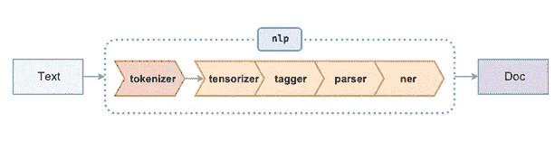
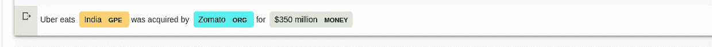
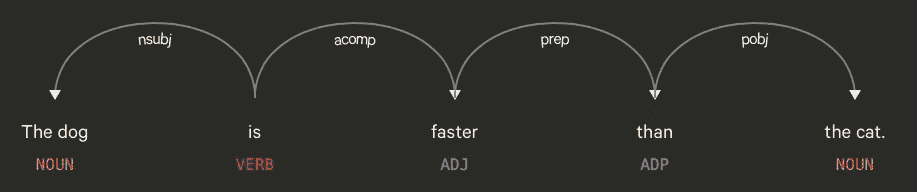

# 使用 Python 中的空间进行自然语言处理(第 1 部分)

> 原文：<https://medium.com/analytics-vidhya/natural-language-processing-using-spacy-in-python-part-1-ac1bc4ad2b9c?source=collection_archive---------2----------------------->


这篇博客文章向你简要介绍了 python 中用于 NLP 的 python 库空间。

这篇文章包括各种预处理和特征提取技术，使用 python 编写的开源 NLP 库 spaCy 和用于高级自然语言处理的 cython。

在将你的数据输入机器学习算法之前，我们需要处理数据，以便机器学习算法能够理解。

在直接进入 NLP 之前，重要的是要知道…..

# **什么是文本分析？**

文本分析是从文本中收集有用信息的技术。文本分析的目的是从自由文本内容中创建 ***结构化数据*** 。文本分析与文本挖掘、文本分析和信息提取 ***(IE)*** 等其他术语很接近。

**垃圾入，垃圾出(GIGO)**

GIGO 是处理机器学习的一个重要方面，在处理文本数据时更是如此。垃圾入，垃圾出意味着， ***如果我们的数据格式不佳，我们的结果很可能会很差*** *。*

更多的数据通常会导致更好的预测，但对于文本分析来说并不总是如此，因为更多的数据可能会导致无意义的结果。例如*停用词*，这些词通常会在应用文本分析之前从文本中移除。以类似的方式，我们删除文本主体中出现频率高的单词和只出现一两次的单词——这些单词很可能对文本分析没有用。

自然语言处理技术还可以帮助我们构造工具，这些工具可以帮助个人商业或企业，例如:聊天机器人在主要网站上越来越常见。这在很大程度上是由于**机器学习**的子领域，称为**深度** **学习**，在那里我们使用了受人类大脑结构启发的算法和结构。这些算法和结构被称为**神经** **网络**。

SpaCy 也是 python 中最快的 NLP 框架之一。

使用以下命令安装 spaCy:

> pip3 安装空间

# **斯帕西的语言模型**

spaCy 最有趣的特性之一是它的语言模型。语言模型是一个统计模型，让我们执行自然语言处理任务，如词性标注和 NER 标注。

使用以下方式下载这些模型:

> spacy 下载英语模型
> 
> spacy 下载德#德模型
> 
> spacy 下载 xx #多语言模型

为您的空间安装下载特定型号:

> python3 -m 空间下载

在 Python shell 中运行以下命令:

```
import spacy
nlp = spacy.load(‘en_core_web_sm’)doc = nlp('This is nlp with spaCy')
```

我们将使用 spaCy 的语言模型来帮助我们进行预处理。在进入预处理步骤之前，让我们了解一下当您运行以下命令时会发生什么:

```
doc = nlp('This is nlp with spaCy')
```

当您对文本调用 NLP 时，spaCy 首先对文本进行标记，以产生一个 **Doc** 对象。然后，Doc 在几个不同的步骤中被处理，我们也称之为流水线。



图默认管道

标记化是将句子分割成有意义的片段的任务，称为**标记**。这些片段可以是单词、标点符号、数字或其他构成句子的特殊字符。

SpaCy 的默认管道也执行基于规则的匹配。这用更多的信息注释了文本，并在预处理过程中增加了价值。

**预处理:**

有了 spaCy，停用词就容易识别了，每个令牌都有 IS_STOP 属性，让我们知道这个词是不是停用词。

我们可以将停用词添加到停用词列表中。

```
stop_words = ['say', 'said', 'it', 'an', 'none', 'all', 'saying']
for stopwords in stop_words:
  lexeme = nlp.vocab[stopwords]
  lexeme.is_stop = True
```

也可以使用以下方式添加停用词:

```
from spacy.lang.en.stop_words import STOP_WORDS
print(STOP_WORDS) # SpaCy's default stop words
STOP_WORDS.add("your_additional_stopwords_here")
```

如果你注意到*说，说，说*提供了相同的信息——除了语法上的不同，它不会影响结果。

词干化和词汇化是流行的技术。**词干**一般涉及去除后缀。但往往会产生无意义的文字。例如从**中去掉后缀懒惰**会导致**懒惰**，它不依赖于词性。另一方面，术语化有助于将单词转化为词根**。**

在 spacy 中，单词的词汇化形式是用。 ***引理 _*** 属性。

让我们检查句子“*全球紧急情况下的实时培训对于有效的准备和响应至关重要。*”:

```
doc = nlp(‘Real-time training during global emergencies is critical for effective preparedness and response. ‘)sentence = []for w in doc: # if it’s not a stop word or punctuation mark, add it to our     article! if w.text != ’n’ and not w.is_stop and not w.is_punct and not   w.like_num: # we add the lemmatized version of the word sentence.append(w.lemma_)print(sentence)
```

通过使用。is_stop，is_punct，和 **w.like_num** 属性，我们可以删除句子中我们不需要的部分。

输出将是:

```
['real', 'time', 'training', 'global', 'emergency', 'critical', 'effective', 'preparedness', 'response']
```

我们可以根据用例进一步删除或不删除单词。

## **向量化文本、转换和 n 元语法**

我们可以将 ***向量*** 视为一种将单词投射到数学空间的方式，同时保留这些单词所提供的信息。在机器学习中，这个特征被称为 ***特征向量*** ，因为每个值对应于一些用于进行预测的特征。

这些矢量表示的一些概念是…

**文字袋(蝴蝶结)**

这是将句子表示为向量的一种直接形式。例如:

```
P1: “The dog sat near the door.”
P2: ”The bird likes grains.”
```

按照上面提到的相同预处理步骤，上面的句子变成:

```
P1: “dog sat near door.”P2: “birds like grains.”
```

词汇向量是句子中唯一的单词。

```
vocab = [‘dog’, ‘sat’, ‘near’, ‘door’, ‘birds', 'like', 'grains']
```

我们可以考虑将词汇表中的每个单词映射成一个数字。

**BOW** 模型使用词频来构造向量。现在我们的句子看起来像..

```
P1: [1, 1, 1, 1, 0, 0, 0]
P2: [0, 0, 0, 0, 1, 1, 1]
```

在第一句中，单词*狗*出现 1 次，单词*鸟*出现 0 次，以此类推。

# TF-IDF

***词频*和*逆文档词频*** 主要用于搜索引擎根据查询找到相关文档。想象你有一个搜索引擎，有人在寻找 *Ronoldo* 。结果将按相关性顺序显示。最相关的体育文章的排名会更高，因为 TF-IDF 给了单词 *Ronoldo* 更高的分数。

```
TF(t) = (number of times term t appears in a document) / (total    number of terms in the document)IDF(t) = log_e (total number of documents / number of documents with term t in it)
```

TF_IDF 就是 TF 和 IDF 这两个因子的乘积。

TF_IDF 使罕见的单词更突出，并忽略常见的单词，如 is、or、an，这些单词可能出现很多次，但可能不太突出。

**N-grams**

n 元语法是文本中 n 个元素的相邻序列。

二元语法是最流行的 n 元语法之一。在对你的语料库运行二元模型之前，移除停用词是必要的，否则可能会形成无意义的二元模型**。**

**例如:机器学习、人工智能、新德里、数据分析、大数据可能是由二元语法创造的词对。**

**如果你想了解更多关于 n-grams 的知识，请参考链接( [ngrams](https://en.wikipedia.org/wiki/N-gram) )。**

# ****位置标记****

**词性标注是在文本输入中用适当的词性标注单词的过程。**

****带空格的位置标记****

**这是载入管道的核心特性之一。**

```
import spacy
nlp = spacy.load('en_core_web_sm')sent1 = nlp('Washing your hands with soap and water or using alcohol-based hand rub kills viruses that may be on your hands.')sent2 = nlp('Antibiotics do not help, as they do not work against viruses.')sent3 = nlp(u'Marie took out her rather suspicious and fishy cat to gofish for fish.')for token in sent2:
  print(token.text, token.pos_, token.tag_)
```

**输出:**

```
Antibiotics NOUN NNS
do AUX VBP 
not PART RB 
help VERB VB 
, PUNCT , 
as SCONJ IN 
they PRON PRP 
do AUX VBP 
not PART RB 
work VERB VB 
against ADP IN 
viruses NOUN NNS 
. PUNCT .
```

**正如你所看到的，这些单词被标注了适当的词性。**

**重要的一点是，根据上下文，有些词既可以是名词也可以是动词。请尝试用一个词在一个句子中充当名词，在另一个句子中充当动词的句子，并检查它们是否标有适当的词性。比如说。玛丽拿出她那只相当可疑的猫去抓鱼。**

**如果你想训练自己的贴牌员，请点击下面的链接。**

**[**训练空间的统计模型**](https://spacy.io/usage/training) **。****

# ****NER 标签****

**NER 是命名实体识别。命名实体是具有适当名称的真实世界对象——例如印度、Sunil Chetri、谷歌，这里印度是一个国家，被标识为 **GPE** (地缘政治实体)，Sunil Chetri 是 **PER** (人)，谷歌是 **ORG** (组织)。**

**这个过程包括从文本块中找到命名的实体(人、地点、组织等),并将它们分类到预定义的类别集中。**

**SpaCy 本身提供了某些预定义的实体集合。NER 标记不是最终结果，它最终有助于进一步的任务。**

**新德里是印度的首都。New 塔格会承认新德里是印度的一部分，GPE 也是印度的一部分。命名实体可以根据上下文而有所不同。**

```
import spacy
nlp = spacy.load('en_core_web_sm')
sentence = 'Uber eats India was acquired by Zomato for $350 million'doc = nlp(sentence)for token in doc:
  print(token.text, token.ent_type_)
```

**输出:**

```
Uber
eats
India GPE
was
acquired
by
Zomato ORG
for
$ MONEY
350 MONEY
million MONEY
```

**对于那些没有被识别为命名实体的单词，返回一个空字符串。例如，在上面的输出中， *eats，acquired* dosent 引用特定的实体。**

**我们可以使用 displaCy 来可视化我们的文本，**

```
displacy.render(doc, style = "ent",jupyter = True)
```

****

**图 5 显示词类标签**

# ****依存解析****

***解析*可以理解为对一个句子进行分析或者分解句子以了解句子结构的一种方式。NLP 中的解析是通过基于底层语法分析组成文本的单词来确定文本的句法结构。**

**顾名思义 ***依存解析*** 是指通过句子中词与词之间的依存关系来理解句子的结构。当对一个句子进行依存分析时，它会给我们一个句子中单词之间关系的信息。**

**分析器把一个句子分成一个主语和一个宾语，宾语是名词短语和动词短语。依存解析器认为动词是句子的中心，所有的依存关系都是围绕它建立的。**

**这只狗比这只猫跑得快。**

****

**图 1 .可视化依存句法分析**

**狗是名词短语，标记为 *nsubj* ，表示句子的主语。 *Acomp* 意为形容词补语，表示是修饰形容词或给形容词增加意义的短语。*比*的词是介词，这里 pobj 代表前置的宾语，也就是*猫*。**

```
from spacy import displacy
nlp = spacy.load(‘en_core_web_sm’)
doc = nlp(u”displaCy uses JavaScript, SVG and CSS.”)
spacy.displacy.serve(doc, style=’dep’)
```

**上面的代码将运行一个 web 服务器。你可以在浏览器中运行 [http://127.0.0.1:5000](http://127.0.0.1:5000) 来查看可视化效果。**

****结论:****

**这篇博客简要介绍了基本的预处理技术和特征提取技术，如自然语言处理流水线中的 BOW、TF_IDF、n-grams、词性标注、NER 标注和依存句法分析。博客的下一部分将包含主题建模、文本摘要、聚类和各种单词嵌入技术。**

# **参考资料:**

**-> [空间文件](https://spacy.io/usage/processing-pipelines/):**

**->博客的某些部分参考了 Barghav Srinivasa Desikan 的《自然语言处理和计算语言学》一书。**

**— — — — ***谢谢*** — — — — — —**