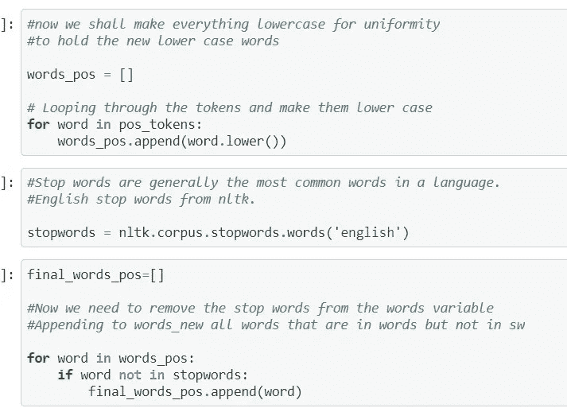
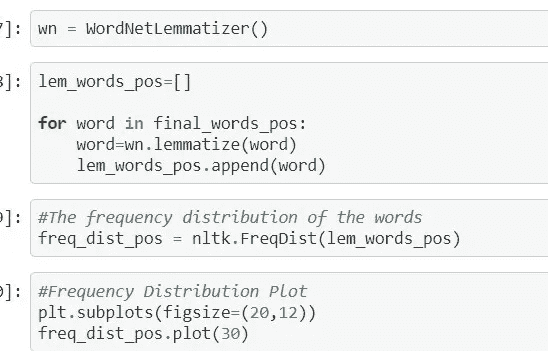
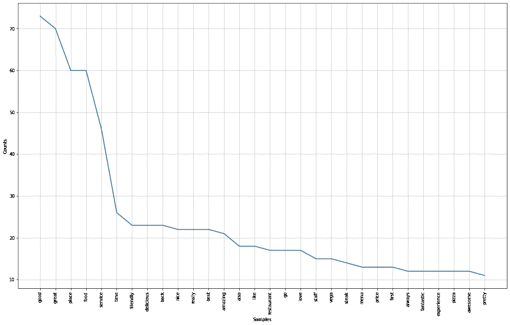

# 餐馆评论的自然语言处理(上)

> 原文：<https://medium.com/analytics-vidhya/natural-language-processing-with-restaurant-reviews-part-1-46e228585a32?source=collection_archive---------3----------------------->

如今，每个人似乎都在谈论机器学习，每个人似乎都想成为数据科学家。但人们所知道的只是与 Sklearn 合作导入几个库。似乎很少有人关心实际的数据科学管道、业务需求和问题的范围。


如今的“数据科学”。

## 那么什么是 NLP 呢？

根据维基的说法，

自然语言处理(NLP)是语言学、计算机科学和人工智能的一个分支，涉及计算机和人类语言之间的交互，特别是如何对计算机进行编程以处理和分析大量自然语言数据

目前，NLP 有各种各样的实际应用。这些天产生了大量的文本数据。所有这些数据如果正确地用于分析，都可以用于实现业务目标。我们根据餐馆评论收集了一些数据。


数据概述

数据是一个. tsv 文件。它有顾客给出的评论和一个标签，0 代表顾客不喜欢食物，1 代表顾客喜欢食物。这些数据包含大量信息，如果使用得当，可以洞察评论和客户心态。

```
**import** **nltk
import** **pandas** **as** **pd** 
**import** **re** **import** **string
from** **nltk.stem** **import** WordNetLemmatizer  
**import** **seaborn** **as** **sns** 
**import** **matplotlib.pyplot** **as** **plt** 
**from** **wordcloud** **import** WordCloud 
**import** **re** 
**import** **nltk** **from** **nltk.sentiment.vader** 
**import** SentimentIntensityAnalyzer  
**from** **nltk.stem** **import** WordNetLemmatizer   

%matplotlib inline
```

任务所需的所有导入和库。


读取数据。

然后，我们读取数据，根据标签，我们将文本分为正面和负面评论。我们现在有了作为文本 blob 的所有正面和负面评论。


写积极的评论。

接下来，在积极的评论上，我们去掉标点符号，因为要处理文本数据，最好的做法是去掉标点符号。使用分词器，我们将文本拆分成单词(分词)。



下一步。

类似地，在 NLP 中，将文本数据转换成小写也是统一性的一个很好的实践。然后我们去掉停用词，停用词是语言中最常见的词。在计算中，在处理自然语言数据之前或之后，停用词被过滤掉。

**停用词示例-**

一个，of，on，I，the，with，so，等等



引理化和频率分布。

接下来我们对单词进行词条化，要了解更多关于词干化和词条化的知识，请阅读-

[](https://nlp.stanford.edu/IR-book/html/htmledition/stemming-and-lemmatization-1.html) [## 词干化和词汇化

### 下一步:更快发布列表交叉向上:确定以前的词汇:其他语言。的目录索引

nlp.stanford.edu](https://nlp.stanford.edu/IR-book/html/htmledition/stemming-and-lemmatization-1.html) 

两者都是自然语言处理的重要组成部分，各有各的好处和需求。



正面评论词的频率分布。

阳性词的频率分布给了我们这个结果。正如我们所看到的，大部分词语都是积极向上的，表现出良好的本性。


WordCloud 一代。

接下来，我们生成一个单词云，它给出了一个关于单词的很好的概念。


正面评论的 word cloud(100 字)。

生成的 wordcloud 给出了这个输出。同样，在这里我们可以看到，主要是积极的话和暗示良好服务的话。词云和词频图是分析文本和理解用户情绪的好方法。处理文本数据很有趣，就好像在讲故事一样。仅仅将 NLTK 方法应用于文本数据并不构成 NLP。NLP 就多了，我们经常要跳出框框去思考，去理解我们的方式，去解决问题。

在那之后，以类似的方式处理负面评论让他们产生了洞察力。对文本数据的分析已经完成。

有关该项目的完整代码，请参见-

[](https://github.com/prateekmaj21/Restaurant-Reviews-NLP-Project) [## prateekma 21/餐厅-评论-NLP-项目

### 一个基于餐馆评论的自然语言处理项目。GitHub 是超过 5000 万开发者的家园…

github.com](https://github.com/prateekmaj21/Restaurant-Reviews-NLP-Project) 

博客的第二部分-

[](https://prateekmaj21.medium.com/natural-language-processing-with-restaurant-reviews-part-2-ad240d1a7393) [## 餐馆评论的自然语言处理(下)

### 在本博客的第 1 部分，我们致力于分析和理解餐馆评论数据集。我们发现…

prateekmaj21.medium.com](https://prateekmaj21.medium.com/natural-language-processing-with-restaurant-reviews-part-2-ad240d1a7393) 

博客的第三部分-

[](/analytics-vidhya/natural-language-processing-with-restaurant-reviews-part-3-2e08da61b8e5) [## 餐馆评论的自然语言处理(第三部分)

### 到目前为止，在这个博客的前两部分，我们致力于数据的分析，并创造了机器…

medium.com](/analytics-vidhya/natural-language-processing-with-restaurant-reviews-part-3-2e08da61b8e5) 

**谢谢你。**