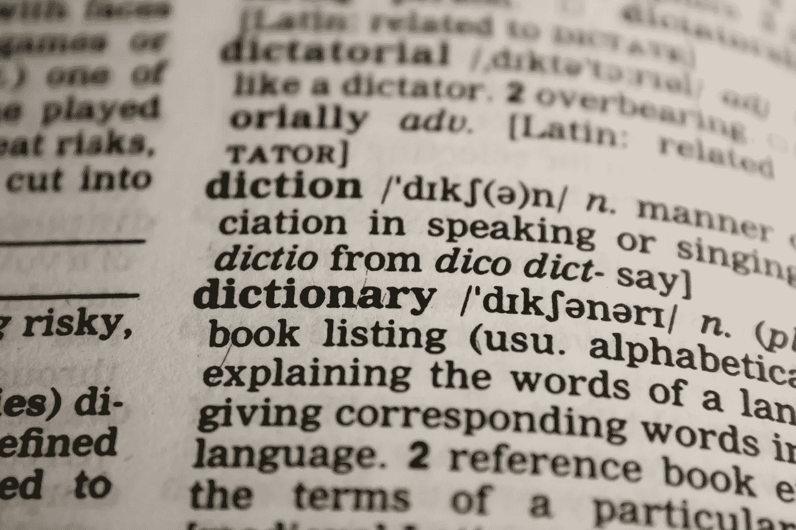
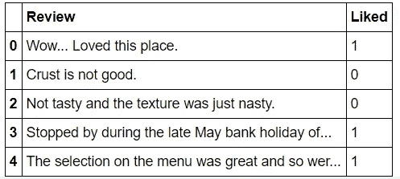
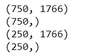
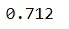
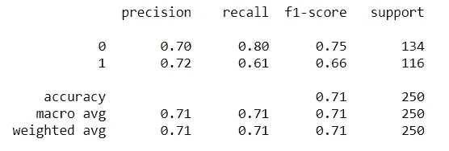

# 餐馆评论的自然语言处理(下)

> 原文：<https://medium.com/analytics-vidhya/natural-language-processing-with-restaurant-reviews-part-2-ad240d1a7393?source=collection_archive---------9----------------------->

在本博客的第 1 部分，我们致力于分析和理解餐馆评论数据集。我们发现，单词云和词频计算将带来有价值的见解。除此之外，我们还研究了基本的自然语言处理技术，比如去除标点符号、单词标记化、将文本转换成小写字母。还实现了一些重要的概念，如停用词的移除、词干提取和词汇化。

第一部分，请访问-

[](/analytics-vidhya/natural-language-processing-with-restaurant-reviews-part-1-46e228585a32) [## 餐馆评论的自然语言处理(上)

### 这些天每个人似乎都在谈论机器学习，每个人似乎都想成为数据…

medium.com](/analytics-vidhya/natural-language-processing-with-restaurant-reviews-part-1-46e228585a32) 

使用文本数据可能很有趣。

# 构建分类器

由于数据集包含正面和负面评论，现在我们将构建一个分类器，它能够将新的给定评论分类为正面或负面。分类是一个有监督的机器学习问题。它指定数据元素所属的类，最适合在输出具有有限值和离散值时使用。在这里，我们将指定什么类型的审查是积极的，什么类型的审查是消极的，什么类型的审查是积极的。所以让我们进入编码。

```
**import** **nltk** 
**import** **pandas** **as** **pd** 
**import** **re** 
**import** **string** 
**from** **nltk.stem** **import** WordNetLemmatizer
```

然后我们导入数据。

```
*# Reading the dataset* dataset = pd.read_csv('Restaurant_Reviews.tsv', delimiter = '**\t**', quoting = 3)
dataset.head()
```



最多 5 个条目的数据概览。

我将在最后提供 Github 上的数据文件和笔记本链接。

```
stopwords = nltk.corpus.stopwords.words('english')
lemmatizer = WordNetLemmatizer()
```

现在，我们将继续进行停用词删除和词条化。停用词是任何语言中最常见和重复的词。更多关于停用词和词汇化的信息，请访问我的博客 1。现在进行文本预处理。

```
*# Preprocessing* nltk.download('stopwords')
corpus = []
**for** i **in** range(0, 1000): #as the data as 1000 data points
    review = re.sub('[^a-zA-Z]', ' ', dataset['Review'][i])
    review = review.lower()
    review = review.split()
    review = [lemmatizer.lemmatize(word) **for** word **in** review **if** **not** word **in** set(stopwords)]
    review = ' '.join(review)
    corpus.append(review)
```

# **计数矢量化**

计数矢量化用于根据每个单词在整个文本中出现的频率(计数)将给定文本转换为矢量。有关计数矢量化技术的更多信息，请访问-

[](https://www.geeksforgeeks.org/using-countvectorizer-to-extracting-features-from-text/) [## 使用计数向量器从文本中提取特征

### CountVectorizer 是 Python 中的 scikit-learn 库提供的一个很棒的工具。它用于转换给定的文本…

www.geeksforgeeks.org](https://www.geeksforgeeks.org/using-countvectorizer-to-extracting-features-from-text/) 

```
**from** **sklearn.feature_extraction.text** **import** CountVectorizer
*# Creating the Bag of Words model* cv = CountVectorizer(max_features = 2000)*#the X and y* X = cv.fit_transform(corpus).toarray()
y = dataset.iloc[:, 1].values#X- data
#y- labels
```

现在，我们将把数据分成训练集和测试集。

```
**from** **sklearn.model_selection** **import** train_test_split
*# Splitting the dataset into the Training set and Test set* X_train, X_test, y_train, y_test = train_test_split(X, y, test_size = 0.25, random_state = 7)print(X_train.shape)
print(y_train.shape)
print(X_test.shape)
print(y_test.shape)
```



我们得到了形状。

现在，我们将数据输入随机森林分类器。有关随机森林分类器的更多信息，请访问-

[](https://scikit-learn.org/stable/modules/generated/sklearn.ensemble.RandomForestClassifier.html) [## 3.2.4.3.1.sk learn . ensemble . randomforestclassifier-sci kit-learn 0 . 23 . 2 文档

### class sk learn . ensemble . RandomForestClassifier(n _ estimators = 100，*，criterion='gini '，max_depth=None…

scikit-learn.org](https://scikit-learn.org/stable/modules/generated/sklearn.ensemble.RandomForestClassifier.html) 

```
**from** **sklearn.ensemble** **import** RandomForestClassifier
*# Random Forest* classifier = RandomForestClassifier(n_estimators = 10, criterion = 'entropy', random_state = 7)
classifier.fit(X_train, y_train)
y_pred = classifier.predict(X_test)
```

数据已经“适合”到模型中，并且使用测试数据集的预测也已经生成。现在可以查看准确性得分和分类报告。

```
**from** **sklearn.metrics** **import** accuracy_score
**from** **sklearn.metrics** **import** classification_reportaccuracy_score(y_test, y_pred)
```



输出。

我们得到 0.712 或 71.2%的分数，即分类器能够正确预测(在测试数据中)评论是正面还是负面的次数为 71.2%。值得注意的一点是，使用计数矢量化，许多事情取决于一个单词在评论中出现的频率。比方说，如果像“坏”、“最差”、“陈旧”这样的词以高数量出现在负面评论的训练数据中，并且样本测试数据也包含这些词，则模型将确定该评论是负面的。这是使用计数矢量器的基本思想。

我们现在，打印分类报告。

```
print(classification_report(y_test, y_pred))
```



分类报告。

这样，模型得到训练，我们也得到分类报告。博客的这一部分涉及机器学习管道。预处理、清理数据、完成 NLP 先决条件，最后将数据输入模型。

*博客的第三部分也是最后一部分，我们将进行一次预测测试，使用 pickle 保存模型，并创建一个小的 Python 应用程序来进行预测。*

项目代码及相关文件-

[](https://github.com/prateekmaj21/Restaurant-Reviews-NLP-Project) [## prateekma 21/餐厅-评论-NLP-项目

### 一个基于餐馆评论的自然语言处理项目。GitHub 是超过 5000 万开发人员的家园，他们在…

github.com](https://github.com/prateekmaj21/Restaurant-Reviews-NLP-Project) 

博客的第三部分-

[](/analytics-vidhya/natural-language-processing-with-restaurant-reviews-part-3-2e08da61b8e5) [## 餐馆评论的自然语言处理(第三部分)

### 到目前为止，在这个博客的前两部分，我们致力于数据的分析，并创造了机器…

medium.com](/analytics-vidhya/natural-language-processing-with-restaurant-reviews-part-3-2e08da61b8e5) 

# 谢谢你。