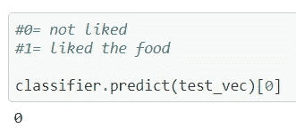
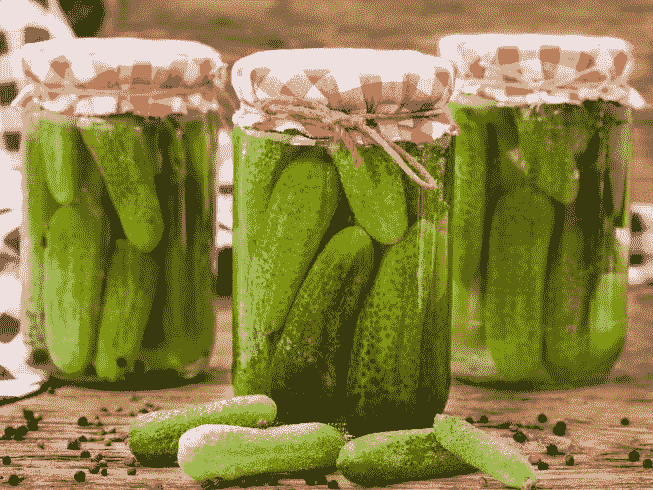
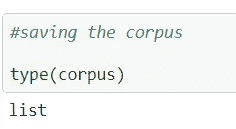

# 餐馆评论的自然语言处理(第三部分)

> 原文：<https://medium.com/analytics-vidhya/natural-language-processing-with-restaurant-reviews-part-3-2e08da61b8e5?source=collection_archive---------14----------------------->

到目前为止，在本博客的前两部分中，我们对数据进行了分析，并创建了机器学习分类器模型来预测给定的评论是正面还是负面。

链接到以前的部分-

[](/analytics-vidhya/natural-language-processing-with-restaurant-reviews-part-1-46e228585a32) [## 餐馆评论的自然语言处理(上)

### 这些天每个人似乎都在谈论机器学习，每个人似乎都想成为数据…

medium.com](/analytics-vidhya/natural-language-processing-with-restaurant-reviews-part-1-46e228585a32) [](/analytics-vidhya/natural-language-processing-with-restaurant-reviews-part-2-ad240d1a7393) [## 餐馆评论的自然语言处理(下)

### 在本博客的第 1 部分，我们致力于分析和理解餐馆评论数据集。我们发现…

medium.com](/analytics-vidhya/natural-language-processing-with-restaurant-reviews-part-2-ad240d1a7393) 

让我们从使用分类器做一个测试预测开始。

```
*#doing a test prediction* test = ["the food was not very good, it was very rotten and tasted bad"]

*#transforming for using on the model (using the count vectorizer)* test_vec = cv.transform(test)
*#0= not liked
#1= liked the food*classifier.predict(test_vec)[0]
```



输出。

输出给出了“0 ”,这是负面评论的类别。因此，我们可以理解模型运行良好。

# **使用 Pickle 保存模型和文本语料库**



现实生活中的泡菜:)

在现实生活中，泡菜是用来长时间储存食物和保存食物的。同样，在 Python **中，pickle** 可以用来将机器学习模型存储为文件以备后用。要阅读更多关于 Python 中 pickle 的内容，请访问-

[](https://www.tutorialspoint.com/python-pickling) [## 蟒蛇腌制

### Python pickle 模块用于序列化和反序列化 Python 对象结构。转换任何…的过程

www.tutorialspoint.com](https://www.tutorialspoint.com/python-pickling) 

继续进行的代码-

```
*#saving the model*
**import** **pickle**filename = 'reviews_classifier.sav'
pickle.dump(classifier, open(filename, 'wb'))
```

这将把分类器模型作为. sav 文件保存在 Jupyter 笔记本/Python IDE 的本地目录中。

现在我们还必须保存语料库以备后用。在语言学和 NLP 中，**语料库**(拉丁文字面意思为身体)指的是文本的集合。这里的语料库是所有评论的集合。我们将需要语料库能够为我们的模型使用计数矢量器。当我们使用一个新的输入时，它应该能够被输入到模型中。因此，计数矢量器将需要语料库。所以我们继续保存语料库。

```
*#saving the corpus*

type(corpus)
```



语料库实际上是一个列表。

```
**with** open('corpus.data', 'wb') **as** filehandle:     
*# store the data as binary data stream*     
    pickle.dump(corpus, filehandle)
```

所以我们也将**文集**保存为一个文件。它被保存为 **corpus.data** 。

# 创建一个. py 可执行文件来运行分类器

我们将从他们的文件中加载语料库和模型。

```
import pickle
from sklearn.feature_extraction.text import CountVectorizer#model filename
filename = 'reviews_classifier.sav'loaded_classifier = pickle.load(open(filename, 'rb'))cv = CountVectorizer(max_features = 2000)#loading the corpuswith open('corpus.data', 'rb') as filehandle:
    # read the data as binary data stream
    corpus = pickle.load(filehandle)
#fitting the count vectorizer with the corpus
cv.fit_transform(corpus)
```

现在我们将研究 python 代码，现在几乎所有的东西都是简单的 python 代码。

```
print("Welcome to the Restaurant Review analyser")
print("The output will be either positive or negative.")
print("A count vectorizer was used")
print("---------------------------------------------------")
user_input=input("Enter the review of the restaurant:  ")test = [user_input]
test_vec = cv.transform(test)val=loaded_classifier.predict(test_vec)[0]print("---------------------------------------------------")if(val==0):
    print("The review entered was negative.")    
    print("The user did not like the restaurant.")if(val==1):
    print("The review entered was positive.")
    print("The user liked the restaurant.")
```

如果执行该代码，用户可以选择用简单的英语输入评论，并输出评论是积极的还是消极的。这个项目是基本的自然语言处理技术的整体实现。

自然语言处理的主要目标之一是以一种聪明而有用的方式从人类语言中获取意义。更高级的应用包括文本摘要、主题提取、情感分析、关系提取等等。关注我，了解机器学习、数据科学、NLP 等等。

Github Repo 有所有的项目文件-

[](https://github.com/prateekmaj21/Restaurant-Reviews-NLP-Project) [## prateekma 21/餐厅-评论-NLP-项目

### 一个基于餐馆评论的自然语言处理项目。GitHub 是超过 5000 万开发人员的家园，他们在…

github.com](https://github.com/prateekmaj21/Restaurant-Reviews-NLP-Project) 

如果你喜欢这份工作，一定要给它一颗星。

**谢谢你。**