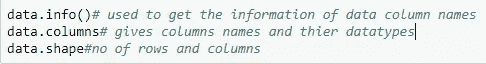

# 自然语言程序设计

> 原文：<https://medium.com/analytics-vidhya/natural-language-programming-5d885923cd4c?source=collection_archive---------22----------------------->

> 自然语言处理帮助机器阅读文本，模拟人类理解情感的能力
> 
> 它用于检测客户对产品或服务等的意见。

从上一篇博客中，我们了解了如何从亚马逊网站上删除客户评论数据。如果没有浏览我提到的博客，请点击下面的链接

[https://medium . com/@ nandamurideepya 135/scraping-Amazon-reviews-fc 13617 E0 ba 1](/@nandamuridedeepya135/scraping-amazon-reviews-fc13617e0ba1)

在这个博客中，我们学习如何从总体评论中理解正面和负面的评论。让我们看看过程

**第一步**:先安装库

**步骤 2** :导入数据集，检查包含的信息、列数和行数

我们需要通过删除不必要的东西来清理评论，比如 URL、多余的空格、表情符号、标点符号、停用词、词干词(比如 ing)以及通过用空格分隔单词来将大写字母转换成小写字母，因此我们编写了一个函数来声明所有这些因素。

***第四步*** :新建一列，用于保存已清理的评论。

**Step-5** :如果我们想从所有评论中观察到频繁出现的词，我们使用词云。

安装单词云

从图中我们可以看到，笔记本电脑，mac book pro，MS-office，价值，金钱，电池寿命，价格电池备份，重量轻是所有评论中使用频率最高的词。单词的大小取决于它们在评论中出现的频率。

**步骤 6** :删除文本之间的' \n '，并相应地连接文本

**步骤 7** :我们使用记号化将文本分解成更小的元素。

**第八步**:词干化是产生词根/基本词的形态变体的过程。以便提供有意义的审查见解。

**步骤 9** :我们使用 Gensim 和语料库为所有评论创建词典

**步骤 10** :识别我们需要安装库的文本评论的情绪。

**Step-11** :通过将所有评论作为句子发送，编写一个分析情感评分的函数。

> ***注:***

*   我们正在计算每个干净评论的复合分数，因为要分析情绪，我们需要评级。
*   但是提取的数据只包含评论，没有评级，所以遵循情感分析器分数和复合分数。

> ***Step-12*** *:比如让我们把一句话的感悟赋予为“* ***苹果笔记本电脑超级惊艳*** *”来检验感悟的得分。*

**步骤-13** :我们为所有清理后的评论定义一个函数，计算复合得分

**步骤-14** :为了划分文本的情感，我们对复合得分取一定的阈值。

我们以复合得分为参考，并指定某个阈值为 0.5，定义“得分> 0.5 为正面”，“得分<0.5 as Negative”, “Score=0.5 as Neutral”.

**步骤-15** :现在我们存储正面评价和负面评价

**第 16 步**:现在检查评论中的前 20 个正面和负面词汇。这不是强制性的只检查 20 个，你可以想检查多少就检查多少。但是我只拿 20 块

**步骤-17** :现在检查从正负和负正中移除的单词的值

**Step-18** :定义一个函数，检查所有前 20 个正负词的图形

**输出**:

**第 19 步**:我们对正面和负面评论进行二元语法和三元语法分析，以检查评论中有意义的见解。这在 unigram 中并不常见

在上面的代码中，如果我们改变“n”的值，

*   如果 n=1，那么它是一元文法
*   如果 n=2，那么它就是二元模型
*   如果 n=3，那么它是三元模型等等。

根据二元模型和三元模型绘制图表。

> ***注*** *:三卦图遵循相同的代码。*

**步骤 20:** 我们使用词云来查看清洗后的评论中最常出现的正面词和负面词。

将情绪改为消极的，以便发现消极的词语。

> ***注:*** *使用以上代码查找为负面评价。*

通过这种方式，我们将分析每一个顾客评论的情绪。🙂