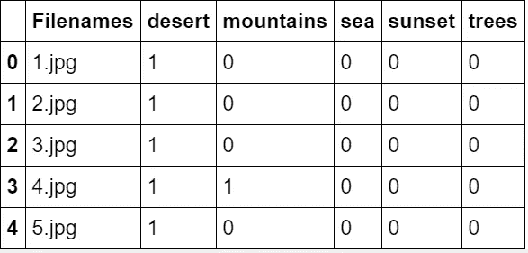
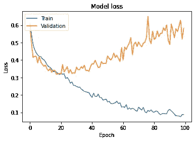
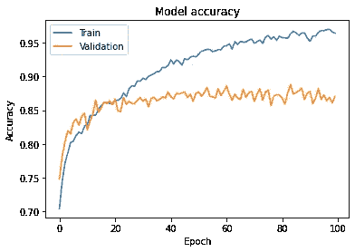
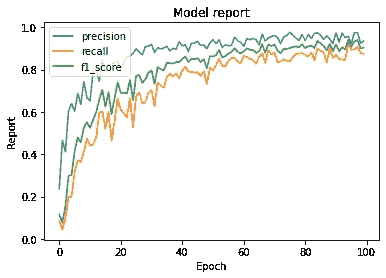
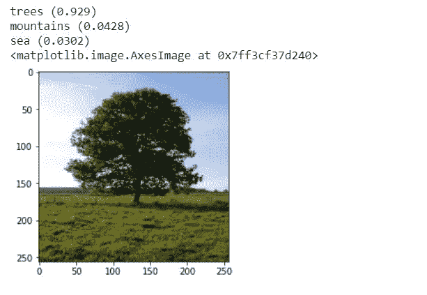
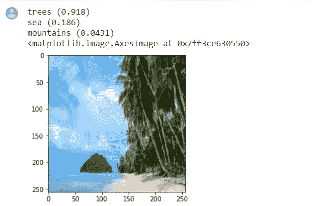
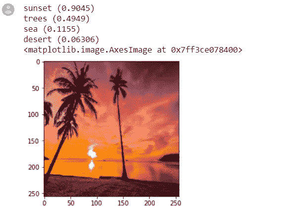

# 使用深度学习模型的自然风景检测-使用 Django 的全面部署(第 1 部分)

> 原文：<https://medium.com/analytics-vidhya/natural-scenery-detection-using-deep-learning-model-full-deployment-with-django-part-1-f0e4838c7198?source=collection_archive---------16----------------------->


为了识别风景，我将使用 Keras 和 Tensorflow。这只是一个初级水平的多标记图像识别方法。对于多标签图像，我们需要标记图像。有很多方法可以做到这一点，我只是通过 CSV 标记它们，这似乎是最简单的方法。我用 colab 来实现。首先，让我们进口所有必要的东西，

```
**import** **keras**
**from** **keras.models** **import** Sequential
**from** **keras.layers** **import** Dense, Dropout, Flatten
**from** **keras.layers** **import** Conv2D, MaxPooling2D
**from** **keras.utils** **import** to_categorical
**from** **keras.preprocessing** **import** image
**import** **numpy** **as** **np**
**import** **pandas** **as** **pd**
**import** **matplotlib.pyplot** **as** **plt**
**from** **sklearn.model_selection** **import** train_test_split
**from** **tqdm** **import** tqdm
%matplotlib inline
**import** **keras_metrics**
```

您可能对 keras_metrics 有问题，所以您应该通过“pip install Keras-metrics”来安装它。下一步是比较我们的 CSV 和我们现有的图像，我们必须让我们的模型识别图像，并将它们与我们标记的 CSV 文件进行比较。为此，我们必须将每个图像分别与 CSV 的每一行进行比较。为此，我们需要制作一个训练图像的空白列表，我们将在其中放置图像的数组，然后通过每行将其与 CSV 进行比较。让我们看看我们的 CSV 文件-

```
train = pd.read_csv("/content/drive/My Drive/miml_dataset/miml_labels_1.csv")
train_image = []
train.head()
```



```
**for** i **in** tqdm(range(train.shape[0])):
    img = image.load_img('/content/drive/My Drive/miml_dataset/images/'+train['Filenames'][i],target_size=(256,256,3))
    img = image.img_to_array(img)
    img = img/255
    train_image.append(img)
X = np.array(train_image)
```

在这里，tqdm 是一个进度条，用于笔记本中的嵌套循环。在我们使用 CNN 模型之前，我们最好删除文件名行。然后，我们将使用训练-测试拆分，将数据集拆分为 90%用于训练数据集，10%用于验证数据集。

```
y = np.array(train.drop(['Filenames'],axis=1)) X_train, X_test, y_train, y_test = train_test_split(X, y, random_state=42, test_size=0.1)
```

然后我们再定义一个简单的 CNN 模型，层数和参数都比较少。并按照我们之前提供的方法改变输入形状。您也可以根据自己的需要添加层和参数。之后，我们使用 fit 运行模型，就像我们使用数组一样。

```
model = Sequential()
model.add(Conv2D(filters=16, kernel_size=(5, 5), activation="relu", input_shape=(256,256,3)))
model.add(MaxPooling2D(pool_size=(2, 2)))
model.add(Dropout(0.25))
model.add(Conv2D(filters=32, kernel_size=(5, 5), activation='relu'))
model.add(MaxPooling2D(pool_size=(2, 2)))
model.add(Dropout(0.25))
model.add(Conv2D(filters=64, kernel_size=(5, 5), activation="relu"))
model.add(MaxPooling2D(pool_size=(2, 2)))
model.add(Dropout(0.25))
model.add(Conv2D(filters=64, kernel_size=(5, 5), activation='relu'))
model.add(MaxPooling2D(pool_size=(2, 2)))
model.add(Dropout(0.25))
model.add(Flatten())
model.add(Dense(128, activation='relu'))
model.add(Dropout(0.5))
model.add(Dense(64, activation='relu'))
model.add(Dropout(0.5))
model.add(Dense(5, activation='sigmoid'))
model.summary()
model.compile(optimizer='adam', loss='binary_crossentropy', metrics=['accuracy',keras_metrics.precision(), keras_metrics.recall(),keras_metrics.f1_score()])hist=model.fit(X_train, y_train, epochs=100, validation_data=(X_test, y_test), batch_size=64)
```

在第 100 个历元时，我们有一个相当好的精度，即 96%的训练精度和验证精度较低，但仍然看起来不错。现在，我们将绘制准确性、丢失率、精确度、召回率和 f1_score 来进行可视化。

```
plt.plot(hist.history['loss'])
plt.plot(hist.history['val_loss'])
plt.title('Model loss')
plt.ylabel('Loss')
plt.xlabel('Epoch')
plt.legend(['Train', 'Validation'], loc='upper left')
*#fig.savefig("Model loss.png")*
plt.show()
```



训练损失和验证损失

```
**import matplotlib.pyplot as plt**
plt.plot(hist.history['accuracy'])
plt.plot(hist.history['val_accuracy'])
plt.title('Model accuracy')
plt.ylabel('Accuracy')
plt.xlabel('Epoch')
plt.legend(['Train', 'Validation'], loc='upper left')
plt.show()
```



训练和测试准确性

```
plt.plot(hist.history['precision'])
plt.plot(hist.history['recall'])
plt.plot(hist.history['f1_score'])
plt.title('Model report')
plt.ylabel('Report')
plt.xlabel('Epoch')
plt.legend(['precision', 'recall','f1_score'], loc='upper left')
plt.show()
```



培训模型报告

之后，我们需要测试数据。为了测试，我们可以从谷歌上下载随机的风景图片。为了加载你的图像，你需要给出图像路径，并且你必须将目标尺寸改变为 256 的高度和 256 的宽度，否则，形状将会不匹配。然后把图像换成数组。就我而言，我已经从谷歌上随机下载了图片并进行测试。这里给出了一些例子。

```
img = image.load_img('/content/image1.jpg',target_size=(256,256,3))                       
img = image.img_to_array(img)                       
img = img/255
```

现在，我们将使用 model.predict 来预测图像。在这里，我们选择了前 3 类进行预测。你可以自己改。

```
classes = np.array(train.columns[3:])
proba = model.predict(img.reshape(1,256,256,3))
top_3 = np.argsort(proba[0])[:-4:-1]
**for** i **in** range(3):
    print("**{}**".format(classes[top_3[i]])+" (**{:.3}**)".format(proba[0][top_3[i]]))
plt.imshow(img)
```



```
img = image.load_img('/content/image2.jpg',target_size=(256,256,3))                       
img = image.img_to_array(img)                       
img = img/255classes = np.array(train.columns[3:])
proba = model.predict(img.reshape(1,256,256,3))
top_3 = np.argsort(proba[0])[:-4:-1]
**for** i **in** range(3):
    print("**{}**".format(classes[top_3[i]])+" (**{:.3}**)".format(proba[0][top_3[i]]))
plt.imshow(img)
```



```
img = image.load_img('/content/image3.jpg',target_size=(256,256,3))                       
img = image.img_to_array(img)                       
img = img/255classes = np.array(train.columns[3:])
proba = model.predict(img.reshape(1,256,256,3))
top_3 = np.argsort(proba[0])[:-5:-1]
**for** i **in** range(4):
    print("**{}**".format(classes[top_3[i]])+" (**{:.4}**)".format(proba[0][top_3[i]]))
plt.imshow(img)
```

在这里我选了 4 门课。有时模型在选择海洋或沙漠时可能是错误的。这是我面临的主要问题。除此之外，一切似乎都很好。



现在我们将保存模型。模型可以通过多种方式保存。这些是-

```
**import** **pickle**
**from** **sklearn.externals** **import** joblib
filename='Scene.pkl'
joblib.dump(model, filename)
model.save('scenery')
model.save('scenery.h5')
model.save_weights('scenery')
model.save_weights('scenery.h5')
```

最后，我们可以加载模型并从模型中预测图像。下一部分，我们将使用保存的模型预测图像，然后在 Django 网站应用程序中进行。