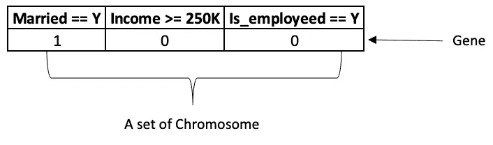
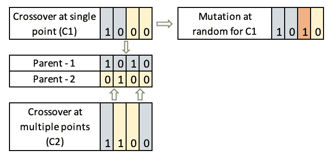

# 自然选择和自动化

> 原文：<https://medium.com/analytics-vidhya/natural-selection-and-automl-f9cb00d6a878?source=collection_archive---------37----------------------->

在处理任何数据科学问题(无论是回归问题还是分类问题)时，我们经常会在最终确定模型时遇到问题，例如这是否是最好的算法，参数是否得到了完美的调整，或者我是否可以在特征工程中更具创造性。坦率地说，改变管道的任何一个方面，都可能对找到最佳解决方案造成巨大的破坏。因此，如果你有足够的时间进行培训，我想把你的注意带到 python 中的 TPOT 库。这是一个个人的 python 数据科学助手，使用遗传算法处理上述令人头痛的问题。我们将首先了解什么是真正的遗传算法，然后我们将扩展我们对 TPOT 图书馆和一些常见的超参数的理解。

# 遗传算法

遗传算法(GAs)是一种元启发式算法，它捕捉了自然选择的过程，以找到优化问题的解决方案。该算法基于查尔斯·达尔文的适者生存理论，即物种如何在后代中创造后代。最健康的那部分人口最有可能在下一代生育后代。这种类比可用于在有约束和无约束的优化问题中获得最优解，其中手动寻找解可能具有挑战性。

# 算法简介

该算法可以用下面的方式来理解。我们首先初始化一个随机生成的候选人群体和一个适应度函数，该函数定量地确定一个候选人如何优于另一个候选人，并且所有的适应度被收集到一个池中。现在，从这个池中选择个体来创建新的候选人(新一代)，并且再次测试这些个体以确定最合适的候选人。这个过程被迭代地应用，直到已经经过了最大数量的代，或者达到了令人满意的群体适应度水平，或者创建的新一代是前几代的精确副本。在这里，我们必须注意到，收敛到全局极值是没有保证的。

# 主要特点:

1.  **代表群体(基因组和染色体):**经典机器学习设置中的数据集中的每一行或者每一条流水线(在 TPOT 库使用的情况下，后面会详细解释)都可以理解为群体中的个体。行中的每个特征可以理解为类似于基因，整行可以理解为染色体。最常见和首选的表示是特征值对的二进制表示。

代表一行数据

**2。** **定义适应度函数:**适应度函数工作的唯一要求是能够计算并定量区分好的和坏的候选人。它可以取决于问题陈述，并且可以是准确度、F1 分数(在分类问题的情况下)或 RMSE(在回归问题的情况下)。

**3。** **选择最佳候选人的方法:**选择候选人放入池中以创建下一代群体的一些最常见的方法是——轮盘赌选择(基于更高的适应度分数分配更高的概率)、精英选择(仅选择最适合的成员)或截断选择(适应度分数大于特定值的成员)。

**4。** **繁殖方法:**在为下一代繁殖成员时使用两种主要方法——a)交叉——父母的染色体在不同的点上随机重组以产生后代；b)突变——父母染色体或产生的后代中的一些基因被翻转以适应数据中的噪声。

解释繁殖过程。

# 使用 TPOT 获取最佳算法和最佳参数

# 那么，TPOT 是什么？

冲泡最好的茶

TPOT 是一个使用遗传算法优化机器学习管道的 Python AutoML 工具。它是在 python 中的 scikit-learn 库的基础上构建的，如果您已经熟悉它，它会非常直观。想象一下(从它的标志中进行类比),它就像一个茶壶，冲泡所有的管道、参数和功能，在让它冲泡几分钟(可能是几分钟、几小时甚至几天)后，给你你所希望的最好的管道。

# 它是做什么的？

它会制作原始数据集的多个副本，创建不同的要素集(多项式要素、PCA 等等)，反复移除无关紧要的要素，然后选择最佳的分类/回归算法，最后调整其参数以获得最佳参数。在处理任何经典的 ML 问题时，它是自动化最乏味的部分。

# 它做得怎么样？

要了解它如何优化整个设置，您必须将每个管道视为群体中的一员。现在，每个成员都将接受体能评估(根据你的体能得分)。然后对合适的候选人进行一点调整(如前所述的交叉和变异)，然后再次评估他们的适应性，直到你的耐心耗尽或者 TPOT 不能进一步提高适应性分数。

TPOT 让您控制选择**种群**大小、**代**数量(类似于迭代次数)、选择您自己的适应度**评分**函数(提供最常用的分数，如‘准确性’、‘f1’、‘负 _ 对数 _ 损失’、‘roc _ AUC’)以及从大量其他超参数中调整的数量(**、* ***交叉率*** )*

*您可以参考以下链接来更好地了解如何使用该库:*

1.  *[http://epistasislab.github.io/tpot/](http://epistasislab.github.io/tpot/)*
2.  *[https://towards data science . com/tpot-automated-machine-learning-in-python-4c 063 B3 e 5 de 9](https://towardsdatascience.com/tpot-automated-machine-learning-in-python-4c063b3e5de9)*

*如果你想了解更多关于气体的知识，你可以看看这些笔记。*