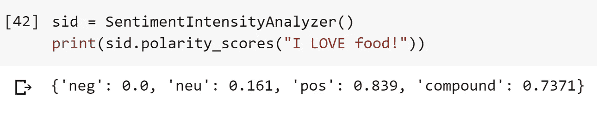
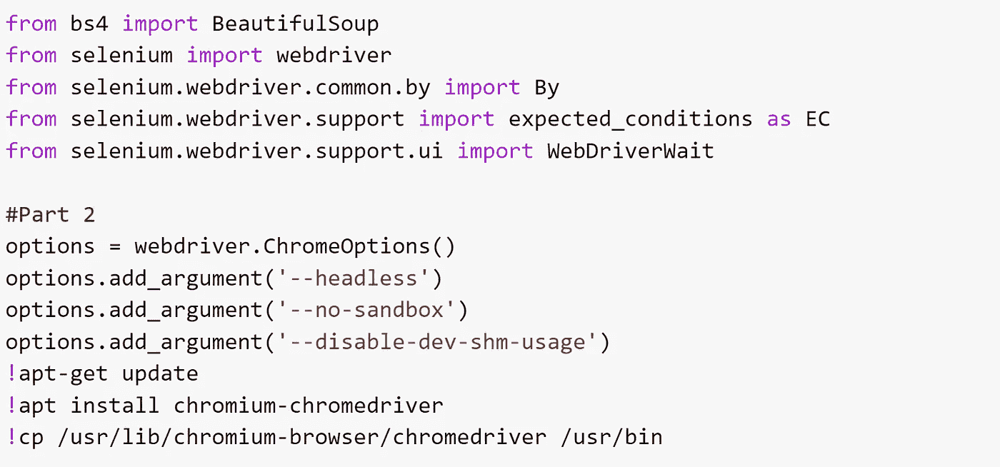
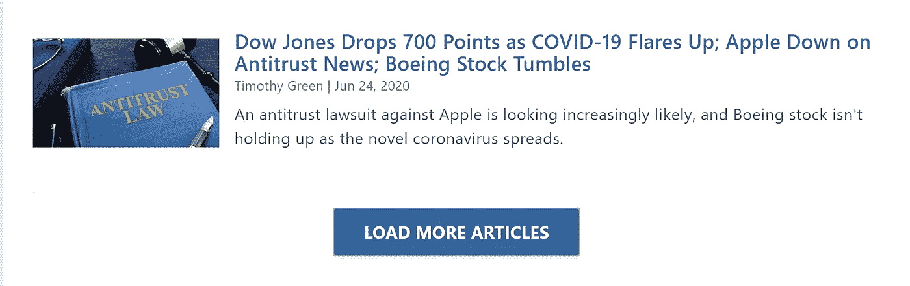
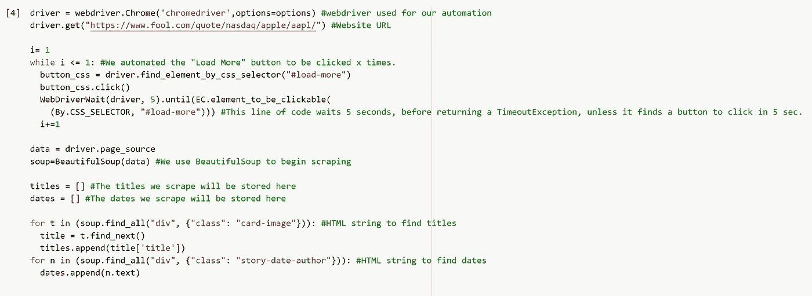
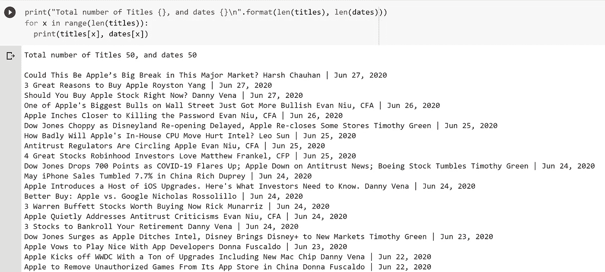
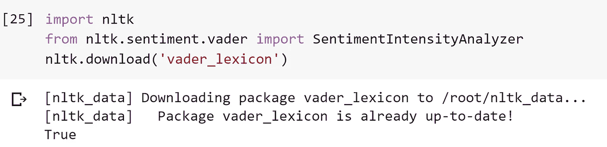
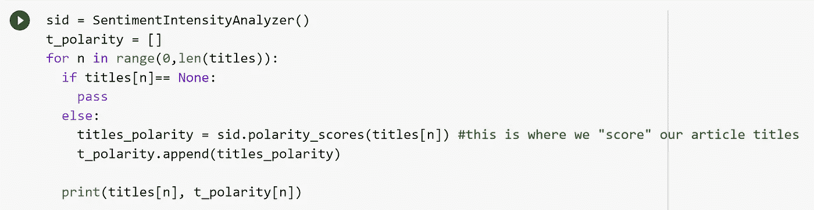
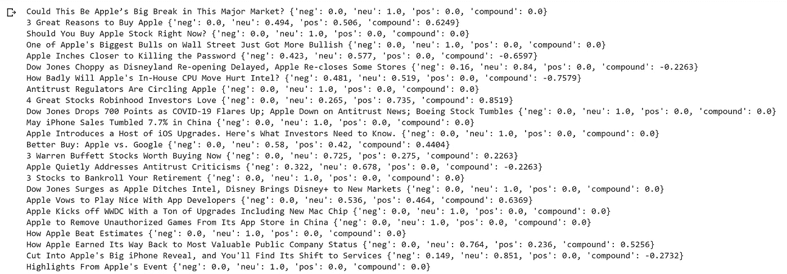

# 导航新闻:情感分析的温和介绍。(第一部分)

> 原文：<https://medium.com/analytics-vidhya/navigating-news-a-gentle-introduction-to-sentiment-analysis-pt-1-c55473853ce2?source=collection_archive---------26----------------------->

## 目标

使用情绪分析对与某种股票相关的新闻文章进行“评分”,收集这些数据，并创建一个模型来预测未来的股票走势。

# 介绍

这篇文章和接下来的其他文章将详细介绍我学习和实现情感分析的过程。考虑到这一点，这些文章将提供丰富的信息，但是也会展示我的尝试和错误。我觉得学习、理解和实施一个新的研究领域的这一方面经常被忽视。在我看来，解释障碍和考验会让话题不那么吓人，更容易理解。希望你喜欢这篇文章，并获得一些见解！我的整个进程将被分成三篇文章…

第 1 部分:情感分析和 VADER 的一般知识

第 2 部分:TF-IDF

第 3 部分:建模和回归分析。

# **什么是情感分析，有哪些应用？**

情感分析(从现在开始)解释和分类文本。SA 属于自然语言处理(NLP)的范畴。此外，NLP 可以被广泛地定义为一个分析、推导和推导人类语言的研究领域。

SA 是一个强大的工具，它允许机器量化文本的潜在情感。有两种典型的情感分析方法。

1.  监督方法:这包括标记的训练数据，用于开发模型来分类和标记“未来”文本。
2.  无监督方法:(也称为基于词典)这种方法不需要训练数据。相反，内部运作依赖于每个单词的极性。在多个单词的情况下，考虑集体极性。(我们将在文章中进一步探讨这种方法。)

此外，基于词典的 SA 通常用两种方法来实现..

1.  基于词典的方法:为了找出单词的极性，参考词典。
2.  基于语料库的方法:使用语料库，基于句法模式，可以在上下文中找到其他极性。

那么…SA 是如何实用的呢？我们消费媒体的方式已经发生了巨大的变化。媒体作为一个整体已经与日常生活交织在一起，许多人没有考虑到它是多么的广阔和强大。每一条政治推特、国际紧张局势、股票走势或贸易协定，几乎都可以在全球范围内被任何人即时获取……将这些主观文本转化为客观数据的能力，几乎成为所有研究领域的一个重要指标。在专业上，SA 应用于产品研究、测量公众意见和解释客户体验。我们甚至可以看到金融机构利用 SA 来推断“美联储会议记录”，或者律师事务所利用 SA 来推断报表。

# NLTK 和 VADER

自然语言工具包(NLTK)是自然语言处理的领先库之一。它是开源的，并提供了许多 NLP 工具，如标记化、词干化等…(值得注意的是，还有其他库，如 TextBlob，也提供了类似的功能，我建议也探索其他库！)

VADER(化合价感知词典和情感推理机)是一个词典，基于规则的情感分析工具。VADER 很有趣，因为他同时考虑了文本的极性和强度。这意味着，标点符号的常规使用(例如"!")、单词形状(例如一个单词全部大写)，以及程度修饰语(例如在评估文本的情感时考虑“非常”、“有点”)。它还能够评估表情符号(utf-8 编码)、俚语和 hip 文本语言(例如 lol)。

很明显，VADER 是为处理社交媒体上传达的情绪而量身定制的！让我们使用 VADER 运行一个示例代码。

图 1:通过 VADER 对“我爱食物！”

让我们看看我们的输出。前三列分别代表“阴性”、“中性”和“阳性”。列后的值表示属于每个类别的文本的比率。所以这些值加起来应该大致在 1 左右(我说大致是由于尾数不同的潜力。)重要的是要注意，标准化每个类的阈值是典型且有用的。

通过对词典中每个词的情感得分求和来计算复合值，进行调整，然后在[-1]和[1]之间的范围内进行归一化。([-1]代表最消极，[1]代表最积极。)

## 让我们用一些好的网络搜集来尝试情感分析。

**我将在谷歌实验室运行所有代码！一个 python 笔记本，由 Google Research 为机器学习和数据分析量身定制。它提供免费的计算资源，如 GPU/ TPU(有一些限制)。这使得每个人都能够免费利用专业硬件！我强烈推荐！*

**用 BS4 和硒刮网**

我会通过 Motley Fool 网站搜集与苹果(AAPL)相关的新闻标题。

对于忧心忡忡的数据挖掘者来说，网络抓取在一定程度上是合法的。2019 年，在 *hiQ 实验室的决定。Inc 诉 Linkedin Corp.* 裁定自动抓取公开数据合法！然而，抓取需要认证的网站是不合法的(例如。任何需要“登录”才能访问数据的东西。)记住这一点，仔细地、有意识地刮”

这些是抓取网页所需的包！

如果你收到一个“ModuleNotFoundError”简单地写！pip 将 selenium”安装到笔记本单元中并运行它！

代码的第二部分是在使用 Selenium 时避免版本不匹配(Google Chrome 和 Chromium 浏览器之间)的方法。我们只是简单地更新每个包，以避免这种不匹配

当处理带有交互式内容的动态页面时，Selenium 是完美的。它通常用于基于 web 的应用程序，但是它也用于模仿/自动化人类行为(比如点击按钮)。

股票新闻的杂色傻瓜网页。我们可以使用 Selenium 来模拟按钮点击。

将 Selenium 和 BeautifulSoup 结合起来，我们几乎可以抓取任何网站！

让我们来看看网页抓取代码！

网页抓取的代码

请注意，我们正在抓取两个值。我们搜集了大量(准确地说是 50 篇)新闻文章的标题、作者和日期。让我们看看输出！

如果你想创建一个时间序列分析，日期将是关键。Authors 是一个不太重要的值，可以通过使用切片符号来删除。

让我们对每篇文章的标题进行情感分析。

我们的情绪分析所需的软件包

VADER 电码

相当简单！让我们来看看输出。

来自 VADER 的输出

成功了！但是，请注意许多文章的“复合得分”为 0。这表明文章标题完全是中性的，没有潜在的情绪可以确定。

VADER 是一个如此神奇的工具，然而当谈到分析新闻文章，它是缺乏的。我的思路是，利用基于词典的方法是合理的。在我的下一篇文章中，我将使用一种流行的统计方法，称为**术语频率-逆文档频率(TF-IDF)** 来代替，希望能产生更有成效的结果！

# **定义**

**词库**:“词库是关于一种语言的单词及其所属词类的信息的集合。一个词典通常被构造成一个词汇条目的集合，比如(“猪”N 对 ADJ)“pig”是一个常见的名词，但也作为动词和形容词出现，例如在短语“生铁”中

来源:[http://www.cse.unsw.edu.au/~billw/nlpdict.html#firstC](http://www.cse.unsw.edu.au/~billw/nlpdict.html#firstC)

**语料库:**这可以简单的认为是一个很大的文本集合。(**文集**在拉丁文中，意为*正文。*)

**记号化:**NLP 预处理阶段的一个步骤，将一串单词“分解”成片段(正式称为**记号**)。例如，句子“标记化对 SA 至关重要”将被转换为… [“标记化”、“is”、“关键”、“For”、“SA”]

**词干化:**将一个单词化简为其“根”的过程(称为**引理**)例如，单词“playing”将被转化为“play”。