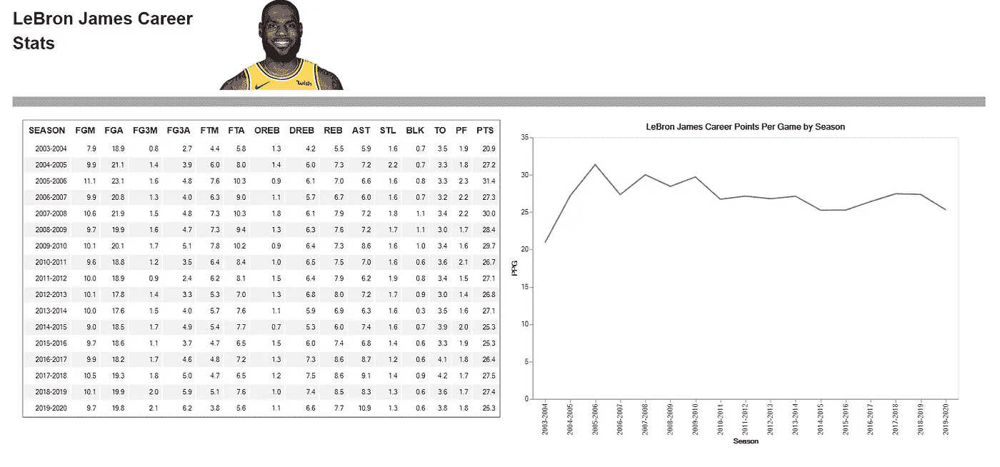
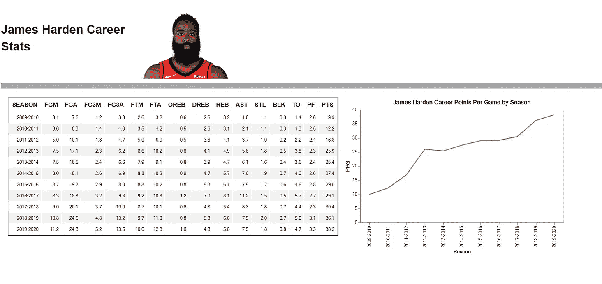
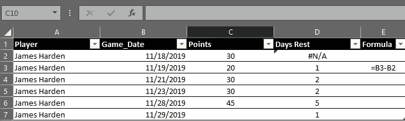

# NBA 数据:数据清洗的活生生的例子

> 原文：<https://medium.com/analytics-vidhya/nba-data-a-live-example-of-data-cleansing-c2d75195f352?source=collection_archive---------15----------------------->



用一点点努力和熊猫你能做什么

# 摘要

这篇文章介绍了一个数据清理练习，该练习使用 Pandas 库检查 NBA 球员日志，涵盖了 Python 中的大量主题。

> 议程:
> 1。遍历文件列表并将它们合并成一个数据帧。
> 2。构建自定义函数来清理混合的字符串/数字数据。
> 3。处理缺失/不完整的源数据，并使用 Pandas 类似 SQL 的合并功能来合并不同的数据集。
> 4。使用 Pandas 工具(如聚合和选择器)聚焦您的质量保证(QA)工作流。
> 5。如何使用 Pandas、Panel 和 Altair(标题图像)构建仪表板。
> 6。使用 Pandas 进行使用 itertuples 的按行计算。

跳到底部，查看所有细节的要点。由于细节在代码本身中，我将从概念上谈论上述主题，以免过于冗长。

# 背景

首先，问题陈述:我如何使用来自未记录的 API 的数据来 QA 30 年的 NBA 球员游戏日志？

Excel(必要时还有 VBA)通常是我分析大多数数据集的首选；如果这样做不起作用，下一步通常是将 MS-Access 添加到较小数据集的工作流中，或者查询 SQL 数据库以获得较大数据集，但在这种情况下，Excel 不会起作用，特别是因为它自己的日期格式晦涩难懂，而且对于时间计算(以及其他事情)来说很糟糕。我知道 Excel 将强制某些格式，这将在以后产生问题，除非我在 VBA 做一堆预处理，这不是时间效率。参见[https://www . science mag . org/news/2016/08/one-five-genetics-papers-contains-errors-thanks-Microsoft-excel](https://www.sciencemag.org/news/2016/08/one-five-genetics-papers-contains-errors-thanks-microsoft-excel)。Excel 非常适合现金流建模和假设分析，但不是我清理数据的首选工具。

这给了我一个很好的借口，在我感兴趣的项目中使用 Python。

# 装置

浏览本教程需要笔记本中包含以下库/模块:

> 1.熊猫和 Numpy
> 2。日期时间和时间；
> 3。面板+ Altair + HTML(来自 Ipython)用于视觉效果；
> 4。OS(如果您想要硬编码文件路径，则可选)；
> 5。日志记录(可选)；
> 6。Xlwings(可选)；和
> 7。web 浏览器(可选)。

# 说到点子上

## 遍历一组文件

Python 使循环变得非常简单，OS 模块有助于更有效地处理文件和目录。

> 1. **os.getcwd()** 会获取你的根目录并存储在一个字符串中。
> 2。 **os.listdir()** 会让你得到一个目录下的文件列表。将您的路径放在()中，并将这些文件存储在一个列表中。
> 3。现在您可以用一个 **for** 循环来循环这个列表，其中每个元素都是一个文件。如果只想打开某些文件，可以使用一个 **if** 语句。

```
For element in directory list:
    If element.endswith('*.csv'): #If element meets condition
      df=pd.read_csv(element) #Do something
```

## 数据框行或列的自定义函数。应用

有时，您需要对 DataFrame 中的元素应用自定义函数。熊猫**。apply()** 方法使这变得简单明了。在我的例子中，我需要标准化每个玩家在每场比赛中的上场时间，因为有时它是一个字符串，有时它是一个整数，但是为了说明这个概念，最好使用一个简单的例子。

```
Define custom_function (x):
  x = str(x) + 'day(s)' #Do something to x
  Return x
```

假设我的函数是 x 的平方，我想在数据帧的一系列中使用它，我可以如下应用它:

```
[df[‘series_adj’]= df[‘series’].apply(custom_function).
```

就是这样！如果“系列”包含值 1、2、3、4，则“系列 _ 调整”将变成“1 天”、“4 天”、“9 天”、“16 天”。注意如果**。apply()** 用于数据帧。通过设置“轴”参数，可将该函数应用于行或列。

## 合并数据帧(处理缺失数据)

当我查看 NBA 的数据时，*大部分*看起来不错，但仍然有数据问题，我后来确认是在源数据本身。我需要的一个关键字段是比赛发生的日期，幸运的是它在另一个表中可用。

1.  我必须看看我是否能把数据拉到其他地方*并且*使用一个公共键把它链接到我的源数据。*在继续下一步之前，始终确保你有办法连接数据集。*
2.  对于曾经使用 SQL 连接过表的人来说，下一步相对简单和直观([http://www.sql-join.com/](http://www.sql-join.com/)是关于连接的教程)。请注意，默认情况下，Pandas 假设一个内部连接，并尝试对键进行来宾操作，但更谨慎的做法是显式连接。

```
Merged_DataFrame = DataFrame1(DataFrame2,
left_on = 'DataFrame1_key',
right_on = 'DataFrame2_key',
how = 'left/right/inner/outer')
```

## 向工具箱添加聚合

在某些情况下，隔离数据问题相对容易。例如，我知道每个玩家都应该有一个名字(或者不能为空)。理想情况下，这就是你需要筛选的全部内容——实际上，这几乎是不可能的。完全有可能一个球员在一场比赛中从来不出手，或者他的任何一次出手都没有命中(不是每个人都像勒布朗一样优秀)。

然而，常识告诉我们，虽然一个玩家可能在一场比赛中得不到分，但如果比赛开始了，就会有人得分。这就是聚合和选择器派上用场的地方。

通过聚合，我将把不同的玩家放在一起，使用一组共同的特征。例如，我可以为一个特定的游戏将所有的玩家分组到同一个团队中；最后，我把一个特定游戏中的所有玩家分组在一起，集中精力统计数据。


左:未分组；右:分组。

在 Pandas 中，对数据帧中的元素进行分组非常简单([https://Pandas . py data . org/Pandas-docs/stable/reference/API/Pandas)。DataFrame.groupby.html](https://pandas.pydata.org/pandas-docs/stable/reference/api/pandas.DataFrame.groupby.html)。

```
grouper = DataFrame.**groupby([list of grouper columns])** grouper = df.groupby(['col1','col2')
```

这就是如何创建一个名为“group”的选择器变量。*注意，如果你只使用一列来分组，那么[]是不需要的，但是，我建议养成使用列表的习惯，即使只有一个元素来保持事情的一致性。*

然后，您可以使用 grouper 变量进行聚合。如果需要，您也可以在一行中完成此操作。

```
grouper.[list of numeric to aggregate].sum() #aggregation_method
grouper.['col1','col2'].sum()
```

在代码中，sum()、mean()、median()等将是一个聚合方法。您还可以使用。更细粒度聚合的 agg()方法([https://pandas . pydata . org/pandas-docs/stable/reference/API/pandas。DataFrame.agg.html](https://pandas.pydata.org/pandas-docs/stable/reference/api/pandas.DataFrame.agg.html)。

在使用 Pandas([https://Pandas . py data . org/Pandas-docs/stable/user _ guide/indexing . html](https://pandas.pydata.org/pandas-docs/stable/user_guide/indexing.html))时，除了 DataFrame 选择器之外，这一点非常重要。

## 制作简单的仪表板

我将在以后的文章中写一篇关于制作交互式仪表板的教程，但是我想展示如何使用面板库制作一个简单的仪表板(关于面板的更多信息，请参见[https://panel.pyviz.org/user_guide/Components.html](https://panel.pyviz.org/user_guide/Components.html))。

> 这是一个关于 Panel 如何为 dashboarding 工作的高级总结，使用一个公告板进行比较:
> 1。Panel 创建一个容器。这就像公告板。
> 2。该容器保存您的数字对象，如图表、表格或照片。
> 3。您可以按行和/或列对这些对象进行分组。
> 4。你把它们放在面板上。

这使您可以添加小部件，使图表具有交互性，甚至可以构建应用程序，供任何有浏览器访问权限的人共享。



Panel 允许您制作自己的数字公告板

## 使用 Pandas 和 itertuples 逐行遍历数据帧

在数据帧中进行跨行计算通常很容易。如果詹姆斯·哈登打了 30 分钟，得到 30 分，我可以用分钟数除以得分数。但是，如果我想做一些更复杂的事情，比如根据比赛之间的休息天数计算出他的得分如何变化，在这种情况下，我需要计算出，对于特定的比赛，*，*他休息了多少天？

在 Excel 中，这相对简单。我可以只过滤詹姆斯·哈登，按日期排序，并按照截图输入公式。



熊猫不打算飞了

然而，这在大规模数据集上不起作用，而且，即使它起作用，您也可能需要打开手动计算，并遇到潜在的性能问题。但是在熊猫身上你会怎么做呢？你不能像在 Excel 中那样做 B3-B2。有一些方法，但是一旦你掌握了它，itertuples 就像一个魔咒一样工作。这将为您提供一个元组，其中包含数据帧中的一行数据，其中 row[index]可用于访问特定的列，因此列 1 =索引 0，列=索引 1，等等。

比如说，我想遍历一个数据帧来比较不同行的数据。如果当前行的第 4 列与前一行的第 4 列相同，下面的示例将打印“match”。

```
for row in **df.itertuples()**:
  if row[0] != 0: #no comparison possible for the first row
    if row[3] == last[3]:
      print('match')
      last = row
  else:
    last=row
```

原来如此！我们已经讨论过议程了。

这里有一个链接，链接到实际项目文件的要点。

[https://github . com/tkpca/Python-Scripts/tree/master/Data % 20 cleaning % 20 示例](https://github.com/tkpca/Python-Scripts/tree/master/Data%20Cleansing%20Example)