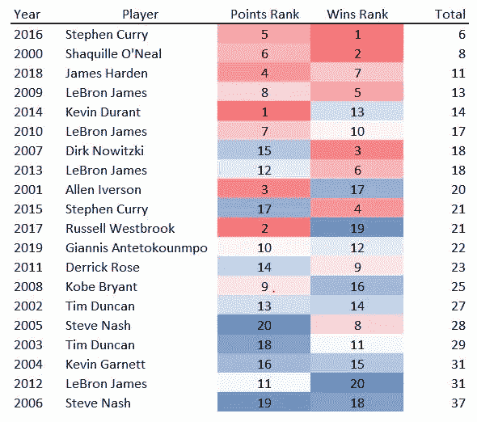

# NBA 最有价值球员(MVP)奖。

> 原文：<https://medium.com/analytics-vidhya/nba-most-valuable-player-mvp-award-15c6cfe727ee?source=collection_archive---------4----------------------->

仔细看看过去 20 年的 MVP 候选人，以及我们对谁将赢得 2020 年 NBA MVP 的看法

[图像来源](https://bleacherreport.com/articles/2820381-nba-all-star-game-2019-lebron-vs-giannis-starters-reserves-roster-breakdown)

# 介绍

> 问:我们如何确定谁是 NBA 中**最有价值球员(MVP)** ？

NBA MVP 是最杰出的球员吗？还是最好的球队里最好的球员？也许 MVP 的标准每年都在变？今天我们将分析过去 20 年的 NBA 常规赛统计数据，以找出什么是 MVP。然后看看哪个 MVP 有最好的赛季，谁会获得 NBA 2019–20 MVP 奖。

在 MVP 讨论中经常提到的一件事是每个球员的“故事”以及这个“故事”是如何帮助或伤害他们的。**这篇博文不会深入叙述，但会强调在分析过程中发现的任何有趣的趋势或异常值。**让我们庆祝过去 20 年中的一些精彩表演。最后一部分将回顾我们认为谁将成为 2019-20 MVP。

r 被用来从[https://www . basketball-reference . com/awards/awards _ 2019 . html](https://www.basketball-reference.com/awards/awards_2019.html)中 web 废料信息。然后清理数据，连接一些表格，做一些功能工程，并创建一些可视化。

请在下面的链接中找到所有代码。

 [## deegandeegan/NBA 最有价值球员

### NBA MVP 投票分析和预测的代码和文件

github.com](https://github.com/deegandeegan/NBA-MVP/blob/master/NBA%20Most%20Valuable%20Player%20%28MVP%29%C2%A0Award..R) 

> 我只想声明，篮球参考已经改变了他们呈现排名的方式，所以这个博客的**网络报废部分**不会完全起作用。种子列将为空。对此可能造成的任何不便，我们深表歉意

# NBA 最有价值球员

NBA 的最有价值球员奖从 1955-56 赛季开始就有了。顾名思义，该奖项授予常规赛中“最有价值”的 NBA 球员。该奖项由体育记者和广播员组成的评审团决定。每位投票者获得 5 张选票(第 1—5 名)，每个名额被授予不同的积分。投票中得分最高的 NBA 球员赢得该奖项。

看看去年的成绩，就更容易理解这些分数是如何合计的。去年的投票结果在下面的链接中:

[https://AK-static . CMS . NBA . com/WP-content/uploads/sites/46/2019/06/2018-19-NBA-最有价值球员-奖项-投票人-选择. pdf](https://ak-static.cms.nba.com/wp-content/uploads/sites/46/2019/06/2018-19-NBA-Most-Valuable-Player-Award-Voter-Selections.pdf)

# 汇总统计数据

通常，每个赛季**大约有**15 名球员获得**MVP 投票。**下面的图像显示了本赛季 MVP 候选人的统计数据。每个可视化将显示不同的统计数据。

希望这些图像能让你更好地理解每个赛季“精英”(MVP 候选人)球员的表现。标签被添加到每个图中以识别极端异常值。逐季比较，看看 MVP 候选人在某些数据上是否有趋势。

> 每个方框中的中间线是**中位数**或每个组(年)的“中间”值。

第一个汇总统计是 1999–00 赛季到 2018–19 赛季 MVP 候选人的场均得分(PPG)。这些标签是给那些场均得分低于 10 分或高于 35 分的 MVP 候选人的。

*   如果你包括 2019-20 赛季，那么詹姆斯·哈登将连续三年成为得分王。
*   我注意到的一件事是，在过去的 3 年里，MVP 候选人在 PPG 的中位数似乎有所增加。

第二个汇总统计是场均篮板(RPG)。这包括进攻篮板和防守篮板。标签上的球员是指在一个赛季中平均每场比赛超过 14 个篮板的 MVP 候选人。

第三个汇总统计是场均助攻(APG)。**贴标签的球员是指在一个赛季中平均每场助攻超过 11 次的 MVP 候选人。**

不要直接进入最后一个方框图，这是关于**玩家效率等级** (PER)的，让我们回顾一下统计数据是什么，以及为什么它现在如此受欢迎。玩家效率等级(PER)是玩家每分钟生产力的等级。关于 PER，需要记住的两件重要事情是，它是每分钟一次的，并且是根据节奏调整的。球员效率等级(PER)是由 ESPN.com 专栏作家**霍林格**开发的。

> 霍林格解释说，“PER 将一名球员的所有积极成就相加，减去消极成就，并返回一名球员每分钟的表现评级。”

玩家效率等级(PER)表

最后的汇总统计是球员效率等级(PER)。被贴上标签的球员是 MVP 候选人，他们的命中率要么在 31%以上，要么在 17%以下。如你所见，勒布朗·詹姆斯和斯蒂芬·库里是仅有的两个赛季 PER 超过 31 的 MVP 候选人。这四个实例导致四个 MVP。

另一方面，三名球员的 PER 低于 17，这将使他们处于“第三进攻选择”到“略高于平均水平的球员”的范围内。

# 2000 年至 2019 年的 NBA MVPs

MVP 统计表——来自 Basketball-Reference.com

上表列出了前 20 位 NBA MVPs 及其常规赛统计数据。这个表格可能有点让人不知所措，但它是我们下一节的一个很好的参考点。下一节将会检验 MVP 是由什么组成的，以及是否有共同的统计成就导致了 NBA MVP。需要指出的一个重要统计数据是**种子**列**。**已经有 5 位 MVP 不是 1 号种子选手。(02 年邓肯，06 年纳什，12 年勒布朗，14 年杜兰特，17 年威斯布鲁克)。

按赛季显示 MVP 统计数据

> 每种**颜色**都是一个**玩家**(见图示右侧图例)。 **X 轴**为**年**Y 轴**为统计**值**。显示了 9 种不同的统计数据。**

从上面的图像中，我们能发现什么趋势吗？

*   积木是 21 世纪初的东西
*   真正的射门和获胜次数似乎相对稳定
*   你还记得别的什么吗？

表" **MVP 图表**

左边的表格显示了与其他 MVP 候选人相比，MVP 在每项统计中领先的次数。同样，这只是将他们与其他 MVP 候选人(每年大约 15 名)相比较

在过去的 20 年中，MVP 已经 12 次领先 MVP 候选人，总胜率 12 次，PER 11 次。与其他 MVP 候选人相比，MVP 只有 7 次成为得分最高的球员。在 MVP 中，真正的投篮，篮板，助攻和抢断领先似乎并不常见。最后，MVP 没有一次在场均盖帽上领先于其他 MVP 候选人。

人们经常提到 MVP 是最好的球队中最好的球员。最上面一行是“Wins_Rank”，取整个 NBA 的输赢记录，按哪支球队赢的最多来排名。这是代替拿 MVP 的种子(因为每个有 2 个，东西部各 1 个)。20 个 MVP 中，有 12 个是常规赛中带领球队赢球最多的。

自 2000 年以来，只有 6 名球员在同一个常规赛中获得 MVP 和得分王。这包括沙克(' 00)，阿伦艾弗森(' 01)，凯文·杜兰特(' 14)，斯蒂芬库里(' 16)，拉塞尔·维斯特布鲁克(' 17)，詹姆斯·哈登(' 18)

自 2009 年以来，MVP 一直是 11 次中 9 次得分最高的球员。MVP 没有最高 PER 的那两年，他是赢球最多的球队。(**见下文**)

与 2000-2008 年的 MVP 相比，你会发现 MVP 的标准发生了巨大的变化。

> 个人觉得这个趋势是整个博客中最有见地的一条信息。

> 上面的两个图表只是对几段前介绍的 MVP 图表的一个更深入的探究。

****Giannis 在 2019-20 赛季的个人和团队胜利中都名列第一。***

# 王中之王

在过去的二十年里，有过一些令人惊叹的 MVP 赛季。这是过去 20 个 MVP 的表格。在这个表中，有每个球员的数据，后面是这些数据的排名。这是我们之前看到的同一张表，但是我们没有使用实际的数字，而是对它们进行了排名。

*   深红色=最好
*   白色=包的中间
*   深蓝色=最差

MVP 统计表(排名)—来自 Basketball-Reference.com

> *以防不清楚——第一排是 2000 年的沙克。与其他 MVP 相比，他得分第 6，篮板第 2，场均助攻第 18(哈哈只有邓肯&德克的 APG 比沙克少)等等*

很明显，有些栏目比其他栏目更重要。我相信你不会认为最佳 MVP 赛季是球员场均盖帽和抢断最高的赛季。让我们通过不同的排名统计迭代。

> 最好的 MVP 赛季是不是最高 **PPG** 和最多球队**胜**的赛季？

> 还是你认为是赛季 a 球员战绩最高的 **PPG** 、 **RPG** 、 **APG** 、 **SPG** 和 **BPG** ？

> 或者说，最佳 MVP 赛季是根据获得最高**胜率**和**的球员？**

> 正如你可以看到的**没有完美的答案**在过去的 20 年里，哪个球员拥有最好的 MVP 赛季。任何统计数据或一组统计数据都不应被视为结论。相反，它们应该被认为是度量标准的集合。

如果你想尝试创建自己的标准，那就点击博客开头的 GitHub 链接，查看“ **king.xlsx** ”。或者，您可以查看“final.r”中生成可视化背后的统计数据的代码。

# 预测 2020 年 MVP

Basketball-Reference 创建了一个 NBA MVP 追踪者列表。不代表本站观点。相反，这些是投票者可能瞄准的球员(每队最多两名球员)。

 [## 2019-20 NBA 最有价值球员奖追踪者| Basketball-Reference.com

### NBA 最有价值球员奖追踪器根据以前的投票结果建立的模型对候选人进行排名。此列表不…

www.basketball-reference.com](https://www.basketball-reference.com/friv/mvp.html) 

请记住，这些统计数据是在六月初上传的，可能会随着时间的推移而改变。

2019–2020 年 6 月 7 日篮球 20 大 MVP 候选人-参考

NBA 赛季通常是 82 场比赛。我们想预测如果赛季没有缩短的话，每个候选人可能会赢多少场。可以理解，这不是一个完美的估计，但仍然觉得这种方法导致了一个合理的选择。看**栏 82 场**看那个数字。

*   PER —范围从 17.9 到 31.6
*   每场比赛分钟数——没有人超过 37 分钟
*   分数——詹姆斯·哈登平均 34.4 分
*   概率% —赢得 MVP 的当前概率(可能性)

虽然 Seed 不在此表中，但**需要注意的是:**

*   前五名 MVP 候选人中有三名是头号种子。
    ——詹尼斯、勒布朗、AD。
*   MVP 候选前 3 名都是前 MVP。
    —詹尼斯、勒布朗、哈登

# 机器学习预测模型

这种分析的机器学习过程可以在下面的链接中找到。

[https://medium . com/@ deegan Robbie/applying-machine-learning-algorithms-to-NBA-MVP-data-e 4470 a 531338](/@deeganrobbie/applying-machine-learning-algorithms-to-nba-mvp-data-e4470a531338)

我们认为这份分析在一个独立的博客中更有价值，可以被不同的目标受众阅读。这个博客是为对篮球统计感兴趣的目标读者写的。

# 我们的 2020 年 NBA MVP 预测

[图像来源](https://www.essentiallysports.com/nba-news-what-hes-always-done-really-well-is-lead-by-example-giannis-antetokounmpo-floors-milwaukee-bucks-teammate-with-his-leadership-skills/)

> 这就是为什么我们相信詹尼斯会赢得 MVP。

*   Antetokounmpo 是队里战绩最好的球员。
*   他在 PER 方面领先联盟
*   他在整个 NBA 并列 PPG 第三，但每场比赛比平均 PPG 比他多的两个球员(詹姆斯·哈登和布拉德利·比尔)少打 6 分钟。
*   他还在整个 NBA 场均篮板数上并列第三。
*   他是年度最佳防守球员候选人的前两名。

****此分析是针对泡沫前的统计数据进行的！！***