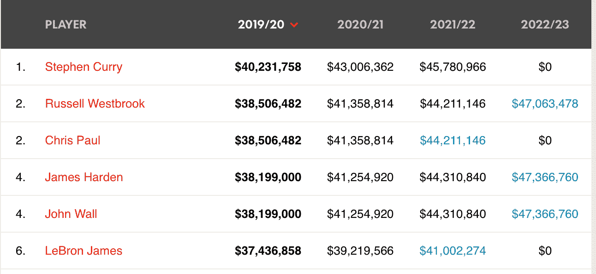
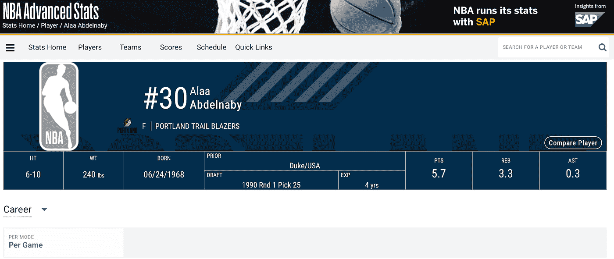
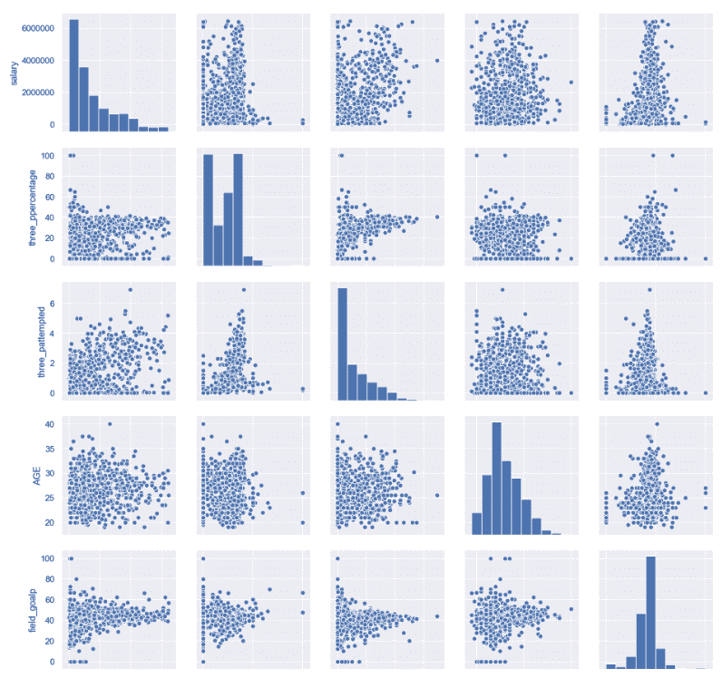
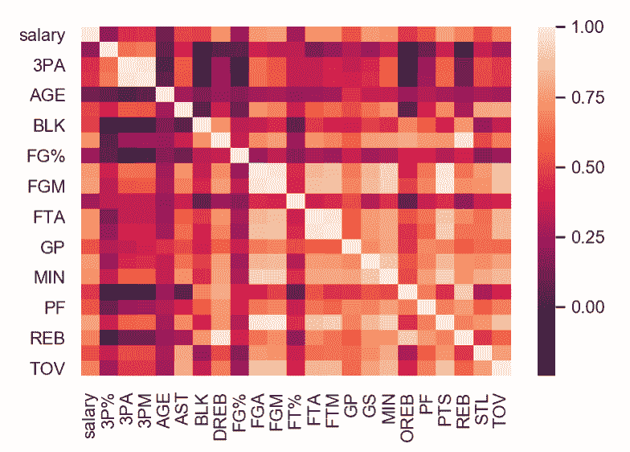
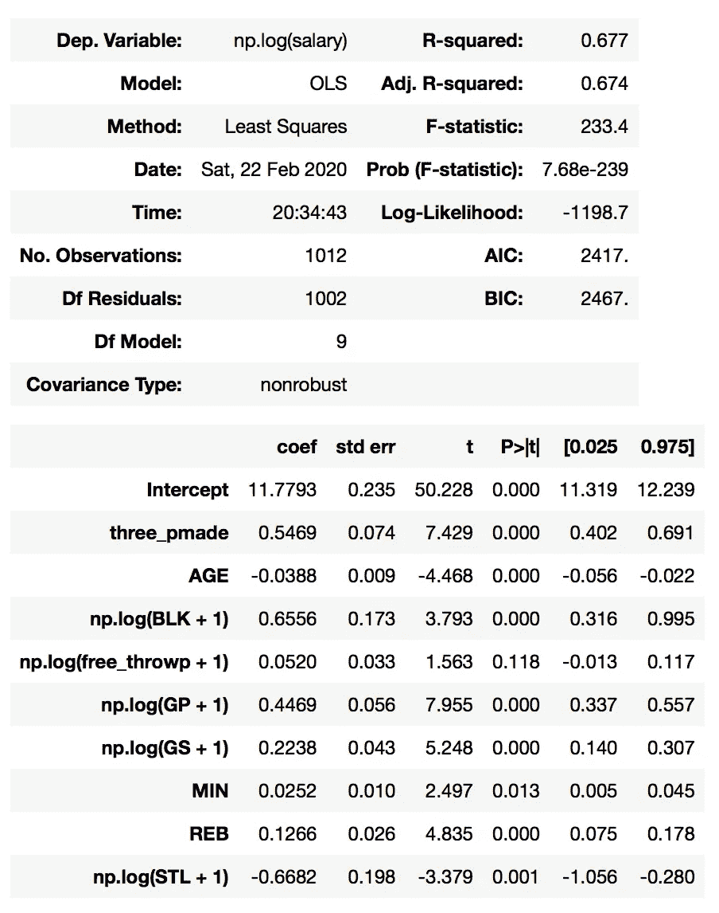
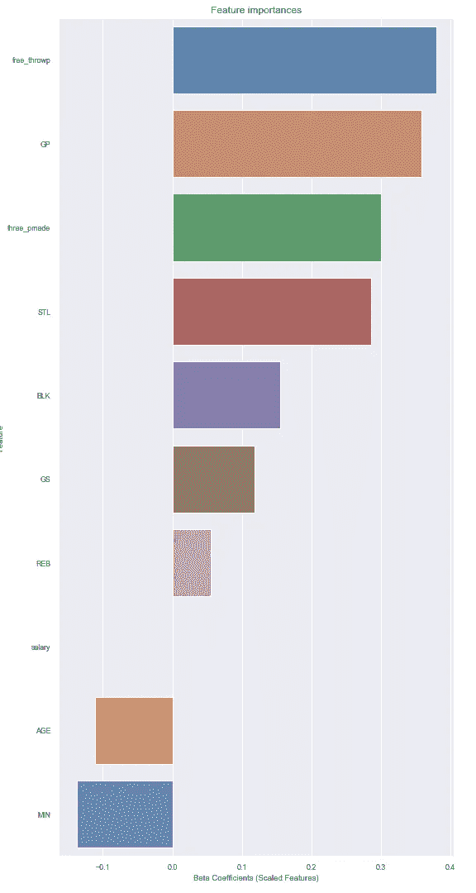
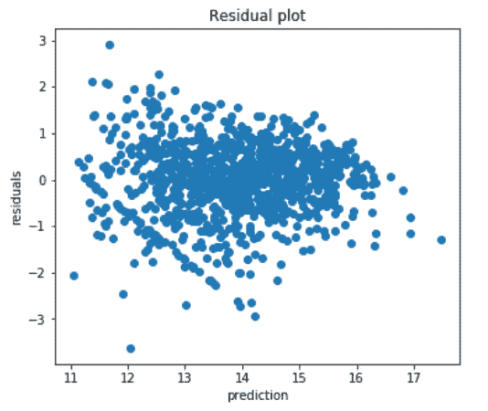
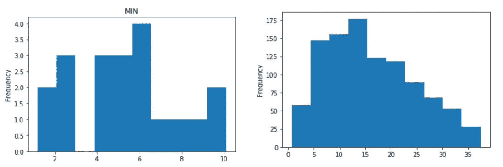
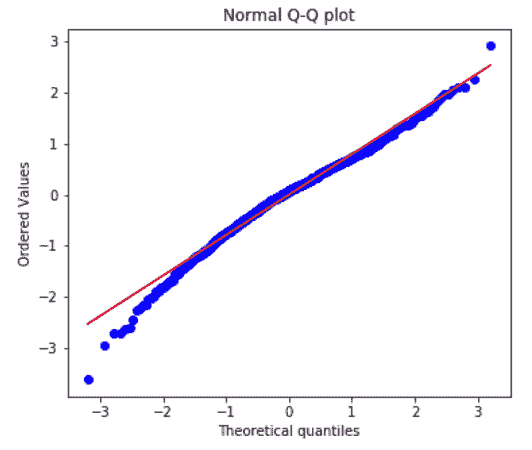

# 用线性回归预测 NBA 球员工资

> 原文：<https://medium.com/analytics-vidhya/nba-player-salaries-prediction-with-linear-regression-2b90280ff4e8?source=collection_archive---------7----------------------->

在 [Unsplash](https://unsplash.com?utm_source=medium&utm_medium=referral) 上 [NeONBRAND](https://unsplash.com/@neonbrand?utm_source=medium&utm_medium=referral) 拍摄的照片

这篇文章是建立线性回归模型预测 NBA 球员工资的快速指南。我的目的是探索如何利用各种 NBA 统计数据来预测 1990 年至 2020 年 NBA 球员的工资，这个项目的目标是找出哪些统计数据是 NBA 球员工资的最佳预测指标，以及进行球员工资预测。

# 方法学

1.  **数据来源**

**球员工资数据集:**从[篮球炒作](https://hoopshype.com/salaries/players/)网站上抓取球员姓名/工资信息。获得的特征包括球员姓名、年份和薪水。

篮球炒作网站的快照

**球员统计数据集:**从 [NBA](https://stats.nba.com/player/76001/career/) 网站抓取球员姓名/球员统计。获得的特征包括球员姓名、赛季、球队、年龄、GP 等。

以上两个数据集都是使用 Beautifulsoup 和 Selenium 抓取的，并保存为。我的本地文件夹中的 pkl 文件。

NBA 网站的快照

2.**数据清理**

在进入 EDA 之前，清理我的特征并做一些数据预处理。

**球员姓名:**改变从 NBA 网站获得的球员姓名的格式，即去掉中间的逗号，并调换名字和姓氏的顺序，以便与从 Hoops Hype 网站获得的姓名相匹配。

**Salary:** 删除该特性中的逗号，并将其转换为整数类型。

**Season:** 删除 Season 特性中的连字符，以匹配从 Hoops Hype 网站获得的 year 特性。

**合并薪资和统计数据:**加入球员姓名和年份的薪资表和统计表。

**取平均值:**按球员姓名和年份对组合数据进行分组，取每个球员工资和统计数据的年平均值。

3. **EDA**

在我们进一步深入之前，对您的数据有一个直观的了解是很重要的。

我们可以查看数据的配对图，以了解每个特征的分布情况，以及某些特征是否严重向左/向右倾斜。

我的 4 个特征和目标的配对图

我们还可以查看热图，以了解某些特征是否高度相关，并发现我们的特征和目标(工资)之间的关系。

我的一些数据变量的热图

4.**特征选择和建模**

在将数据拟合到 statsmodels 中的普通最小二乘模型时，使用特征相关性和 p 值来执行特征选择。

普通最小二乘汇总输出的快照

在执行特征选择之后，最终模型具有 9 个特征，包括年龄、BLK、3PM、BLK、REB、FTP、GP、GS、STL 和 MIN。

建模过程包括三种不同的线性回归模型，它们分别是 OLS、拉索和线性回归。这三个模型给我的 r 平方值都在 0.64 左右。然而，Lasso 给了我一个稍低的 MSE，所以这是我用来做进一步分析的。

# 结果

为了更好地理解最终的模型(套索)是如何工作的，让我们看看这些功能是如何执行的。下面是特征重要性的图表。

贝塔系数越高，特征越重要。对球员工资有积极影响的最强预测因素是 free_throwp(罚球百分比或英尺%)，第二强预测因素是 GP(上场比赛)，第三强预测因素是 three_pmade(三分球进球数或 3PM)。该模型的截距为 13.8，因此当罚球命中率增加 1%时，工资将增加 140 万美元。然而，当比赛或三分球进球数增加 1 时，工资增加 130 万英镑。

我们也可以看看剩余图，看看模型做得怎么样。下面是 y 残差图和 y 预测图。

y 残差(对数)和 y 预测(对数)散点图

我的 y 残差散点图和 y 预测散点图有点随机，但也可以从图表中观察到趋势。工资预测越低，残值越大。

左图:工资预测(log)小于 13，绝对残差(log)大于 2 时的最小值直方图；右图:工资预测(对数)小于 13 时的最小值直方图

深入挖掘后，我怀疑这与 MIN(上场分钟数)特性有关，当残差的绝对值较大且预测值较小时，MIN(上场分钟数)特性通常具有较小的值。

y 残差的 Q-Q 图

我的 y 残差 Q-Q 图总体上是正态分布的，在左下角有轻微的左偏。这表明该模型在高估薪资金额方面存在一些异常值。

# 结论

我的模型建议有抱负的 NBA 球员专注于提高罚球命中率、比赛场次和三分球命中率等方面的统计数据，因为这些是影响薪水的最重要因素。

然而，这只是根据玩家在游戏中的表现所做的薪资预测。接下来，看看一个球员的名人身份是否会影响他的收入，这将会很有趣。我可以从一名球员的社交媒体账户中收集数据，看看他的粉丝数量或他在人气竞赛中的排名是否会对薪水产生影响。此外，我也可以只关注最近几年的工资和统计数据，以防止因通货膨胀而导致工资金额大幅波动。

如需更多信息，请随时[联系我](http://annieshieh12@gmail.com)！你也可以在 [Github](https://github.com/anshieh12/NBA_player_salary_prediction) 上查看这个项目的源代码和文档。