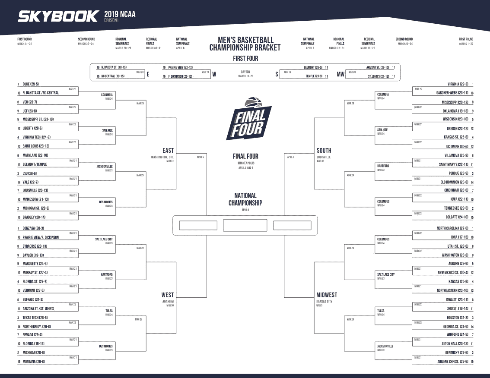
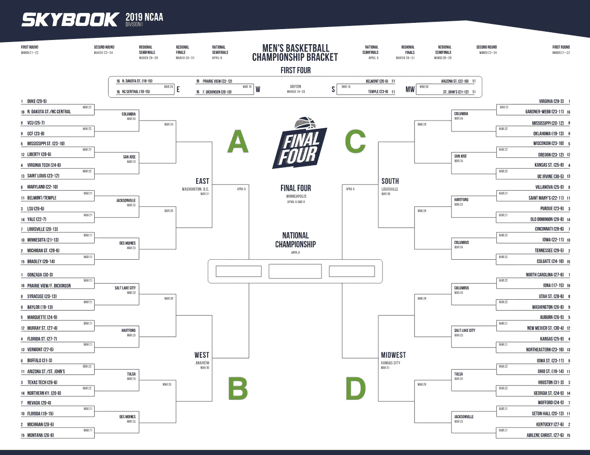
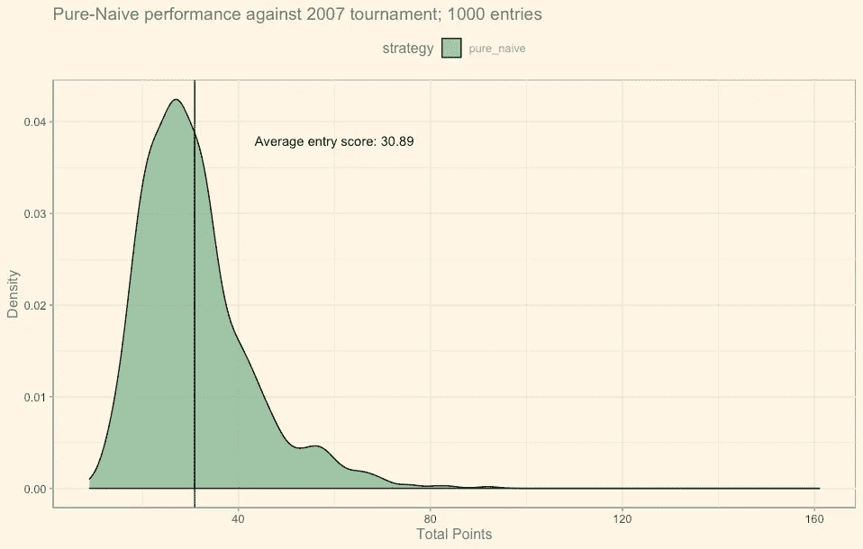
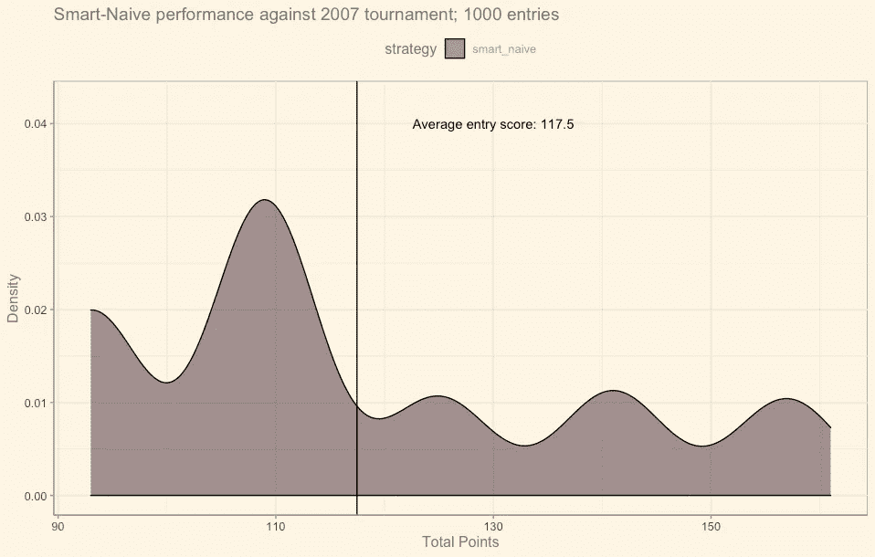
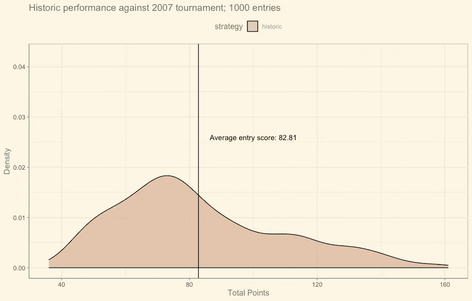
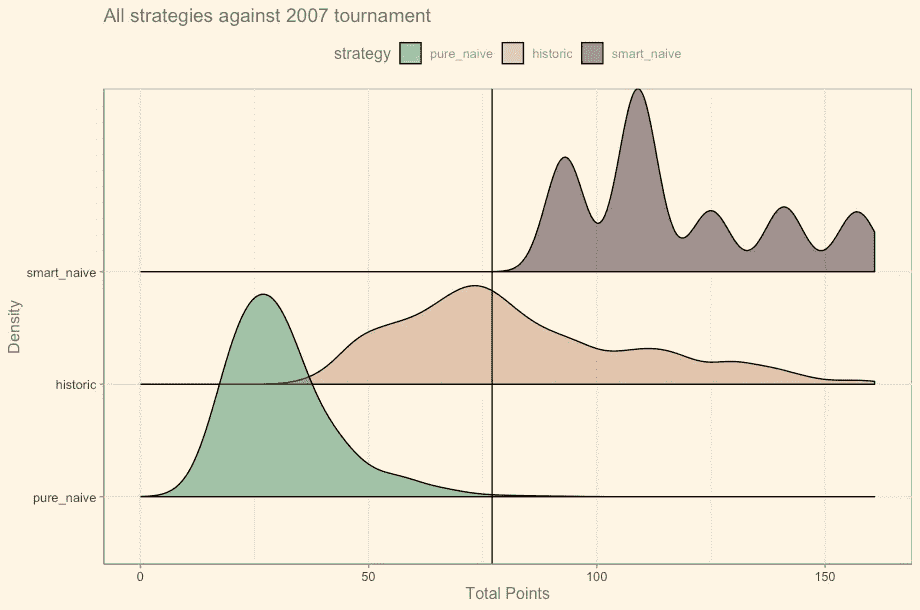
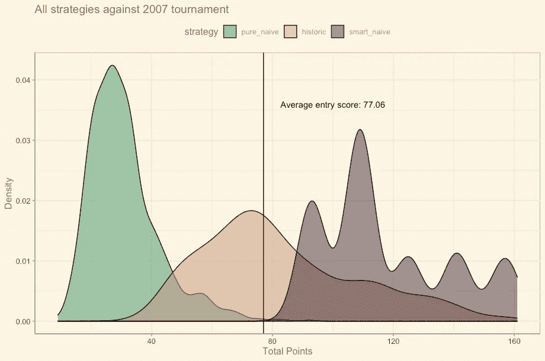
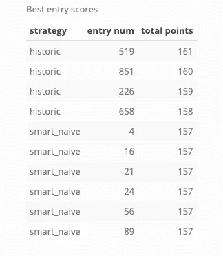
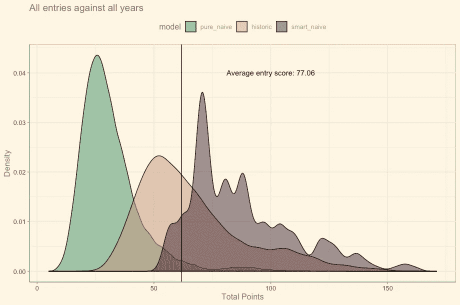
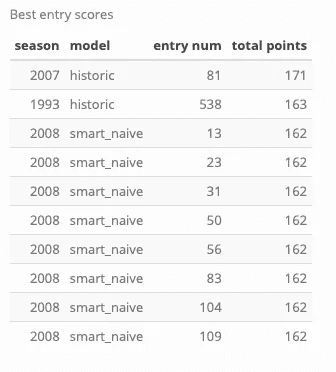

# NCAA 疯狂进行曲——接待员如何赢得办公室的支持

> 原文：<https://medium.com/analytics-vidhya/ncaa-march-madness-333b4cd644c6?source=collection_archive---------20----------------------->

3 月 16 日周一早上，你将会收到办公室某人的电子邮件，鼓励你加入办公室的“三月疯狂”活动。你可能不喜欢运动或者对大学篮球一无所知，但是只要你不是最后一名，参加比赛会很有趣！！在这个故事中，我将创造你的三个假想同事，以及他们选择括号时使用的不同策略。最后，你选择了最佳策略，并自信地认为你可能会进入前 20%。这个故事更多地是针对数据科学社区，但是这里没有代码，并且我试图将统计术语保持在最低限度，以便任何人都可以理解。

# 疯狂三月

每年春天，美国大学篮球赛都有一场 64 支最佳球队参加的六轮淘汰赛。锦标赛占据了三月的大部分时间，每一轮比赛的强度都在增加，直到冠军。

围绕锦标赛开发了一种游戏，让球迷即使在母校被淘汰后也能保持对锦标赛的兴趣。

每个游戏参赛者选出所有 63 个游戏的获胜者，并根据选出正确的获胜者和它出现在哪一轮获得分数。你怎么知道谁将在第 3 和第 4 轮比赛中互相切磋？你不知道，所以你做出有根据的猜测。一些人花费大量时间选择他们的括号以最大化分数，Kaggle 甚至在这项体育赛事周围举办了一年一度的[机器学习比赛](https://www.kaggle.com/c/google-cloud-ncaa-march-madness-2020-division-1-mens-tournament)。沃伦·巴菲特曾经[向任何猜中整个锦标赛的人](https://bleacherreport.com/articles/1931210-warren-buffet-will-pay-1-billion-to-fan-with-perfect-march-madness-bracket)提供 1B，即使有十亿美元的奖励也没人能猜对。

# 三个策略

这篇文章探讨了三种策略，一个对美国大学篮球一无所知的人可以用来挑选锦标赛参赛的获胜者。

> *纯粹天真——随机选择
> *聪明天真——总是选择排名第一的团队
> *历史——使用历史括号预测未来结果

历史记录是一种新颖的策略，对于非数据人员来说并不实用。它假设你对自 1985 年以来的每一场锦标赛都了如指掌。这是一个好的赌注吗？这就是数据科学介入的地方。

*注意:幼稚，在这种情况下，是指球员事先对美国男子大学篮球一无所知。不要与朴素贝叶斯混淆。*

# 锦标赛和比赛概述

如果有人在玩三月疯狂游戏(又名挑选你的括号)，这是传统的可打印的参赛表格。

# 篮球锦标赛

你会注意到它是高度结构化的。
*我将四个地区标记为 A、B、C 和 d。
*每个地区的每个团队根据他们的感知实力从 1 到 16 进行排名。1 是最强的。
*每个地区的队伍按照预先确定的顺序互相比赛，直到产生地区冠军。
* A 区冠军& B 区冠军对打，C 区冠军& D 区冠军第 5 轮对打。
*这些游戏的获胜者将在第 6 轮争夺总冠军。

# 赢得括号

对玩家的关键约束是他们必须在锦标赛开始前选择所有 63 场比赛。这些选秀权被锁定，不能在回合之间改变。

游戏中使用的积分系统如下:每轮总共 32 分:
*第一轮中每个正确的选择值 1 分
*第二轮中每个正确的选择值 2 分
*第三轮中每个正确的选择值 4 分
*第四轮中每个正确的选择值 8 分
*第五轮中每个正确的选择值 16 分
*第六轮中每个正确的选择值 32 分

后面几轮的点数变得很难获得，因为你的输入可能会预测第一轮中的两个赢家，他们会相互比赛，而你在第二轮中选错了。这将关闭该分支的“点管道”,不再可能有更多的点。

# 我们如何知道哪一个是最佳策略？

最佳策略将由所有参赛作品的最高平均分决定。我将使用下面的方法来确定三个策略中的最佳策略。

# 方法学

1.  为每个策略生成 1000 个条目
2.  选择一个历史年份作为基准年来确定我们的分数
3.  对照参考年份给每个条目打分
4.  看结果
5.  对所有 32 年中的每个条目进行评分
6.  确定最佳策略

我选择 2007 年作为参考赛季，因为这是我发现的第一个排名第一的球队赢得整场比赛的赛季。这将导致我们的测试集得分更高，可能不会在所有年份都相同。

# 策略 1——纯粹天真

这是你办公室里的典型的千禧一代，他们真的不想待在那里。他们在每场比赛中随机选择获胜者，只是为了尽快结束比赛。

这种策略预计表现很差，因为它赋予排名第 16 的团队同等的权重，以在第一轮击败排名第 1 的团队。这种情况在 2018 年之前从未发生过，因此他们有 50%的时间会做出错误的选择，从而在下游失去很多分。

纯粹幼稚的表演

分数很低但几乎呈正态分布。最高分是总分 192 分中的 92 分。

# 策略 2——聪明-天真

这是我们观察力敏锐的接待员。她发现所有球队的名字旁边都有一个介于 1 & 16 之间的数字，这可能表明他们的实力，这些排名是由比她更了解大学篮球的人给出的。因为她不知道其他球队的情况，所以她在每场比赛中都选择排名最高的球队。在第 5 轮和第 6 轮中，只有排名第一的队伍，所以她随机选择这些回合。

聪明幼稚的表现

这种策略的最低分是 93 分，所以它远远优于单纯天真。还有五个不同的密度区域，可能与有多少排名靠前的球队晋级下一轮有关。标准偏差为 21.08，比其他值大，但这主要是因为在整个点范围内存在一致的分布。这种策略在 2007 年达到了 157 点的峰值。

# 策略 3——历史支架

这是办公室**的 quant** 。他对大学篮球一无所知，但已经记住了自 1985 年以来每场比赛的结果。他将利用这些知识，根据历史结果挑选出最有可能的赢家。

实际上，这意味着我们有 32 年的数据，并且每年有 4 个迷你支架，总共有 128 个历史支架。对于每个条目，我们将从主列表中随机选择 4 个替换支架，并分配到 A、B、C 和 D 区域。第 5 轮和第 6 轮使用实际概率来决定获胜者。例如，如果在第 5 轮中，#1 与#2 比赛，该函数将从历史上确定#1 获胜的概率，并抽取一个随机数来确定哪个队晋级。

历史业绩

这是相当正常的，直到最后一个季度，它得到了一个胖尾巴。历史平均指数为 82.81，处于幼稚方法的中间。

# 它们是如何堆积起来的

将脊线图排队…

正如我们所料，pure-naive 表现很差，而且几乎是正态分布。Historic 处于其他两种策略的中间，与 smart-naive 有明显的重叠。黑色垂直线代表所有条目的平均值。请注意，整个智能天真范围比平均水平要好。

每个策略 1000 个条目的点密度

我更喜欢这种更传统的图表，但是如果你有机会使用脊线的话…那就做吧！！！

# 2007 年最高的入学分数是多少？

2007 年最佳作品

Smart-Naive 平均占优势，但前四名都使用了历史策略。

# 让我们看看这是否在所有年份都是一致的

请记住，我们有 32 年的数据和 3000 个条目，因此我们最终将得到一个 96，000 行的数据帧来获取每年的统计数据。

应用于每年数据的每个策略/模型 1000 个条目

所有年份的得分密度基本相同。历史数据有一个很长的尾巴，smart-naive 在每年应用时都会有更多的变化。

聪明-天真将是明显的获胜策略。当你想到这一点时，如果你使用聪明-天真，你的分数是对给球队排名的人的一次公投。**接待员**花 5 分钟填写表格，可能会排在所有玩家的前 20%。

# 总体最佳参赛作品

历史对高分有一个真正的厚尾巴。我想知道这个策略有没有最高分？

所有年份

再次，历史产生了两个最好的总体分数，即使平均智能天真有更高的分数。

# 结论

选择每场比赛中排名第一的球队是想要参加三月疯狂的人的最佳策略，而不是花很多时间来决定选择哪支球队，并比平均水平做得更好。

结束