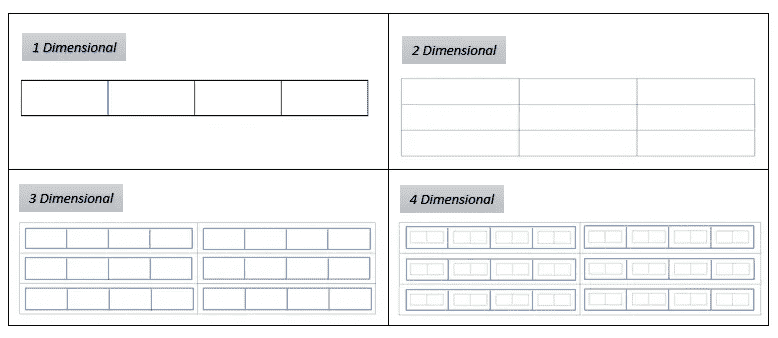

# 恩达雷

> 原文：<https://medium.com/analytics-vidhya/ndarray-f018bbcb63ff?source=collection_archive---------35----------------------->


NumPy logo: [图片来源](https://github.com/numpy/numpy.org/issues/37)

一个'*Python 人'*大军中的 Python 新手肯定会告诉你一个被称为 [NumPy](https://numpy.org/) 的包，一个科学计算的基础包 *(NumPy，n.d.)* 。NumPy 包提供了两个重要的对象。n 维数组 *(ndarray)*
2。通用函数对象 *(ufunc)* 下面的讨论是关于 *ndarray 的。*

> 一个 ndarray 可以定义为一个同质(相同种类或类型)项的集合，这些项被索引。

以上定义中的关键词是，
1。**同质**，表示同一类型或种类的物品。
2。**索引，**定义数组维数的整数。

尺寸是什么意思？
看下表，我们来探讨一下这个概念。
**一维:**要获得任何单元格的值，必须沿*一个方向*移动，并且必须定义单元格编号以获得特定值。
* *单元格编号从 0 开始。* **二维:**要达到任何单元格的值，必须在*两个方向*上行进，并且必须定义一个行号和一个列号才能达到特定的值。
**三维:**为了达到任何单元格的值，一个人必须在*三个方向上行进。*事情从这里开始变得有趣起来，现在要达到一个特定的值，必须先在行中移动，然后是列。到达特定单元格后，必须再次向一个方向移动(*蓝色方框*)才能到达该值。写下你对四维穿越的回答。



数组维数比较

继续，让我们使用这个概念，
***array . ndim****用于获取数组的维数。*

```
**import numpy as np****arr = np.array([1,2,3,4,5])
print("The dimensions of array is ", arr.ndim)** *#The dimensions of array is  1***arr_two = np.array([
                    [1,2,3,4,5],
                    [6,7,8,9,0]
                   ])
print("The dimensions of array is ", arr_two.ndim)**
*#The dimensions of array is  2***arr_three = np.array([
                      [
                       [1,2],[3,4]
                      ],
                      [
                       [5,6],[7,8]
                      ]
                     ])**
**print("The dimensions of array is ", arr_three.ndim)** *#The dimensions of array is  3*****Try and create 4,5 dimensional arrays.*
```

努力理解数组的维数是有原因的。这将有助于理解数组的*形状、步长、切片*的有趣概念。

*什么是* ***形状*** *的一个数组？* 每个维度中元素的计数。
**array.shape** 返回元组。

```
**arr = np.array([1,2,3,4,5])
print("The shape of array is ", arr.shape)** *#The* shape *of array is  (5,)***arr_two = np.array([
                    [1,2,3,4,5],
                    [6,7,8,9,0]
                   ])**
**print("The shape of array is ", arr_two.shape)** *#The shape of array is (2,5)***** Find the shape of* ***arr_three = np.array([
                      [1,2],
                      [6,7,8]
                    ])*** *write your responses in the comment section.*
```

在上面的第二个例子( *arr_two* )中，如果一步一步来，在第一维中元素的数量是 2(加粗的)——[**[]，[]** ]。然后在第二维度中各为 5 个元素— [ **1，2，3，4，5** ]。因此，数组的形状是(2，5)

*什么是数组的* ***步幅*** *？* 步幅的意思，根据谷歌的说法，*沿着一个方向*迈出决定性的步伐。
数组中的每个元素都存储在一定大小的内存块中。假设每个元素分配了 8 个字节的内存。
当你必须计算出要到达 ***每个维度*** 中的一个元素需要“交叉”多少个字节时，大步就派上了用场。于是，得名 ***大踏步*** *。*
**返回一个元组。**

```
**arr = np.array([1,2,3,4,5])**
**print("The strides of array is ", arr.strides)** *#The* strides *of array is  (8,)***arr_two = np.array([
                    [1,2,3,4,5],
                    [6,7,8,9,0]
                   ])**
**print("The strides of array is ", arr_two.strides)** *#The strides of array is  (40, 8)*
```

**让我们来分析第二个例子，
在第一维中，你有**两个元素-**
[ **[]，[]**]——为了从一个粗体块到达第二个粗体块，你必须“交叉”第一个粗体块中的所有元素。第一个块有五个元素，这意味着 8*5 = 40 个字节(假设每个元素占用 8 个字节)。
现在在二次元里，你有**五行-[1，2，3，4，5]或者[6，7，8，9，0]。**
每个块中有五个元素，要从这个块中的一个元素移动到下一个元素，必须“跨越”8 个字节。
因此步幅为(40，8)。
*但是为什么知道这个很重要？* 你有没有想过，为什么使用数组，当你需要从数组中取出一个元素时，跨语言使用一个通用的语法，
**arr[rownumber，column number]，**工作起来很优雅？内存以这种方式保存你的数据吗？答案是否定的。数组中的元素以顺序的方式存储在计算机内存中，ndarray 使用跨距进行数组索引。**

***什么是数组的* ***索引*** *？* 又称*切片*，索引是 Python 中一个强大的概念。但是是什么让我们的生活变得轻松呢？两点(奥列芬特，2006)，
1。索引可以在多个维度上完成；
2。一个省略号( *'…'* )可以表示多个维度；**

**先来探讨第一点，
**索引从 0 开始。数组的第一个元素的索引为零。* 可以为每个维度单独做索引。所以，如果有 N 个维度——arr[dim 1，dim2，dim3，…，dim(N-1)]
实现索引的重要*咒语*之一就是记住——
**【start:stop:step】** 因此，每个 dim 可以有【start:stop:step】——
arr[start 1:stop 1:step 1，start2: stop2: step2，start3: stop3: step3，…，start(N-1): stop(N**

```
**arr_two = np.array([
                    [1,2,3,4,5],
                    [6,7,8,9,0],
                    [9,8,3,4,1]                   
                   ])**
*# Let's get the dimensions* **print(arr_two.ndim)** *# returns 2**# Let's get the second row* **print(arr_two[1])***# Let's get the full array* **print(arr_two[:])***# Let's get the second element from each row.* **print(arr_two[:,1])***# Let's get the odd rows.* **print(arr_two[0:3:2])
# start - 0; 
# stop - 3 (This digit is one more than the index you want to include)
# steps - 2 (Every second element starting from zero)***# Let's get first element from the odd rows.* **print(arr_two[0:3:2,0])***# Let's get the odd rows (if you are not sure of the array length).* ***arr = np.array([[1,2],[2,3],[5,6],.....])*****print(arr[::2,0]))**
```

**探索索引的方法还有很多，这取决于你的需要或创造力。我鼓励你想出你的组合，并尝试它们。
* *如果你有新发现，也可以在回复中分享。***

**再来摸摸第二点，
如果你有一个高维数组呢，比如说 4x4x4x4x4。现在要跨多个维度移动，可以使用省略号。让我们看一个例子，**

```
**arr_complex = np.array([
    [
        [[2,4,6,8],[1,2,3,4]],
        [[1,2,4,5],[1,2,9,4]]
    ],
    [
        [[1,9,4,8],[7,1,3,5]],
        [[1,2,7,4],[1,2,3,4]]
    ],
    [
        [[3,9,4,8],[7,1,6,5]],
        [[1,2,3,9],[1,2,3,4]]
    ]
])** # Try to get second element from each array.
# Method 1 - arr_complex[0:3:2, 0:2:1, 0:2:1, 1]
# Method 2- arr_complex[0:3:2, ... , 1]
```

**方法 1 和方法 2 将产生相同的结果，但是方法 2 的简单性令人难以置信。
切片可以尝试无数种组合。如果你遇到任何有趣的事情，我鼓励你尝试其他排列和写下回答。**

**这篇文章讨论了 ndarray 的基础知识以及常用的属性。未来的文章将涵盖更多的属性和有趣的信息。**

> **参考文献
> *编号*。(未注明)。检索自 NumPy:[https://numpy.org/](https://numpy.org/)
> *奥列芬特，T. E. (2006)。*数字指南*。***