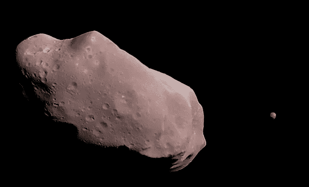

# 近地小行星——探索性分析

> 原文：<https://medium.com/analytics-vidhya/near-earth-asteroids-an-exploratory-analysis-d235bdccf5b4?source=collection_archive---------12----------------------->

图 1——1993 年 8 月 28 日伽利略号探测器看到的小行星 243 Ida。图片来源:美国宇航局/JPL/凯文·m·吉尔处理，右边是艾达的月亮手指

我们的太阳系是一个奇怪的地方，有很多我们不知道也不完全了解的东西。反思这一点，最好的方法莫过于从历史的角度出发。太阳系中行星和其他天体的发现和特征描述可以作为一个很好的起点。我花了一些时间在太阳系动力学上，我想我应该仔细看看小行星…