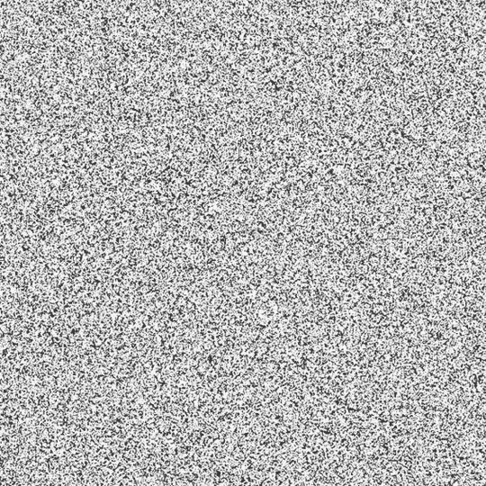

# 最近邻噪声(NNN)作为神经网络的正则化方法

> 原文：<https://medium.com/analytics-vidhya/nearest-neighbour-noise-nnn-as-regularization-method-for-neural-networks-d9a4b3b7c727?source=collection_archive---------16----------------------->

在我研究噪声注入(NI)作为正则化方法的过程中，我想到了一个主意。通常的 NI 工作方式如下:

最常见的方法是采用高斯正态分布，并简单地将其添加到每个历元的数据集输入中。已经提出了其他的变型，例如相乘而不是相加…