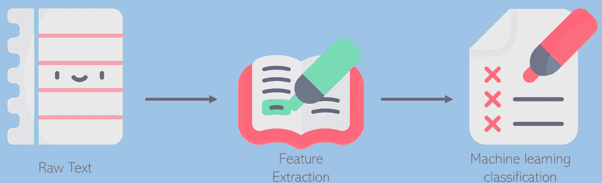

# 使用条件随机场的否定线索检测。

> 原文：<https://medium.com/analytics-vidhya/negation-cue-detection-using-conditional-random-fields-12bd00c3cae1?source=collection_archive---------12----------------------->

## 理解和使用文本分类的实用方法，检测否定的暗示。

自然语言处理中的一个基本任务是文本分类，即给文本分配类别以便从中提取信息的过程。提取信息的想法可以…