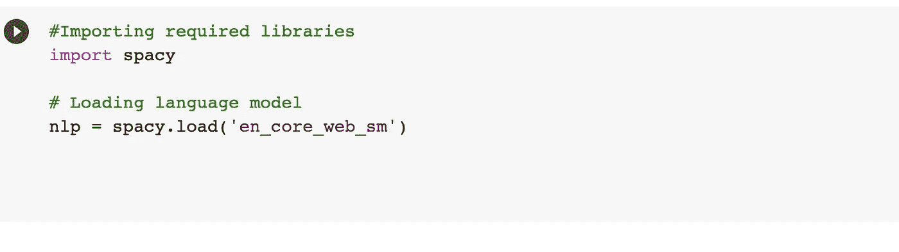

# 使用空间在 Python 中进行 NER 标记

> 原文：<https://medium.com/analytics-vidhya/ner-tagging-in-python-using-spacy-c66cf01d3c7f?source=collection_archive---------8----------------------->

## 提取命名实体

在这篇文章中，我讨论了命名实体的含义、命名实体识别技术以及如何使用 spaCy 提取命名实体。

## **命名实体**

术语“命名实体”传统上用于指在给定文本中遇到的一组人、组织和地点名称。进一步的日期、货币单位或百分比等。通常基于本地语法使用相同的技术来包含和检测。

*例子:——“脸书在 2014 年以 160 亿美元收购了 WhatsApp”*

上例中出现的命名实体是:-

*   脸书组织
*   WhatsApp — ORG
*   2014 年—日期
*   160 亿美元——钱

## **命名实体识别**

它是一种提取命名实体并将它们分类到预定义类别(如组织、人名、日期、时间、语言等)的技术。)从可获得的文本。它也被称为*实体识别、实体分块和实体提取*。

## **NER 的应用**

我们可以使用 NER 来标记文档，并且基于实体标签的值和类型，这些可以在各种场景中使用。使用这种技术可以获得关于文档中引用的关键命名实体的基本概念。

因此，基于标签的类型和频率来标记命名实体可以为各种场景(如新闻文章、技术文章、客户投诉(例如，可以标记与特定产品相关的投诉))而工作。一旦文章被标记，它可以进一步用于推荐任务或增强在大量可用文章中的搜索能力。

## 使用空间提取命名实体

*   **spacy.load()** 是一个方便的包装器，它读取语言 ID 和管道组件，初始化语言类，加载模型数据，并返回它。
*   **en _ core _ web _ sm**——可用的预训练统计模型为**英语**，在 OntoNotes 上训练的英语多任务 CNN。分配上下文特定的令牌向量、位置标签、依赖性分析和*命名实体*。

在本例中，spaCy 的 NER 管道组件确定了三个实体

由 spaCy 的 NER 管道组件标识的命名实体的集合作为 *Doc 对象*的 *ents 属性*可用。

*   在上面的例子中，我已经显示了 **ent.text** (原始实体文本)和 **ent.label_** (实体类型描述)。除了 ent.text 和 ent.label_ 其他可用的实体注释有 ent.label、ent.start、ent.end、ent.start_char 和 ent.end_char。
*   ent.label_ type — ORG(公司、代理、机构等。)、NORP(国籍或宗教或政治团体)和 GPE(国家、城市、州)在给定文本中可用。其他可能的值有人员、语言、金钱、日期、时间、产品、事件等。

## 将命名实体添加到 span

不将“Suprdaily”识别为命名实体

在这个例子中，spaCy 将 Mumbai 标识为一个命名实体，而忽略了 Suprdaily(一个创业组织)。

现在，为了将 Suprdaily 添加为命名实体，我们可以使用“spacy.tokens.Span ”,它将 doc 对象、要添加的命名实体的标记的开始和结束范围以及一个标签值(在我们的示例中为 label=" ORG ")作为参数。

在为新实体创建一个 span 之后，需要将它附加到现有的 doc 对象 doc.ents 上。

现在,“Suprdaily”和“Mumbai”都被确定为命名实体。

在处理您自己的自定义数据时，这在许多情况下都很有用。

## 可视化命名实体

我们可以使用 **displacy** 来可视化命名实体。使用 displacy.render，我们可以传递样式为“ent”的 doc 对象(即要可视化的对象)。这将用不同的颜色突出显示各种类型的实体。

你也可以使用**选项**参数来显示特定类型的实体或者改变高亮显示的颜色。

虽然 3 亿美元也被命名为“MONEY”类型的实体，但由于我们使用 options 只过滤了“ORG”类型，因此它没有被突出显示。

您可以在这里访问示例[中使用的代码。](https://github.com/poojamahajan0712/medium_blog/blob/master/NLP/NER.ipynb)

## 参考

*   [https://spacy.io/api/top-level](https://spacy.io/api/top-level)
*   [https://spacy.io/models/en](https://spacy.io/models/en)
*   [https://spacy.io/usage/linguistic-features#setting-entities](https://spacy.io/usage/linguistic-features#setting-entities)
*   [https://online library . Wiley . com/doi/pdf/10.1002/9781119268567 . app 5](https://onlinelibrary.wiley.com/doi/pdf/10.1002/9781119268567.app5)