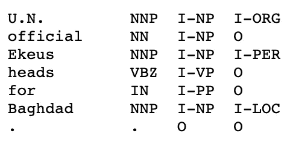

# Tensorflow 2.2.0 中 CoNLL 数据集的命名实体识别(NER)

> 原文：<https://medium.com/analytics-vidhya/ner-tensorflow-2-2-0-9f10dcf5a0a?source=collection_archive---------0----------------------->

本博客详细介绍了使用 Tensorflow2.2.0 对句子( [CoNLL-2003 数据集](https://www.clips.uantwerpen.be/conll2003/ner/))进行命名实体识别(NER)标记的步骤

[CoNLL-2003](https://www.clips.uantwerpen.be/conll2003/ner/) [数据集](https://www.clips.uantwerpen.be/conll2003/ner/)包括 1393 篇英语和 909 篇德语新闻文章。我们将会关注英国的数据。CoNLL-2003 数据文件包含由一个空格分隔的四列。每个单词都被放在单独的一行，每个句子后面都有一个空行。每行的第一项是单词，第二项是词性(POS)标记，第三项是语法块标记，第四项是命名实体标记。组块标签和命名实体标签具有 I-TYPE 格式，这意味着单词在 TYPE 类型的短语内。只有当两个相同类型的短语紧随其后时，第二个短语的第一个单词才会有标签 B-TYPE，以表明它开始了一个新短语。标签为 O 的单词不是短语的一部分。



**数据预处理**

数据文件夹中的 train.txt、valid.txt 和 test.txt 都有句子以及它们的标签。我们只需要命名的实体标签。我们将单词及其命名实体提取到一个数组中—[' EU '，' B-ORG']，['rejects '，' O']，['German '，' B-MISC']，['call '，' O']，['to '，' O']，[' bocoit '，' O']，['British '，' B-MISC']，['lamb '，' O']，[' . '，' O'] ]。参考下面的代码来提取单词和命名实体。我们为训练、有效和测试中的所有句子获取带有命名实体的单词。

```
def split_text_label(filename):
  f = open(filename)
  split_labeled_text = []
  sentence = []
  for line in f:
    if len(line)==0 or line.startswith('-DOCSTART') or    
    line[0]=="\n":
       if len(sentence) > 0:
         split_labeled_text.append(sentence)
         sentence = []
       continue
    splits = line.split(' ')
    sentence.append([splits[0],splits[-1].rstrip("\n")]) if len(sentence) > 0:
    split_labeled_text.append(sentence)
    sentence = []
  return split_labeled_textsplit_train = split_text_label(os.path.join(args.data, "train.txt"))
split_valid = split_text_label(os.path.join(args.data, "valid.txt"))
split_test = split_text_label(os.path.join(args.data, "test.txt"))
```

我们为文件夹(train、valid 和 test)中的所有唯一单词和唯一标签(命名实体将被称为标签)构建词汇表。labelSet 包含标签中所有唯一的单词，即命名实体。wordSet 包含所有独特的单词。

```
labelSet = set()
wordSet = set()
# words and labels
for data in [split_train, split_valid, split_test]:
  for labeled_text in data:
    for word, label in labeled_text:
      labelSet.add(label)
      wordSet.add(word.lower())
```

我们为词汇表中的每个单词/标签关联一个唯一的索引。我们为“填充 _ 令牌”分配索引 0，为“未知 _ 令牌”分配索引 1。当一批句子长度不等时,' PADDING_TOKEN '用于句末标记。“未知 _ 令牌”用于表示不存在于词汇表中的任何单词，

```
# Sort the set to ensure '0' is assigned to 0
sorted_labels = sorted(list(labelSet), key=len)
# Create mapping for labels
label2Idx = {}
for label in sorted_labels:
  label2Idx[label] = len(label2Idx)
idx2Label = {v: k for k, v in label2Idx.items()}# Create mapping for words
word2Idx = {}
if len(word2Idx) == 0:
  word2Idx["PADDING_TOKEN"] = len(word2Idx)
  word2Idx["UNKNOWN_TOKEN"] = len(word2Idx)for word in wordSet:
  word2Idx[word] = len(word2Idx)
```

我们读取 split_train、split_valid 和 split_test 文件夹中的单词，并将其中的单词和标签转换为它们各自的索引。

```
def createMatrices(data, word2Idx, label2Idx):
  sentences = []
  labels = []
  for split_labeled_text in data:
     wordIndices = []
     labelIndices = [] for word, label in split_labeled_text:
       if word in word2Idx:
          wordIdx = word2Idx[word]
       elif word.lower() in word2Idx:
          wordIdx = word2Idx[word.lower()]
       else:
          wordIdx = word2Idx['UNKNOWN_TOKEN']
       wordIndices.append(wordIdx)
       labelIndices.append(label2Idx[label]) sentences.append(wordIndices)
     labels.append(labelIndices) return sentences, labelstrain_sentences, train_labels = createMatrices(split_train, word2Idx, label2Idx)
valid_sentences, valid_labels = createMatrices(split_valid, word2Idx, label2Idx)
test_sentences, test_labels = createMatrices(split_test, word2Idx, label2Idx)
```

这些句子长度不同。我们需要填充句子和标签，以使它们长度相等。max_seq_len 取 128。

```
def padding(sentences, labels, max_len, padding='post'):
  padded_sentences = pad_sequences(sentences, max_len,       
  padding='post')
  padded_labels = pad_sequences(labels, max_len, padding='post')
  return padded_sentences, padded_labelstrain_features, train_labels = padding(train_sentences, train_labels, max_seq_len, padding='post' )
valid_features, valid_labels = padding(valid_sentences, valid_labels, max_seq_len, padding='post' )
test_features, test_labels = padding(test_sentences, test_labels, max_seq_len, padding='post' )
```

我们将使用预先训练的手套词嵌入。将手套嵌入— [glove.6B.100d.txt](http://nlp.stanford.edu/data/glove.6B.zip) 下载到嵌入文件夹。对于我们词汇表中的所有单词，我们得到单词的手套表示。embedding_vector 拥有我们词汇表中所有单词的手套表示。

```
# Loading glove embeddings
embeddings_index = {}
f = open('embeddings/glove.6B.100d.txt', encoding="utf-8")
for line in f:
  values = line.strip().split(' ')
  word = values[0] # the first entry is the word
  coefs = np.asarray(values[1:], dtype='float32') #100d vectors   
  representing the word
  embeddings_index[word] = coefs
f.close()embedding_matrix = np.zeros((len(word2Idx), EMBEDDING_DIM))# Word embeddings for the tokens
for word,i in word2Idx.items():
  embedding_vector = embeddings_index.get(word)
  if embedding_vector is not None:
    embedding_matrix[i] = embedding_vector
```

**使用 TF . Data . dataset . from _ tensor _ slices 的数据管道**

我们使用 TF . data . dataset . from _ tensor _ slices 对数据集进行批处理和混排。

```
train_batch_size = 32
valid_batch_size = 64
test_batch_size = 64train_dataset = tf.data.Dataset.from_tensor_slices((train_features, train_labels))
valid_dataset = tf.data.Dataset.from_tensor_slices((valid_features, valid_labels))
test_dataset = tf.data.Dataset.from_tensor_slices((test_features, test_labels))shuffled_train_dataset = train_dataset.shuffle(buffer_size=train_features.shape[0], reshuffle_each_iteration=True)batched_train_dataset = shuffled_train_dataset.batch(train_batch_size, drop_remainder=True)
batched_valid_dataset = valid_dataset.batch(valid_batch_size, drop_remainder=True)
batched_test_dataset = test_dataset.batch(test_batch_size, drop_remainder=True)
```

**型号采用双向 LSTM**

```
import tensorflow as tf
from tensorflow.keras import layersclass TFNer(tf.keras.Model):
def __init__(self, max_seq_len, embed_input_dim, embed_output_dim, num_labels, weights):
   super(TFNer, self).__init__()    self.embedding = layers.Embedding(input_dim=embed_input_dim, 
   output_dim=embed_output_dim, weights=weights,    
   input_length=max_seq_len, trainable=False, mask_zero=True)        

   self.bilstm = layers.Bidirectional(layers.LSTM(128,  
   return_sequences=True)) self.dense = layers.Dense(num_labels)def call(self, inputs): x = self.embedding(inputs) # batchsize, max_seq_len,      
   embedding_output_dim
   x = self.bilstm(x) #batchsize, max_seq_len, hidden_dim_bilstm
   logits = self.dense(x) #batchsize, max_seq_len, num_labels
   return logits
```

我们有一个嵌入层，它具有预训练的手套单词嵌入(不可训练)。我们在嵌入后使用双向 LSTM，我们有一个完全连接的层来转换 LSTM 的输出。

我们定义模型、优化器和损失。我们使用稀疏分类交叉熵损失和 Adam 优化器。

```
model = TFNer(max_seq_len=max_seq_len,embed_input_dim=len(word2Idx), embed_output_dim=EMBEDDING_DIM, weights=[embedding_matrix], num_labels=num_labels)optimizer = tf.keras.optimizers.Adam(learning_rate=0.01)scce = tf.keras.losses.SparseCategoricalCrossentropy(from_logits=True)
```

**自定义训练循环:**

```
train_loss_metric = tf.keras.metrics.Mean('training_loss', dtype=tf.float32)
valid_loss_metric = tf.keras.metrics.Mean('valid_loss', dtype=tf.float32)def train_step_fn(sentences_batch, labels_batch):
  with tf.GradientTape() as tape:
    logits = model(sentences_batch)
    loss = scce(labels_batch, logits)
  grads = tape.gradient(loss, model.trainable_variables)
  optimizer.apply_gradients(list(zip(grads,   
  model.trainable_variables))) return loss, logitsdef valid_step_fn(sentences_batch, labels_batch):
  logits = model(sentences_batch)
  loss = scce(labels_batch, logits)
  return loss, logitsfor epoch in epoch_bar:
  for sentences_batch, labels_batch in 
  progress_bar(batched_train_dataset, total=train_pb_max_len, 
  parent=epoch_bar) :
    loss, logits = train_step_fn(sentences_batch, labels_batch)
    train_loss_metric(loss)
  train_loss_metric.reset_states() for sentences_batch, labels_batch in 
  progress_bar(batched_valid_dataset, total=valid_pb_max_len, 
  parent=epoch_bar):
    loss, logits = valid_step_fn(sentences_batch, labels_batch
    valid_loss_metric.update_state(loss)
  valid_loss_metric.reset_states()model.save_weights(f"{args.output}/model_weights",save_format='tf')
```

**在测试数据集上评估模型性能**

我们使用精确度、召回率和 f1 值来评估模型。我们使用 seqeval 包。seqeval 是一个用于序列标签评估的 Python 框架。seqeval 可以评估命名实体识别、词性标注、语义角色标注等组块任务的性能。classification_report metric 构建显示主要分类指标的文本报告。

```
def idx_to_label(predictions, correct, idx2Label):
  label_pred = []
  for sentence in predictions:
    for i in sentence:
      label_pred.append([idx2Label[elem] for elem in i ]) label_correct = []
  if correct != None:
    for sentence in correct:
    for i in sentence:
      label_correct.append([idx2Label[elem] for elem in i ])
  return label_correct, label_pred test_model =  TFNer(max_seq_len=max_seq_len, embed_input_dim=len(word2Idx), embed_output_dim=EMBEDDING_DIM, weights=[embedding_matrix], num_labels=num_labels)test_model.load_weights(f"{args.output}/model_weights")true_labels = []
pred_labels = []for sentences_batch, labels_batch in progress_bar(batched_test_dataset, total=test_pb_max_len):
  logits = test_model(sentences_batch)
  temp1 = tf.nn.softmax(logits)
  preds = tf.argmax(temp1, axis=2)
  true_labels.append(np.asarray(labels_batch))
  pred_labels.append(np.asarray(preds))
label_correct, label_pred = idx_to_label(pred_labels, true_labels, idx2Label)report = classification_report(label_correct, label_pred, digits=4)
```

TensorBoard 提供了机器学习实验所需的酷可视化和工具。github repo 中的代码包含可视化培训和验证损失的代码。代码可在[https://github.com/bhuvanakundumani/NER_tensorflow2.2.0.git](https://github.com/bhuvanakundumani/NER_tensorflow2.2.0.git)获得