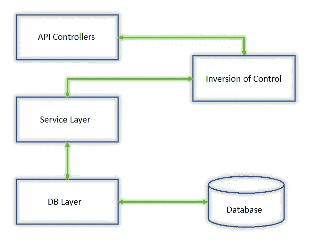

# 。NET 核心、依赖注入和控制反转(IoC)

> 原文：<https://medium.com/analytics-vidhya/net-core-dependency-injection-and-inversion-of-control-ioc-42f598326a8b?source=collection_archive---------13----------------------->

[https://coding infinite . com/WP-content/uploads/2019/01/net-core-love . jpg](https://codinginfinite.com/wp-content/uploads/2019/01/net-core-love.jpg)

设计模式是为了帮助软件工程师写出更好的代码。当我们说更好的时候，这意味着更容易测试，应该有关注点的分离，当然它是有逻辑的(是的，当然软件中的一切都是有逻辑的)！

最近我一直在研究。网芯。我有构建 RESTFul 应用程序的背景。。NET Core 似乎偏离了传统的 ASP.NET MVC 开发模式。我非常喜欢它，用咖啡不停地编码，直到我卡在一个点上:**依赖注入**！

让我们首先理解代码结构。

API 中的控制流和数据流

> 我们使用 MVC 模式来控制应用程序。收到任何请求后，**控制器**验证请求的真实性，然后移交给**服务层**。这一层执行所有的业务逻辑。如果需要从数据库中获取/检索/存储/更新数据，该层调用 **DB 层**。我们也可以将这个 DB 层称为**模型层**。现在控制器不能直接访问数据库，同样服务层(业务逻辑)也不能直接访问数据库。这是关注点分离的一个方面。

# 那么有什么问题呢

英寸 NET Core 有一个名为 **DBContext** 的类，主要负责执行数据库操作。如果搭建数据库，DBContext 将与模型类一起创建。DBContext 是在 Startup.cs 类期间注入到 IServices 中的。现在，因为 WebAPI 是从模型项目中分离出来的，我们需要将模型引用到 WebAPI 项目中。这不是理想的解决方案，因为我们想要实现关注点的分离。

# **所以让我们反转控制**

IoC 或控制反转基本上是一种改变控制流的设计模式。说你午餐需要做饭。但是你很累或者很懒或者像我一样你不知道怎么做饭！！因此，你实际上不是为自己准备午餐，而是雇佣任何厨师来做午餐。换句话说，你实际上把控制权从你自己手中转到了厨师手中。很酷不是吗？

> 因此，在我们的项目结构中，我们引入了一个新项目。你可以叫它 IoC，Helper，Referer，随你喜欢。现在，IoC 项目实际上可以保留模型和服务层的引用。但控制器应仅包含国际奥委会项目的参考。要注入任何依赖关系，控制器应调用 IoC 项目中的任何指定方法，并将其 IServices 对象作为参数传递。IoC 现在可以将 DBContext 的引用添加到 IServices 对象。换句话说，不是 API 做注射，而是它把这项特殊的工作交给 IoC 项目，就像你付钱让厨师给你做薯条，而不是油炸你自己。

我们已经实现了项目关注点的分离和。NET 核心的简单方法是应用一个简单的设计模式，叫做:**控制反转**！

在 IoC 项目中，我们创建了一个名为 **RegisterServices** 的静态方法。该方法接受注册数据库上下文的 IServiceCollection 对象。可以使用该对象注册其他服务。

在 IoC 中注册类以注册 DbContext

现在这个方法在 Startup.cs 文件中被调用，我们将 IServiceCollection 对象作为参数传递。因为该方法是静态的，所以我们不需要创建 Register 类的实例(IoC 项目)

Startup.cs

下面是这个流程的示意图。请注意，控制反转只改变控制流，而不改变数据流。这是因为控制模式的反转试图在不改变数据流的情况下分离类结构。

控制反转(IoC)项目介绍

你可以在我的 [GitHub](https://github.com/umairk83/IoC-and-DependencyInjection) 库找到完整的代码。请随意使用代码。如果你喜欢这个，请分享并关注我更多精彩的文章。下次再见，感谢阅读并享受编码…