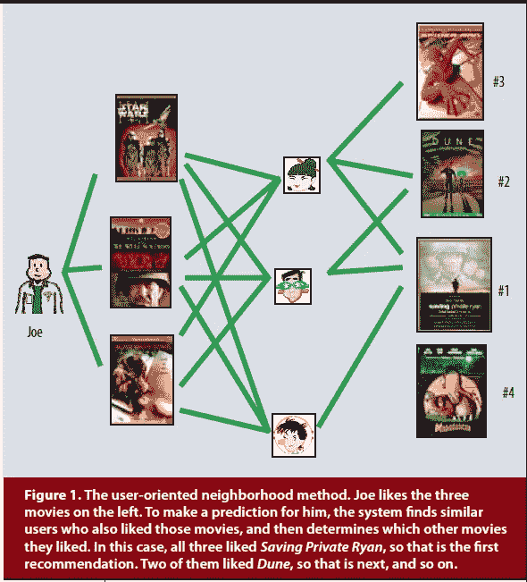
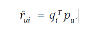
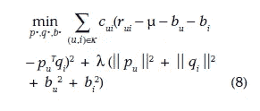

# 网飞百万美元挑战:理解赢得百万美元的算法

> 原文：<https://medium.com/analytics-vidhya/netflix-million-dollar-challenge-understanding-the-algorithm-that-won-a-million-dollar-f6556060e7a0?source=collection_archive---------9----------------------->

为各种产品和服务提供推荐是普遍存在的。一个主要的例子是网飞。2006 年，网飞向全世界的数据科学家发出公开挑战:将他们现有的推荐系统提高 10%，赢得 100 万美元。他们开放了一个庞大的训练和测试数据集，供数据科学家使用。 [Koren 等人](https://datajobs.com/data-science-repo/Recommender-Systems-%5BNetflix%5D.pdf)最终凭借他们的矩阵分解算法获奖。

# 背景

存在多个推荐系统，即，为特定用户提供推荐。其中一种方法被称为*基于内容的过滤*方法，您可以为项目和用户创建配置文件，并根据这些配置文件(配置文件的内容)给出推荐，即喜欢动作片的人会喜欢被标记为“动作”的电影，或者你可以说一个年轻的男性青少年(人口统计数据)平均来说可能喜欢快节奏的动作片。这样做的明显缺点是，您需要收集关于项目和用户的数据。另一种方法叫做 c *人工过滤*，依靠用户过去的行为来预测未来的行为。

*协同过滤*的两个主要领域是*邻域方法*和*潜在因素模型*。

# 邻域方法

邻域法的核心是计算项目之间的关系，或者用户之间的关系。面向项目的方法基于同一用户或通过某些因素(即朋友等)彼此相关的一组用户对“相邻”项目的评级来评估用户对项目的偏好。一个产品的邻居是当由相同的用户或用户组评级时倾向于获得相似评级的其他产品。论文中的图 1 给出了邻域法的直观解释:

图取自 [Koren 等人。艾尔。](https://datajobs.com/data-science-repo/Recommender-Systems-[Netflix].pdf)

# 潜在因素模型(LFM)

LFM 完全依赖于用户对项目的评级，并推断出影响用户评级背后的决定的因素，即用户评级拯救大兵瑞恩高是因为他们普遍喜欢战争电影吗？

# 矩阵分解

我们的输入是评级矩阵 R (n x m)，其中每行是一个用户，每列是一部电影。R(I，j)是用户 I 给电影 j 的评分，我们把 R 分解成两个矩阵 P(n×k)和 Q(k×m)。p(n×k)表示用户对某些潜在因素的偏好，矩阵 Q(k×m)表示项目(网飞的电影和表演)中前述潜在因素的存在/不存在。换句话说，对于给定的用户 u，P(u)的元素测量用户对在相应因子上较高的项目感兴趣的程度。对于给定的项目 I，Q(i)的元素度量该项目拥有那些因素的程度。不幸的是，我们不知道这些因素是什么。但是，一旦我们生成了 P 和 Q，我们就可以对它们进行有根据的猜测。比如生成 P 和 Q 后，我们看到拯救大兵瑞恩，珍珠港和现代启示录与因子 1 的关联度很高。我们还看到，对兄弟乐队评价很高的用户 A 与因子 1 的相关性很高。在这一点上，我们有根据的猜测是，因素 1 指向“战争节目”这一类型。

# 将 R 分解成潜在因子矩阵

已知 P 和 Q，我们可以通过以下公式计算 R(u，I):

因此，如果我们可以为所有用户填充 P(u ),为所有项目填充 Q(i ),那么我们就可以预测用户的评分，这反过来又可以用于给出推荐。那么我们如何填充 P(u)和 Q(i)呢？

最初，矩阵 P 和 Q 中的所有条目都是未知的。我们通过优化过程建立 P 和 Q。

我们有多少未知数？P 和 Q 中的所有项，即我们有(nk + km)个未知实数。在优化过程中，我们将随机初始化 P 和 Q，并开始调整它们的所有条目，使得每当 R 中存在非缺失的评级 r(i，j)时，对应的 k 维向量 P(i)和 Q(j)的内积将逼近评级 r(i，j)。我用 P(i)来表示 P 的第 I 行，用 Q(j)来表示 Q 的第 j 列，因为我们知道这个值，所以我们通过用户给定评分和算法近似评分之间的差值来计算估计值的好坏。然后，我们相应地调整 P(i)和 Q(j ),使这一差值(也称为误差)最小。这是学习步骤，Koren 等人使用的过程称为[随机梯度下降](https://en.wikipedia.org/wiki/Stochastic_gradient_descent)。

当 R 中缺失了某个评分 r(u，v)时(用户 u 没有对物品 v 进行评分)，我们只是不知道如何约束 P(u)和 Q(v)的内积，所以我们只会“随它们去”而不会去管它们。

但是，用户 u 评价了其他项目，P(u)的条目肯定会在其他地方被调整；并且类似地，因为项目 v 被其他用户评级，所以 Q(v)的条目将在别处被调整。因此，在优化过程中，P(u)和 Q(v)不会保持不变。

Koren 等人还考虑了用户偏见，例如，用户是严肃的还是随意的电影评论者，以及他们如何随时间而变化。他们将这些偏差投影为时间的函数，并使用它们来了解用户偏差，以便他们可以基于用户的当前偏差给出最佳推荐。例如，一个用户可能以一个不经意的评论者开始了他们的评论之旅，但是随着生活迫使他们变得更加愤世嫉俗，他们变得更加挑剔(所有这些都是假设的！).所以他们最初的电影收视率很高，但他们最近的收视率出现了令人难过的下滑。对于一个普通用户来说，6 分似乎很低，但是对于这个新的愤世嫉俗的用户来说，这已经很不错了。我们需要能够识别和利用这些偏见。

而且，你是怎么把炒作考虑进去的？我们有时会给一部电影更高的评级，不是因为我们绝对喜欢它，而是因为其他人都喜欢它。或者，这可能是因为奢侈的营销。Koren 等人考虑到这一点，在他们的方程中加入了一个置信变量。

最终等式看起来像这样:

图片来自 Koren 等人。艾尔。

这里，c(u，I)是置信度，r(u，I)是用户给出的评级，mu 是所有电影的平均评级，b(u)是用户偏差，b(i)是电影偏差，p(u)T.q(i)是算法近似评级。

希望这篇文章能对这篇了不起的论文有所启发！看到他们仅仅从用户评分中推断出的数据令人震惊。