# 基于自然语言处理的网飞电影推荐系统

> 原文：<https://medium.com/analytics-vidhya/netflix-movie-recommendation-system-using-nlp-ca5dd0fe299a?source=collection_archive---------2----------------------->

*喜欢看电影？？？*

但是看什么呢？？我们经常在空闲时间问自己这个问题。网飞上有大量的电影、电视节目和纪录片，从中选择一部真的很头疼。在我的空闲时间，我会抛出同样的问题，所以我尝试建立推荐引擎，它可以根据我以前的观看指导我一些电影。

# 概观

对于任何推荐系统，我们考虑用户和一些项目，所以在这种情况下，(网飞)项目是电影。在开始之前，让我们知道一个推荐系统是做什么的。基本上，它根据一组给定用户和一组项目之间的相似性来匹配内容。让我们更深刻地理解这个概念:

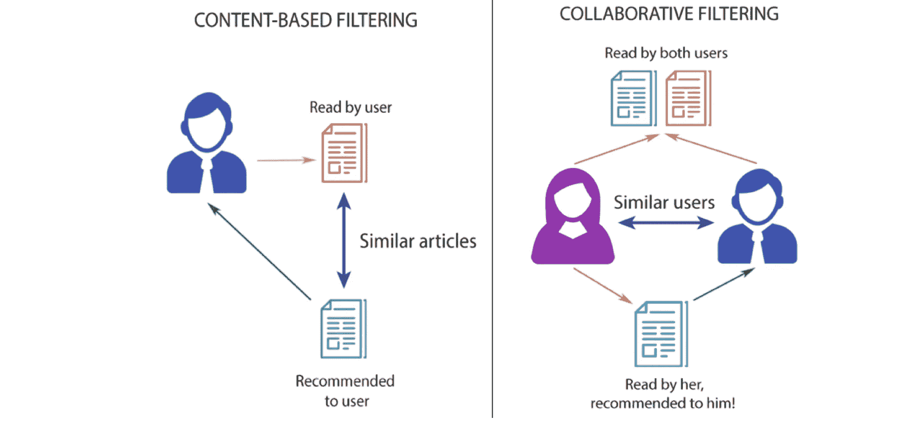

# 1.基于内容的过滤

在基于内容的过滤中，假设我们有一个用户已经读过的物品/书籍，一旦你知道用户喜欢这个物品/书籍，我们就可以根据内容找到相似类型的书籍。内容可以是任何东西，比如作者是谁，这里使用的常用关键字是什么，书籍类型等等，然后将它们推荐给用户。这种类型的过滤器不涉及其他用户，如果不是我们自己。基于我们喜欢的东西，该算法将简单地挑选内容相似的项目来推荐给我们。

# 2.协同过滤

这种类型的过滤器是基于用户的评分，它会推荐我们还没有看过，但是和我们相似的用户有并且喜欢的电影。为了确定两个用户是否相似，该过滤器考虑他们观看的电影以及他们对电影的评价。通过查看共同的项目，这种类型的算法将根据相似用户的评价，基本上预测尚未观看该电影的用户的评价。

***在这种方法中，我们将使用基于内容的过滤，因为我们使用的数据不涉及任何用户信息。***

# 数据收集和清理

数据由 Kaggle 采集，由 6234 行 12 列的电影和电视剧数据组成，数据集的链接为:[https://www.kaggle.com/shivamb/netflix-shows](https://www.kaggle.com/shivamb/netflix-shows)

#我在这里使用的 IDE 是 Jupyter notebook(anaconda 3)

#导入库:

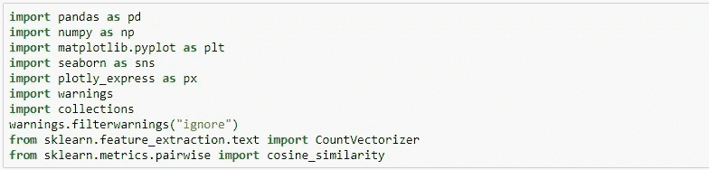

#数据集概述:

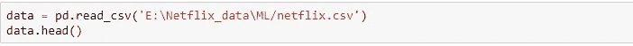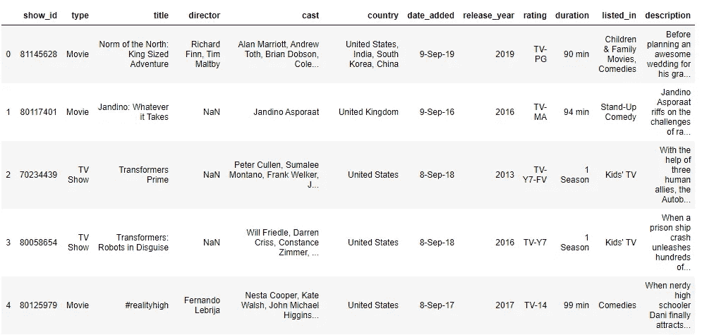

#从数据集中过滤电影数据

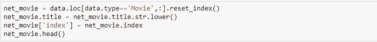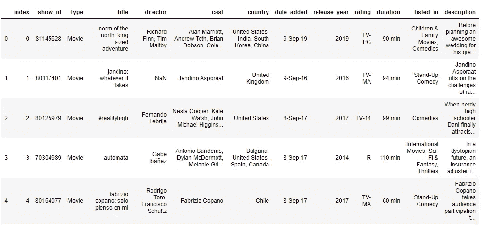

#fliter 电视显示数据集中的数据

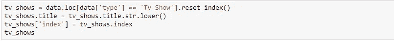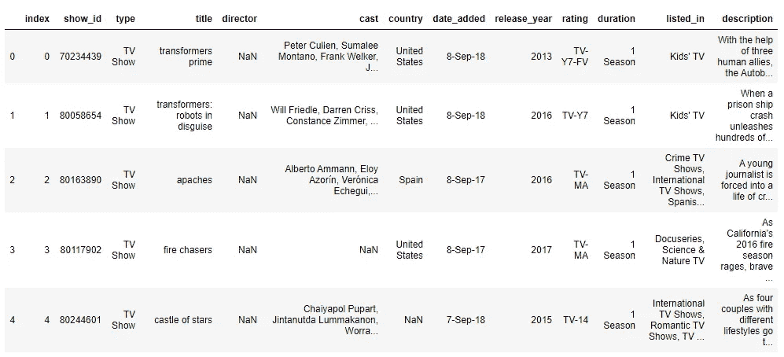

#检查重复值

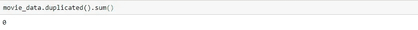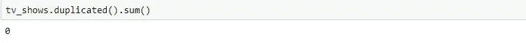

# 分析

#比较节目和电影的数量

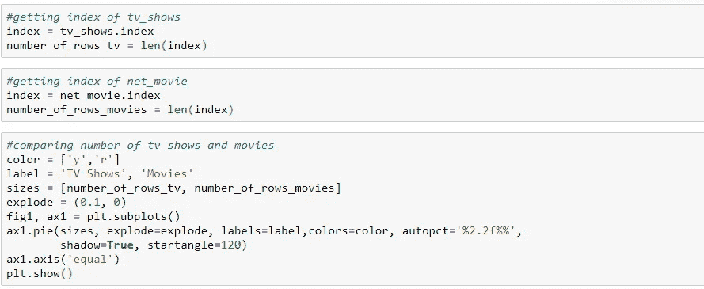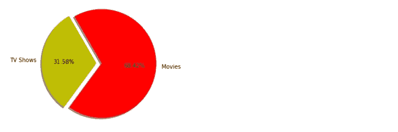

#最新 15 部电影列表

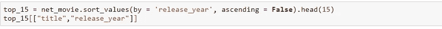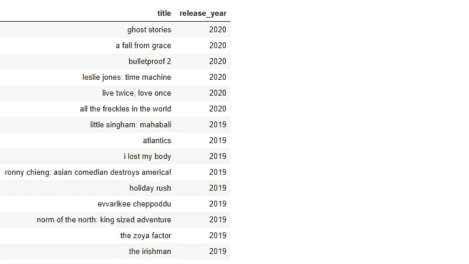

#冠军数量最多的国家

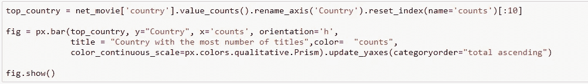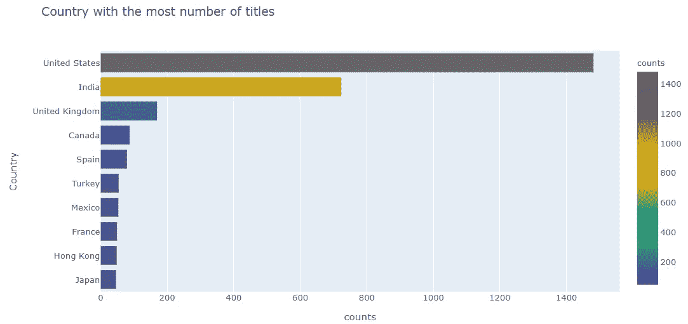

#具有最大内容的目录

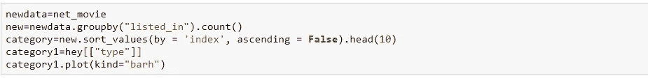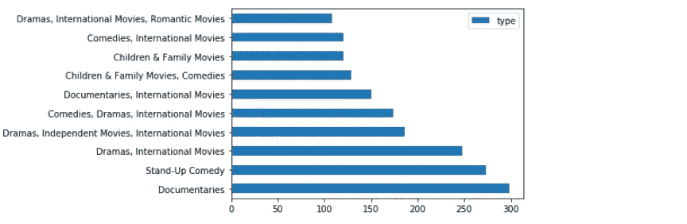

#国家排名前 20 的电影的时长

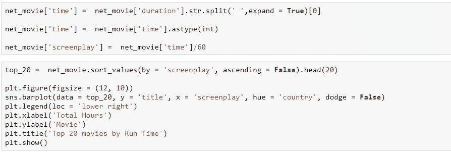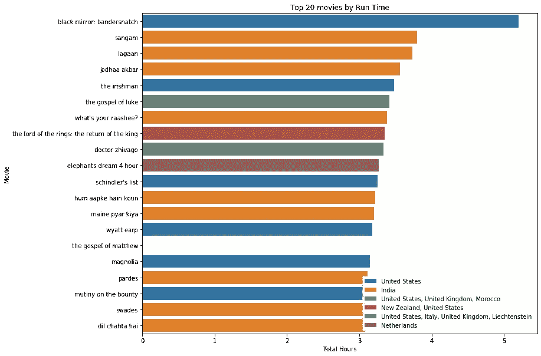

# 建筑推荐系统

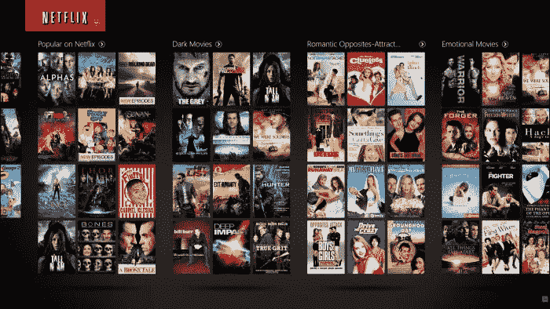

获取数据框中的列:

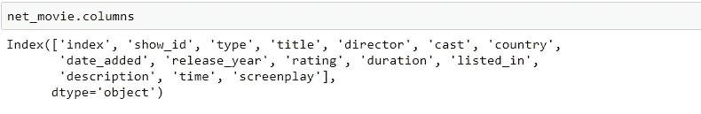

因此，我们将选择一些要素，并在数据框中创建一个列，将所有选择的要素组合成一个字符串:

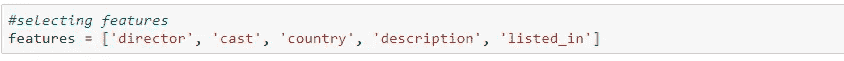

因此，我们有一个名为 create_features 的函数，我们向它提供行输入，它返回特性的行。通过使用 apply 方法，我们将此函数转换为数据框的所有行:

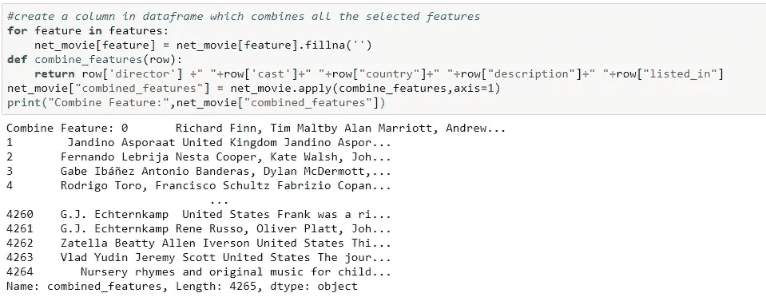

现在，我们需要检查我们为其创建计数度量的内容之间的相似性，然后获取余弦相似性以获得相似性得分:

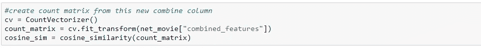

在获得内容之间的相似性之后，我们只需要打印最上面的相似性得分:

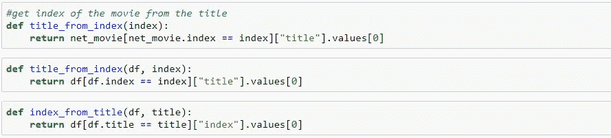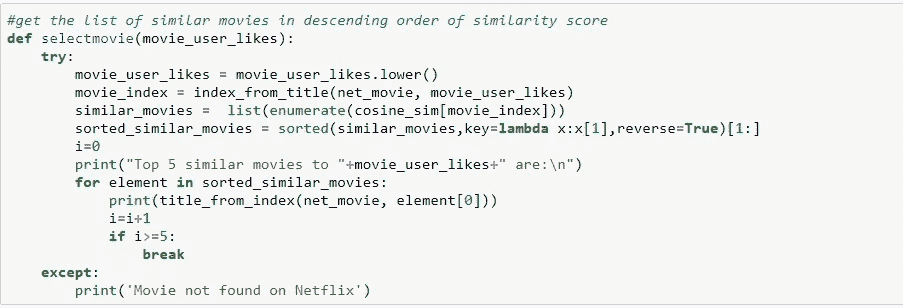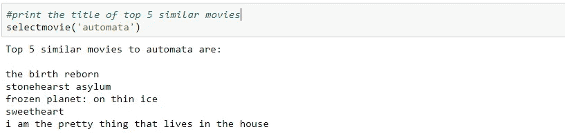

难道不令人兴奋吗？？？我选择了一部名为“自动机”的电影，并根据电影之间的相似性列出了前 5 部相似的电影。我希望你喜欢它，请尝试这种技术的各种数据集，让我知道它是多么有用。

感谢阅读:)