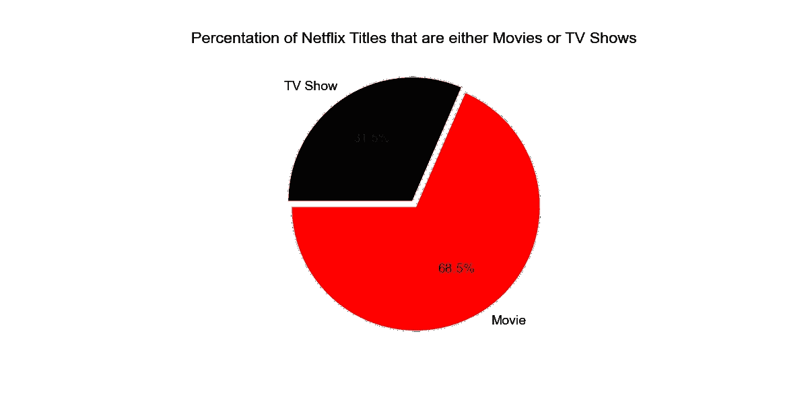
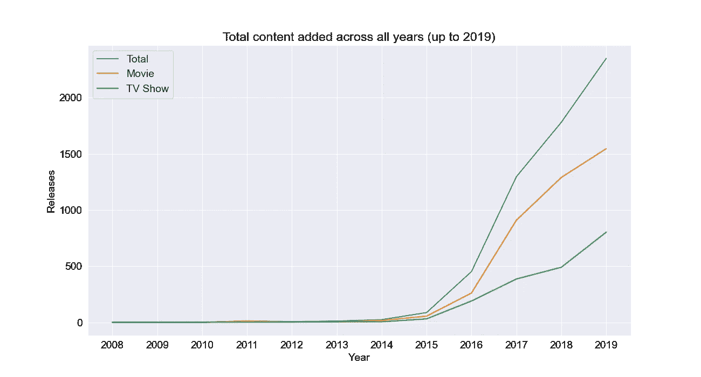
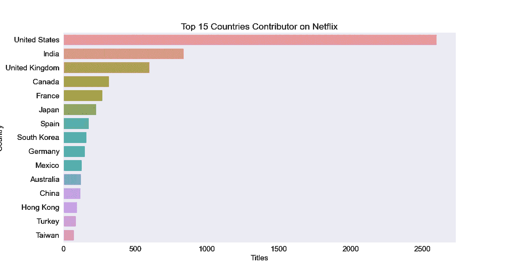
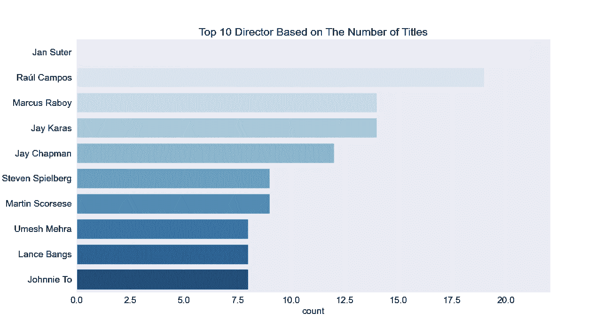
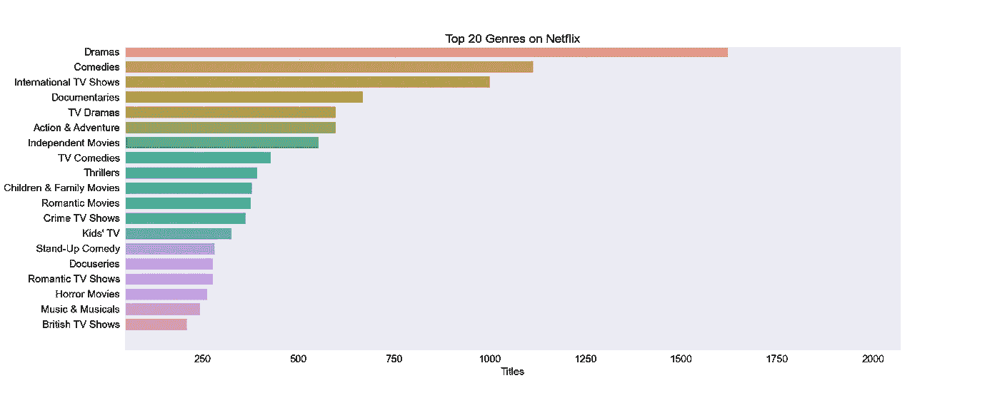
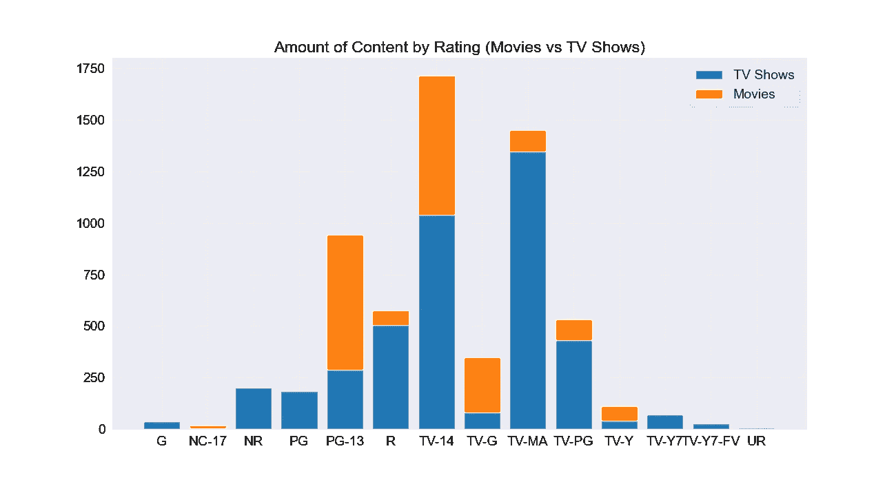
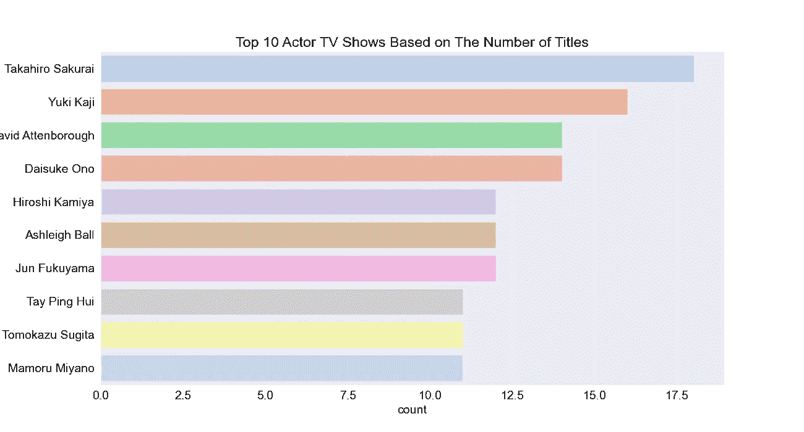
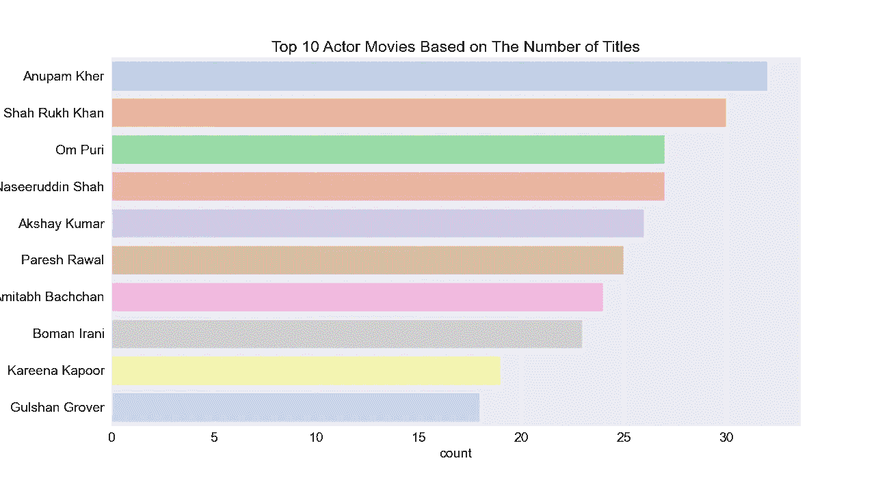

# 网飞电影和电视节目-使用 Python 进行探索性数据分析(EDA)和可视化

> 原文：<https://medium.com/analytics-vidhya/netflix-movies-and-tvshows-exploratory-data-analysis-eda-and-visualization-using-python-80753fcfcf7?source=collection_archive---------0----------------------->


在 [Unsplash](https://unsplash.com?utm_source=medium&utm_medium=referral) 上由 [Thibault Penin](https://unsplash.com/@thibaultpenin?utm_source=medium&utm_medium=referral) 拍摄的照片

N [**etflix 公司**](https://en.wikipedia.org/wiki/Netflix) **。**是一家美国[技术和媒体服务提供商](https://en.wikipedia.org/wiki/Over-the-top_media_service)和[制作公司](https://en.wikipedia.org/wiki/Production_company)，总部位于[加州](https://en.wikipedia.org/wiki/Los_Gatos,_California)洛斯加托斯。网飞于 1997 年由[雷德·哈斯汀斯](https://en.wikipedia.org/wiki/Reed_Hastings)和[马克·伦道夫](https://en.wikipedia.org/wiki/Marc_Randolph)在加州[斯科茨谷创立。该公司的主要业务是基于订阅的流媒体服务，提供在线电影和电视剧库，包括内部制作的电影和电视剧。](https://en.wikipedia.org/wiki/Scotts_Valley,_California)

网飞是一个受欢迎的娱乐服务，被世界各地的人们所使用。该 EDA 将使用 python 库、matplotlib 和 seaborn 通过可视化和图形来探索网飞数据集。

我们使用了来自 [Kaggle](https://www.kaggle.com/search) 的网飞数据集上列出的[电视节目和电影。该数据集由截至 2019 年网飞上可用的电视节目和电影组成。该数据集收集自第三方网飞搜索引擎 Flixable。](https://www.kaggle.com/shivamb/netflix-shows)

# 导入库

导入我们需要的库。

```
import numpy as npimport pandas as pdimport matplotlibimport matplotlib.pyplot as pltimport seaborn as sns
```

# 加载数据集

使用 Pandas 库，我们将加载 CSV 文件。为数据集命名为网飞 df。

```
netflix_df = pd.read_csv("netflix_titles.csv")
```

让我们检查前 5 个数据。

该数据集包含超过 6234 个标题，12 个描述。快速查看数据帧后，它看起来像一个没有分级的典型电影/电视节目数据帧。我们还可以看到在一些列中有 NaN 值。

# **数据剖析&清理**

数据清理是指识别不正确、不完整、不准确、不相关或丢失的数据片段，然后根据需要修改、替换或删除它们的过程。数据清洗被认为是数据科学的基本要素。

从信息中，我们知道这个 EDA 有 6，234 个条目和 12 个列。有几列包含空值，“导演”、“演员”、“国家”、“添加日期”、“评级”

整个数据集中总共有 3，036 个空值，其中“导演”下有 1，969 个缺失点，“演员”下有 570 个，“国家”下有 476 个缺失点，“添加日期”下有 11 个缺失点，“评级”下有 10 个缺失点在我们深入研究 EDA 和建模之前，我们必须处理所有的空数据点。

插补是对缺失值的一种处理方法，采用一定的技术进行填充。可以使用均值、模式或预测模型。在本模块中，我们将讨论使用 Pandas 的 fillna 函数进行插补。删除包含缺失值的行。可以使用熊猫的 dropna 功能。

```
netflix_df.director.fillna("No Director", inplace=True)netflix_df.cast.fillna("No Cast", inplace=True)netflix_df.country.fillna("Country Unavailable", inplace=True)netflix_df.dropna(subset=["date_added", "rating"], inplace=True)
```

消除它们最简单的方法是删除丢失数据的行。然而，这对我们的 EDA 没有好处，因为这是信息的损失。由于“导演”、“演员”和“国家”包含大多数空值，我们选择将每个缺失的值视为不可用。另外两个标签“date_added”和“rating”包含不重要的数据部分，因此它从数据集中删除。最后，我们可以看到数据框中不再有丢失的值。

# **探索性分析和可视化**

**→ 1。按类型划分的网飞内容**

分析由电影和节目组成的整个网飞数据集。我们来比较一下这个数据集中电影和节目的总数，就知道哪个占多数了。

```
plt.figure(figsize=(12,6))plt.title(“Percentation of Netflix Titles that are either Movies or TV Shows”)g = plt.pie(netflix_df.type.value_counts(),explode=(0.025,0.025), labels=netflix_df.type.value_counts().index, colors=[‘red’,’black’],autopct=’%1.1f%%’, startangle=180)plt.show()
```



所以大概有 4000 ++的电影和差不多 2000 的电视剧，电影占大多数。就标题而言，电影标题(68.5%)远远多于电视节目标题(31.5%)。

→ **2。** **作为时间函数的内容量**

接下来，我们将探索网飞在过去几年中添加的内容量。由于我们对网飞何时将标题添加到他们的平台感兴趣，我们将添加“添加年份”列来显示“添加日期”列中的日期。

```
fig, ax = plt.subplots(figsize=(13, 7))sns.lineplot(data=netflix_year_df, x=’year’, y=’date_added’)sns.lineplot(data=movies_year_df, x=’year’, y=’date_added’)sns.lineplot(data=shows_year_df, x=’year’, y=’date_added’)ax.set_xticks(np.arange(2008, 2020, 1))plt.title(“Total content added across all years (up to 2019)”)plt.legend([‘Total’,’Movie’,’TV Show’])plt.ylabel(“Releases”)plt.xlabel(“Year”)plt.show()
```



根据上面的时间线，我们可以得出结论，流行的流媒体平台在 2013 年后开始获得牵引力。从那时起，添加的内容数量一直在显著增加。网飞电影数量的增长远高于电视剧数量的增长。2018 年和 2019 年都增加了约 1300 部新电影。此外，我们可以知道，网飞近年来越来越注重电影而不是电视节目

→ **3。国家所产生的量的内容**

接下来是探索网飞的农产品含量的国家。在分析电影之前，我们需要将电影中的所有国家分开，然后删除没有国家可用的片头。

```
filtered_countries = netflix_df.set_index(‘title’).country.str.split(‘, ‘, expand=True).stack().reset_index(level=1, drop=True);filtered_countries = filtered_countries[filtered_countries != ‘Country Unavailable’]plt.figure(figsize=(13,7))g = sns.countplot(y = filtered_countries, order=filtered_countries.value_counts().index[:15])plt.title(‘Top 15 Countries Contributor on Netflix’)plt.xlabel(‘Titles’)plt.ylabel(‘Country’)plt.show()
```



从上面的图片中，我们可以看到对网飞贡献最大的 15 个国家。按产量计算的国家是美国。

→ **4。** **网飞顶级导演**

要知道最红的导演，我们可以形象化。

```
filtered_directors = netflix_df[netflix_df.director != 'No Director'].set_index('title').director.str.split(', ', expand=True).stack().reset_index(level=1, drop=True)plt.figure(figsize=(13,7))plt.title('Top 10 Director Based on The Number of Titles')sns.countplot(y = filtered_directors, order=filtered_directors.value_counts().index[:10], palette='Blues')plt.show()
```



网飞最受欢迎的导演，拥有最多头衔，主要是国际导演。

→ **5。** **网飞顶级流派**

```
filtered_genres = netflix_df.set_index('title').listed_in.str.split(', ', expand=True).stack().reset_index(level=1, drop=True);plt.figure(figsize=(10,10))g = sns.countplot(y = filtered_genres, order=filtered_genres.value_counts().index[:20])plt.title('Top 20 Genres on Netflix')plt.xlabel('Titles')plt.ylabel('Genres')plt.show()
```



从图表中，我们知道国际电影占据第一位，其次是戏剧和喜剧。

→ **6。** **按等级划分的内容量**

```
order = netflix_df.rating.unique()count_movies = netflix_movies_df.groupby('rating')['title'].count().reset_index()count_shows = netflix_shows_df.groupby('rating')['title'].count().reset_index()count_shows = count_shows.append([{"rating" : "NC-17", "title" : 0},{"rating" : "PG-13", "title" : 0},{"rating" : "UR", "title" : 0}], ignore_index=True)count_shows.sort_values(by="rating", ascending=True)plt.figure(figsize=(13,7))plt.title('Amount of Content by Rating (Movies vs TV Shows)')plt.bar(count_movies.rating, count_movies.title)plt.bar(count_movies.rating, count_shows.title, bottom=count_movies.title)plt.legend(['TV Shows', 'Movies'])plt.show()
```



最大数量的网飞内容是由“电视-14”评级。“TV-14”包含父母或成年监护人可能认为不适合 14 岁以下儿童观看的内容。但是最大数量的电视节目是由“TV-MA”评级制作的。“TV-MA”是由电视家长指南分配给仅为成年观众设计的电视节目的分级。

**→** 7。**根据头衔数量排名网飞最佳男演员**

```
filtered_cast_shows = netflix_shows_df[netflix_shows_df.cast != ‘No Cast’].set_index(‘title’).cast.str.split(‘, ‘, expand=True).stack().reset_index(level=1, drop=True)plt.figure(figsize=(13,7))plt.title(‘Top 10 Actor TV Shows Based on The Number of Titles’)sns.countplot(y = filtered_cast_shows, order=filtered_cast_shows.value_counts().index[:10], palette=’pastel’)plt.show()
```



根据头衔数量，网飞电视节目的最佳男演员是樱井孝宏。

```
filtered_cast_movie = netflix_movies_df[netflix_movies_df.cast != 'No Cast'].set_index('title').cast.str.split(', ', expand=True).stack().reset_index(level=1, drop=True)plt.figure(figsize=(13,7))plt.title('Top 10 Actor Movies Based on The Number of Titles')sns.countplot(y = filtered_cast_movie, order=filtered_cast_movie.value_counts().index[:10], palette='pastel')plt.show()
```



根据获奖数量，网飞电影的最佳男演员是阿努潘·凯尔。

# 结论

我们从数据集网飞标题中得出了许多有趣的推论；以下是其中几个的总结:

1.  网飞上最多的内容类型是电影，
2.  这个流行的流媒体平台在 2014 年后开始获得关注。从那时起，添加的内容数量一直在显著增加，
3.  按产量计算的国家是美国，
4.  网飞最受欢迎的导演，拥有最多头衔的是简·苏特。
5.  国际电影是一种主要出现在网飞的类型，
6.  最大数量的网飞内容是由“TV-14”分级制成的，
7.  根据头衔数量，网飞电视节目中最受欢迎的演员是樱井孝宏，
8.  根据获奖数量，网飞电影最受欢迎的演员是阿努潘·凯尔。

可以通过我的 GitHub 下载数据和 python 代码文档:[https://GitHub . com/dwiknrd/medium-code/tree/master/网飞-eda](https://github.com/dwiknrd/medium-code/tree/master/netflix-eda) 。