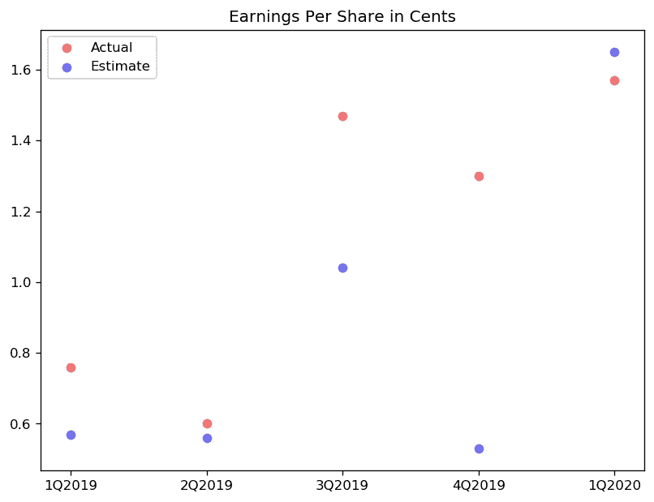

# 网飞股票简介:数据分析

> 原文：<https://medium.com/analytics-vidhya/netflix-stock-profile-data-analytics-be89a1f43e8?source=collection_archive---------22----------------------->

数据分析是指提高生产力和商业效益的数据处理方法。数据来自各种来源，并被清理和分类以解释不同的行为模式。在这个项目中，借助于不同的图来分析网飞公司的股票概况。

[自由股票](https://unsplash.com/@freestocks?utm_source=unsplash&utm_medium=referral&utm_content=creditCopyText)在 [Unsplash](https://unsplash.com/s/photos/netflix?utm_source=unsplash&utm_medium=referral&utm_content=creditCopyText) 上的照片

网飞公司是一家美国媒体服务提供商和制作公司，总部设在加利福尼亚州。股票概况的数据可视化可以帮助金融分析师评估股票的风险。

# 使用的术语:

1.  **股票简介**:在金融领域，股票简介是一系列的研究、可视化和分析，将上市公司的数据投入到不同的方面。
2.  **道琼斯工业平均指数(DJIA):** 道琼斯工业平均指数(DJIA)是一个代表 30 家大型上市蓝筹股公司的指数，这些公司在纽约证券交易所和纳斯达克上市。
3.  收入:收入是一家公司销售其商品和服务所获得的净收入。收入是扣除费用之前产生的收益。对某些公司来说，收入通常被称为净销售额，因为净销售额包括顾客退回的所有商品。
4.  **收益:**收益是公司在一段时间内赚取的利润。收益数字在损益表上记为净收入。当投资者和分析师谈论一家公司的收益时，他们指的是该公司的净收入或利润。
5.  **每股收益(EPS)** :每股收益(EPS)的计算方法是公司的利润除以其普通股的已发行股份。得出的数字可以作为公司盈利能力的指标。一家公司报告每股收益是很常见的，每股收益是根据非常项目和潜在的股份稀释进行调整的。一个公司的每股收益越高，就越需要考虑它的盈利能力。由[investopedia.com](https://www.investopedia.com/terms/e/eps.asp)定义。

该项目的财务数据来源为[雅虎财经](https://finance.yahoo.com/quote/DATA/)。网飞的季度收益数据收集自[网飞投资者](https://www.netflixinvestor.com/)。这个项目的 GitHub 链接是这里的。对于该项目，只有 2019-20 年的可视化数据。具体来说，有以下可视化:

*   最近五个季度(2019–20)的股价分布
*   网飞在过去五个季度的收益和收入
*   2019-20 年五个季度的实际与预计每股收益(EPS)
*   2019-20 年网飞股票价格和道琼斯工业平均指数(DJIA)价格的比较

*(注:道琼斯工业平均指数-DJIA 用于比较网飞股票和更大的股票市场。要了解更多关于 DJIA，请参考下面的网站。)*

 [## 道琼斯工业平均指数- DJIA

### 道琼斯工业平均指数(DJIA)是一个跟踪 30 家大型上市蓝筹股公司的指数

www.investopedia.com](https://www.investopedia.com/terms/d/djia.asp) 

在绘制我们的数据之前，让我们先来看看它，了解这些特性是如何工作的。在雅虎的数据中， *Adj Close* 代表了根据股息和股票分割调整后的收盘价。这意味着这是给定交易日的真实收盘价。而*收盘*代表因拆分而调整的收盘价。在指标中，货币单位是美元。下面是雅虎财经的网飞(NFLX)股票数据集的前几行。DJIA (^DJI)数据集类似于下图所示。NFLX 和^DJI 分别是网飞和道琼斯工业平均指数的股票代码。

**图一。**我们网飞股票数据集的前 5 行

为了可视化每季度的股票价格，添加了代表五个季度中每个季度的新列。例如，“Q1 2019”意味着 2019 年的第一季度。

**图二。**网飞股票季度数据集的前 5 行

在理解了这些术语和我们的数据之后，是时候让我们可视化这些图来了解网飞的股票概况了。对于数据可视化，这里使用了 Python 的 *Matplotlib* 和 *Seaborn* 库。

# 1.让我们来看看网飞的季度数据吧！

为了了解 2019-20 年网飞季度股票价格的分布，特别是为了了解哪个季度的股票价格波动最大，使用了五把小提琴的小提琴图，每个业务季度一把！

iolin 图有助于我们一次可视化和比较多个分布。沿着中线有两个对称的“KDE —核密度估计—图”。中间的“黑色粗线”表示四分位数范围，而从四分位数延伸到两端的线表示 95%的置信区间。中间的白点表示分布的中间值。点击 *了解更多小提琴剧情* [*。*](https://seaborn.pydata.org/generated/seaborn.violinplot.html)

**图三。**小提琴图-股价与业务季度

y 轴上的值是以美元为单位的*调整收盘价*，即股息和拆分的调整收盘价。x 轴是 2019 年 1 月至 2020 年 3 月的业务季度。 *Q1 2019* 是 2019 年的第一个业务季度(1-3 月)。上图(95%置信区间)暗示了我们正在调查的五个季度中大多数股票价格的下跌范围。通过查看每个季度的中间值，我们可以知道价格的总体变化是如何随着时间的推移而发生的。此外，我们还可以分析整个时间跨度内的最高价或最低价。

# 2.使用散点图分析 EPS 的性能

接下来，让我们通过将雅虎对该季度的预测与该季度的实际收益进行对比，来绘制每股收益(EPS)的表现。

*散点图是一个图表，其中每个数据值都表示为一个点。这在比较来自多个数据分布的数据值时非常有用，因为它有助于明确它们之间的细微差别。对于重叠的数据点，可以用不透明度来区分。点击* *了解更多散点图* [*。*](https://matplotlib.org/3.2.1/api/_as_gen/matplotlib.pyplot.scatter.html)

**图 4。**散点图——实际每股收益与预计每股收益

每股收益的实际值和估计值来自雅虎财经。以下是从 2019 年第一季度到 2020 年第一季度连续五个业务季度的指标(用 Python 列表表示):

预期收益[0.57，. 56，1.04，. 53，1.65]
实际收益[0.76，. 6，1.47，1.3，1.57]

0.57 美元是雅虎财经对网飞 2019 年第一季度每股收益的估计，0.76 美元是网飞的实际每股收益，其他数据也是如此。从上面的图表中我们可以看出，每股收益的估计值和实际每股收益与预期值有多接近。是大幅度超过预估的 EPS 还是没有超过预估的 EPS 值？实际的每股收益和估计的每股收益有时可能会重叠，这个数据值将被视为一个紫色的点。(在色彩理论中，红色和蓝色混合成紫色)

# 3.可视化收益和收入

接下来，让我们通过并排绘制两个条形图来直观显示网飞报告的收益和收入。在下图中，收入和收益(扣除费用后的净收入)以十亿美元计。

**并排** *条形图可用于比较具有相同轴值的两组数据。为此，将两个条形相邻绘制，以便可以比较数值。从* [*这里*](https://matplotlib.org/3.1.0/gallery/lines_bars_and_markers/barchart.html) *了解更多。*

**图 5。**收入和收益的并排条形图

收入和收益数据来自网飞的财务报表，这些报表是从[网飞投资者](https://www.netflixinvestor.com/financials/quarterly-earnings/default.aspx)那里收集的。以下是从 2019 年第一季度到 2020 年第一季度连续五个业务季度的指标(用 Python 列表表示):

分季度收入[4.52099，4.92311，5.24490，5.46743，5.76769]
分季度收益[0.34405，. 27065，. 66524，. 58697，. 70906]

网飞公司 2019 年第一季度的收入为 45.20992 亿美元(约 45.2 亿美元)，并扣除了营销、开发、利息等费用。净收入(收益)为 344，052，000 美元(约 3.4 亿美元)。上图有助于理解网飞公司的收入或收益是否遵循季度趋势。我们可以大致描述收入的百分之多少构成收益。随着时间的推移，收入似乎在增加，网飞公司的净收入也在增加。

# 4.将网飞股票与道琼斯股票进行对比

在这最后一步，让我们将网飞股票与 2019-20 年的道琼斯工业平均指数进行比较。我们可以通过在一张图中绘制两个上下重叠的折线图来实现这一点。

**一条线** *图是一种可视化变量随时间变化的好方法。支线剧情用来并排显示两条线。通过使用支线剧情，我们可以在旁边显示多条线。每把斧头都被称为一个支线剧情。一张包含所有支线剧情的图叫做图。点击* *了解更多支线剧情* [*。*](https://matplotlib.org/3.2.1/api/_as_gen/matplotlib.pyplot.subplot.html)

**图 6。**折线图——道琼斯和网飞

在绘制上面的图表时，x 刻度被设置为只显示相应月份的一个日期，以避免读数冲突。通过形象化上面的图表，我们可以知道网飞股票与道琼斯工业平均指数相比表现如何。至于波动性，我们可以说网飞比道琼斯更不稳定。在 2019 年第三季度和第四季度，当道琼斯股票上涨时，网飞股票下跌，如上图所示。

道琼斯工业平均指数-DJIA 用于比较网飞股票和更大的股票市场。DJIA 通常被称为“道琼斯指数”，是世界上最古老和最受关注的指数之一。对于投资者来说，道琼斯指数被定义为一组收益稳定的蓝筹股公司。当电视网说“今天市场上涨”时，通常指的是道琼斯指数。